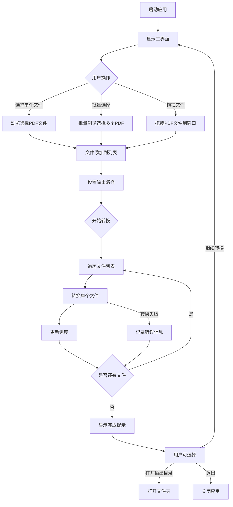

# PDF转Word GUI工具设计文档

## 功能概述

为python-office项目开发一个独立的PDF转Word桌面应用程序，提供图形化界面供用户便捷地将PDF文件转换为可编辑的Word文档。

## 核心目标

- 提供简洁易用的图形界面
- 支持单个PDF文件转换
- 支持批量PDF文件转换
- 显示转换进度
- 提供转换结果反馈

## 功能需求

### 界面布局

主窗口包含以下区域：

| 区域名称 | 说明 | 主要内容 |
|---------|------|---------|
| 标题栏 | 应用程序标题 | 显示"PDF转Word工具" |
| 文件选择区 | 选择待转换文件 | 文件路径输入框、浏览按钮、批量选择按钮 |
| 输出设置区 | 配置输出选项 | 输出路径选择、文件命名规则 |
| 操作控制区 | 转换操作控制 | 开始转换按钮、取消按钮、清空列表按钮 |
| 状态显示区 | 显示转换状态 | 进度条、状态文本、文件列表及转换状态 |

### 交互流程



### 功能特性

#### 文件选择

- 单文件选择：通过文件浏览对话框选择单个PDF文件
- 批量选择：支持一次性选择多个PDF文件
- 拖拽支持：支持将PDF文件拖拽到窗口中
- 文件过滤：仅显示和接受.pdf格式文件
- 文件列表：显示已选择的所有待转换文件及其路径

#### 输出设置

- 输出路径选择：用户可自定义Word文档保存位置
- 默认输出路径：默认为源文件所在目录
- 文件命名策略：
  - 保持原文件名，扩展名改为.docx
  - 文件重名时自动添加编号后缀

#### 转换控制

- 开始转换：触发转换流程
- 取消转换：中断正在进行的转换任务
- 清空列表：清除所有已选择的文件
- 批量转换：自动依次处理列表中的所有文件

#### 状态反馈

- 整体进度：显示总体转换进度百分比和进度条
- 当前文件：显示正在转换的文件名称
- 文件状态：在列表中标记每个文件的转换状态（等待、转换中、成功、失败）
- 错误提示：转换失败时显示具体错误信息
- 完成通知：所有转换完成后弹出提示

## 技术方案

### 技术栈选择

| 技术组件 | 选用方案 | 说明 |
|---------|---------|------|
| GUI框架 | PyQt5 | 与项目现有GUI版本保持一致 |
| PDF转换核心 | office.pdf.pdf2docx | 使用项目已有的PDF转换API |
| 底层依赖 | popdf | 实际执行转换的底层库 |

### 架构设计

采用MVC架构模式组织代码：


| 层次 | 职责 | 主要内容 |
|------|------|---------|
| View 视图层 | 界面呈现与交互 | 窗口组件、布局、样式、事件绑定 |
| Controller 控制层 | 业务逻辑控制 | 文件管理、转换流程控制、状态管理 |
| Model 业务层 | 数据处理 | 调用PDF转换API、文件操作、错误处理 |

### 核心模块

#### 主窗口模块

- 负责整体界面布局和组件初始化
- 管理子组件的创建和布局
- 处理窗口级别的事件（关闭、最小化等）

#### 文件管理模块

- 管理文件列表数据结构
- 处理文件选择、添加、移除操作
- 验证文件格式和可访问性
- 支持拖拽功能

#### 转换控制模块

- 封装PDF转Word转换逻辑
- 管理转换任务队列
- 处理单个和批量转换流程
- 实现转换的启动、暂停、取消

#### 进度管理模块

- 计算和更新转换进度
- 管理各文件的状态
- 向界面反馈实时进度信息

#### 异常处理模块

- 捕获转换过程中的异常
- 提供友好的错误信息
- 记录错误日志供调试使用

## 界面设计

### 主窗口布局

主窗口采用垂直布局，从上到下依次为：

- 顶部工具栏：包含批量添加、清空列表等快捷操作
- 文件列表区域：表格形式展示待转换文件
- 输出设置面板：输出路径选择控件
- 底部操作区：开始转换按钮和进度条

### 文件列表表格

| 列名 | 宽度比例 | 内容 |
|------|---------|------|
| 序号 | 5% | 文件编号 |
| 文件名 | 40% | PDF文件名称 |
| 文件路径 | 40% | 完整路径 |
| 状态 | 15% | 等待/转换中/成功/失败 |

### 状态标识

使用不同颜色和图标标识文件状态：

- 等待：灰色圆点
- 转换中：蓝色旋转图标
- 成功：绿色对勾
- 失败：红色叉号

## 转换逻辑

### 转换流程

转换过程分为以下阶段：

| 阶段 | 说明 | 关键操作 |
|------|------|---------|
| 准备阶段 | 转换前的验证和初始化 | 检查文件存在性、创建输出目录、初始化进度 |
| 转换阶段 | 执行实际转换 | 调用office.pdf.pdf2docx，传入文件路径和输出路径 |
| 结果处理 | 处理转换结果 | 验证输出文件、更新状态、记录日志 |
| 清理阶段 | 转换后的收尾工作 | 更新进度条、释放资源 |

### 批量转换策略

批量转换时采用顺序处理策略：

- 按文件列表顺序依次转换
- 单个文件转换失败不影响后续文件
- 记录每个文件的转换结果
- 所有文件处理完毕后统一展示结果报告

### 错误处理

针对可能出现的错误情况制定处理策略：

| 错误类型 | 处理策略 |
|---------|---------|
| 文件不存在 | 提示用户文件路径无效，跳过该文件 |
| 文件被占用 | 提示用户关闭文件，可选择重试或跳过 |
| 输出路径无权限 | 提示用户选择其他输出路径 |
| 转换失败 | 显示具体错误信息，记录日志，跳过该文件 |
| 磁盘空间不足 | 提示用户清理磁盘空间或更换输出路径 |

## 数据结构

### 文件信息对象

每个待转换文件使用字典结构存储信息：

| 字段名 | 类型 | 说明 |
|-------|------|------|
| id | int | 文件序号 |
| filename | str | 文件名 |
| filepath | str | 完整路径 |
| status | str | 当前状态：waiting/processing/success/failed |
| output_path | str | 输出文件路径 |
| error_msg | str | 错误信息（如有） |

### 应用状态

应用程序维护全局状态信息：

| 状态项 | 说明 |
|-------|------|
| file_list | 待转换文件列表 |
| current_index | 当前正在转换的文件索引 |
| total_count | 文件总数 |
| success_count | 成功转换数量 |
| failed_count | 失败转换数量 |
| is_converting | 是否正在转换 |
| output_directory | 默认输出目录 |

## 配置项

应用程序支持以下配置选项：

| 配置项 | 默认值 | 说明 |
|-------|-------|------|
| 默认输出路径 | 源文件目录 | 转换文件的默认保存位置 |
| 窗口大小 | 800x600 | 主窗口初始尺寸 |
| 最大并发数 | 1 | 同时转换的文件数量（当前版本为1，顺序处理） |
| 自动打开输出目录 | False | 转换完成后是否自动打开输出文件夹 |
| 显示详细日志 | False | 是否在界面显示详细的转换日志 |

## 用户体验优化

### 交互优化

- 提供文件拖拽功能，简化文件添加流程
- 转换完成后可一键打开输出文件夹
- 支持键盘快捷键操作（如Delete删除选中文件）
- 双击列表中的文件可在资源管理器中定位

### 性能优化

- 文件列表使用虚拟滚动，支持大量文件
- 转换过程使用多线程，避免界面卡顿
- 大文件转换时实时显示进度避免假死感

### 视觉优化

- 使用清晰的图标和状态颜色
- 进度条平滑过渡动画
- 错误信息使用醒目的颜色提示
- 界面采用简洁现代的设计风格

## 扩展性考虑

预留以下扩展能力：

| 扩展方向 | 说明 |
|---------|------|
| 转换参数配置 | 未来可支持配置转换质量、页面范围等参数 |
| 格式支持扩展 | 预留接口支持其他格式转换（如PDF转图片） |
| 批处理脚本 | 支持保存批处理任务配置，一键重复执行 |
| 转换历史 | 记录转换历史，支持查看和重新转换 |
| 多语言支持 | 预留国际化接口，支持中英文切换 |

## 部署方案

### 打包方式

使用PyInstaller将Python应用打包为独立可执行文件：

- Windows平台：生成.exe可执行文件
- 包含所有依赖库，无需用户安装Python环境
- 单文件模式或目录模式可选

### 目录结构

打包后的应用程序目录结构：

```
pdf2word-gui/
├── pdf2word.exe          # 主程序
├── config/               # 配置文件目录（可选）
│   └── settings.json
├── logs/                 # 日志目录（运行时创建）
└── README.txt            # 使用说明
```

### 依赖管理

确保打包时包含以下核心依赖：

- PyQt5：GUI框架
- python-office：项目核心库
- popdf：PDF处理底层库

## 测试要点

### 功能测试

- 单文件转换正常流程
- 批量文件转换正常流程
- 文件拖拽功能
- 输出路径自定义
- 转换取消功能
- 清空列表功能

### 异常测试

- 选择非PDF文件的处理
- 输入文件不存在的处理
- 输出路径无权限的处理
- 转换过程中删除源文件
- 磁盘空间不足场景
- 超大PDF文件转换

### 兼容性测试

- Windows 10/11系统
- 不同分辨率屏幕显示
- 高DPI显示器适配

### 性能测试

- 批量转换100个文件的性能
- 大文件（如100MB以上）转换性能
- 界面响应速度
- 内存占用情况
