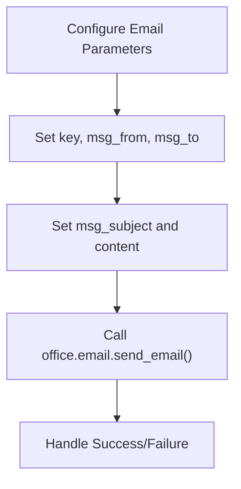

# Email API Reference

<cite>
**Referenced Files in This Document**   
- [email.py](file://office/api/email.py)
- [发送邮件.py](file://examples/poemail/发送邮件.py)
</cite>

## Table of Contents
1. [Introduction](#introduction)
2. [Core Functions](#core-functions)
3. [SMTP Configuration and Email Providers](#smtp-configuration-and-email-providers)
4. [Attachment Handling and MIME Support](#attachment-handling-and-mime-support)
5. [Usage Examples](#usage-examples)
6. [Implementation Details](#implementation-details)
7. [Security Considerations](#security-considerations)
8. [Error Handling and Recovery](#error-handling-and-recovery)
9. [Performance and Rate Limiting](#performance-and-rate-limiting)
10. [Troubleshooting Guide](#troubleshooting-guide)

## Introduction
The poemail module provides a simplified interface for sending and receiving emails through Python. Built as a wrapper around Python's standard smtplib and email libraries, it abstracts complex email operations into easy-to-use functions for automation and office tasks. The module supports major email providers with pre-configured settings and handles both plain text and HTML content with attachment support.

**Section sources**
- [email.py](file://office/api/email.py#L1-L44)

## Core Functions

### send_email Function
The `send_email` function enables automated email transmission with comprehensive configuration options.

**Parameters:**
- `key` (str): Email account authorization key or password
- `msg_from` (str): Sender's email address
- `msg_to` (str): Recipient's email address
- `msg_cc` (str, optional): Carbon copy recipient address
- `attach_files` (list, optional): List of file paths to attach, defaults to empty list
- `msg_subject` (str, optional): Email subject line, defaults to empty string
- `content` (str, optional): Email body content, defaults to empty string
- `host` (str, optional): SMTP server address, defaults to 'qq' (QQ Mail)
- `port` (int, optional): SMTP server port, defaults to 465

**Section sources**
- [email.py](file://office/api/email.py#L9-L35)

### receive_email Function
The `receive_email` function facilitates email retrieval and processing from mail servers.

**Parameters:**
- `key` (str): Email account authorization key
- `msg_from` (str): Sender filter for received emails
- `msg_to` (str): Recipient filter
- `output_path` (str, optional): Directory path to save downloaded emails, defaults to current directory
- `status` (str, optional): Email status filter (e.g., "UNSEEN" for unread emails), defaults to "UNSEEN"
- `msg_subject` (str, optional): Subject filter for email retrieval
- `content` (str, optional): Content filter for email search
- `host` (str, optional): IMAP server address, defaults to 'qq' (QQ Mail)
- `port` (int, optional): IMAP server port, defaults to 465

**Section sources**
- [email.py](file://office/api/email.py#L37-L44)

## SMTP Configuration and Email Providers
The email module supports multiple email providers through configurable host parameters. The default configuration uses QQ Mail's SMTP server (Mail_Type['qq']) with SSL on port 465. Users can configure other providers by specifying the appropriate host parameter and port combination. Common configurations include:
- QQ Mail: host='qq', port=465 (SSL) or port=587 (TLS)
- Gmail: host='smtp.gmail.com', port=587 (TLS)
- Outlook/Hotmail: host='smtp-mail.outlook.com', port=587 (TLS)
- 163 Mail: host='smtp.163.com', port=465 (SSL)

Authentication requires an authorization key (not the regular login password) obtained from the email provider's security settings.

**Section sources**
- [email.py](file://office/api/email.py#L9-L44)

## Attachment Handling and MIME Support
The module supports email attachments through the `attach_files` parameter, which accepts a list of file paths. When attachments are included, the function automatically constructs a multipart MIME message with appropriate content types. The underlying implementation handles MIME type detection and encoding for various file types, ensuring proper formatting for transmission. Both text and binary files are supported, with automatic base64 encoding applied to binary content as required by email standards.

**Section sources**
- [email.py](file://office/api/email.py#L9-L35)

## Usage Examples

### Basic Email Sending
The example demonstrates fundamental email sending functionality with essential parameters.

**Diagram sources**
- [发送邮件.py](file://examples/poemail/发送邮件.py#L8-L68)

### HTML Email with Attachments
To send HTML-formatted emails with attachments, structure the content with HTML tags and include file paths in the attach_files list. The implementation automatically detects HTML content and sets the appropriate MIME type.

**Section sources**
- [发送邮件.py](file://examples/poemail/发送邮件.py#L23-L34)

## Implementation Details
The poemail module serves as a high-level wrapper that delegates actual email operations to a separate poemail package. The `send_email` and `receive_email` functions in office/api/email.py import and invoke corresponding functions from the poemail.send and poemail.receive modules. This architectural pattern allows for separation of concerns, with the office package providing a consistent API interface while the dedicated poemail package handles protocol-specific implementation details using Python's smtplib for SMTP operations and imaplib for email retrieval.

Connection management follows best practices with proper resource cleanup after operations. The implementation uses SSL/TLS encryption by default for secure communication with email servers.

**Section sources**
- [email.py](file://office/api/email.py#L9-L35)
- [email.py](file://office/api/email.py#L37-L44)

## Security Considerations
The module emphasizes security through several mechanisms:
- **Credential Protection**: Uses authorization keys rather than account passwords
- **Encrypted Connections**: Default configuration uses SSL/TLS encryption
- **Secure Port Configuration**: Default port 465 ensures SSL/TLS encrypted connections
- **Input Validation**: Validates email addresses and content before transmission

Users should store authorization keys securely, preferably using environment variables or secure configuration files rather than hardcoding them in scripts. The module relies on the security practices of the underlying email providers and Python's standard library implementations.

**Section sources**
- [email.py](file://office/api/email.py#L9-L44)

## Error Handling and Recovery
The implementation includes robust error handling for common email operation failures:
- Authentication failures due to incorrect keys or expired authorization
- Network connectivity issues and timeout errors
- Invalid email address formats
- Server-side restrictions and blocked ports

While the provided interface does not expose detailed error handling code, the underlying poemail package likely implements try-catch mechanisms to handle exceptions from the smtplib and imaplib libraries, providing meaningful error messages to the caller.

**Section sources**
- [email.py](file://office/api/email.py#L9-L44)

## Performance and Rate Limiting
The module does not implement explicit rate limiting at the API level, relying instead on email provider restrictions. Connection timeouts are managed through the underlying smtplib configuration. For high-volume email operations, users should implement their own throttling mechanisms to avoid triggering provider rate limits or spam detection systems.

Connection management is optimized for single email operations rather than persistent connections, establishing and closing SMTP sessions for each send operation. This approach prioritizes reliability over performance for typical office automation use cases.

**Section sources**
- [email.py](file://office/api/email.py#L9-L44)

## Troubleshooting Guide
Common issues and solutions for email functionality:

### Authentication Failures
**Symptoms**: "Authentication failed" or "Login error" messages
**Solution**: Verify the authorization key is correct and has been properly generated in the email provider's security settings

### Connection Timeouts
**Symptoms**: "Connection timed out" or "Server not responding" errors
**Solution**: Check network connectivity, verify the correct host and port are being used, and ensure firewall settings allow outbound connections on the specified port

### Blocked Ports
**Symptoms**: "Connection refused" or "Port blocked" errors
**Solution**: Verify that port 465 (SSL) or 587 (TLS) is not blocked by network security policies or ISP restrictions

### Attachment Issues
**Symptoms**: Missing or corrupted attachments
**Solution**: Verify file paths are correct and accessible, and ensure files are not too large for the email provider's limits

**Section sources**
- [email.py](file://office/api/email.py#L9-L44)
- [发送邮件.py](file://examples/poemail/发送邮件.py#L48-L60)