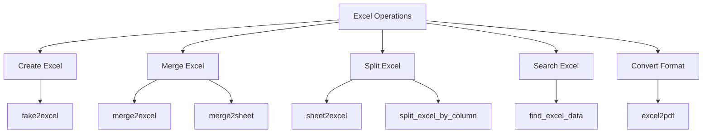
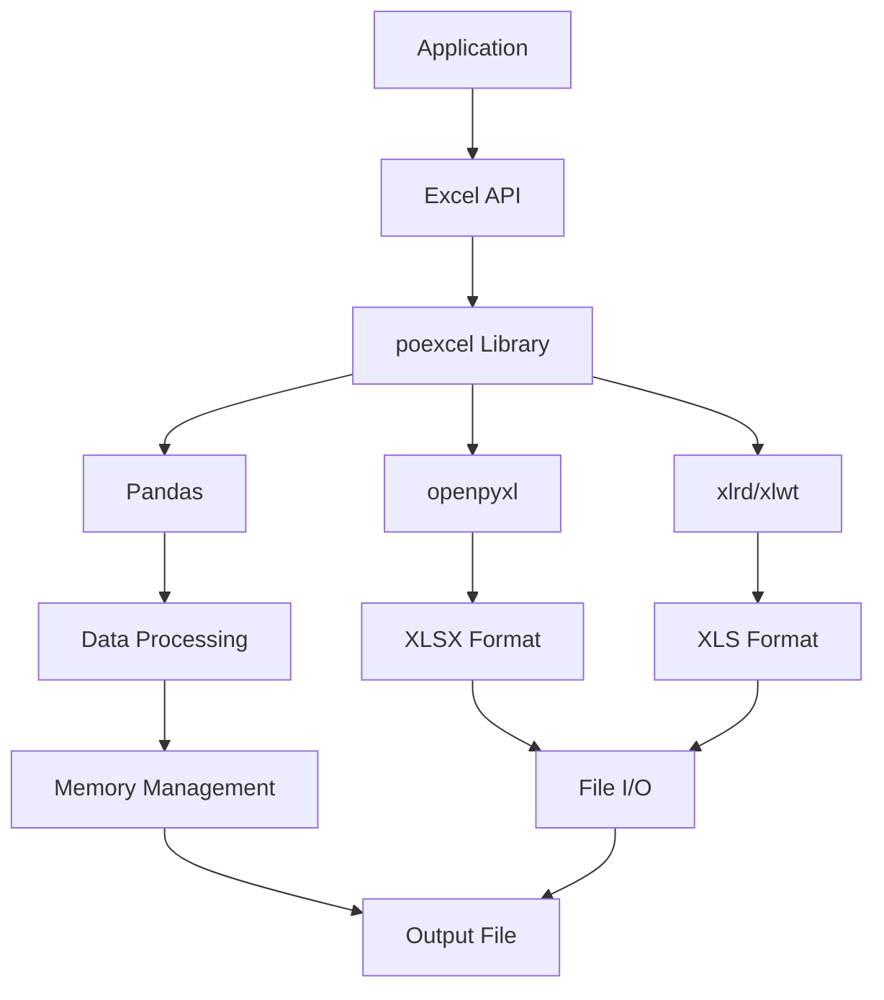
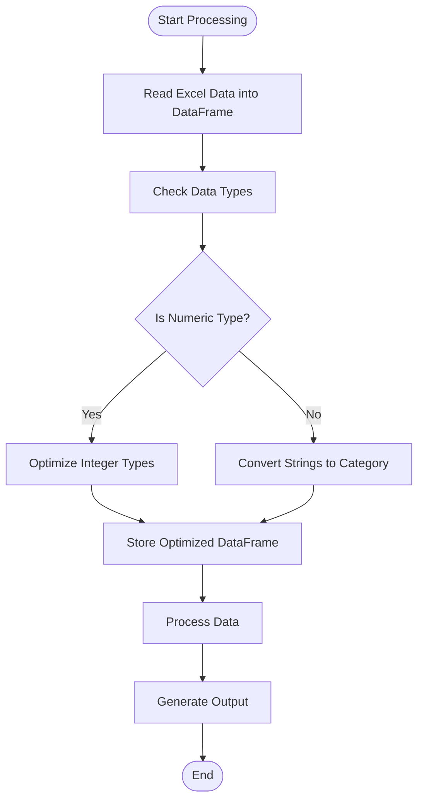

# Excel API Reference

<cite>
**Referenced Files in This Document**   
- [excel.py](file://office/api/excel.py)
- [SplitExcel.py](file://office/lib/excel/SplitExcel.py)
- [pandas_mem.py](file://office/lib/utils/pandas_mem.py)
- [settings.py](file://settings.py)
- [创建Excel文件.py](file://examples/poexcel/创建Excel文件.py)
- [Excel转PDF.py](file://examples/poexcel/Excel转PDF.py)
- [批量模拟数据.py](file://examples/poexcel/批量模拟数据.py)
- [根据内容，查询Excel.py](file://examples/poexcel/根据内容，查询Excel.py)
- [根据指定的列，拆分excel.py](file://examples/poexcel/根据指定的列，拆分excel.py)
</cite>

## Table of Contents
1. [Introduction](#introduction)
2. [Core Functions](#core-functions)
3. [Function Signatures and Parameters](#function-signatures-and-parameters)
4. [Usage Examples](#usage-examples)
5. [Underlying Architecture](#underlying-architecture)
6. [Performance Considerations](#performance-considerations)
7. [Configuration Options](#configuration-options)
8. [Troubleshooting Guide](#troubleshooting-guide)

## Introduction
The poexcel module in python-office provides a comprehensive suite of Excel file processing capabilities designed to simplify common data manipulation tasks. This API reference documents the public functions available in the office/api/excel.py module, which serves as a high-level interface to various Excel operations including data generation, file merging, splitting, and format conversion. The module abstracts complex operations into simple function calls, making it accessible for users to perform sophisticated Excel manipulations with minimal code. The API is designed to handle both .xls and .xlsx file formats while providing consistent behavior across different operations.

**Section sources**
- [excel.py](file://office/api/excel.py#L1-L20)

## Core Functions
The Excel module (poexcel) exposes several key functions for common Excel operations. These functions are designed to be intuitive and require minimal configuration to achieve desired results. The core functionality includes creating Excel files with simulated data, merging multiple Excel files, splitting Excel files by various criteria, searching for content within Excel files, and converting Excel files to PDF format. Each function follows a consistent pattern of accepting file paths and configuration parameters while handling the underlying complexity of file operations, data processing, and format compatibility.



**Diagram sources**
- [excel.py](file://office/api/excel.py#L25-L136)

**Section sources**
- [excel.py](file://office/api/excel.py#L25-L136)

## Function Signatures and Parameters
This section details the complete signature, parameters, return values, and exceptions for each public function in the Excel module.

### create_excel (fake2excel)
Creates an Excel file with simulated/fake data based on specified parameters.

**Signature**
```python
def fake2excel(columns=['name'], rows=1, path='./fake2excel.xlsx', language='zh_CN')
```

**Parameters**
- `columns` (list): List of column names to generate. Supported columns include various data types like name, text, email, etc. Default: ['name']
- `rows` (int): Number of data rows to generate. Default: 1
- `path` (str): Output file path and name for the generated Excel file. Default: './fake2excel.xlsx'
- `language` (str): Language for the generated data. 'zh_CN' for Chinese, 'english' for English. Default: 'zh_CN'

**Returns**
- None

**Exceptions**
- May raise file I/O exceptions if the output directory is not writable
- May raise memory exceptions for very large row counts

**Section sources**
- [excel.py](file://office/api/excel.py#L25-L40)
- [批量模拟数据.py](file://examples/poexcel/批量模拟数据.py)

### merge_excel (merge2excel)
Merges multiple Excel files into a single Excel file with each source file in a separate sheet.

**Signature**
```python
def merge2excel(dir_path, output_file='merge2excel.xlsx')
```

**Parameters**
- `dir_path` (str): Directory path containing the Excel files to merge
- `output_file` (str): Path and filename for the merged output file. Default: 'merge2excel.xlsx'

**Returns**
- None

**Exceptions**
- Raises ValueError if the specified directory does not exist
- Raises file format exceptions if non-Excel files are present in the directory
- May raise file I/O exceptions if the output file cannot be written

**Section sources**
- [excel.py](file://office/api/excel.py#L42-L55)

### split_excel (sheet2excel)
Splits a single Excel file with multiple sheets into separate Excel files, one for each sheet.

**Signature**
```python
def sheet2excel(file_path, output_path='./')
```

**Parameters**
- `file_path` (str): Path to the Excel file to be split
- `output_path` (str): Directory where the split files will be saved. Default: current directory ('./')

**Returns**
- None

**Exceptions**
- Raises file not found exception if the input file does not exist
- Raises file format exception if the input is not a valid Excel file
- May raise file I/O exceptions if the output directory is not writable

**Section sources**
- [excel.py](file://office/api/excel.py#L60-L72)

### excel_to_pdf (excel2pdf)
Converts a specified worksheet in an Excel file to PDF format.

**Signature**
```python
def excel2pdf(excel_path, pdf_path, sheet_id: int = 0)
```

**Parameters**
- `excel_path` (str): Path to the source Excel file
- `pdf_path` (str): Path where the generated PDF file will be saved
- `sheet_id` (int): Index of the worksheet to convert (0-based). Default: 0 (first sheet)

**Returns**
- None

**Exceptions**
- Raises file not found exception if the Excel file does not exist
- Raises file format exception if the input is not a valid Excel file
- May raise conversion exceptions if the PDF generation fails
- May raise file I/O exceptions if the output PDF cannot be written

**Section sources**
- [excel.py](file://office/api/excel.py#L123-L136)
- [Excel转PDF.py](file://examples/poexcel/Excel转PDF.py)

### search_in_excel (find_excel_data)
Searches for specified content across multiple Excel files in a directory.

**Signature**
```python
def find_excel_data(search_key: str, target_dir: str)
```

**Parameters**
- `search_key` (str): Text or value to search for within the Excel files
- `target_dir` (str): Directory path to search, containing Excel files

**Returns**
- None

**Exceptions**
- Raises directory not found exception if the target directory does not exist
- May skip files that are not valid Excel formats
- May raise read permission exceptions for files that cannot be accessed

**Section sources**
- [excel.py](file://office/api/excel.py#L92-L104)
- [根据内容，查询Excel.py](file://examples/poexcel/根据内容，查询Excel.py)

### split_by_column (split_excel_by_column)
Splits an Excel file into multiple files based on the unique values in a specified column.

**Signature**
```python
def split_excel_by_column(filepath: str, column: int, worksheet_name: str = None)
```

**Parameters**
- `filepath` (str): Path to the Excel file to be split
- `column` (int): Column index (1-based) to use for splitting the data
- `worksheet_name` (str, optional): Name of the worksheet to process. If None, uses the first/active worksheet.

**Returns**
- None

**Exceptions**
- Raises file not found exception if the input file does not exist
- Raises index error if the specified column is beyond the worksheet's column count
- Raises file format exception if the input is not a valid Excel file
- May raise file I/O exceptions if output files cannot be written

**Section sources**
- [excel.py](file://office/api/excel.py#L109-L120)
- [SplitExcel.py](file://office/lib/excel/SplitExcel.py#L117-L136)

## Usage Examples
This section provides practical examples demonstrating real-world usage scenarios for the Excel API functions.

### Creating Excel Files with Fake Data
The following example demonstrates how to create an Excel file with simulated data:

```python
import office
# Create Excel with default settings (1 row, 'name' column, Chinese language)
office.excel.fake2excel()
```

For more complex data generation:

```python
import poexcel
# Create Excel with multiple columns and 20 rows of English data
poexcel.fake2excel(columns=['name', 'email', 'text'], rows=20, language='english')
```

**Section sources**
- [创建Excel文件.py](file://examples/poexcel/创建Excel文件.py)
- [批量模拟数据.py](file://examples/poexcel/批量模拟数据.py)

### Merging Multiple Excel Files
To merge multiple Excel files from a directory into a single file with separate sheets:

```python
import office
# Merge all Excel files in the specified directory
office.excel.merge2excel(
    dir_path=r'C:\path\to\excel\files',
    output_file=r'C:\path\to\output\merged_file.xlsx'
)
```

**Section sources**
- [excel.py](file://office/api/excel.py#L42-L55)

### Converting Excel to PDF
To convert a specific worksheet from an Excel file to PDF format:

```python
import office
# Convert the first worksheet of an Excel file to PDF
office.excel.excel2pdf(
    excel_path=r'C:\path\to\input\document.xlsx',
    pdf_path=r'C:\path\to\output\document.pdf',
    sheet_id=0
)
```

To convert a specific worksheet by index:

```python
import poexcel
# Convert the third worksheet (index 2) to PDF
poexcel.excel2pdf(
    excel_path=r'D:\reports\monthly.xlsx',
    pdf_path=r'D:\reports\monthly_summary.pdf',
    sheet_id=2
)
```

**Section sources**
- [Excel转PDF.py](file://examples/poexcel/Excel转PDF.py)

### Splitting Excel by Column Values
To split an Excel file into multiple files based on the values in a specific column:

```python
import poexcel
# Split Excel file based on values in the first column
poexcel.split_excel_by_column(
    filepath=r'C:\data\sales_records.xlsx',
    column=1,
    worksheet_name='SalesData'
)
```

This operation creates separate Excel files for each unique value found in the specified column, making it ideal for organizing data by categories such as region, department, or product type.

**Section sources**
- [根据指定的列，拆分excel.py](file://examples/poexcel/根据指定的列，拆分excel.py)

## Underlying Architecture
The Excel API abstracts multiple underlying libraries to provide a unified interface for Excel operations. The architecture follows a layered approach where the high-level API functions in office/api/excel.py serve as entry points that delegate to specialized implementation modules.



**Diagram sources**
- [excel.py](file://office/api/excel.py)
- [SplitExcel.py](file://office/lib/excel/SplitExcel.py)

**Section sources**
- [excel.py](file://office/api/excel.py)
- [SplitExcel.py](file://office/lib/excel/SplitExcel.py)

The API primarily leverages pandas for data manipulation and openpyxl for XLSX file operations, while maintaining compatibility with the older XLS format through xlrd and xlwt libraries. When a function is called, the following data flow occurs:

1. Input validation and parameter processing
2. File reading using appropriate library based on file format
3. Data processing in memory using pandas DataFrames
4. Memory optimization using type reduction techniques
5. File writing with proper formatting
6. Resource cleanup and error handling

For operations involving large datasets, the API implements streaming where possible to minimize memory footprint. The split_excel_by_column function, for example, reads the source file in a streaming fashion while grouping rows by the specified column value before writing to separate output files.

## Performance Considerations
When working with large Excel files, several performance factors should be considered to ensure efficient operation and prevent memory issues.

### Memory Usage Optimization
The Excel module incorporates memory optimization techniques, particularly when handling large datasets. The pandas_mem.py utility module implements data type optimization to reduce memory consumption:



**Diagram sources**
- [pandas_mem.py](file://office/lib/utils/pandas_mem.py#L4-L41)

The reduce_pandas_mem_usage function automatically converts integer columns to the smallest possible integer type (int8, int16, int32, or int64) based on the data range, and converts string/object columns to categorical types when appropriate. This can significantly reduce memory usage, especially for large datasets with repetitive string values.

### Large File Handling
For optimal performance with large Excel files:

1. **Use XLSX format**: XLSX files are generally more efficient than XLS files for large datasets
2. **Process in chunks**: For extremely large files, consider processing data in smaller chunks
3. **Close file handles**: Ensure that Excel applications are closed when files are being processed to avoid file locking issues
4. **Monitor memory**: Be aware of system memory limitations when processing very large files

The API automatically handles format detection and uses the appropriate library (openpyxl for XLSX, xlrd for XLS) to ensure optimal performance for each file type.

**Section sources**
- [pandas_mem.py](file://office/lib/utils/pandas_mem.py)
- [SplitExcel.py](file://office/lib/excel/SplitExcel.py)

## Configuration Options
Currently, the Excel module does not expose configuration options through the settings.py file. All configuration is handled through function parameters. The settings.py file in the project root contains Scrapy framework settings and is not used by the Excel module.

The behavior of Excel operations is controlled entirely through the function parameters, allowing for flexible configuration on a per-operation basis. Future versions may incorporate a configuration system for default values and global settings, but currently all settings are passed directly to the functions.

**Section sources**
- [settings.py](file://settings.py)

## Troubleshooting Guide
This section addresses common issues encountered when using the Excel API and provides solutions.

### File Locking Issues
**Problem**: "File is being used by another process" error when trying to read or write Excel files.

**Solution**: 
- Ensure Microsoft Excel or other spreadsheet applications are closed before running the script
- Use file paths with raw strings (prefix with 'r') to avoid path interpretation issues
- Check for proper file closure in case of previous script interruptions

### Format Incompatibilities
**Problem**: Errors when processing certain Excel files.

**Solution**:
- Convert files to XLSX format when possible, as it's better supported
- Ensure files are not corrupted by opening and saving them in Excel
- For very old XLS files, consider converting to XLSX format first

### Encoding Errors
**Problem**: Character encoding issues, especially with non-ASCII characters.

**Solution**:
- Use UTF-8 encoding when saving source files
- For Chinese characters, ensure the language parameter is set correctly ('zh_CN')
- When specifying file paths with non-ASCII characters, use raw strings or properly encoded paths

### Column Index Issues
**Problem**: "Maximum column count" error when specifying a column for splitting.

**Solution**:
- Remember that the column parameter uses 1-based indexing (first column is 1, not 0)
- Verify the actual number of columns in the source file
- Check for hidden columns that might affect the count

### Memory Issues with Large Files
**Problem**: Script crashes or becomes unresponsive with large Excel files.

**Solution**:
- Process files in smaller batches when possible
- Close other memory-intensive applications
- Consider using the system's 64-bit Python installation for better memory handling
- Monitor memory usage and optimize data types

**Section sources**
- [SplitExcel.py](file://office/lib/excel/SplitExcel.py#L42-L45)
- [SplitExcel.py](file://office/lib/excel/SplitExcel.py#L95-L98)