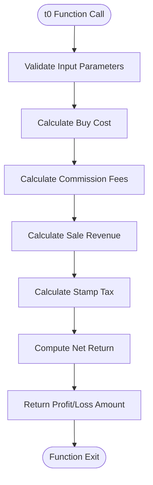
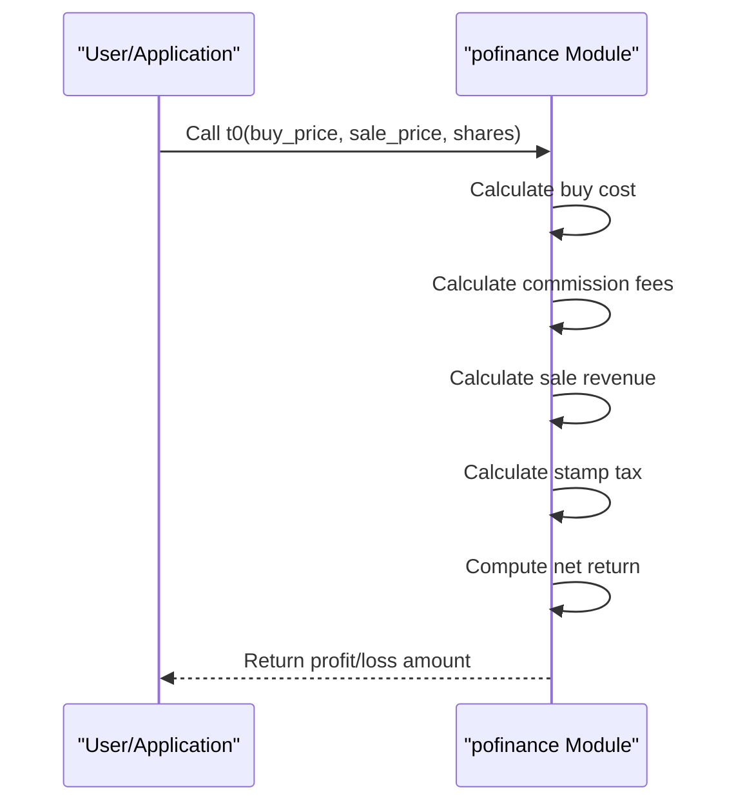

# Finance API Reference

<cite>
**Referenced Files in This Document**   
- [finance.py](file://office/api/finance.py)
- [1、单次做T.py](file://examples/pofinance/1、单次做T.py)
</cite>

## Table of Contents
1. [Introduction](#introduction)
2. [Core Functions](#core-functions)
3. [Usage Examples](#usage-examples)
4. [Trading Parameters](#trading-parameters)
5. [Risk Management](#risk-management)
6. [Error Handling](#error-handling)
7. [Conclusion](#conclusion)

## Introduction
The pofinance module is a specialized component of the python-office library designed for stock trading calculations, specifically focused on "T-day" trading strategies (also known as "stock_t_operation"). This API provides financial calculation utilities for determining trading profits and losses, with built-in support for various transaction costs including commissions and stamp taxes. The module is designed to help traders calculate potential returns from intraday trading operations.

**Section sources**
- [finance.py](file://office/api/finance.py#L1-L34)

## Core Functions

### t0 Function
The primary function in the pofinance module is `t0`, which calculates the profit or loss from a T-day trading operation. This function computes the net return after accounting for all transaction costs including commissions and taxes.



**Diagram sources**
- [finance.py](file://office/api/finance.py#L7-L30)

**Section sources**
- [finance.py](file://office/api/finance.py#L7-L30)

## Usage Examples

### Single T-Operation Example
The pofinance module includes example code demonstrating how to use the t0 function for single T-operations. These examples show practical applications of the API for calculating trading returns with different stock prices, quantities, and market conditions.



**Diagram sources**
- [1、单次做T.py](file://examples/pofinance/1、单次做T.py#L1-L32)

**Section sources**
- [1、单次做T.py](file://examples/pofinance/1、单次做T.py#L1-L32)

## Trading Parameters

### Function Parameters
The t0 function accepts several parameters that define the trading operation and associated costs:

| Parameter | Type | Default Value | Description |
|---------|------|-------------|-------------|
| buy_price | float | Required | Stock purchase price per share |
| sale_price | float | Required | Stock selling price per share |
| shares | int | Required | Number of shares traded |
| w_rate | float | 2.5/10000 | Commission rate (default: 0.025%) |
| min_rate | int | 5 | Minimum commission fee per transaction (RMB) |
| stamp_tax | float | 1/1000 | Stamp tax rate (default: 0.1%) |

The function uses a threshold (RATE_LINE = 20,000) to determine whether to apply the minimum commission fee or calculate it as a percentage of the transaction value.

**Section sources**
- [finance.py](file://office/api/finance.py#L7-L30)

## Risk Management

### Financial Calculation Methodology
The pofinance module implements precise financial calculations using the Decimal class to avoid floating-point precision errors in monetary calculations. The profit calculation follows the formula:

```
Profit = Sale Revenue - Purchase Cost - Buy Commission - Sell Commission - Stamp Tax
```

The module handles commission fees with a tiered approach:
- Transactions with value ≤ 20,000: Apply minimum commission fee (default: 5 RMB)
- Transactions with value > 20,000: Calculate commission as a percentage of transaction value

This approach accurately reflects common brokerage fee structures in the Chinese stock market.

**Section sources**
- [finance.py](file://office/api/finance.py#L22-L29)

## Error Handling
While the current implementation does not include explicit error handling mechanisms, users should be aware of potential issues:

1. **Input validation**: Ensure all parameters are of correct type and within reasonable ranges
2. **Market timing**: The calculations assume immediate execution at specified prices
3. **Rate limit considerations**: No API rate limits as this is a calculation-only module
4. **Data accuracy**: Results depend on accurate input of trading parameters

For production use, implement appropriate input validation and exception handling around the function calls.

**Section sources**
- [finance.py](file://office/api/finance.py#L7-L30)

## Conclusion
The pofinance module provides a straightforward API for calculating T-day trading profits with realistic cost modeling. While currently focused on basic profit calculation, the module serves as a foundation for more sophisticated trading analysis tools. Future enhancements could include support for multiple trading strategies, integration with real-time market data APIs, and paper trading capabilities.

The module is accessible both as a standalone import (`import pofinance`) and through the main office package (`from office.api import finance`). Its simple interface makes it suitable for both novice traders performing basic calculations and experienced developers building more complex trading systems.