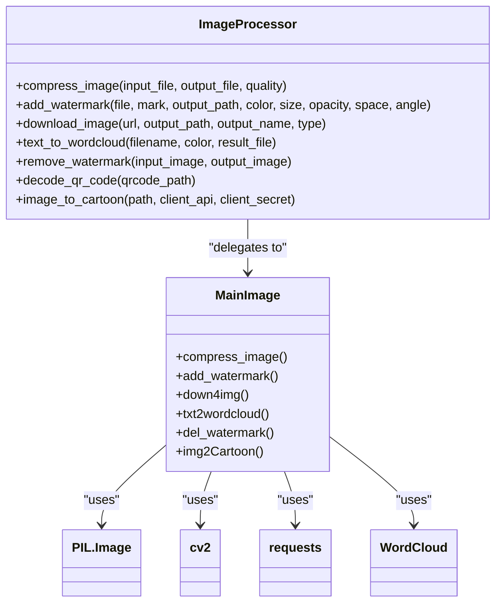
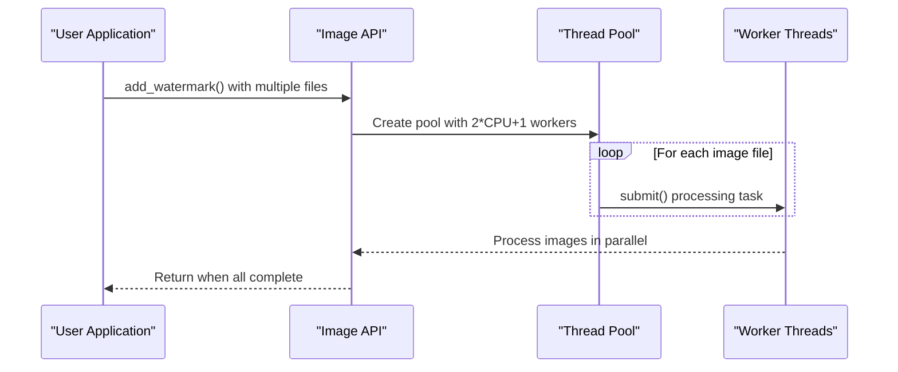

# Image API Reference

<cite>
**Referenced Files in This Document**   
- [image.py](file://office/api/image.py)
- [ImageType.py](file://poimage/core/ImageType.py)
- [add_watermark_service.py](file://poimage/lib/image/add_watermark_service.py)
- [图片加水印.py](file://examples/poimage/图片加水印.py)
- [下载图片.py](file://examples/poimage/下载图片.py)
- [文本转词云.py](file://examples/poimage/文本转词云.py)
- [图片去水印.py](file://examples/poimage/图片去水印.py)
- [compress_image.py](file://examples/poimage_demo/compress_image.py)
- [test_image.py](file://tests/test_code/test_image.py)
</cite>

## Table of Contents
1. [Introduction](#introduction)
2. [Core Functions](#core-functions)
3. [Function Details](#function-details)
4. [Image Processing Examples](#image-processing-examples)
5. [Library Integration](#library-integration)
6. [Performance Considerations](#performance-considerations)
7. [Troubleshooting Guide](#troubleshooting-guide)
8. [Conclusion](#conclusion)

## Introduction
The poimage module provides a comprehensive set of image processing functions for Python developers. This API documentation covers all available functions in the office/api/image.py module, including image watermarking, compression, format conversion, and special effects processing. The module serves as a wrapper for the underlying poimage library, providing simplified access to advanced image manipulation capabilities.

**Section sources**
- [image.py](file://office/api/image.py#L1-L152)

## Core Functions

The image processing module offers eight primary functions for various image manipulation tasks:

- **add_watermark**: Adds text watermarks to images with customizable appearance and layout
- **compress_image**: Reduces image file size while maintaining visual quality
- **image_to_gif**: Converts images to animated GIF format (currently limited implementation)
- **text_to_wordcloud**: Generates word cloud images from text files
- **image_to_cartoon**: Converts photos to cartoon-style images using AI
- **download_image**: Downloads images from URLs to local storage
- **remove_watermark**: Removes watermarks from images, particularly from WeChat articles
- **decode_qr_code**: Extracts information from QR code images

These functions are implemented through the poimage library, which leverages multiple image processing libraries including PIL/Pillow, OpenCV, and specialized AI services.



**Diagram sources**
- [image.py](file://office/api/image.py#L5-L152)
- [ImageType.py](file://poimage/core/ImageType.py#L22-L222)

## Function Details

### add_watermark
Adds text watermarks to images with extensive customization options.

**Parameters:**
- `file` (str): Path to the input image file
- `mark` (str): Watermark text content
- `output_path` (str, optional): Output directory path, defaults to './'
- `color` (str, optional): Watermark color in hex format, defaults to "#eaeaea"
- `size` (int, optional): Font size of watermark, defaults to 30
- `opacity` (float, optional): Transparency level (0.01-1), defaults to 0.35
- `space` (int, optional): Spacing between watermarks, defaults to 200
- `angle` (int, optional): Rotation angle of watermark, defaults to 30

**Image Format Support:** All formats supported by PIL/Pillow including JPG, PNG, BMP, TIFF, and GIF.

**Output Options:** Watermarked images are saved in the same format as the input file.

**Section sources**
- [image.py](file://office/api/image.py#L35-L52)
- [ImageType.py](file://poimage/core/ImageType.py#L67-L86)

### compress_image
Reduces image file size through quality-based compression.

**Parameters:**
- `input_file` (str): Path to the input image file
- `output_file` (str): Path for the compressed output file
- `quality` (int): Compression quality (0-95), where higher values preserve more quality but result in larger files

**Image Format Support:** Primarily JPG/JPEG, but supports any format that PIL/Pillow can save with quality parameter.

**Quality Settings:** The quality parameter follows standard JPEG quality scale where 95 is near-lossless and 0 is highly compressed.

**Output Options:** Output format is determined by the file extension in output_file parameter.

**Section sources**
- [image.py](file://office/api/image.py#L5-L17)
- [ImageType.py](file://poimage/core/ImageType.py#L23-L32)

### image_to_gif
Converts images to GIF format (current implementation has limitations).

**Parameters:** None in current implementation - uses hardcoded file names.

**Image Format Support:** Can convert any format readable by PIL/Pillow to GIF.

**Output Options:** Currently saves as 'gif.gif' with basic animation parameters.

**Note:** The current implementation is limited and uses fixed file names (1.jpg, 2.jpg, 3.jpg) rather than accepting parameters.

**Section sources**
- [image.py](file://office/api/image.py#L20-L29)
- [ImageType.py](file://poimage/core/ImageType.py#L35-L40)

### text_to_wordcloud
Generates word cloud images from text files.

**Parameters:**
- `filename` (str): Path to the input text file
- `color` (str, optional): Background color of the word cloud, defaults to "white"
- `result_file` (str, optional): Output file name, defaults to "your_wordcloud.png"

**Image Format Support:** Outputs PNG format with transparency support.

**Text Processing:** Uses jieba for Chinese text segmentation and WordCloud for visualization.

**Output Options:** Always outputs PNG format regardless of specified extension.

**Section sources**
- [image.py](file://office/api/image.py#L94-L106)
- [ImageType.py](file://poimage/core/ImageType.py#L42-L65)

### image_to_cartoon
Converts photos to cartoon-style images using Baidu AI services.

**Parameters:**
- `path` (str): Path to the input image file
- `client_api` (str, optional): Baidu AI API key, defaults to predefined value
- `client_secret` (str, optional): Baidu AI secret key, defaults to predefined value

**Image Format Support:** Any format that can be base64 encoded and processed by Baidu AI.

**Output Options:** Saves as 'result.jpg' in the current directory.

**Note:** Requires internet connection and Baidu AI account with available quota.

**Section sources**
- [image.py](file://office/api/image.py#L58-L72)
- [ImageType.py](file://poimage/core/ImageType.py#L108-L151)

### download_image
Downloads images from URLs to local storage.

**Parameters:**
- `url` (str): URL of the image to download
- `output_path` (str, optional): Directory to save the image, defaults to current directory
- `output_name` (str, optional): Name for the saved file, defaults to 'down4img'
- `type` (str, optional): File extension, defaults to 'jpg'

**Image Format Support:** Preserves the original format as specified by the type parameter.

**Output Options:** Saves with the specified name and extension in the designated directory.

**Section sources**
- [image.py](file://office/api/image.py#L76-L91)
- [ImageType.py](file://poimage/core/ImageType.py#L153-L164)

### remove_watermark
Removes watermarks from images, particularly designed for WeChat article screenshots.

**Parameters:**
- `input_image` (str): Path to the input image with watermark
- `output_image` (str, optional): Path for the processed output, defaults to './del_water_mark.jpg'

**Image Format Support:** All OpenCV-supported formats including JPG, PNG, BMP.

**Processing Method:** Uses a combination of cropping and inpainting techniques to remove watermarks from the bottom-right corner.

**Output Options:** Saves in the format specified by the output file extension.

**Section sources**
- [image.py](file://office/api/image.py#L140-L151)
- [ImageType.py](file://poimage/core/ImageType.py#L38-L70)

### decode_qr_code
Extracts information from QR code images.

**Parameters:**
- `qrcode_path` (str): Path to the QR code image file

**Image Format Support:** Any format readable by PIL/Pillow.

**Output Options:** Returns the decoded URL or text content from the QR code.

**Note:** Currently commented out in the implementation but documented in the API.

**Section sources**
- [image.py](file://office/api/image.py#L128-L137)

## Image Processing Examples

### Watermark Placement Example
Demonstrates how to add a text watermark to an image:

```python
import office

office.image.add_watermark(
    file='./test_files/add_watermark/程序员晚枫-2.jpg',
    mark='程序员晚枫',
    output_path='./test_files/add_watermark/mark_img'
)
```

This example places a diagonal watermark with default settings across the specified image, saving the result in the designated output directory.

**Section sources**
- [图片加水印.py](file://examples/poimage/图片加水印.py#L20-L24)

### Batch Compression Example
Shows how to compress an image with quality control:

```python
import office

office.image.compress_image(
    input_file='D:\\workplace\\code\\github\\poimage\\tests\\头像.jpg',
    output_file="compressed.jpg",
    quality=50
)
```

This example reduces the image quality to 50% of the original, significantly decreasing file size while maintaining acceptable visual quality.

**Section sources**
- [compress_image.py](file://examples/poimage_demo/compress_image.py#L3-L7)

### Word Cloud Generation Example
Demonstrates text-to-word-cloud conversion:

```python
import poimage

poimage.txt2wordcloud()
```

This basic example generates a word cloud from a default text source with white background, saving it as "your_wordcloud.png".

**Section sources**
- [文本转词云.py](file://examples/poimage/文本转词云.py#L11-L14)

## Library Integration

### PIL/Pillow Integration
The image processing module extensively uses PIL/Pillow for core image operations:

- **Image Opening and Saving**: Utilizes `Image.open()` and `Image.save()` methods for file I/O
- **Format Support**: Inherits all format capabilities from PIL/Pillow including JPEG, PNG, BMP, GIF, TIFF, and more
- **Color Space Handling**: Maintains original color spaces (RGB, RGBA, L for grayscale) during processing
- **EXIF Data**: Currently does not explicitly preserve EXIF metadata during transformations

```mermaid
flowchart TD
A[Input Image] --> B{Image.open()}
B --> C[Process Image]
C --> D{Image.save()}
D --> E[Output Image]
style A fill:#f9f,stroke:#333
style E fill:#bbf,stroke:#333
```

**Diagram sources**
- [ImageType.py](file://poimage/core/ImageType.py#L31-L32)

### Other Library Integration
The module integrates multiple specialized libraries for enhanced functionality:

- **OpenCV (cv2)**: Used for advanced image processing tasks like watermark removal and pencil sketch effects
- **NumPy**: Supports array operations for pixel-level manipulations
- **requests**: Handles HTTP operations for image downloading and API calls
- **WordCloud**: Generates word cloud visualizations from text data
- **jieba**: Performs Chinese text segmentation for word cloud generation

**Memory Management:** The implementation uses context managers for file operations and leverages PIL's lazy loading for efficient memory usage. For large images, consider processing in batches or using lower resolution versions.

**Section sources**
- [ImageType.py](file://poimage/core/ImageType.py#L7-L15)

## Performance Considerations

### Large Image Processing
When working with large images, consider the following performance guidelines:

- **Memory Usage**: Large images can consume significant RAM; monitor system resources during processing
- **Processing Time**: Complex operations like watermarking or cartoon conversion scale with image dimensions
- **Disk I/O**: Write operations can be bottlenecked by disk speed, especially for high-resolution images

### Multi-threading Capabilities
The add_watermark function implements multi-threading for batch processing:



**Diagram sources**
- [ImageType.py](file://poimage/core/ImageType.py#L78-L85)

The threading model uses `ThreadPoolExecutor` with a worker count based on CPU cores, optimizing for I/O-bound operations like file reading and writing.

### Disk Caching Strategies
The module implements basic disk caching through:

- **Temporary Files**: Some operations create intermediate files during processing
- **Output Directory Management**: Automatically creates output directories when needed
- **File Overwrite Behavior**: Overwrites existing files without warning

For production use, implement additional caching strategies such as:
- Memory caching for frequently accessed images
- Content-aware caching based on image similarity
- Tiered storage with hot/cold data separation

**Section sources**
- [ImageType.py](file://poimage/core/ImageType.py#L74-L75)

## Troubleshooting Guide

### Common Issues and Solutions

#### Format Conversion Artifacts
**Issue:** JPEG compression artifacts appearing in output images
**Solution:** Increase the quality parameter (up to 95) or convert to PNG format for lossless output

#### Memory Exhaustion
**Issue:** Program crashes when processing large images
**Solution:** 
- Process images in smaller batches
- Resize images to lower dimensions before processing
- Use 64-bit Python to access more memory
- Monitor memory usage and implement early termination

#### Missing Dependencies
**Issue:** ModuleNotFoundError for required packages
**Solution:** Install all dependencies:
```bash
pip install pillow opencv-python numpy requests wordcloud jieba pofile poprogress
```

#### Chinese Path Problems
**Issue:** Errors when file paths contain Chinese characters
**Solution:** Use ASCII-only paths for input and output files, or encode paths properly

#### Baidu API Limitations
**Issue:** Cartoon conversion fails due to API quota exhaustion
**Solution:** 
- Register for a Baidu AI account to obtain free quota
- Implement retry logic with exponential backoff
- Cache results to avoid repeated API calls

#### Watermark Removal Limitations
**Issue:** remove_watermark only works on bottom-right corner watermarks
**Solution:** The current implementation is specifically designed for WeChat article watermarks; for other watermark positions, modify the cropping coordinates in the source code

**Section sources**
- [图片去水印.py](file://examples/poimage/图片去水印.py#L8-L11)
- [test_image.py](file://tests/test_code/test_image.py#L17-L42)

## Conclusion
The poimage module provides a comprehensive set of image processing functions accessible through a simple API. While the current implementation offers valuable functionality for common image manipulation tasks, there are opportunities for enhancement in areas such as EXIF data preservation, broader format support, and improved error handling. The integration of multiple libraries creates a powerful toolkit for developers, though careful attention should be paid to memory management and dependency requirements in production environments.