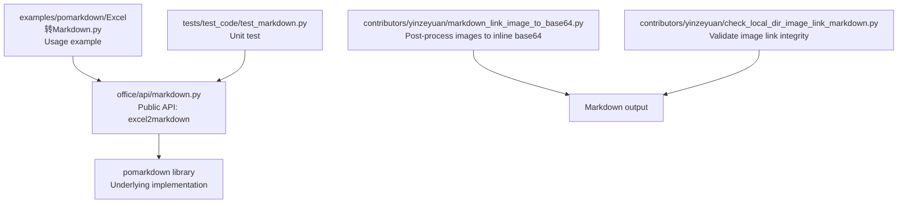
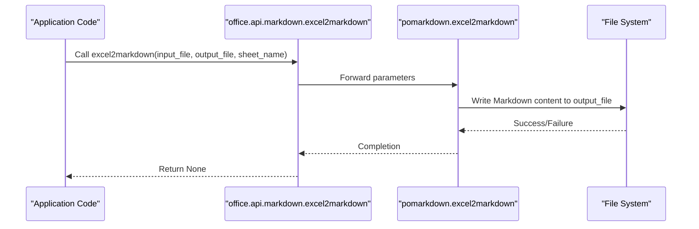
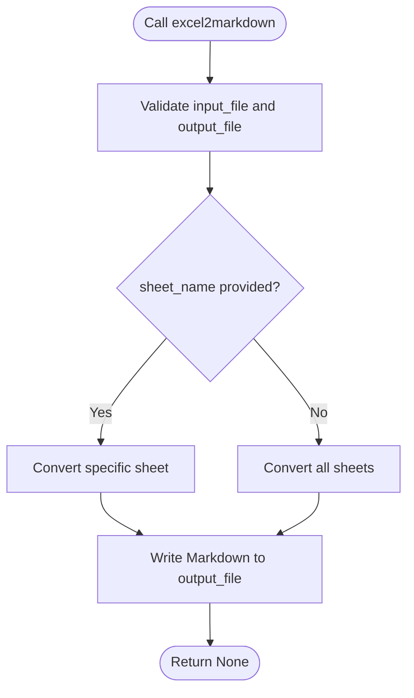
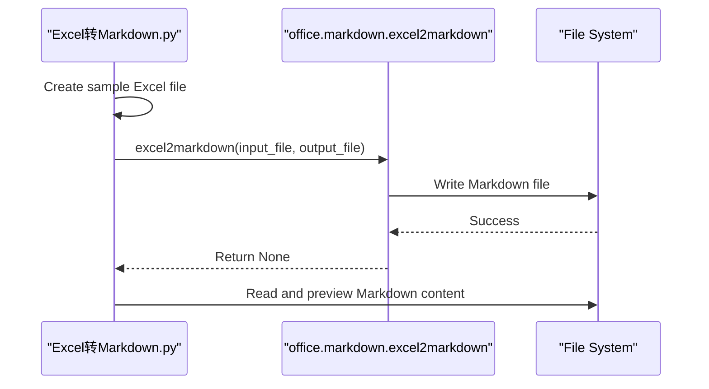
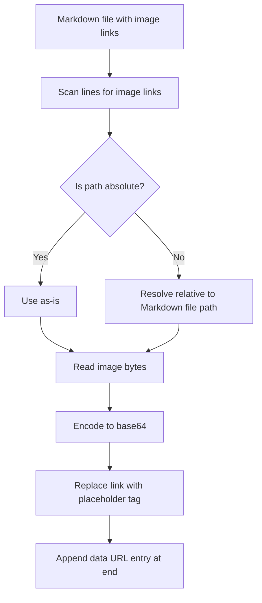
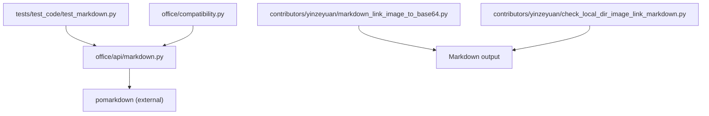

# Markdown API Reference

<cite>
**Referenced Files in This Document**
- [markdown.py](file://office/api/markdown.py)
- [Excel转Markdown.py](file://examples/pomarkdown/Excel转Markdown.py)
- [test_markdown.py](file://tests/test_code/test_markdown.py)
- [compatibility.py](file://office/compatibility.py)
- [markdown_link_image_to_base64.py](file://contributors/yinzeyuan/markdown_link_image_to_base64.py)
- [check_local_dir_image_link_markdown.py](file://contributors/yinzeyuan/check_local_dir_image_link_markdown.py)
</cite>

## Table of Contents
1. [Introduction](#introduction)
2. [Project Structure](#project-structure)
3. [Core Components](#core-components)
4. [Architecture Overview](#architecture-overview)
5. [Detailed Component Analysis](#detailed-component-analysis)
6. [Dependency Analysis](#dependency-analysis)
7. [Performance Considerations](#performance-considerations)
8. [Troubleshooting Guide](#troubleshooting-guide)
9. [Conclusion](#conclusion)
10. [Appendices](#appendices)

## Introduction
This document provides a comprehensive API reference for the Markdown module (pomarkdown) within the python-office ecosystem. It focuses on the public API surface exposed by office.api.markdown, specifically the excel2markdown function, and demonstrates how it integrates with the underlying pomarkdown library. The guide also covers usage patterns shown in examples, outlines how Markdown conversion is performed conceptually, and provides guidance on handling images, encoding, and compatibility considerations across Markdown renderers.

## Project Structure
The Markdown API resides under office/api/markdown.py and is complemented by:
- An example script that demonstrates Excel-to-Markdown conversion workflows
- Unit tests validating the API’s behavior
- Utility scripts in contributors/yinzeyuan that illustrate Markdown image handling workflows (useful for post-processing Markdown outputs)

**Diagram sources**
- [markdown.py](file://office/api/markdown.py#L1-L21)
- [Excel转Markdown.py](file://examples/pomarkdown/Excel转Markdown.py#L1-L81)
- [test_markdown.py](file://tests/test_code/test_markdown.py#L1-L22)
- [markdown_link_image_to_base64.py](file://contributors/yinzeyuan/markdown_link_image_to_base64.py#L1-L45)
- [check_local_dir_image_link_markdown.py](file://contributors/yinzeyuan/check_local_dir_image_link_markdown.py#L1-L63)

**Section sources**
- [markdown.py](file://office/api/markdown.py#L1-L21)
- [Excel转Markdown.py](file://examples/pomarkdown/Excel转Markdown.py#L1-L81)
- [test_markdown.py](file://tests/test_code/test_markdown.py#L1-L22)

## Core Components
- Public API: excel2markdown(input_file, output_file=r"./excel2markdown.md", sheet_name=None)
  - Purpose: Convert Excel spreadsheets to Markdown tables and write to a file.
  - Behavior: Delegates to pomarkdown.excel2markdown with the provided parameters.
  - Parameters:
    - input_file (str): Path to the input Excel file.
    - output_file (str): Path to the output Markdown file (default current directory).
    - sheet_name (str or None): Specific worksheet name to convert; None converts all sheets.
  - Returns: None (writes to disk).

Notes:
- The function signature and docstring indicate that the implementation relies on pomarkdown.excel2markdown.
- The example script demonstrates typical usage by passing an input Excel path and an output Markdown path.

**Section sources**
- [markdown.py](file://office/api/markdown.py#L1-L21)
- [Excel转Markdown.py](file://examples/pomarkdown/Excel转Markdown.py#L45-L66)

## Architecture Overview
The Markdown API follows a thin wrapper pattern around the pomarkdown library. The high-level flow is:
- Application code calls office.markdown.excel2markdown(...)
- The wrapper forwards arguments to pomarkdown.excel2markdown(...)
- The underlying library performs Excel parsing and Markdown generation, writing the result to the specified output file.

**Diagram sources**
- [markdown.py](file://office/api/markdown.py#L1-L21)

**Section sources**
- [markdown.py](file://office/api/markdown.py#L1-L21)

## Detailed Component Analysis

### API: excel2markdown
- Responsibilities:
  - Validate and forward Excel-to-Markdown conversion requests.
  - Support multi-sheet conversion by accepting sheet_name=None.
- Parameters:
  - input_file: Absolute or relative path to the Excel workbook.
  - output_file: Absolute or relative path to the Markdown file to be created.
  - sheet_name: Optional; if provided, only that sheet is converted; if None, all sheets are converted.
- Implementation notes:
  - The function delegates to pomarkdown.excel2markdown, indicating that the actual parsing and Markdown generation are handled by the external library.
- Usage example:
  - See examples/pomarkdown/Excel转Markdown.py for a complete workflow that creates an Excel file and then converts it to Markdown.

**Diagram sources**
- [markdown.py](file://office/api/markdown.py#L1-L21)

**Section sources**
- [markdown.py](file://office/api/markdown.py#L1-L21)
- [Excel转Markdown.py](file://examples/pomarkdown/Excel转Markdown.py#L45-L66)

### Example Usage: Excel to Markdown
- The example script demonstrates:
  - Creating a sample Excel file programmatically.
  - Converting it to Markdown using office.markdown.excel2markdown.
  - Previewing the resulting Markdown content.
- This serves as the canonical usage pattern for the API.

**Diagram sources**
- [Excel转Markdown.py](file://examples/pomarkdown/Excel转Markdown.py#L1-L81)
- [markdown.py](file://office/api/markdown.py#L1-L21)

**Section sources**
- [Excel转Markdown.py](file://examples/pomarkdown/Excel转Markdown.py#L1-L81)

### Image Handling Utilities (Post-conversion)
While the core API focuses on Excel-to-Markdown conversion, the repository includes utilities for Markdown image management that are commonly used after conversion:
- markdown_link_image_to_base64: Scans a Markdown file for image links and replaces them with inline base64-encoded images, appending a data URL index at the end.
- check_local_dir_image_link_markdown: Validates whether all images referenced in a Markdown file are present in a given local directory and vice versa.

These utilities help address image embedding and path resolution concerns when Markdown is consumed by different renderers.

**Diagram sources**
- [markdown_link_image_to_base64.py](file://contributors/yinzeyuan/markdown_link_image_to_base64.py#L1-L45)

**Section sources**
- [markdown_link_image_to_base64.py](file://contributors/yinzeyuan/markdown_link_image_to_base64.py#L1-L45)
- [check_local_dir_image_link_markdown.py](file://contributors/yinzeyuan/check_local_dir_image_link_markdown.py#L1-L63)

## Dependency Analysis
- Internal dependency:
  - office.api.markdown.excel2markdown depends on pomarkdown.excel2markdown.
- External dependency:
  - The pomarkdown library is required for Excel-to-Markdown conversion.
- Compatibility:
  - The compatibility module lists Markdown processing as fully supported across platforms.

**Diagram sources**
- [markdown.py](file://office/api/markdown.py#L1-L21)
- [test_markdown.py](file://tests/test_code/test_markdown.py#L1-L22)
- [markdown_link_image_to_base64.py](file://contributors/yinzeyuan/markdown_link_image_to_base64.py#L1-L45)
- [check_local_dir_image_link_markdown.py](file://contributors/yinzeyuan/check_local_dir_image_link_markdown.py#L1-L63)
- [compatibility.py](file://office/compatibility.py#L40-L72)

**Section sources**
- [markdown.py](file://office/api/markdown.py#L1-L21)
- [compatibility.py](file://office/compatibility.py#L40-L72)

## Performance Considerations
- Large Excel files: Converting very large spreadsheets to Markdown can produce substantial Markdown content. Consider streaming or chunked writes if you extend the API to handle larger datasets.
- Multi-sheet conversions: Converting all sheets increases output size; consider specifying sheet_name to limit scope when appropriate.
- Image-heavy Markdown: If embedding images inline (base64), Markdown size grows significantly. Prefer linking images for large documents and use the provided utilities to validate and manage image paths.

[No sources needed since this section provides general guidance]

## Troubleshooting Guide
- Excel file path issues:
  - Ensure input_file points to a valid Excel workbook (.xlsx).
  - Verify output_file path exists or can be created by the process.
- Encoding problems:
  - The example reads and writes using UTF-8. If your environment uses a different locale, ensure consistent encoding when reading/writing files.
- Formatting loss:
  - The underlying pomarkdown library determines Markdown table formatting. If you require specific table styles or renderer-specific features, post-process the Markdown using the provided utilities or adjust the rendering pipeline.
- Links and embedded HTML:
  - The API does not alter Markdown links or HTML; it delegates to pomarkdown. If your Excel contains hyperlinks or rich text, confirm how pomarkdown renders them and validate with your target Markdown renderer.
- Image path resolution:
  - Use check_local_dir_image_link_markdown to verify that all referenced images exist locally and are reachable from the Markdown file’s directory.
  - For portable Markdown with embedded images, use markdown_link_image_to_base64 to replace links with inline base64 data URLs.

**Section sources**
- [Excel转Markdown.py](file://examples/pomarkdown/Excel转Markdown.py#L45-L66)
- [check_local_dir_image_link_markdown.py](file://contributors/yinzeyuan/check_local_dir_image_link_markdown.py#L1-L63)
- [markdown_link_image_to_base64.py](file://contributors/yinzeyuan/markdown_link_image_to_base64.py#L1-L45)

## Conclusion
The Markdown API in python-office exposes a simple, reliable interface for converting Excel spreadsheets to Markdown via pomarkdown. The example and tests demonstrate straightforward usage, while the contributor utilities provide practical solutions for image embedding and path validation. For advanced Markdown formatting or renderer-specific features, leverage the provided utilities and validate output against your target Markdown engine.

[No sources needed since this section summarizes without analyzing specific files]

## Appendices

### API Definition Summary
- Function: excel2markdown
  - Parameters:
    - input_file (str): Path to the Excel file.
    - output_file (str): Path to the Markdown file to create.
    - sheet_name (str or None): Specific sheet to convert; None converts all sheets.
  - Returns: None
  - Notes: Delegates to pomarkdown.excel2markdown.

**Section sources**
- [markdown.py](file://office/api/markdown.py#L1-L21)

### Usage Examples
- Complete end-to-end example:
  - See examples/pomarkdown/Excel转Markdown.py for creating an Excel file and converting it to Markdown, including previewing the result.

**Section sources**
- [Excel转Markdown.py](file://examples/pomarkdown/Excel转Markdown.py#L1-L81)

### Compatibility Considerations
- The compatibility module confirms Markdown processing (pomarkdown) is fully supported across platforms.

**Section sources**
- [compatibility.py](file://office/compatibility.py#L40-L72)