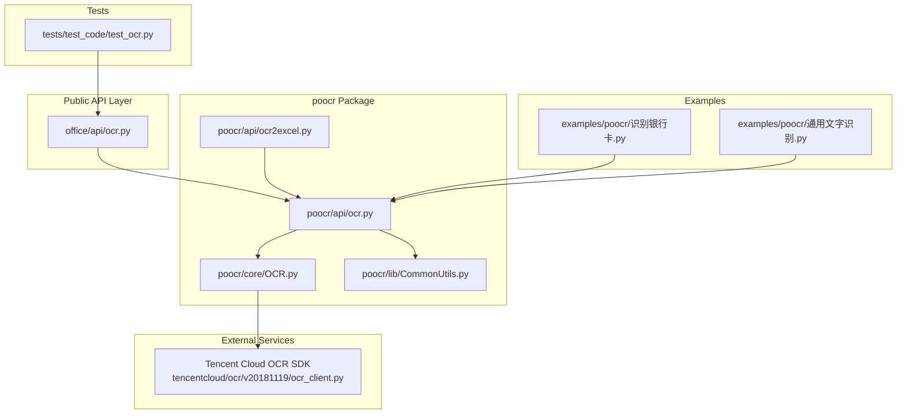
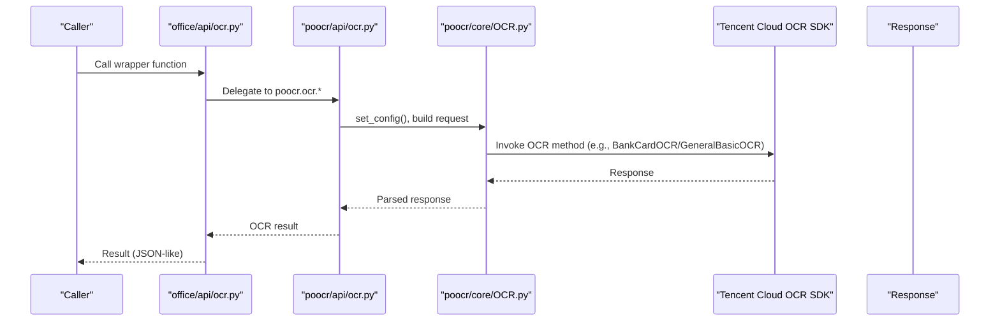
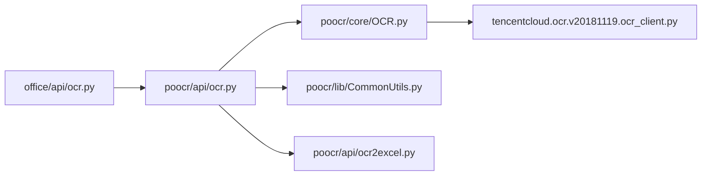

# OCR API Reference

<cite>
**Referenced Files in This Document**
- [office/api/ocr.py](file://office/api/ocr.py)
- [poocr/api/ocr.py](file://venv/Lib/site-packages/poocr/api/ocr.py)
- [poocr/api/ocr2excel.py](file://venv/Lib/site-packages/poocr/api/ocr2excel.py)
- [poocr/core/OCR.py](file://venv/Lib/site-packages/poocr/core/OCR.py)
- [poocr/lib/CommonUtils.py](file://venv/Lib/site-packages/poocr/lib/CommonUtils.py)
- [tencentcloud/ocr/v20181119/ocr_client.py](file://venv/Lib/site-packages/tencentcloud/ocr/v20181119/ocr_client.py)
- [examples/poocr/识别银行卡.py](file://examples/poocr/识别银行卡.py)
- [examples/poocr/通用文字识别.py](file://examples/poocr/通用文字识别.py)
- [tests/test_code/test_ocr.py](file://tests/test_code/test_ocr.py)
</cite>

## Table of Contents
1. [Introduction](#introduction)
2. [Project Structure](#project-structure)
3. [Core Components](#core-components)
4. [Architecture Overview](#architecture-overview)
5. [Detailed Component Analysis](#detailed-component-analysis)
6. [Dependency Analysis](#dependency-analysis)
7. [Performance Considerations](#performance-considerations)
8. [Troubleshooting Guide](#troubleshooting-guide)
9. [Conclusion](#conclusion)
10. [Appendices](#appendices)

## Introduction
This document provides comprehensive API documentation for the OCR module (poocr) integrated in the python-office project. It focuses on the public APIs exposed by the project’s wrapper and the underlying OCR engines, covering:
- Function signatures and parameters for bank card and general OCR workflows
- Image preprocessing and enhancement options
- Language selection and confidence thresholds
- Result formatting and post-processing
- API key management and rate limiting
- Error handling and common failure modes
- Accuracy considerations across image quality, lighting, and font types

## Project Structure
The OCR functionality spans several layers:
- Public API wrappers in the project (office/api/ocr.py) that delegate to the poocr package
- The poocr package (venv/Lib/site-packages/poocr/*) that integrates Tencent Cloud OCR SDK and other providers
- Example scripts demonstrating usage for bank card and general OCR
- Tests validating API invocation with environment credentials

**Diagram sources**
- [office/api/ocr.py](file://office/api/ocr.py#L1-L29)
- [poocr/api/ocr.py](file://venv/Lib/site-packages/poocr/api/ocr.py#L1-L435)
- [poocr/api/ocr2excel.py](file://venv/Lib/site-packages/poocr/api/ocr2excel.py#L1-L550)
- [poocr/core/OCR.py](file://venv/Lib/site-packages/poocr/core/OCR.py#L1-L100)
- [poocr/lib/CommonUtils.py](file://venv/Lib/site-packages/poocr/lib/CommonUtils.py#L1-L63)
- [tencentcloud/ocr/v20181119/ocr_client.py](file://venv/Lib/site-packages/tencentcloud/ocr/v20181119/ocr_client.py#L1-L200)
- [examples/poocr/识别银行卡.py](file://examples/poocr/识别银行卡.py#L1-L17)
- [examples/poocr/通用文字识别.py](file://examples/poocr/通用文字识别.py#L1-L16)
- [tests/test_code/test_ocr.py](file://tests/test_code/test_ocr.py#L1-L34)

**Section sources**
- [office/api/ocr.py](file://office/api/ocr.py#L1-L29)
- [poocr/api/ocr.py](file://venv/Lib/site-packages/poocr/api/ocr.py#L1-L435)
- [poocr/api/ocr2excel.py](file://venv/Lib/site-packages/poocr/api/ocr2excel.py#L1-L550)
- [poocr/core/OCR.py](file://venv/Lib/site-packages/poocr/core/OCR.py#L1-L100)
- [poocr/lib/CommonUtils.py](file://venv/Lib/site-packages/poocr/lib/CommonUtils.py#L1-L63)
- [tencentcloud/ocr/v20181119/ocr_client.py](file://venv/Lib/site-packages/tencentcloud/ocr/v20181119/ocr_client.py#L1-L200)
- [examples/poocr/识别银行卡.py](file://examples/poocr/识别银行卡.py#L1-L17)
- [examples/poocr/通用文字识别.py](file://examples/poocr/通用文字识别.py#L1-L16)
- [tests/test_code/test_ocr.py](file://tests/test_code/test_ocr.py#L1-L34)

## Core Components
- Office API wrapper: Exposes a convenience function for invoice-to-excel conversion and delegates to poocr.
- poocr OCR API: Provides numerous OCR functions including bank card and general OCR, plus PDF handling and image enhancement.
- poocr OCR Engine: Wraps Tencent Cloud OCR SDK, manages credentials, constructs requests, and handles errors.
- poocr OCR2Excel: Converts OCR results into structured Excel spreadsheets for invoices, cards, and other documents.
- Common Utilities: Image encoding helpers, PDF-to-base64 conversion, and field extraction utilities.
- Examples: Demonstrations for bank card and general OCR usage.
- Tests: Validates API invocation with SecretId/SecretKey environment variables.

**Section sources**
- [office/api/ocr.py](file://office/api/ocr.py#L1-L29)
- [poocr/api/ocr.py](file://venv/Lib/site-packages/poocr/api/ocr.py#L1-L435)
- [poocr/api/ocr2excel.py](file://venv/Lib/site-packages/poocr/api/ocr2excel.py#L1-L550)
- [poocr/core/OCR.py](file://venv/Lib/site-packages/poocr/core/OCR.py#L1-L100)
- [poocr/lib/CommonUtils.py](file://venv/Lib/site-packages/poocr/lib/CommonUtils.py#L1-L63)
- [examples/poocr/识别银行卡.py](file://examples/poocr/识别银行卡.py#L1-L17)
- [examples/poocr/通用文字识别.py](file://examples/poocr/通用文字识别.py#L1-L16)
- [tests/test_code/test_ocr.py](file://tests/test_code/test_ocr.py#L1-L34)

## Architecture Overview
The OCR pipeline integrates local image or URL inputs with Tencent Cloud OCR services. The poocr wrapper builds requests, encodes images, and invokes SDK methods. Results are returned as structured responses and can be transformed into Excel via OCR2Excel.

**Diagram sources**
- [office/api/ocr.py](file://office/api/ocr.py#L1-L29)
- [poocr/api/ocr.py](file://venv/Lib/site-packages/poocr/api/ocr.py#L1-L200)
- [poocr/core/OCR.py](file://venv/Lib/site-packages/poocr/core/OCR.py#L1-L100)
- [tencentcloud/ocr/v20181119/ocr_client.py](file://venv/Lib/site-packages/tencentcloud/ocr/v20181119/ocr_client.py#L1-L200)

## Detailed Component Analysis

### Office API Wrapper: VatInvoiceOCR2Excel
- Purpose: Convert VAT invoice images to Excel via poocr.ocr2excel.
- Parameters:
  - input_path: Local file or folder containing invoice images/PDFs
  - output_path: Output directory for Excel file
  - output_excel: Output filename (must end with .xlsx or .xls)
  - img_url: Remote image URL (ignored if input_path provided)
  - id/key: Tencent Cloud credentials (optional if configured elsewhere)
  - file_name: Include original filename as a column
  - trans: Attempt numeric/date conversions during Excel export
- Behavior:
  - Resolves files recursively
  - Invokes poocr.ocr2excel.VatInvoiceOCR2Excel
  - Handles PDFs by page and aggregates results
  - Writes to Excel using pandas

**Section sources**
- [office/api/ocr.py](file://office/api/ocr.py#L1-L29)
- [poocr/api/ocr2excel.py](file://venv/Lib/site-packages/poocr/api/ocr2excel.py#L72-L125)

### poocr OCR API: Bank Card and General OCR
- BankCardOCR
  - Parameters: img_path, img_url, configPath, id, key
  - Behavior: Delegates to Tencent Cloud BankCardOCR; accepts URL or local image
  - Returns: Structured OCR response
- GeneralBasicOCR
  - Parameters: img_path, img_url, configPath, id, key
  - Behavior: Delegates to Tencent Cloud GeneralBasicOCR
  - Returns: Structured OCR response
- Additional capabilities:
  - PDF support via base64 encoding
  - Image enhancement via ImageEnhancement
  - Multiple-page PDF handling for invoice-related APIs

Notes on parameters:
- img_path vs img_url: Only one is required; if both are provided, img_url takes precedence
- configPath: Deprecated in favor of passing id/key directly
- id/key: Required for Tencent Cloud OCR; can be loaded from configuration if not provided

**Section sources**
- [poocr/api/ocr.py](file://venv/Lib/site-packages/poocr/api/ocr.py#L70-L172)
- [poocr/api/ocr.py](file://venv/Lib/site-packages/poocr/api/ocr.py#L382-L409)
- [poocr/core/OCR.py](file://venv/Lib/site-packages/poocr/core/OCR.py#L46-L100)
- [tencentcloud/ocr/v20181119/ocr_client.py](file://venv/Lib/site-packages/tencentcloud/ocr/v20181119/ocr_client.py#L80-L120)
- [tencentcloud/ocr/v20181119/ocr_client.py](file://venv/Lib/site-packages/tencentcloud/ocr/v20181119/ocr_client.py#L720-L796)

### OCR Engine Integration and API Key Management
- Credential loading:
  - If id/key are provided to poocr.ocr.* functions, they are used directly
  - Otherwise, configuration is loaded from poocrConfig
- Client creation:
  - Uses Tencent Cloud SDK with endpoint "ocr.tencentcloudapi.com"
  - Initializes OcrClient with SecretId/SecretKey and region "ap-beijing"
- Request construction:
  - Builds request JSON with ImageUrl or ImageBase64
  - For PDFs, sets EnableMultiplePage flag
- Error handling:
  - Catches TencentCloudSDKException and logs errors

**Section sources**
- [poocr/core/OCR.py](file://venv/Lib/site-packages/poocr/core/OCR.py#L16-L44)
- [poocr/core/OCR.py](file://venv/Lib/site-packages/poocr/core/OCR.py#L46-L100)
- [poocr/lib/CommonUtils.py](file://venv/Lib/site-packages/poocr/lib/CommonUtils.py#L21-L38)

### Image Enhancement and Preprocessing
- ImageEnhancement:
  - Enhances document images (cropping, deskewing, shadow/moire removal)
  - Useful for improving OCR accuracy on low-quality scans
- PDF handling:
  - Converts individual PDF pages to base64 bytes for per-page OCR
- Image encoding:
  - img2base64 converts local images to base64 strings
  - pdf2base64 iterates pages and encodes each page

**Section sources**
- [poocr/api/ocr.py](file://venv/Lib/site-packages/poocr/api/ocr.py#L170-L172)
- [poocr/lib/CommonUtils.py](file://venv/Lib/site-packages/poocr/lib/CommonUtils.py#L21-L38)
- [poocr/api/ocr.py](file://venv/Lib/site-packages/poocr/api/ocr.py#L20-L64)

### Result Formatting and Excel Export
- VatInvoiceOCR2Excel:
  - Supports single images and PDFs
  - Aggregates per-page results for multi-page PDFs
  - Optionally includes filename and attempts data conversions
- BankCardOCR2Excel:
  - Batch processes images or folders
  - Converts JSON results to DataFrame and writes Excel
- IDCardOCR2Excel and others:
  - Similar patterns for identity and ticket documents

**Section sources**
- [poocr/api/ocr2excel.py](file://venv/Lib/site-packages/poocr/api/ocr2excel.py#L72-L125)
- [poocr/api/ocr2excel.py](file://venv/Lib/site-packages/poocr/api/ocr2excel.py#L264-L307)

### Usage Examples
- Bank card recognition:
  - Demonstrates img_path and id/key usage
- General text recognition:
  - Demonstrates img_path and id/key usage

**Section sources**
- [examples/poocr/识别银行卡.py](file://examples/poocr/识别银行卡.py#L1-L17)
- [examples/poocr/通用文字识别.py](file://examples/poocr/通用文字识别.py#L1-L16)

## Dependency Analysis
- Internal dependencies:
  - office/api/ocr.py depends on poocr.ocr2excel
  - poocr/api/ocr.py depends on poocr/core/OCR and poocr/lib/CommonUtils
  - poocr/core/OCR depends on Tencent Cloud SDK
- External dependencies:
  - tencentcloud.common, tencentcloud.ocr.v20181119
  - pandas, pymupdf, base64, requests (for BaiduOCR)

**Diagram sources**
- [office/api/ocr.py](file://office/api/ocr.py#L1-L29)
- [poocr/api/ocr.py](file://venv/Lib/site-packages/poocr/api/ocr.py#L1-L200)
- [poocr/core/OCR.py](file://venv/Lib/site-packages/poocr/core/OCR.py#L1-L100)
- [poocr/lib/CommonUtils.py](file://venv/Lib/site-packages/poocr/lib/CommonUtils.py#L1-L63)
- [poocr/api/ocr2excel.py](file://venv/Lib/site-packages/poocr/api/ocr2excel.py#L1-L120)
- [tencentcloud/ocr/v20181119/ocr_client.py](file://venv/Lib/site-packages/tencentcloud/ocr/v20181119/ocr_client.py#L1-L200)

**Section sources**
- [office/api/ocr.py](file://office/api/ocr.py#L1-L29)
- [poocr/api/ocr.py](file://venv/Lib/site-packages/poocr/api/ocr.py#L1-L200)
- [poocr/core/OCR.py](file://venv/Lib/site-packages/poocr/core/OCR.py#L1-L100)
- [poocr/lib/CommonUtils.py](file://venv/Lib/site-packages/poocr/lib/CommonUtils.py#L1-L63)
- [poocr/api/ocr2excel.py](file://venv/Lib/site-packages/poocr/api/ocr2excel.py#L1-L120)
- [tencentcloud/ocr/v20181119/ocr_client.py](file://venv/Lib/site-packages/tencentcloud/ocr/v20181119/ocr_client.py#L1-L200)

## Performance Considerations
- Rate limits:
  - BankCardOCR: 10 requests per second
  - GeneralBasicOCR: 20 requests per second
  - Other APIs vary; consult the SDK documentation for exact limits
- Recommendations:
  - Batch requests judiciously; implement backoff on rate limit errors
  - Prefer URL-based processing for remote images to reduce bandwidth
  - Use ImageEnhancement to improve accuracy and reduce retries
  - For multi-page PDFs, process pages sequentially to avoid exceeding limits

**Section sources**
- [tencentcloud/ocr/v20181119/ocr_client.py](file://venv/Lib/site-packages/tencentcloud/ocr/v20181119/ocr_client.py#L80-L120)
- [tencentcloud/ocr/v20181119/ocr_client.py](file://venv/Lib/site-packages/tencentcloud/ocr/v20181119/ocr_client.py#L720-L796)

## Troubleshooting Guide
Common failure modes and handling strategies:
- Low-confidence results:
  - Apply ImageEnhancement prior to OCR
  - Improve lighting and contrast; ensure sharp focus
  - Try higher-precision OCR variants when available
- API quota exhaustion:
  - Respect rate limits; implement retry with exponential backoff
  - Monitor error_code in responses; handle throttling gracefully
- Network timeouts:
  - Increase timeout values; retry transient failures
  - Validate endpoint connectivity and proxy settings
- Authentication errors:
  - Ensure id/key are valid and configured
  - Confirm region and endpoint settings
- PDF processing:
  - Verify PDF validity; convert to images if necessary
  - For multi-page PDFs, process page-by-page to avoid large payloads

Diagnostic utilities:
- Error detection helper checks for error_code in responses
- Logging of TencentCloudSDKException messages

**Section sources**
- [poocr/lib/CommonUtils.py](file://venv/Lib/site-packages/poocr/lib/CommonUtils.py#L9-L19)
- [poocr/core/OCR.py](file://venv/Lib/site-packages/poocr/core/OCR.py#L78-L100)

## Conclusion
The OCR module provides a robust, layered architecture integrating Tencent Cloud OCR with convenient wrappers and Excel export utilities. By following the parameter guidelines, applying image enhancement, respecting rate limits, and handling errors systematically, developers can achieve reliable OCR results across diverse document types and image conditions.

## Appendices

### API Parameter Reference

- BankCardOCR
  - img_path: Local image path
  - img_url: Remote image URL
  - configPath: Deprecated
  - id: Tencent Cloud SecretId
  - key: Tencent Cloud SecretKey
- GeneralBasicOCR
  - img_path: Local image path
  - img_url: Remote image URL
  - configPath: Deprecated
  - id: Tencent Cloud SecretId
  - key: Tencent Cloud SecretKey
- VatInvoiceOCR2Excel
  - input_path: Single file or directory
  - output_path: Output directory
  - output_excel: Excel filename ending with .xlsx or .xls
  - img_url: Remote image URL
  - id: Tencent Cloud SecretId
  - key: Tencent Cloud SecretKey
  - file_name: Include filename column
  - trans: Attempt numeric/date conversions

**Section sources**
- [poocr/api/ocr.py](file://venv/Lib/site-packages/poocr/api/ocr.py#L70-L172)
- [poocr/api/ocr2excel.py](file://venv/Lib/site-packages/poocr/api/ocr2excel.py#L72-L125)
- [office/api/ocr.py](file://office/api/ocr.py#L1-L29)

### Example Usage Paths
- Bank card recognition: [examples/poocr/识别银行卡.py](file://examples/poocr/识别银行卡.py#L1-L17)
- General text recognition: [examples/poocr/通用文字识别.py](file://examples/poocr/通用文字识别.py#L1-L16)

**Section sources**
- [examples/poocr/识别银行卡.py](file://examples/poocr/识别银行卡.py#L1-L17)
- [examples/poocr/通用文字识别.py](file://examples/poocr/通用文字识别.py#L1-L16)