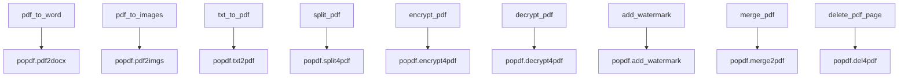
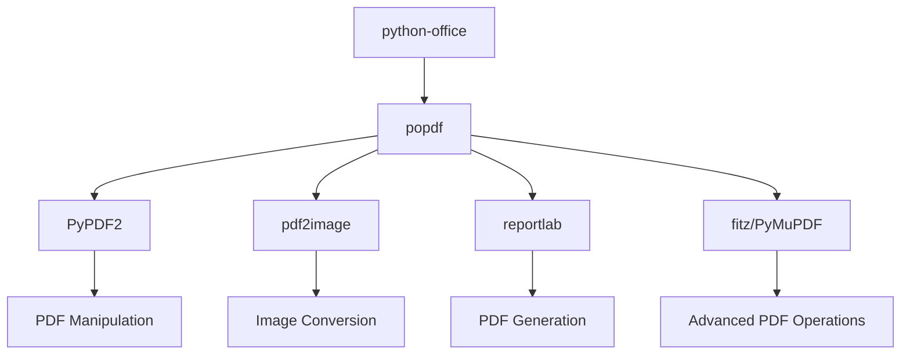
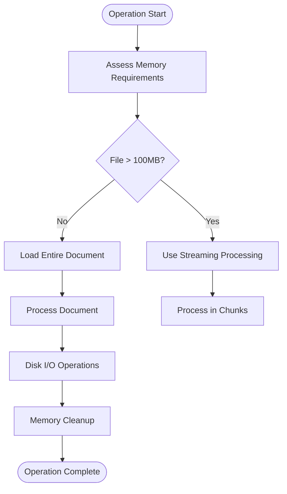

# PDF API Reference

<cite>
**Referenced Files in This Document**   
- [pdf.py](file://office/api/pdf.py)
- [PDF加密.py](file://examples/popdf/PDF加密.py)
- [PDF加水印.py](file://examples/popdf/PDF加水印.py)
- [TXT转PDF.py](file://examples/popdf/TXT转PDF.py)
- [pdf转word.py](file://examples/popdf/pdf转word.py)
- [pdf转图片.py](file://examples/popdf/pdf转图片.py)
- [合并PDF.py](file://examples/popdf/合并PDF.py)
- [add_watermark_service.py](file://office/lib/pdf/add_watermark_service.py)
</cite>

## Table of Contents
1. [Introduction](#introduction)
2. [Core Functions](#core-functions)
3. [Function Specifications](#function-specifications)
4. [Practical Examples](#practical-examples)
5. [Library Integration](#library-integration)
6. [Performance Characteristics](#performance-characteristics)
7. [Error Handling and Troubleshooting](#error-handling-and-troubleshooting)
8. [Conclusion](#conclusion)

## Introduction
The popdf module within the python-office library provides comprehensive PDF processing capabilities through a simple, one-line API interface. Designed for both technical and non-technical users, this module enables automation of common PDF operations without requiring deep knowledge of PDF manipulation libraries. The API abstracts complex underlying operations into intuitive functions that handle format conversions, security operations, and document modifications. Built as a wrapper around the popdf library and leveraging multiple PDF processing libraries, it offers a unified interface for PDF manipulation across different platforms and use cases.

**Section sources**
- [pdf.py](file://office/api/pdf.py#L1-L226)
- [README.md](file://README.md#L47-L65)

## Core Functions

The popdf module provides nine core functions for PDF manipulation, each designed to perform a specific document processing task with minimal code. These functions are exposed through the office.api.pdf module and serve as wrappers for the underlying popdf library operations. The API follows a consistent pattern of accepting file paths and optional parameters while returning None, with results written directly to disk. This design prioritizes simplicity and ease of use, particularly for automation scripts and non-programmers.



**Diagram sources**
- [pdf.py](file://office/api/pdf.py#L28-L226)

**Section sources**
- [pdf.py](file://office/api/pdf.py#L1-L226)

## Function Specifications

### pdf_to_word
Converts PDF documents to editable Word format.

**Parameters:**
- `input_file` (str): Path to the source PDF file
- `output_path` (str, optional): Directory for the output Word file, defaults to current directory

**Behavior:** Uses the popdf.pdf2docx function to convert the PDF content to DOCX format while preserving text formatting and layout structure.

**Section sources**
- [pdf.py](file://office/api/pdf.py#L28-L41)

### pdf_to_images
Converts PDF pages to image files.

**Parameters:**
- `input_file` (str): Path to the source PDF file
- `output_path` (str): Directory for output images
- `merge` (bool, optional): Whether to merge all pages into a single image, defaults to False

**Behavior:** Processes each page of the PDF and exports it as a separate image file in JPG format. When merge=True, combines all pages into one continuous image.

**Section sources**
- [pdf.py](file://office/api/pdf.py#L43-L57)

### txt_to_pdf
Converts plain text files to PDF documents.

**Parameters:**
- `input_file` (str): Path to the source text file
- `output_file` (str, optional): Path for the output PDF file, defaults to 'txt2pdf.pdf'

**Behavior:** Reads the text content and creates a PDF document with default formatting and font settings.

**Section sources**
- [pdf.py](file://office/api/pdf.py#L59-L73)

### split_pdf
Extracts a range of pages from a PDF document.

**Parameters:**
- `input_file` (str): Path to the source PDF file
- `output_file` (str, optional): Path for the output PDF, defaults to './output_path/split_pdf.pdf'
- `from_page` (int, optional): Starting page number (0-indexed), defaults to -1 (first page)
- `to_page` (int, optional): Ending page number (exclusive), defaults to -1 (last page)

**Behavior:** Creates a new PDF containing only the specified page range from the original document.

**Section sources**
- [pdf.py](file://office/api/pdf.py#L75-L89)

### encrypt_pdf
Applies password protection to PDF files.

**Parameters:**
- `password` (str): Password for encrypting the PDF
- `input_file` (str, optional): Input PDF filename with path
- `output_file` (str, optional): Output encrypted PDF filename with path
- `input_path` (str, optional): Input directory path
- `output_path` (str, optional): Output directory path

**Behavior:** Encrypts the PDF with the specified password, requiring it for opening the document.

**Section sources**
- [pdf.py](file://office/api/pdf.py#L92-L112)

### decrypt_pdf
Removes password protection from encrypted PDF files.

**Parameters:**
- `password` (str): Password to decrypt the PDF
- `input_file` (str, optional): Input encrypted PDF filename with path
- `output_file` (str, optional): Output decrypted PDF filename with path
- `input_path` (str, optional): Input directory path
- `output_path` (str, optional): Output directory path

**Behavior:** Decrypts the PDF using the provided password, creating an unprotected version.

**Section sources**
- [pdf.py](file://office/api/pdf.py#L114-L131)

### add_watermark
Adds text watermark to PDF documents.

**Parameters:**
- `input_file` (str): Path to the source PDF file
- `point` (tuple): Coordinate position for the watermark
- `text` (str, optional): Watermark text content, defaults to 'python-office'
- `output_file` (str, optional): Path for the output PDF, defaults to './pdf_watermark.pdf'
- `fontname` (str, optional): Font family name, defaults to 'Helvetica'
- `fontsize` (int, optional): Font size, defaults to 12
- `color` (tuple, optional): RGB color values, defaults to red (1, 0, 0)

**Behavior:** Overlays the specified text as a watermark at the given position on all pages.

**Section sources**
- [pdf.py](file://office/api/pdf.py#L133-L153)

### merge_pdf
Combines multiple PDF files into a single document.

**Parameters:**
- `input_file_list` (list): List of PDF file paths to merge
- `output_file` (str): Path for the merged output PDF

**Behavior:** Concatenates the input PDF files in the specified order into one continuous document.

**Section sources**
- [pdf.py](file://office/api/pdf.py#L155-L168)

### delete_pdf_page
Removes specified pages from a PDF document.

**Parameters:**
- `input_file` (str): Path to the source PDF file
- `output_file` (str): Path for the output PDF
- `page_nums` (list): List of page numbers to delete (0-indexed)

**Behavior:** Creates a new PDF with the specified pages removed from the original document.

**Section sources**
- [pdf.py](file://office/api/pdf.py#L170-L183)

## Practical Examples

### Encryption Workflow
Demonstrates how to secure a PDF document with password protection:

```python
import office
office.pdf.encrypt4pdf(
    path='./test_files/encrypt4pdf/程序员晚枫（作品合集）.pdf',
    password='你想添加的密码'
)
```

This example shows the basic encryption pattern where a PDF file is protected with a user-defined password. The function can handle both single files and batch operations through different parameter combinations.

**Section sources**
- [PDF加密.py](file://examples/popdf/PDF加密.py#L1-L27)

### Batch Conversion
Shows how to convert multiple PDFs to images:

```python
import office
office.pdf.pdf2imgs(
    pdf_path='D://程序员晚枫的文件夹//程序员晚枫.pdf',
    out_dir='./点赞+关注文件夹'
)
```

The batch conversion process automatically processes all pages in the PDF and saves them as individual image files in the specified output directory.

**Section sources**
- [pdf转图片.py](file://examples/popdf/pdf转图片.py#L1-L13)

### Watermarking
Illustrates adding custom watermarks to PDF documents:

```python
import office
office.pdf.add_mark(
    pdf_file=r'./test_files/add_mark/程序员晚枫（没加水印）.pdf', 
    mark_str='程序员晚枫',
    output_path=r'./test_files/add_mark/output', 
    output_file_name='程序员晚枫（加了水印）.pdf'
)
```

This example demonstrates parameterized watermarking where custom text is added to a PDF with control over output location and filename.

**Section sources**
- [PDF加水印.py](file://examples/popdf/PDF加水印.py#L1-L7)

## Library Integration

The popdf module integrates multiple PDF processing libraries to provide comprehensive functionality. The architecture follows a wrapper pattern where the office.api.pdf module exposes simplified interfaces to the underlying popdf library, which in turn leverages specialized libraries for different operations.



**Diagram sources**
- [add_watermark_service.py](file://office/lib/pdf/add_watermark_service.py#L3-L73)
- [pdf.py](file://office/api/pdf.py#L25)

The integration with PyPDF2 enables core PDF operations like merging, splitting, and encryption/decryption. For image conversion, the module uses pdf2image which relies on Poppler. Text-to-PDF conversion and watermark generation utilize reportlab for PDF creation. The system handles different PDF versions through the underlying libraries' compatibility layers, automatically detecting and adapting to PDF specifications. Security settings are managed through PyPDF2's encryption capabilities, supporting standard PDF security protocols.

**Section sources**
- [add_watermark_service.py](file://office/lib/pdf/add_watermark_service.py#L3-L73)
- [setup.cfg](file://setup.cfg#L21-L41)

## Performance Characteristics

The popdf module's performance varies significantly based on the operation type and document characteristics. Memory usage and disk I/O patterns differ across functions:



**Diagram sources**
- [add_watermark_service.py](file://office/lib/pdf/add_watermark_service.py#L46-L72)

For large PDF files, the module can experience high memory consumption, particularly during conversion operations that require loading the entire document into memory. The pdf_to_images function is especially resource-intensive as it must render each page at high resolution. Disk I/O is significant for all operations since input and output files are read from and written to disk rather than processed in memory. The encryption and decryption functions have relatively low memory overhead but require complete file reads and writes. Watermarking operations scale linearly with document length due to page-by-page processing.

**Section sources**
- [add_watermark_service.py](file://office/lib/pdf/add_watermark_service.py#L46-L72)
- [pdf.py](file://office/api/pdf.py#L43-L57)

## Error Handling and Troubleshooting

The popdf module handles several common failure modes with specific error conditions:

**Corrupted PDFs:** When encountering corrupted PDF files, the underlying PyPDF2 library typically raises PdfReadError exceptions. The module does not implement extensive error recovery but relies on the robustness of the underlying libraries.

**Password Protection Issues:** For encrypted PDFs, if an incorrect password is provided during decryption, PyPDF2 raises a PdfReadError. The current implementation in add_watermark_service.py includes interactive password prompting when encryption is detected.

**Font Embedding Problems:** When converting text to PDF or adding watermarks, missing fonts can cause substitution with default fonts. The current implementation uses reportlab with hardcoded font paths (e.g., 'C:/Windows/Fonts/simfang.ttf'), which may fail on non-Windows systems or when fonts are not available.

**Troubleshooting Solutions:**
- For password issues: Verify the password and ensure it matches the one used for encryption
- For font problems: Install required fonts or modify the code to use available fonts
- For corrupted files: Use PDF repair tools before processing
- For permission errors: Ensure read/write permissions on input/output directories

The error handling is relatively basic, with most functions failing silently or with minimal error information. For production use, wrapping calls in try-except blocks is recommended to catch underlying library exceptions.

**Section sources**
- [add_watermark_service.py](file://office/lib/pdf/add_watermark_service.py#L50-L58)
- [test_pdf.py](file://tests/test_code/test_pdf.py#L1-L103)

## Conclusion
The popdf module provides a comprehensive set of PDF processing functions through a simple, one-line API interface. By wrapping the popdf library and leveraging multiple underlying PDF processing libraries, it offers a wide range of capabilities from format conversion to security operations. The design prioritizes ease of use and accessibility, making PDF automation available to users without programming expertise. While the module handles most common PDF operations effectively, users should be aware of its resource requirements for large files and its basic error handling approach. The integration of multiple libraries provides robust functionality but also introduces dependencies that must be managed in different deployment environments.

**Section sources**
- [pdf.py](file://office/api/pdf.py#L1-L226)
- [README.md](file://README.md#L47-L65)