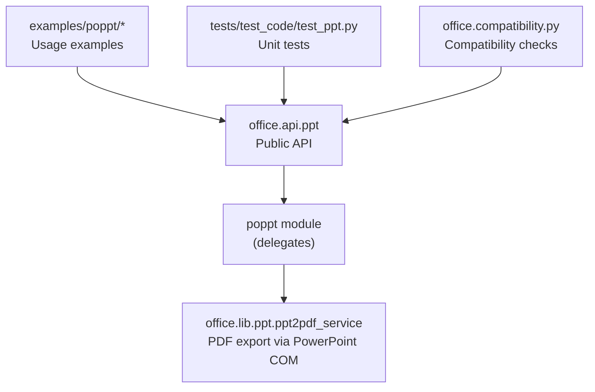
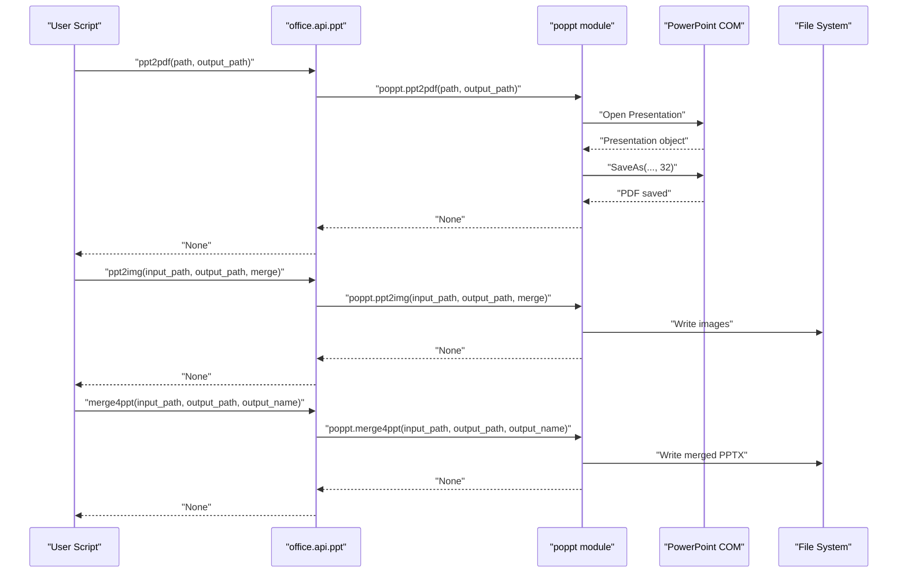
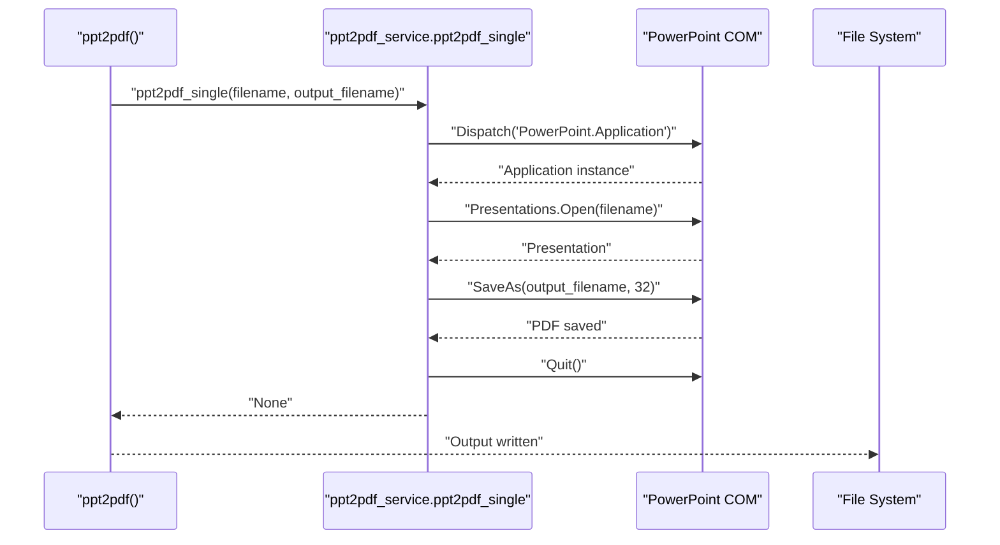
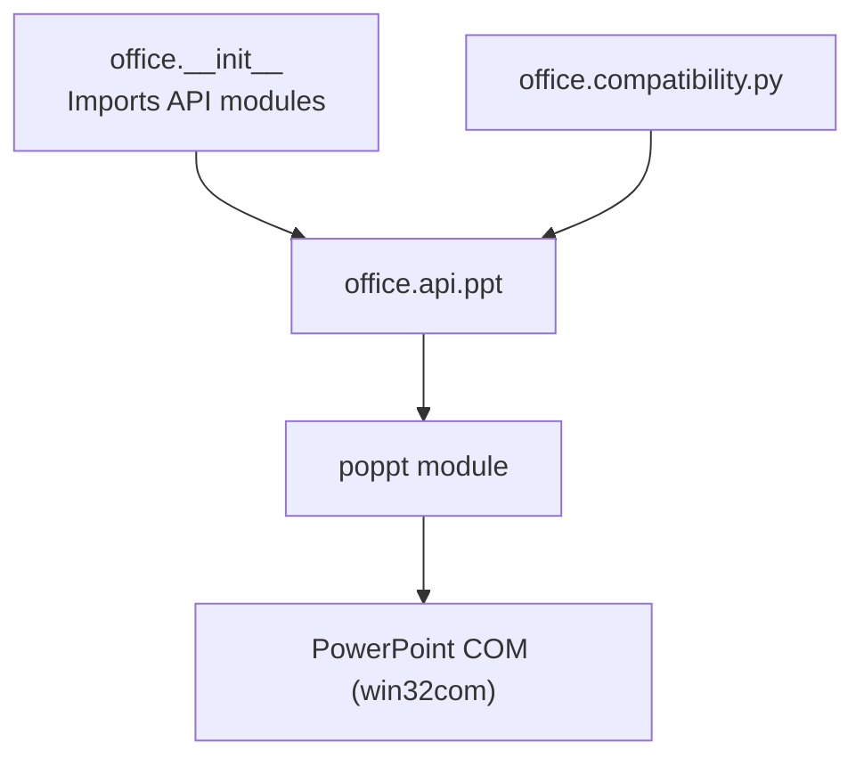

# PPT API Reference

<cite>
**Referenced Files in This Document**
- [ppt.py](file://office/api/ppt.py)
- [ppt2pdf_service.py](file://office/lib/ppt/ppt2pdf_service.py)
- [ppt2pdf.py](file://examples/poppt/ppt2pdf.py)
- [ppt2img.py](file://examples/poppt/ppt2img.py)
- [merge4ppt.py](file://examples/poppt/merge4ppt.py)
- [test_ppt.py](file://tests/test_code/test_ppt.py)
- [compatibility.py](file://office/compatibility.py)
- [__init__.py](file://office/__init__.py)
- [README.md](file://README.md)
</cite>

## Table of Contents
1. [Introduction](#introduction)
2. [Project Structure](#project-structure)
3. [Core Components](#core-components)
4. [Architecture Overview](#architecture-overview)
5. [Detailed Component Analysis](#detailed-component-analysis)
6. [Dependency Analysis](#dependency-analysis)
7. [Performance Considerations](#performance-considerations)
8. [Troubleshooting Guide](#troubleshooting-guide)
9. [Conclusion](#conclusion)
10. [Appendices](#appendices)

## Introduction
This document provides comprehensive API documentation for the PowerPoint module (poppt) within the python-office ecosystem. It focuses on the public API surface exposed under office.api.ppt, covering the functions for converting PPT to PDF, converting PPT to images, and merging multiple PPT files. It also explains how the API integrates with underlying libraries, describes platform-specific behavior, and provides guidance on performance, memory usage, and common issues encountered during conversion.

## Project Structure
The poppt module’s public API is defined in office.api.ppt and delegates to an internal poppt module. Example scripts demonstrate usage patterns for conversion and merging. Compatibility checks indicate Windows-only dependencies for PowerPoint-related operations.

**Diagram sources**
- [ppt.py](file://office/api/ppt.py#L1-L46)
- [ppt2pdf_service.py](file://office/lib/ppt/ppt2pdf_service.py#L1-L34)
- [ppt2pdf.py](file://examples/poppt/ppt2pdf.py#L1-L9)
- [ppt2img.py](file://examples/poppt/ppt2img.py#L1-L24)
- [merge4ppt.py](file://examples/poppt/merge4ppt.py#L1-L14)
- [test_ppt.py](file://tests/test_code/test_ppt.py#L1-L26)
- [compatibility.py](file://office/compatibility.py#L39-L198)

**Section sources**
- [ppt.py](file://office/api/ppt.py#L1-L46)
- [ppt2pdf_service.py](file://office/lib/ppt/ppt2pdf_service.py#L1-L34)
- [ppt2pdf.py](file://examples/poppt/ppt2pdf.py#L1-L9)
- [ppt2img.py](file://examples/poppt/ppt2img.py#L1-L24)
- [merge4ppt.py](file://examples/poppt/merge4ppt.py#L1-L14)
- [test_ppt.py](file://tests/test_code/test_ppt.py#L1-L26)
- [compatibility.py](file://office/compatibility.py#L39-L198)

## Core Components
- Public API entry points:
  - ppt2pdf(path, output_path)
  - ppt2img(input_path, output_path, merge)
  - merge4ppt(input_path, output_path, output_name)
- Underlying implementation:
  - PDF export uses PowerPoint COM automation.
  - Image export and merge operations are delegated to the poppt module.
- Example usage:
  - Conversion to PDF and images, and merging multiple presentations are demonstrated in examples/poppt.

Key observations:
- The API is thin wrappers around the poppt module.
- PDF conversion relies on Microsoft PowerPoint via win32com.
- Image conversion supports single-file or directory inputs and can produce a single merged image.

**Section sources**
- [ppt.py](file://office/api/ppt.py#L1-L46)
- [ppt2pdf_service.py](file://office/lib/ppt/ppt2pdf_service.py#L1-L34)
- [ppt2pdf.py](file://examples/poppt/ppt2pdf.py#L1-L9)
- [ppt2img.py](file://examples/poppt/ppt2img.py#L1-L24)
- [merge4ppt.py](file://examples/poppt/merge4ppt.py#L1-L14)

## Architecture Overview
The poppt API exposes three primary functions. Internally, PDF conversion is performed by launching PowerPoint via COM and saving as PDF. Image conversion and merging are handled by the poppt module. The examples show typical usage patterns for batch conversions and merges.

**Diagram sources**
- [ppt.py](file://office/api/ppt.py#L1-L46)
- [ppt2pdf_service.py](file://office/lib/ppt/ppt2pdf_service.py#L1-L34)
- [ppt2pdf.py](file://examples/poppt/ppt2pdf.py#L1-L9)
- [ppt2img.py](file://examples/poppt/ppt2img.py#L1-L24)
- [merge4ppt.py](file://examples/poppt/merge4ppt.py#L1-L14)

## Detailed Component Analysis

### API Functions Overview
- ppt2pdf(path, output_path)
  - Purpose: Convert a PPT/PPTX to PDF.
  - Parameters:
    - path: Input PPT/PPTX file path.
    - output_path: Output directory for the generated PDF.
  - Behavior: Delegates to poppt.ppt2pdf.
- ppt2img(input_path, output_path, merge)
  - Purpose: Convert PPT/PPTX slides to images; can merge into a single tall image.
  - Parameters:
    - input_path: Single file or directory containing PPT/PPTX files.
    - output_path: Output directory for images.
    - merge: If True, produces one merged image; if False, one image per slide.
  - Behavior: Delegates to poppt.ppt2img.
- merge4ppt(input_path, output_path, output_name)
  - Purpose: Merge multiple PPT/PPTX files into a single PPTX.
  - Parameters:
    - input_path: Directory containing PPT/PPTX files to merge.
    - output_path: Output directory for the merged PPTX.
    - output_name: Name of the merged output file.
  - Behavior: Delegates to poppt.merge4ppt.

Notes on parameters and options:
- Conversion quality, slide range selection, and output format options are not exposed in the current API wrapper. These capabilities depend on the underlying poppt module and PowerPoint COM behavior.

Practical examples:
- PDF conversion example: [ppt2pdf.py](file://examples/poppt/ppt2pdf.py#L1-L9)
- Image conversion example: [ppt2img.py](file://examples/poppt/ppt2img.py#L1-L24)
- Merging example: [merge4ppt.py](file://examples/poppt/merge4ppt.py#L1-L14)

**Section sources**
- [ppt.py](file://office/api/ppt.py#L1-L46)
- [ppt2pdf.py](file://examples/poppt/ppt2pdf.py#L1-L9)
- [ppt2img.py](file://examples/poppt/ppt2img.py#L1-L24)
- [merge4ppt.py](file://examples/poppt/merge4ppt.py#L1-L14)

### PDF Conversion Workflow
- Implementation: Uses PowerPoint COM automation to open the presentation and save as PDF (format code 32).
- Steps:
  - Dispatch PowerPoint application.
  - Open the specified presentation.
  - SaveAs with PDF format.
  - Quit the application.

**Diagram sources**
- [ppt2pdf_service.py](file://office/lib/ppt/ppt2pdf_service.py#L1-L34)

**Section sources**
- [ppt2pdf_service.py](file://office/lib/ppt/ppt2pdf_service.py#L1-L34)

### Image Conversion and Merging
- Image conversion:
  - Supports single file or directory input.
  - Can produce either one image per slide or a single merged image.
- Merging:
  - Merges multiple PPT/PPTX files into one PPTX.
  - Allows specifying output directory and filename.

Example usage:
- [ppt2img.py](file://examples/poppt/ppt2img.py#L1-L24)
- [merge4ppt.py](file://examples/poppt/merge4ppt.py#L1-L14)

**Section sources**
- [ppt2img.py](file://examples/poppt/ppt2img.py#L1-L24)
- [merge4ppt.py](file://examples/poppt/merge4ppt.py#L1-L14)

### Unit Testing
- The test suite exercises the API functions and verifies outputs.
- Example assertions confirm PDF generation and placeholder for image conversion testing.

**Section sources**
- [test_ppt.py](file://tests/test_code/test_ppt.py#L1-L26)

## Dependency Analysis
- Public API depends on the poppt module for implementation.
- PDF conversion depends on PowerPoint COM automation.
- Platform compatibility:
  - PowerPoint-based operations require Microsoft PowerPoint installed on Windows.
  - Compatibility checks and workarounds are documented.

**Diagram sources**
- [__init__.py](file://office/__init__.py#L1-L30)
- [ppt.py](file://office/api/ppt.py#L1-L46)
- [compatibility.py](file://office/compatibility.py#L39-L198)

**Section sources**
- [__init__.py](file://office/__init__.py#L1-L30)
- [ppt.py](file://office/api/ppt.py#L1-L46)
- [compatibility.py](file://office/compatibility.py#L39-L198)

## Performance Considerations
- Large presentations:
  - PDF conversion via PowerPoint COM may consume significant CPU and memory while rendering slides. Expect longer processing times for presentations with many slides, embedded media, or complex graphics.
- Memory usage:
  - Rendering slides for PDF or image export can increase memory consumption proportional to slide complexity and resolution.
- Temporary files:
  - PowerPoint COM may create temporary files during conversion. Ensure adequate disk space and clean up temporary files post-conversion if needed.
- Batch operations:
  - Converting many files in a loop increases total runtime. Consider batching and scheduling to reduce peak load.
- Output format options:
  - The current API does not expose format-specific controls. PDF quality and image resolution are determined by PowerPoint COM defaults.

[No sources needed since this section provides general guidance]

## Troubleshooting Guide
Common issues and recommendations:
- Missing fonts:
  - Symptom: Text appears substituted or distorted.
  - Recommendation: Install missing fonts on the host system or preflight font availability.
- Animation loss:
  - Symptom: Animations not present in exported PDF/images.
  - Recommendation: PowerPoint COM exports static renderings; animations are not preserved.
- Shape distortion:
  - Symptom: Vector shapes or transparency artifacts.
  - Recommendation: Simplify slide content or adjust PowerPoint rendering settings externally.
- PowerPoint not installed or not accessible:
  - Symptom: Exceptions when calling PDF conversion.
  - Recommendation: Install Microsoft PowerPoint on Windows and ensure win32com can dispatch the application. Verify compatibility checks and consider workarounds documented in compatibility utilities.
- File locking or permissions:
  - Symptom: Failures writing output files.
  - Recommendation: Ensure the output directory exists and is writable; close the source presentation if opened elsewhere.
- Slide range selection and conversion quality:
  - Current API does not expose parameters for slide ranges or quality controls. If needed, leverage the underlying poppt module directly or preprocess presentations externally.

**Section sources**
- [compatibility.py](file://office/compatibility.py#L39-L198)

## Conclusion
The poppt API provides straightforward functions for converting PPT/PPTX to PDF, exporting slides to images, and merging multiple presentations. PDF conversion is implemented via PowerPoint COM automation, which offers convenience but ties behavior to PowerPoint’s rendering pipeline. For advanced needs—such as controlling conversion quality, selecting slide ranges, or handling diverse PPT versions—the underlying poppt module may offer additional capabilities beyond the current wrapper. Users should account for platform constraints, memory usage, and potential rendering differences when automating PPT workflows.

[No sources needed since this section summarizes without analyzing specific files]

## Appendices

### API Function Specifications
- ppt2pdf(path, output_path)
  - Inputs:
    - path: str (PPT/PPTX file path)
    - output_path: str (directory for output PDF)
  - Output: None
  - Notes: Delegates to poppt.ppt2pdf; PDF format via PowerPoint COM.
- ppt2img(input_path, output_path, merge)
  - Inputs:
    - input_path: str (single file or directory)
    - output_path: str (output directory)
    - merge: bool (True to merge into one image; False for per-slide images)
  - Output: None
  - Notes: Delegates to poppt.ppt2img.
- merge4ppt(input_path, output_path, output_name)
  - Inputs:
    - input_path: str (directory of PPT/PPTX files)
    - output_path: str (output directory)
    - output_name: str (merged file name)
  - Output: None
  - Notes: Delegates to poppt.merge4ppt.

**Section sources**
- [ppt.py](file://office/api/ppt.py#L1-L46)

### Practical Examples
- PDF conversion:
  - See [ppt2pdf.py](file://examples/poppt/ppt2pdf.py#L1-L9)
- Image conversion (single file, merged output):
  - See [ppt2img.py](file://examples/poppt/ppt2img.py#L1-L24)
- Merging multiple presentations:
  - See [merge4ppt.py](file://examples/poppt/merge4ppt.py#L1-L14)

**Section sources**
- [ppt2pdf.py](file://examples/poppt/ppt2pdf.py#L1-L9)
- [ppt2img.py](file://examples/poppt/ppt2img.py#L1-L24)
- [merge4ppt.py](file://examples/poppt/merge4ppt.py#L1-L14)

### Platform and Integration Notes
- PowerPoint COM dependency:
  - Requires Microsoft PowerPoint on Windows.
  - Refer to compatibility checks and workarounds.
- Integration with python-pptx:
  - The current implementation uses win32com for PDF export. python-pptx is not directly used here; if you need python-pptx features, use that library separately or via the poppt module if it integrates it internally.

**Section sources**
- [compatibility.py](file://office/compatibility.py#L39-L198)
- [README.md](file://README.md#L84-L110)