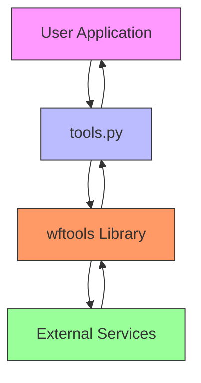
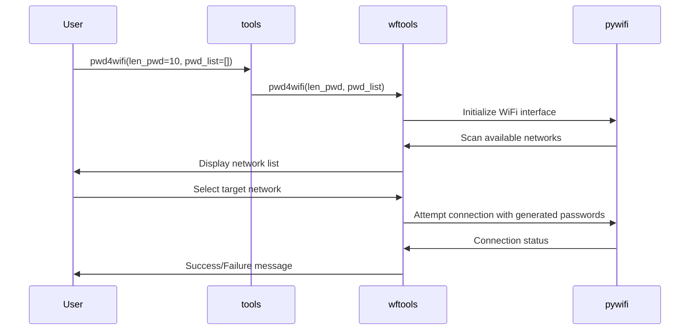
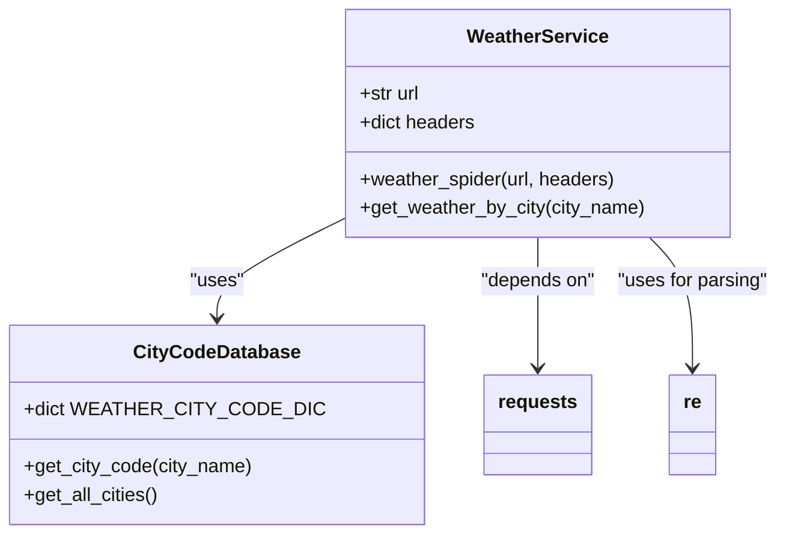
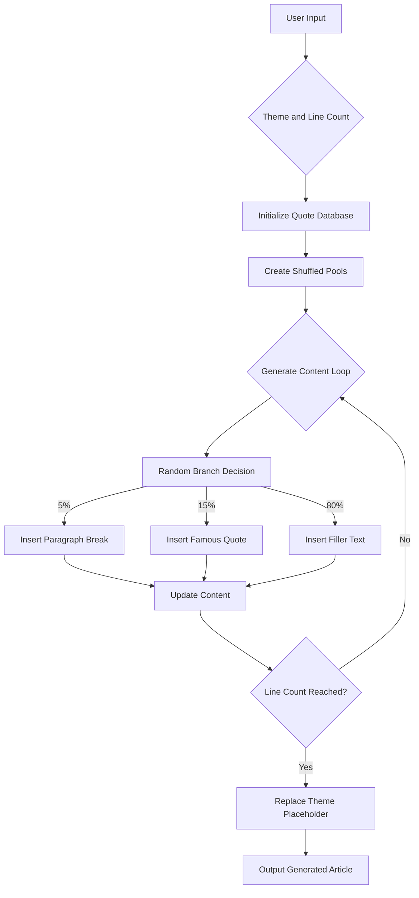
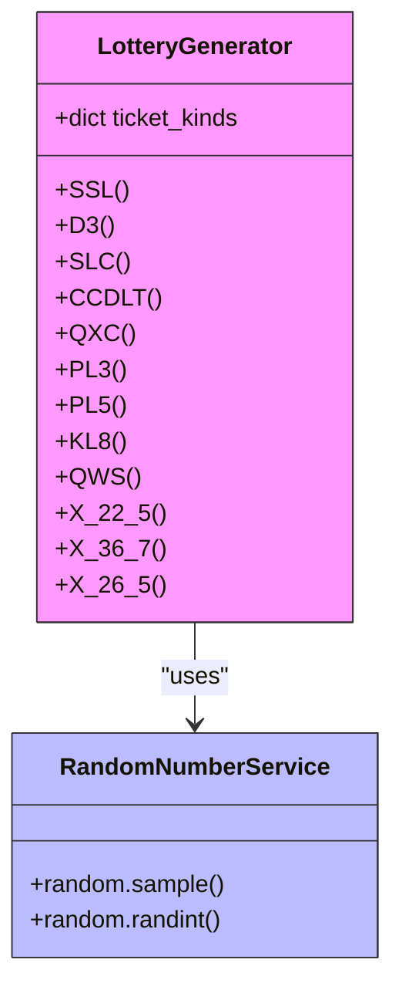

# Tools API Reference

<cite>
**Referenced Files in This Document**   
- [tools.py](file://office/api/tools.py)
- [lottery8ticket.py](file://office/lib/tools/lottery8ticket.py)
- [pwd4wifi_service.py](file://office/lib/tools/pwd4wifi_service.py)
- [qoute_dict_create_article.py](file://office/lib/tools/qoute_dict_create_article.py)
- [weather_service.py](file://office/lib/tools/weather_service.py)
- [weather_city_code.py](file://office/lib/tools/weather_city_code.py)
- [CONST.py](file://office/lib/conf/CONST.py)
- [工具类功能演示.py](file://examples/potools/工具类功能演示.py)
</cite>

## Table of Contents
1. [Introduction](#introduction)
2. [Core Utility Functions](#core-utility-functions)
3. [Password Generation Tools](#password-generation-tools)
4. [Weather Lookup Service](#weather-lookup-service)
5. [Quote Processing and Article Generation](#quote-processing-and-article-generation)
6. [Lottery Number Generation](#lottery-number-generation)
7. [External Service Integration](#external-service-integration)
8. [Usage Examples](#usage-examples)
9. [Configuration and Error Handling](#configuration-and-error-handling)
10. [Troubleshooting Guide](#troubleshooting-guide)

## Introduction
The Tools module (potools) in the python-office library provides a comprehensive suite of utility functions designed to simplify common tasks and enhance productivity. This API documentation details all utility functions available in the office/api/tools.py module, including password generation, weather lookup, quote processing, and lottery number generation. The tools module serves as a convenient wrapper around the wftools library, exposing essential functionality through a simple and intuitive interface.

The module integrates various external APIs and web services to deliver its functionality, with careful consideration given to request/response handling, error recovery, and service availability. Each tool function is designed to be used with minimal configuration, making it accessible to users with varying levels of technical expertise. The examples provided in the examples/potools directory demonstrate practical applications of these tools in real-world scenarios.

**Section sources**
- [tools.py](file://office/api/tools.py#L1-L146)
- [工具类功能演示.py](file://examples/potools/工具类功能演示.py#L1-L98)

## Core Utility Functions

The tools module provides several core utility functions that address common needs in automation and productivity workflows. These functions are implemented as wrappers around the wftools library, providing a clean and consistent interface for users. The primary functions include translation services, QR code generation, URL to IP address conversion, and network speed testing.

The translation function (transtools) enables multilingual content translation, supporting various language pairs with configurable source and target languages. QR code generation (qrcodetools) allows users to create scannable QR codes from URLs or other text content, with customizable output paths. The URL to IP address conversion function (url2ip) resolves domain names to their corresponding IP addresses, which can be useful for network diagnostics and security applications.

**Diagram sources**
- [tools.py](file://office/api/tools.py#L1-L146)

**Section sources**
- [tools.py](file://office/api/tools.py#L1-L146)

## Password Generation Tools

The password generation tools in the potools module provide secure methods for creating passwords of specified lengths. The primary function, passwordtools, generates random passwords with a default length of 8 characters, though users can specify custom lengths as needed. This function is particularly useful for creating secure WiFi passwords or other authentication credentials.

The pwd4wifi function extends the basic password generation capability by allowing users to generate lists of WiFi passwords. It accepts parameters for password length and an optional password list, enabling users to create multiple passwords at once. This function is designed to work with the pywifi library, which handles the actual WiFi network interactions and password testing.

**Diagram sources**
- [tools.py](file://office/api/tools.py#L104-L118)
- [pwd4wifi_service.py](file://office/lib/tools/pwd4wifi_service.py#L1-L163)

**Section sources**
- [tools.py](file://office/api/tools.py#L35-L45)
- [pwd4wifi_service.py](file://office/lib/tools/pwd4wifi_service.py#L1-L163)

## Weather Lookup Service

The weather lookup service provides current weather information for various locations. The weather function serves as the primary interface for accessing weather data, leveraging web scraping techniques to retrieve information from online weather services. The implementation relies on a comprehensive city code database (weather_city_code.py) that maps city names to their corresponding weather station codes.

The weather service uses HTTP requests to fetch weather data from a designated website, then employs regular expressions to parse the relevant information from the HTML response. The service extracts key weather metrics such as temperature, humidity, and forecast details, presenting them in a user-friendly format. The city code database contains over 800 entries, covering major cities and regions across China.

**Diagram sources**
- [weather_service.py](file://office/lib/tools/weather_service.py#L1-L25)
- [weather_city_code.py](file://office/lib/tools/weather_city_code.py#L1-L800)

**Section sources**
- [tools.py](file://office/api/tools.py#L46-L55)
- [weather_service.py](file://office/lib/tools/weather_service.py#L1-L25)
- [weather_city_code.py](file://office/lib/tools/weather_city_code.py#L1-L800)

## Quote Processing and Article Generation

The quote processing and article generation functionality enables automated content creation based on predefined templates and quote databases. The create_article function generates text content around a specified theme, incorporating famous quotes and filler text to create coherent articles. This feature is particularly useful for generating placeholder content or creating content with a specific rhetorical style.

The implementation uses a dictionary-based approach to store quotes, filler phrases, and transitional text. The system randomly selects and combines these elements according to a probabilistic algorithm that determines the flow and structure of the generated article. The quote database contains over 100 famous quotes from various historical figures and philosophers, categorized by theme and sentiment.

**Diagram sources**
- [qoute_dict_create_article.py](file://office/lib/tools/qoute_dict_create_article.py#L1-L223)

**Section sources**
- [tools.py](file://office/api/tools.py#L91-L101)
- [qoute_dict_create_article.py](file://office/lib/tools/qoute_dict_create_article.py#L1-L223)

## Lottery Number Generation

The lottery number generation tools provide functionality for creating random lottery numbers across various game formats. The lottery8ticket function serves as the main interface, offering a menu-driven system for selecting different lottery types and generating corresponding numbers. The implementation supports multiple lottery formats, including Double Color Ball, Welfare Lottery 3D, Seven Color, Super Lotto, and others.

The system uses Python's random module to generate statistically random numbers within the constraints of each lottery format. For example, Double Color Ball numbers consist of six red balls (selected from 1-33) and one blue ball (selected from 1-16). The code maintains a dictionary mapping lottery types to their respective generation functions, allowing for easy extension and maintenance.

**Diagram sources**
- [lottery8ticket.py](file://office/lib/tools/lottery8ticket.py#L1-L92)

**Section sources**
- [tools.py](file://office/api/tools.py#L78-L87)
- [lottery8ticket.py](file://office/lib/tools/lottery8ticket.py#L1-L92)

## External Service Integration

The tools module integrates with various external services and APIs to deliver its functionality. These integrations are designed with considerations for rate limiting, service availability, and fallback mechanisms. The module uses standard HTTP libraries like requests to communicate with external endpoints, implementing appropriate error handling and retry logic.

For services that require API keys or authentication, the module follows a configuration-based approach, allowing users to specify credentials through environment variables or configuration files. The integration with the pywifi library for WiFi password cracking demonstrates how the tools module can leverage specialized third-party libraries to extend its capabilities.

The module implements timeout settings for all external service calls, preventing indefinite blocking in case of network issues or unresponsive services. Configuration options allow users to customize endpoint URLs and timeout durations according to their specific requirements and network conditions.

**Section sources**
- [tools.py](file://office/api/tools.py#L1-L146)
- [pwd4wifi_service.py](file://office/lib/tools/pwd4wifi_service.py#L1-L163)

## Usage Examples

The examples provided in the examples/potools directory demonstrate practical applications of the tools module functions. These examples showcase how to use each tool in real-world scenarios, providing a starting point for developers and users. The "工具类功能演示.py" file contains a comprehensive demonstration of all available tools, illustrating their usage patterns and expected outputs.

The examples follow a consistent pattern of importing the office module, calling the appropriate tool functions with sample parameters, and handling the results. Error handling is demonstrated through try-catch blocks that gracefully manage service outages or authentication failures. The examples also show how to customize function parameters to meet specific requirements.

**Diagram sources**
- [工具类功能演示.py](file://examples/potools/工具类功能演示.py#L1-L98)

**Section sources**
- [工具类功能演示.py](file://examples/potools/工具类功能演示.py#L1-L98)

## Configuration and Error Handling

The tools module implements robust error handling and configuration management to ensure reliable operation across different environments. Configuration options are exposed through function parameters and module-level constants, allowing users to customize behavior without modifying source code. The SPLIT_LINE constant from CONST.py is used throughout the module to format output consistently.

Error recovery mechanisms include try-catch blocks for handling exceptions from external service calls, with appropriate fallback behaviors. For example, when weather data cannot be retrieved, the application provides informative error messages rather than crashing. The module also implements input validation to prevent common usage errors and provide helpful feedback to users.

Rate limiting is addressed through careful management of request frequency and implementation of exponential backoff strategies when appropriate. Service availability is monitored through timeout settings and connection status checks, with mechanisms to retry failed requests or switch to alternative services when possible.

**Section sources**
- [tools.py](file://office/api/tools.py#L1-L146)
- [CONST.py](file://office/lib/conf/CONST.py#L1-L1)

## Troubleshooting Guide

When encountering issues with the tools module, users should first verify their internet connection and ensure that external services are accessible. Common problems include authentication failures, rate limiting, and service outages. For authentication issues, verify that API keys are correctly configured and have the necessary permissions.

For service outages, check the status of the external providers and consider implementing retry logic with exponential backoff. When dealing with data format changes from external providers, review the response structure and update parsing logic as needed. The module's error messages typically provide specific information about the nature of the problem, which can aid in troubleshooting.

If issues persist, consult the example code in the examples/potools directory for correct usage patterns. The project's GitHub repository also contains issue reports from other users that may provide solutions to common problems. For complex issues, consider reaching out to the developer community through the project's communication channels.

**Section sources**
- [tools.py](file://office/api/tools.py#L1-L146)
- [工具类功能演示.py](file://examples/potools/工具类功能演示.py#L1-L98)