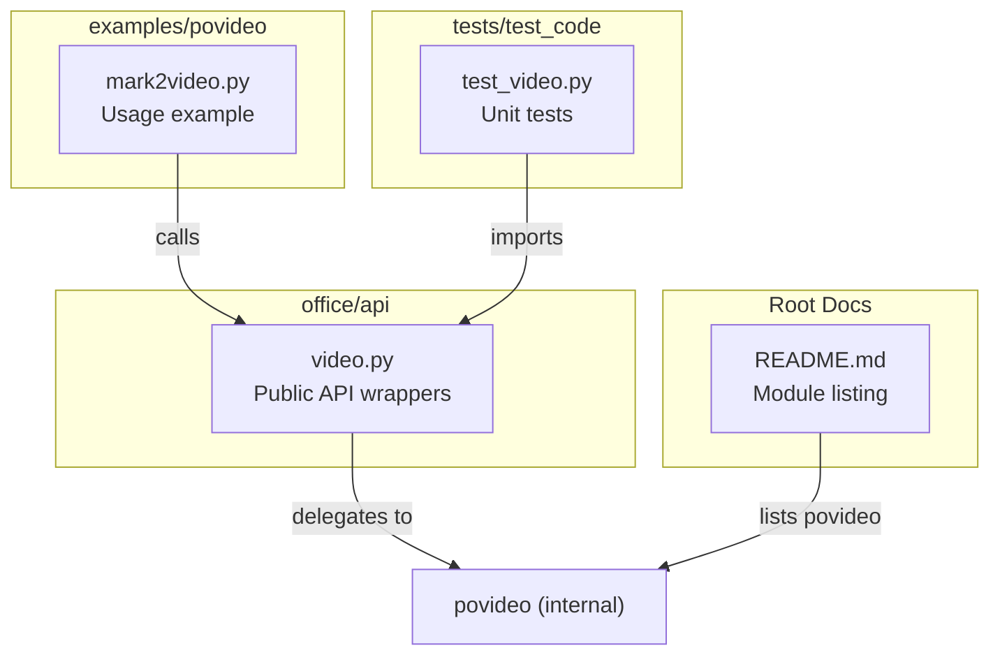
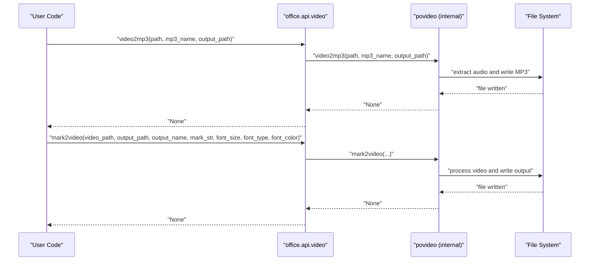
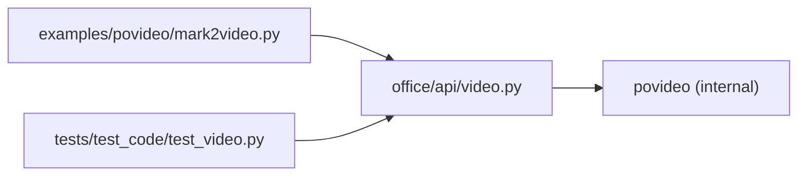

# Video API Reference

<cite>
**Referenced Files in This Document**
- [office/api/video.py](file://office/api/video.py)
- [examples/povideo/mark2video.py](file://examples/povideo/mark2video.py)
- [tests/test_code/test_video.py](file://tests/test_code/test_video.py)
- [README.md](file://README.md)
</cite>

## Table of Contents
1. [Introduction](#introduction)
2. [Project Structure](#project-structure)
3. [Core Components](#core-components)
4. [Architecture Overview](#architecture-overview)
5. [Detailed Component Analysis](#detailed-component-analysis)
6. [Dependency Analysis](#dependency-analysis)
7. [Performance Considerations](#performance-considerations)
8. [Troubleshooting Guide](#troubleshooting-guide)
9. [Conclusion](#conclusion)
10. [Appendices](#appendices)

## Introduction
This document provides a comprehensive API reference for the video processing module (povideo) exposed via the office API. It focuses on the functions defined in office/api/video.py, including mark2video and related video operations. It also outlines usage patterns demonstrated in examples/povideo/mark2video.py, and discusses integration points with underlying video libraries, codec/container handling, and operational considerations such as performance and common issues.

## Project Structure
The video-related functionality is primarily exposed through a thin wrapper in office/api/video.py that delegates to an internal module named povideo. Example usage is provided under examples/povideo/, and tests validate basic functionality.

**Diagram sources**
- [office/api/video.py](file://office/api/video.py#L1-L73)
- [examples/povideo/mark2video.py](file://examples/povideo/mark2video.py#L1-L6)
- [tests/test_code/test_video.py](file://tests/test_code/test_video.py#L1-L22)
- [README.md](file://README.md#L100-L110)

**Section sources**
- [office/api/video.py](file://office/api/video.py#L1-L73)
- [examples/povideo/mark2video.py](file://examples/povideo/mark2video.py#L1-L6)
- [tests/test_code/test_video.py](file://tests/test_code/test_video.py#L1-L22)
- [README.md](file://README.md#L100-L110)

## Core Components
The video API exposes four primary functions:
- video2mp3: Extract audio from a video file and save as MP3.
- audio2txt: Transcribe audio to text using an external service (with a documented local file size constraint).
- mark2video: Add a text watermark to a video.
- txt2mp3: Convert text to speech and produce an MP3 file.

These functions are thin wrappers around an internal module named povideo. The public API does not expose parameters for video encoding, resolution, frame rate, watermark placement, or duration control. These capabilities are delegated to the underlying povideo implementation.

Key behaviors and constraints:
- mark2video currently supports English-only watermark text and allows specifying font size, font type, and font color.
- audio2txt imposes a local file size limit noted in the docstring.
- txt2mp3 returns a value from the underlying implementation.

**Section sources**
- [office/api/video.py](file://office/api/video.py#L8-L18)
- [office/api/video.py](file://office/api/video.py#L21-L35)
- [office/api/video.py](file://office/api/video.py#L39-L56)
- [office/api/video.py](file://office/api/video.py#L60-L72)

## Architecture Overview
The public API wraps an internal module named povideo. Calls made through office.api.video are forwarded to the corresponding functions in povideo. The examples demonstrate invoking the public API, while tests exercise the API surface.

**Diagram sources**
- [office/api/video.py](file://office/api/video.py#L8-L18)
- [office/api/video.py](file://office/api/video.py#L39-L56)

## Detailed Component Analysis

### video2mp3
Purpose:
- Extract audio from a video file and save it as an MP3.

Parameters:
- path: Path to the input video file.
- mp3_name: Optional output MP3 filename. If not provided, a default name may be derived from the input.
- output_path: Output directory for the generated MP3.

Behavior:
- Delegates to the internal povideo.video2mp3 function.
- Produces an MP3 file at the specified location.

Usage example:
- See tests/test_code/test_video.py for invocation patterns.

Notes:
- Codec/container handling and encoding parameters are managed internally by the underlying implementation.

**Section sources**
- [office/api/video.py](file://office/api/video.py#L8-L18)
- [tests/test_code/test_video.py](file://tests/test_code/test_video.py#L16-L21)

### audio2txt
Purpose:
- Transcribe audio to text using an external service.

Constraints:
- Local audio files must not exceed a specified size threshold.

Parameters:
- audio_path: Path to the input audio file.
- appid: Application identifier for the transcription service.
- secret_id: Secret identifier for the service.
- secret_key: Secret key for the service.

Behavior:
- Delegates to the internal povideo.audio2txt function.
- No return value is indicated by the wrapper.

Common use cases:
- Converting short audio clips to text for downstream processing.

**Section sources**
- [office/api/video.py](file://office/api/video.py#L21-L35)

### mark2video
Purpose:
- Add a text watermark to a video.

Parameters:
- video_path: Path to the input video file.
- output_path: Output directory for the watermarked video.
- output_name: Output filename for the watermarked video.
- mark_str: Watermark text (English-only).
- font_size: Font size for the watermark text.
- font_type: Font family for the watermark text.
- font_color: Color for the watermark text.

Behavior:
- Delegates to the internal povideo.mark2video function.
- Produces a watermarked video file at the specified location.

Usage example:
- examples/povideo/mark2video.py demonstrates calling the API with a video path and output directory.

Watermark placement:
- The public API does not expose explicit placement controls (e.g., x/y coordinates). Placement is handled by the underlying implementation.

Encoding/resolution/frame rate:
- The public API does not expose parameters for encoding, resolution, or frame rate. These are managed internally.

Duration control:
- The public API does not expose duration trimming or control parameters. Duration handling is managed internally.

**Section sources**
- [office/api/video.py](file://office/api/video.py#L39-L56)
- [examples/povideo/mark2video.py](file://examples/povideo/mark2video.py#L1-L6)

### txt2mp3
Purpose:
- Convert text to speech and produce an MP3 file.

Parameters:
- content: Text content to convert.
- file: Optional path to a file whose content should be used instead of the literal content.
- mp3: Output MP3 path and filename. Passing None disables saving to disk.
- speak: Whether to play the generated audio immediately.

Behavior:
- Delegates to the internal povideo.txt2mp3 function.
- Returns a value from the underlying implementation.

**Section sources**
- [office/api/video.py](file://office/api/video.py#L60-L72)

## Dependency Analysis
The public API depends on an internal module named povideo. The examples import the public API and call its functions. Tests import the public API to validate behavior.

**Diagram sources**
- [examples/povideo/mark2video.py](file://examples/povideo/mark2video.py#L1-L6)
- [tests/test_code/test_video.py](file://tests/test_code/test_video.py#L1-L22)
- [office/api/video.py](file://office/api/video.py#L1-L73)

**Section sources**
- [office/api/video.py](file://office/api/video.py#L1-L73)
- [examples/povideo/mark2video.py](file://examples/povideo/mark2video.py#L1-L6)
- [tests/test_code/test_video.py](file://tests/test_code/test_video.py#L1-L22)

## Performance Considerations
- Long-running operations: Video processing tasks (e.g., extracting audio, adding watermarks, text-to-speech) can be CPU-intensive. For large files or batch processing, consider running on systems with adequate CPU resources and sufficient RAM.
- Memory management: Large video files and high-resolution outputs increase memory usage. Monitor memory consumption during processing and avoid simultaneous heavy operations.
- I/O throughput: Disk I/O can become a bottleneck when reading large input videos and writing processed outputs. Ensure fast storage for both input and output paths.
- Parallelization: If performing multiple independent operations, consider scheduling them sequentially or using external orchestration to prevent resource contention.

[No sources needed since this section provides general guidance]

## Troubleshooting Guide
Common issues and resolutions:
- Codec incompatibilities:
  - Symptom: Playback errors or conversion failures.
  - Resolution: Use widely supported codecs and containers. Ensure the input video uses standard codecs. If encountering issues, re-encode the input to a standard format before processing.
- Audio-video synchronization:
  - Symptom: Mismatch between audio and video tracks after processing.
  - Resolution: Verify the input media is intact and not corrupted. Re-encode the input to a standard container format. If the issue persists, review the processing pipeline for any frame-rate or timing adjustments.
- File size limitations:
  - Symptom: Errors when processing very large files.
  - Resolution: Split large inputs into smaller segments or reduce resolution/bitrate prior to processing. Ensure sufficient disk space for intermediate and output files.
- Watermark rendering issues:
  - Symptom: Watermark appears clipped or misaligned.
  - Resolution: The public API does not expose placement parameters; adjust input video resolution or output container settings externally if necessary. Confirm that the watermark text is English-only as supported by the API.
- Local audio size constraints:
  - Symptom: Transcription fails for local audio exceeding the documented limit.
  - Resolution: Compress or trim the audio to meet the size requirement before calling audio2txt.

**Section sources**
- [office/api/video.py](file://office/api/video.py#L21-L35)
- [office/api/video.py](file://office/api/video.py#L39-L56)

## Conclusion
The office video API provides a simple, high-level interface for common video operations: extracting audio, transcribing audio, adding watermarks, and converting text to speech. While the public API intentionally omits low-level controls (encoding, resolution, frame rate, watermark placement, duration), these are managed by the underlying povideo implementation. For production use, ensure appropriate hardware resources, handle codec/container compatibility, and follow the troubleshooting steps outlined above.

[No sources needed since this section summarizes without analyzing specific files]

## Appendices

### API Parameter Summary
- video2mp3
  - path: Input video path
  - mp3_name: Optional output MP3 name
  - output_path: Output directory
- audio2txt
  - audio_path: Input audio path
  - appid: Service app id
  - secret_id: Service secret id
  - secret_key: Service secret key
- mark2video
  - video_path: Input video path
  - output_path: Output directory
  - output_name: Output filename
  - mark_str: Watermark text (English-only)
  - font_size: Watermark font size
  - font_type: Watermark font family
  - font_color: Watermark color
- txt2mp3
  - content: Text to convert
  - file: Optional file path to read content from
  - mp3: Output MP3 path and name; None to skip saving
  - speak: Whether to play the audio

**Section sources**
- [office/api/video.py](file://office/api/video.py#L8-L18)
- [office/api/video.py](file://office/api/video.py#L21-L35)
- [office/api/video.py](file://office/api/video.py#L39-L56)
- [office/api/video.py](file://office/api/video.py#L60-L72)

### Usage Examples
- Basic watermarking:
  - See examples/povideo/mark2video.py for a minimal usage pattern calling office.video.mark2video with a video path and output directory.
- Audio extraction:
  - Refer to tests/test_code/test_video.py for invoking video2mp3 with a video path and optional output naming.

**Section sources**
- [examples/povideo/mark2video.py](file://examples/povideo/mark2video.py#L1-L6)
- [tests/test_code/test_video.py](file://tests/test_code/test_video.py#L16-L21)