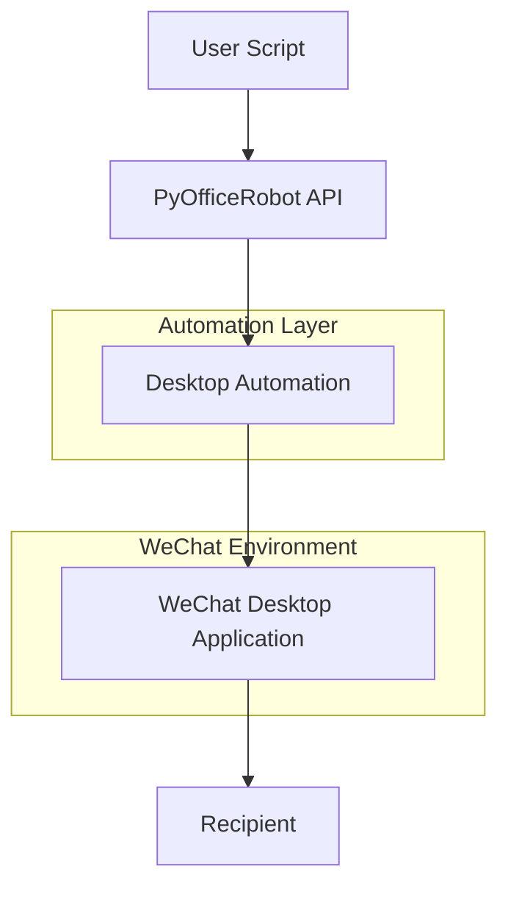

# WeChat API Reference

<cite>
**Referenced Files in This Document**   
- [wechat.py](file://office/api/wechat.py)
- [001-发一条信息.py](file://examples/PyOfficeRobot/001-发一条信息.py)
- [002-发文件.py](file://examples/PyOfficeRobot/002-发文件.py)
- [003-根据关键词回复.py](file://examples/PyOfficeRobot/003-根据关键词回复.py)
- [004-定时发送.py](file://examples/PyOfficeRobot/004-定时发送.py)
- [010-定时群发.py](file://examples/PyOfficeRobot/010-定时群发.py)
- [005-自定义功能.py](file://examples/PyOfficeRobot/005-自定义功能.py)
- [008-发消息换行.py](file://examples/PyOfficeRobot/008-发消息换行.py)
- [012、智能聊天.py](file://examples/PyOfficeRobot/012、智能聊天.py)
- [README.md](file://README.md)
</cite>

## Table of Contents
1. [Introduction](#introduction)
2. [Core Functions](#core-functions)
3. [Usage Examples](#usage-examples)
4. [Implementation Approach](#implementation-approach)
5. [Authentication and Session Management](#authentication-and-session-management)
6. [Rate Limiting and Compliance](#rate-limiting-and-compliance)
7. [Common Issues and Mitigation](#common-issues-and-mitigation)
8. [Conclusion](#conclusion)

## Introduction

The PyOfficeRobot WeChat automation module provides a comprehensive set of tools for automating WeChat messaging tasks. This API enables users to programmatically send messages, files, and scheduled content to individual contacts or groups, implement keyword-based auto-replies, and manage chat interactions without requiring access to the WeChat Web API. The module is designed to work with the desktop version of WeChat through automation techniques that simulate user interactions with the application interface.

**Section sources**
- [wechat.py](file://office/api/wechat.py#L1-L94)
- [README.md](file://README.md#L80-L150)

## Core Functions

### send_message
Sends a text message to a specified WeChat contact.

**Parameters:**
- `who` (str): The recipient's WeChat nickname or remark name
- `message` (str): The content of the message to be sent

This function enables basic messaging automation by delivering text content to designated contacts. Special characters including emojis are supported through clipboard operations.

**Section sources**
- [wechat.py](file://office/api/wechat.py#L6-L17)
- [001-发一条信息.py](file://examples/PyOfficeRobot/001-发一条信息.py#L46-L52)

### send_file
Transfers a file to a specified WeChat contact.

**Parameters:**
- `who` (str): The recipient's WeChat nickname or remark name
- `file` (str): The file path to be sent (use raw strings for Windows paths)

The function supports sending various file types by simulating the file attachment process in the WeChat desktop application.

**Section sources**
- [wechat.py](file://office/api/wechat.py#L46-L57)
- [002-发文件.py](file://examples/PyOfficeRobot/002-发文件.py#L8)

### auto_reply (chat_by_keywords)
Implements automated responses based on received message content.

**Parameters:**
- `who` (str): The contact to monitor for messages
- `keywords` (dict): A dictionary mapping trigger phrases to response messages

This feature enables rule-based chatbot functionality where specific incoming messages trigger predefined responses.

**Section sources**
- [wechat.py](file://office/api/wechat.py#L33-L44)
- [003-根据关键词回复.py](file://examples/PyOfficeRobot/003-根据关键词回复.py#L14)

### schedule_message (send_message_by_time)
Schedules a message to be sent at a specific time.

**Parameters:**
- `who` (str): The recipient's WeChat nickname or remark name
- `message` (str): The content of the message to be sent
- `time` (str): The scheduled sending time in 24-hour format (HH:MM:SS)

This function enables time-based messaging automation for regular updates or reminders.

**Section sources**
- [wechat.py](file://office/api/wechat.py#L19-L30)
- [004-定时发送.py](file://examples/PyOfficeRobot/004-定时发送.py#L8)

### group_message (group_send)
Sends messages to multiple contacts in a batch operation.

**Parameters:**
- None (configuration managed internally)

This function facilitates mass messaging campaigns to predefined contact lists.

**Section sources**
- [wechat.py](file://office/api/wechat.py#L59-L65)
- [010-定时群发.py](file://examples/PyOfficeRobot/010-定时群发.py#L8)

## Usage Examples

### Basic Message Sending
```python
PyOfficeRobot.chat.send_message(who='Contact Name', message='Hello from automation!')
```

### File Transfer
```python
PyOfficeRobot.file.send_file(who='Contact Name', file=r'C:\path\to\file.pdf')
```

### Keyword-Based Auto-Reply
```python
keywords = {
    "hello": "Hi there!",
    "help": "How can I assist you?"
}
PyOfficeRobot.chat.chat_by_keywords(who='Contact Name', keywords=keywords)
```

### Scheduled Messaging
```python
PyOfficeRobot.chat.send_message_by_time(who='Contact Name', message='Reminder', time='14:30:00')
```

### Message Formatting
For multi-line messages, use special key combinations:
```python
PyOfficeRobot.chat.send_message(who='Contact Name', message='Line 1' + '{ctrl}{ENTER}' + 'Line 2')
```

### Integration with Other Tools
The system supports integration with other office automation tools:
```python
keywords = {
    "password": office.tools.passwordtools()
}
```

**Section sources**
- [001-发一条信息.py](file://examples/PyOfficeRobot/001-发一条信息.py#L46-L52)
- [002-发文件.py](file://examples/PyOfficeRobot/002-发文件.py#L8)
- [003-根据关键词回复.py](file://examples/PyOfficeRobot/003-根据关键词回复.py#L14)
- [004-定时发送.py](file://examples/PyOfficeRobot/004-定时发送.py#L8)
- [005-自定义功能.py](file://examples/PyOfficeRobot/005-自定义功能.py#L14)
- [008-发消息换行.py](file://examples/PyOfficeRobot/008-发消息换行.py#L6)

## Implementation Approach

The PyOfficeRobot WeChat automation module utilizes desktop automation techniques rather than official APIs or web interfaces. This approach enables compatibility with all WeChat accounts, including those that cannot access the web version of WeChat.

The implementation relies on simulating user interactions with the WeChat desktop application through:
- Keyboard and mouse automation
- Clipboard operations for content transfer
- Window management to ensure proper application focus

This method bypasses the need for API keys or authentication tokens by operating at the UI level, making it accessible to all users regardless of their WeChat account type.



**Diagram sources**
- [wechat.py](file://office/api/wechat.py#L4-L94)
- [001-发一条信息.py](file://examples/PyOfficeRobot/001-发一条信息.py#L7-L43)

**Section sources**
- [wechat.py](file://office/api/wechat.py#L4-L94)
- [001-发一条信息.py](file://examples/PyOfficeRobot/001-发一条信息.py#L13-L43)

## Authentication and Session Management

The system does not require traditional API authentication as it operates through desktop automation rather than network-based API calls. Instead, authentication is handled through the following mechanism:

1. **User Session**: The automation requires an active WeChat desktop session with the user already logged in
2. **No Token Management**: There are no API keys, tokens, or credentials to manage
3. **Persistent Login**: The WeChat application must remain logged in and running in the background

This approach eliminates the complexity of token refresh cycles and API key management but requires the user to maintain an active WeChat desktop session.

**Section sources**
- [wechat.py](file://office/api/wechat.py#L4-L94)
- [README.md](file://README.md#L80-L150)

## Rate Limiting and Compliance

### Rate Limiting Considerations
While the system itself does not enforce rate limits, users should be aware of WeChat's internal restrictions:

- **Message Frequency**: Excessive messaging may trigger temporary sending restrictions
- **File Transfer Limits**: Large files or frequent transfers may be blocked
- **Account Security**: Rapid automated activity may trigger security warnings

### Compliance Guidelines
To maintain account security and comply with WeChat's terms of service:

1. **Moderate Frequency**: Limit automated messages to reasonable frequencies
2. **Content Quality**: Ensure messages provide value to recipients
3. **Opt-Out Mechanism**: Provide clear ways for contacts to opt out of automated messages
4. **Respect Privacy**: Do not distribute personal information without consent

The automation should be used responsibly to avoid account restrictions or bans.

**Section sources**
- [wechat.py](file://office/api/wechat.py#L4-L94)
- [README.md](file://README.md#L80-L150)

## Common Issues and Mitigation

### Login Failures
**Symptoms**: Automation cannot interact with WeChat application
**Causes**: 
- WeChat not running or logged out
- Application window not accessible
- Multiple WeChat instances running

**Solutions**:
- Ensure WeChat desktop application is running and logged in
- Close duplicate instances
- Restart both WeChat and the automation script

### Message Blocking
**Symptoms**: Messages fail to send or are flagged
**Causes**:
- Content detected as spam
- Excessive sending frequency
- Suspicious automation patterns

**Mitigation**:
- Reduce message frequency
- Personalize message content
- Implement random delays between operations

### Account Security Warnings
**Symptoms**: WeChat displays security alerts
**Causes**:
- Unusual activity patterns
- Rapid succession of actions
- Non-human interaction patterns

**Prevention**:
- Add random delays between operations
- Limit daily message volume
- Avoid sending identical content to many contacts simultaneously

### Technical Issues
**Known Limitations**:
- Path formatting issues on Windows (use raw strings)
- Emoji rendering inconsistencies
- Group message functionality may have bugs

**Workarounds**:
- Use `r'path\to\file'` for Windows file paths
- Test emoji rendering before deployment
- Verify group list functionality before scheduling

**Section sources**
- [wechat.py](file://office/api/wechat.py#L4-L94)
- [007-收集群消息.py](file://examples/PyOfficeRobot/007-收集群消息.py#L9)
- [002-发文件.py](file://examples/PyOfficeRobot/002-发文件.py#L7)

## Conclusion

The PyOfficeRobot WeChat automation module provides a practical solution for WeChat messaging automation that works with all account types. By leveraging desktop automation techniques, it bypasses the limitations of the web API while offering a comprehensive set of features for message sending, file transfer, scheduling, and automated responses.

Key advantages include:
- Universal compatibility with all WeChat accounts
- Simple implementation without API key management
- Comprehensive feature set for common automation tasks
- Integration capabilities with other office tools

Users should exercise responsible usage to maintain account security and comply with platform guidelines. The system is particularly well-suited for personal productivity enhancement, customer service automation, and regular information dissemination when used appropriately.

**Section sources**
- [wechat.py](file://office/api/wechat.py#L1-L94)
- [README.md](file://README.md#L80-L150)