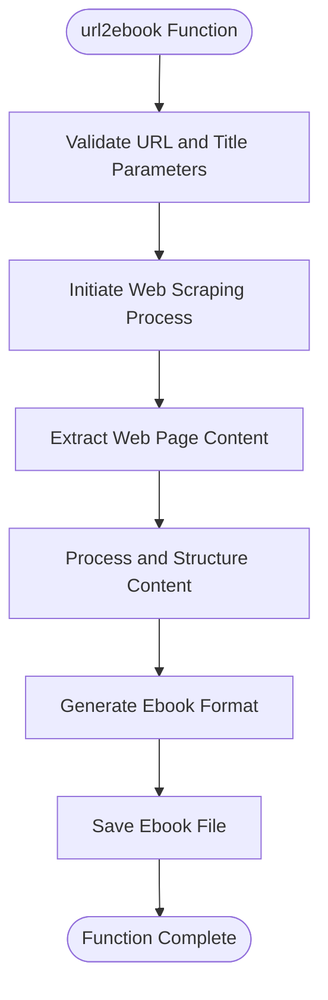
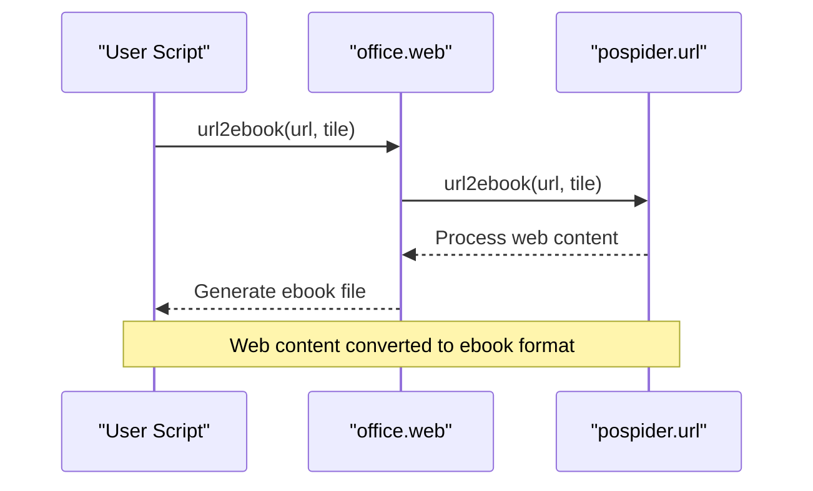
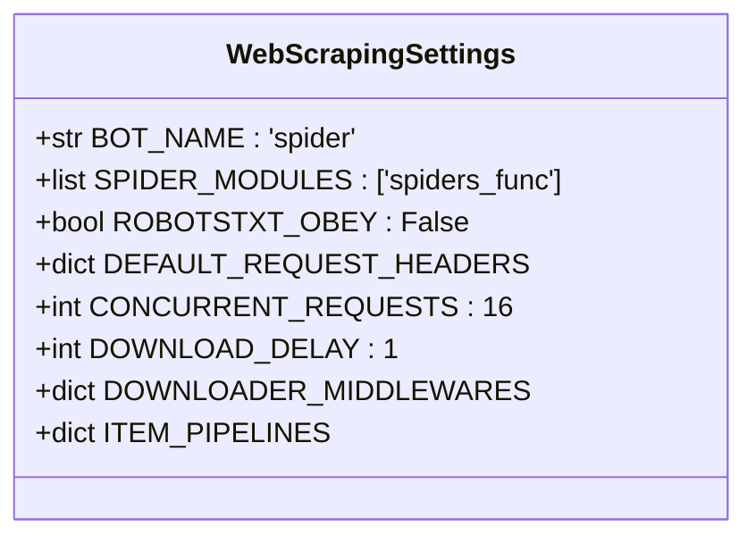

# Web API Reference

<cite>
**Referenced Files in This Document**   
- [web.py](file://office/api/web.py)
- [网页转电子书.py](file://examples/pospider/网页转电子书.py)
- [settings.py](file://settings.py)
</cite>

## Table of Contents
1. [Introduction](#introduction)
2. [Core Functionality](#core-functionality)
3. [API Reference](#api-reference)
4. [Usage Examples](#usage-examples)
5. [Implementation Details](#implementation-details)
6. [Configuration and Settings](#configuration-and-settings)
7. [Performance Considerations](#performance-considerations)
8. [Common Issues and Solutions](#common-issues-and-solutions)
9. [Ethical Usage Guidelines](#ethical-usage-guidelines)

## Introduction
The pospider web module provides functionality for converting web content into ebook format. This API allows users to transform web pages into structured electronic books with minimal configuration. The system leverages web scraping techniques to extract content from URLs and convert them into readable ebook formats suitable for offline consumption.

**Section sources**
- [web.py](file://office/api/web.py#L1-L17)
- [网页转电子书.py](file://examples/pospider/网页转电子书.py#L1-L55)

## Core Functionality
The web module focuses on converting web content to ebook format, enabling users to archive online content for offline reading. The primary function extracts main content from web pages while preserving structure and formatting. This functionality supports various use cases including technical documentation archiving, learning material compilation, and content preservation for offline access.

**Section sources**
- [web.py](file://office/api/web.py#L1-L17)
- [网页转电子书.py](file://examples/pospider/网页转电子书.py#L1-L55)

## API Reference

### url2ebook Function
Converts a specified URL to ebook format with the given title.



**Diagram sources**
- [web.py](file://office/api/web.py#L5-L17)

**Section sources**
- [web.py](file://office/api/web.py#L5-L17)

#### Parameters
- **url** (str): The webpage URL to be converted to ebook format
- **tile** (str): The title for the generated ebook (note: parameter name appears to be misspelled as 'tile' instead of 'title')

#### Returns
None, but generates an ebook file as output

#### Description
This function serves as a wrapper that calls the pospider.url.url2ebook method to convert web content into ebook format. It abstracts the complexity of web scraping and ebook generation, providing a simple interface for users to convert web pages to ebooks with minimal configuration.

## Usage Examples

### Basic Web to Ebook Conversion
Demonstrates the basic usage of converting a webpage to an ebook format.



**Diagram sources**
- [网页转电子书.py](file://examples/pospider/网页转电子书.py#L8-L55)

**Section sources**
- [网页转电子书.py](file://examples/pospider/网页转电子书.py#L8-L55)

#### Example Code
```python
import office

# Convert python-office documentation to ebook
office.web.url2ebook(
    url="https://www.python-office.com",
    tile="Python-Office Automation Guide"
)
```

#### Output
```
🌐 网页转电子书功能演示 - 程序员晚枫
==================================================
📋 转换信息：
   网页URL：https://www.python-office.com
   电子书标题：Python-Office自动化办公指南

🚀 开始转换...
✅ 网页转电子书转换成功！

💡 功能特点：
• 支持多种网页格式转换
• 自动提取网页主要内容
• 生成标准电子书格式

📚 适用场景：
• 技术文档归档
• 学习资料整理
• 网页内容离线阅读
```

## Implementation Details
The web-to-ebook conversion functionality is implemented through the pospider package, which handles the underlying web scraping operations. The implementation uses a modular approach where the office.api.web module acts as an interface to the more comprehensive pospider library. This design allows for separation of concerns between the high-level API and the detailed scraping logic.

The system appears to use Scrapy framework components based on the configuration settings found in the repository, suggesting a robust web scraping foundation. The content extraction process likely involves parsing HTML structure, identifying main content areas, and removing navigation and advertising elements to create a clean ebook format.

**Section sources**
- [web.py](file://office/api/web.py#L3-L17)
- [settings.py](file://settings.py#L1-L70)

## Configuration and Settings
The web scraping functionality is configured through settings that control request behavior and scraping policies.



**Diagram sources**
- [settings.py](file://settings.py#L4-L63)

**Section sources**
- [settings.py](file://settings.py#L4-L63)

### Key Configuration Parameters
- **ROBOTSTXT_OBEY**: Set to False, indicating the scraper does not respect robots.txt rules
- **CONCURRENT_REQUESTS**: Set to 16, allowing 16 concurrent requests
- **DOWNLOAD_DELAY**: Set to 1 second between requests to prevent server overload
- **DEFAULT_REQUEST_HEADERS**: Configures User-Agent and COOKIE headers for requests
- **DOWNLOADER_MIDDLEWARES**: Configures proxy and cookie handling middleware

## Performance Considerations
The system includes several performance-related configurations to balance efficiency and server load:

- **Concurrent Requests**: Limited to 16 simultaneous requests to prevent overwhelming target servers
- **Download Delay**: Implements a 1-second delay between requests for the same domain
- **Memory Management**: The architecture suggests streaming processing of content rather than loading entire pages into memory
- **Content Filtering**: Automatically extracts main content while filtering out navigation and advertising elements

For large web pages, the system may face challenges with memory usage and processing time. The current configuration helps mitigate these issues by controlling request frequency and concurrency.

**Section sources**
- [settings.py](file://settings.py#L18-L27)

## Common Issues and Solutions

### Connection and Authentication Issues
- **Certificate Validation Errors**: May occur with HTTPS sites; ensure SSL certificates are valid
- **Authentication Requirements**: Sites requiring login may need cookie configuration via cookie.txt
- **Network Connectivity**: Verify internet connection and URL accessibility

### Anti-Scraping Measures
- **Rate Limiting**: The DOWNLOAD_DELAY setting helps avoid rate limiting
- **IP Blocking**: DOWNLOADER_MIDDLEWARES supports proxy usage to prevent IP blocking
- **Dynamic Content**: JavaScript-rendered content may not be fully captured by the current implementation

### Content Extraction Problems
- **Incomplete Content**: Some page elements may not be properly extracted
- **Formatting Issues**: Complex layouts may not translate well to ebook format
- **Missing Media**: Images and other media may not be included in the output

## Ethical Usage Guidelines
When using the web-to-ebook functionality, consider the following ethical guidelines:

- **Respect Copyright**: Only convert content you have permission to archive
- **Observe robots.txt**: Although ROBOTSTXT_OBEY is set to False, consider respecting site scraping policies
- **Limit Server Load**: The configured delays help prevent server overload
- **Personal Use**: Use primarily for personal archiving rather than redistribution
- **Attribution**: Maintain proper attribution and copyright information in generated ebooks
- **Sensitive Data**: Avoid scraping personal or sensitive information

The functionality is designed for legitimate use cases such as archiving public documentation, educational materials, and personal reference content.