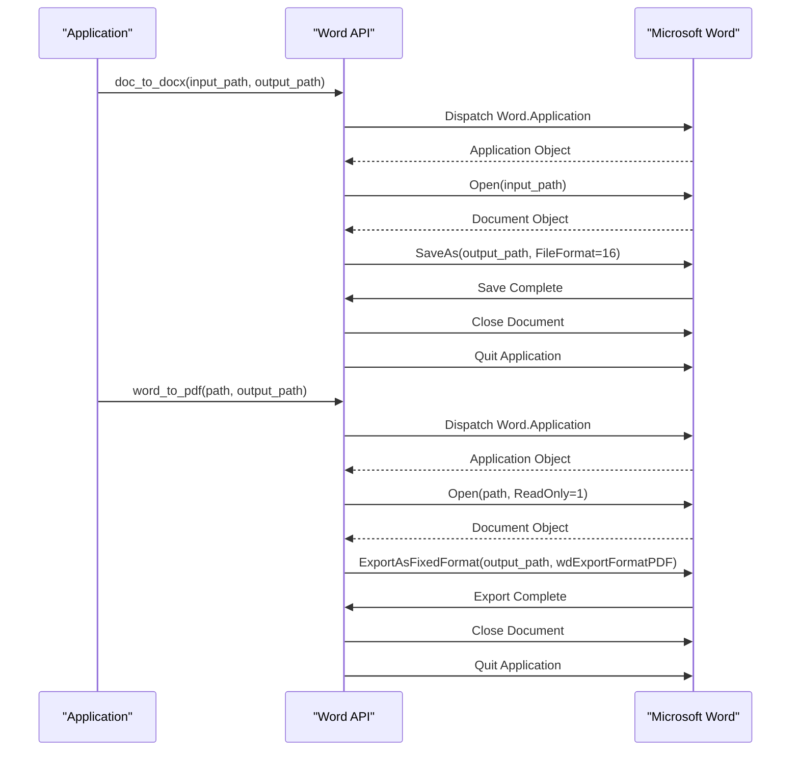

# Word API Reference

<cite>
**Referenced Files in This Document**   
- [word.py](file://office/api/word.py)
- [WordType.py](file://venv/Lib/site-packages/poword/core/WordType.py)
- [doc和docx互转.py](file://examples/poword/doc和docx互转.py)
- [word转PDF.py](file://examples/poword/word转PDF.py)
- [合并word.py](file://examples/poword/合并word.py)
</cite>

## Table of Contents
1. [Introduction](#introduction)
2. [Core Functions](#core-functions)
3. [Implementation Details](#implementation-details)
4. [Usage Examples](#usage-examples)
5. [File Path and Resource Management](#file-path-and-resource-management)
6. [Common Issues and Solutions](#common-issues-and-solutions)
7. [Performance Considerations](#performance-considerations)

## Introduction
The Word processing module (poword) provides a comprehensive API for handling Microsoft Word documents in both .doc and .docx formats. This API enables document conversion, merging, and image extraction operations through a simple interface. Built on top of the win32com library and python-docx, the module leverages Microsoft Word's native capabilities for reliable document processing. The API is designed to handle both single files and batch operations, making it suitable for various document automation scenarios.

## Core Functions

### doc_to_docx
Converts legacy .doc files to the modern .docx format.

**Parameters:**
- `input_path` (str): Path to the input .doc file or directory containing .doc files
- `output_path` (str, optional): Output directory path, defaults to current directory ('./')
- `output_name` (str, optional): Custom output filename, defaults to original filename

**Returns:** None

**Error Conditions:**
- FileNotFoundError: Input file or directory does not exist
- PermissionError: Insufficient permissions to read input or write output
- COMError: Microsoft Word application issues or licensing problems

**Section sources**
- [word.py](file://office/api/word.py#L34-L45)
- [WordType.py](file://venv/Lib/site-packages/poword/core/WordType.py#L126-L137)

### docx_to_doc
Converts modern .docx files to the legacy .doc format.

**Parameters:**
- `input_path` (str): Path to the input .docx file or directory containing .docx files
- `output_path` (str, optional): Output directory path, defaults to current directory ('./')
- `output_name` (str, optional): Custom output filename, defaults to original filename

**Returns:** None

**Error Conditions:**
- FileNotFoundError: Input file or directory does not exist
- PermissionError: Insufficient permissions to read input or write output
- COMError: Microsoft Word application issues or licensing problems

**Section sources**
- [word.py](file://office/api/word.py#L48-L59)
- [WordType.py](file://venv/Lib/site-packages/poword/core/WordType.py#L139-L151)

### word_to_pdf
Converts Word documents (.doc or .docx) to PDF format.

**Parameters:**
- `path` (str): Path to the Word file or directory containing Word files
- `output_path` (str, optional): Output directory path, defaults to input path

**Returns:** None

**Error Conditions:**
- FileNotFoundError: Input file or directory does not exist
- PermissionError: Insufficient permissions to read input or write output
- COMError: Microsoft Word application issues or licensing problems
- ValueError: Invalid file format that cannot be processed by Word

**Section sources**
- [word.py](file://office/api/word.py#L6-L18)
- [WordType.py](file://venv/Lib/site-packages/poword/core/WordType.py#L17-L56)

### merge_word
Combines multiple Word documents into a single document.

**Parameters:**
- `input_path` (str): Path to the input file or directory containing Word files to merge
- `output_path` (str): Output directory path for the merged document
- `new_word_name` (str, optional): Name for the merged output file, defaults to 'merge4docx'

**Returns:** None

**Error Conditions:**
- FileNotFoundError: Input file or directory does not exist
- PermissionError: Insufficient permissions to read input or write output
- COMError: Microsoft Word application issues or licensing problems
- ValueError: No valid Word files found in the specified directory

**Section sources**
- [word.py](file://office/api/word.py#L20-L31)
- [WordType.py](file://venv/Lib/site-packages/poword/core/WordType.py#L77-L124)

### extract_image_from_word
Extracts all images embedded in a .docx document.

**Parameters:**
- `word_path` (str): Path to the source .docx file
- `img_path` (str): Directory where extracted images will be saved

**Returns:** None

**Error Conditions:**
- FileNotFoundError: Input .docx file does not exist
- PermissionError: Insufficient permissions to read the document or write images
- PackageNotFoundError: Invalid .docx file structure or corrupted document
- NotADirectoryError: Specified image path is not a directory

**Section sources**
- [word.py](file://office/api/word.py#L61-L71)
- [WordType.py](file://venv/Lib/site-packages/poword/core/WordType.py#L177-L201)

## Implementation Details

```mermaid
classDiagram
class MainWord {
+str app
+docx2pdf(path, output_path, docxSuffix, pdfSuffix)
+createpdf(wordPath, pdfPath)
+merge4docx(input_path, output_path, new_word_name)
+doc2docx(input_path, output_path, output_name, docSuffix, type_id)
+docx2doc(input_path, output_path, output_name, docSuffix, type_id)
+_convert4word(type_id, input_path, output_path, docSuffix, output_name)
+docx4imgs(word_path, img_path)
}
class Document {
+part
+rels
}
MainWord --> Document : "uses"
MainWord --> "win32com.client" : "dispatches"
```

**Diagram sources**
- [WordType.py](file://venv/Lib/site-packages/poword/core/WordType.py#L12-L201)

The Word API is implemented using Microsoft Word's COM (Component Object Model) interface through the win32com library. This approach ensures high-fidelity document processing by leveraging Word's native rendering engine. For .docx file operations, the python-docx library is used to directly access the document's ZIP-based structure, enabling efficient image extraction without requiring Word application instances.

The conversion functions (doc_to_docx and docx_to_doc) utilize Word's SaveAs method with specific file format identifiers (type_id 16 for .docx and 0 for .doc). The word_to_pdf function uses Word's ExportAsFixedFormat method, which provides better PDF quality than simple printing. The merge_word function creates a new document and inserts each source file using Word's Selection.InsertFile method, preserving formatting and layout.

For image extraction, the API directly accesses the .docx package structure, identifying image relationships within the document's XML and extracting the binary content of image parts. This approach is more reliable than screenshot-based methods and preserves original image quality.

## Usage Examples



**Diagram sources**
- [word.py](file://office/api/word.py#L6-L18)
- [WordType.py](file://venv/Lib/site-packages/poword/core/WordType.py#L17-L56)

### Document Conversion Workflow
```python
import office

# Convert a single .doc file to .docx
office.word.doc2docx(
    input_path=r'C:\documents\example.doc',
    output_path=r'C:\converted',
    output_name='converted_document.docx'
)

# Convert all .doc files in a directory
office.word.doc2docx(
    input_path=r'C:\documents\batch',
    output_path=r'C:\converted\batch'
)
```

### Batch Processing Example
```python
import office

# Convert all Word documents in a folder to PDF
office.word.docx2pdf(
    path=r'D:\reports\quarterly',
    output_path=r'D:\reports\quarterly\pdf_version'
)

# Merge multiple reports into a single document
office.word.merge4docx(
    input_path=r'D:\reports\quarterly\pdf_version',
    output_path=r'D:\reports\annual',
    new_word_name='annual_report.docx'
)
```

**Section sources**
- [doc和docx互转.py](file://examples/poword/doc和docx互转.py#L7-L9)
- [word转PDF.py](file://examples/poword/word转PDF.py#L7-L9)
- [合并word.py](file://examples/poword/合并word.py#L7-L8)

## File Path and Resource Management

The API handles file paths using Python's pathlib library for cross-platform compatibility. All paths are converted to absolute paths to prevent issues with relative path resolution. The system automatically creates output directories if they don't exist using the mkdir utility function.

Resource management is critical in this implementation due to the use of COM objects. The API ensures proper cleanup by:
1. Setting Word application visibility to False to prevent UI interference
2. Closing documents after processing
3. Quitting the Word application instance when operations are complete
4. Using context managers where appropriate to guarantee cleanup

Temporary files are generally not created, as the API processes files directly. However, when converting .doc to .docx, temporary Word application instances are created in memory. These are automatically cleaned up when the application quits.

The image extraction function creates a subdirectory named after the source document within the specified output directory, organizing extracted images by their source document.

**Section sources**
- [WordType.py](file://venv/Lib/site-packages/poword/core/WordType.py#L17-L201)

## Common Issues and Solutions

### Missing Fonts
When converting documents with custom fonts, missing fonts may be substituted with default fonts. To mitigate this:
- Ensure all required fonts are installed on the system
- Use standard fonts when possible
- Test conversions on the target system before deployment

### Formatting Loss
Some complex formatting may not translate perfectly between formats:
- Tables with complex layouts may lose spacing
- Advanced text effects may be simplified
- Custom styles may not be preserved

Solution: Always validate output documents and adjust source formatting as needed.

### Compatibility with Older .doc Files
Legacy .doc files may have compatibility issues:
- Binary format is less reliable than .docx
- Some features may not convert correctly
- Larger file sizes can impact performance

Recommendation: Convert legacy documents to .docx format first, then perform other operations.

### COM Registration Issues
The API requires Microsoft Word to be properly installed and registered:
- Run as administrator if encountering permission issues
- Repair Office installation if COM errors persist
- Ensure proper licensing of Microsoft Word

**Section sources**
- [WordType.py](file://venv/Lib/site-packages/poword/core/WordType.py#L17-L201)

## Performance Considerations

For processing large documents or batches:
- Process files sequentially rather than in parallel, as Word does not support multiple instances well
- Monitor memory usage, as large documents can consume significant RAM
- Consider breaking large documents into smaller sections for processing

Memory-efficient patterns:
- Process one document at a time in loops
- Close documents immediately after processing
- Quit Word application instances between large batches
- Use 64-bit Python and Word when processing very large documents

Performance tips:
- SSD storage significantly improves I/O performance
- Sufficient RAM prevents swapping
- Close other applications to free system resources
- Process during off-peak hours for production systems

The API includes progress indicators for long-running operations through the poprogress library, providing feedback during batch operations.

**Section sources**
- [WordType.py](file://venv/Lib/site-packages/poword/core/WordType.py#L38-L39)
- [WordType.py](file://venv/Lib/site-packages/poword/core/WordType.py#L163-L164)