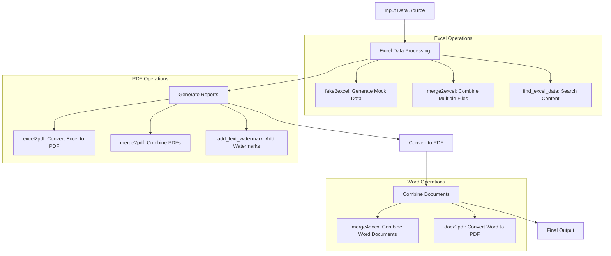
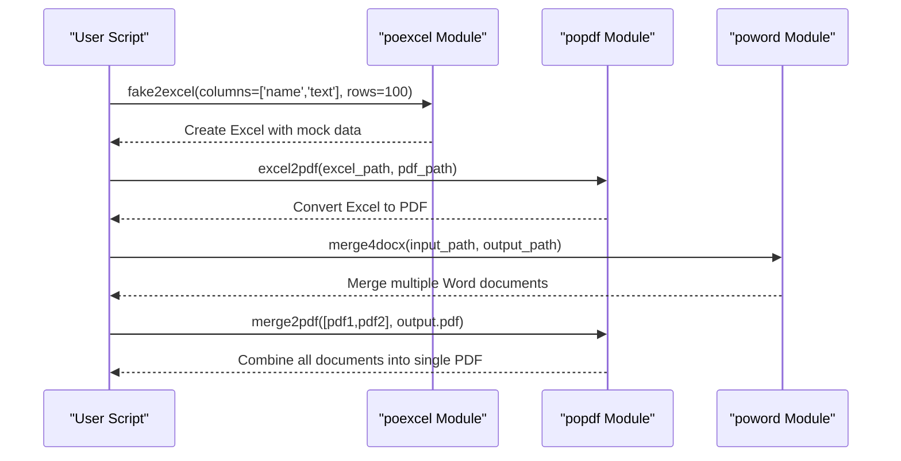
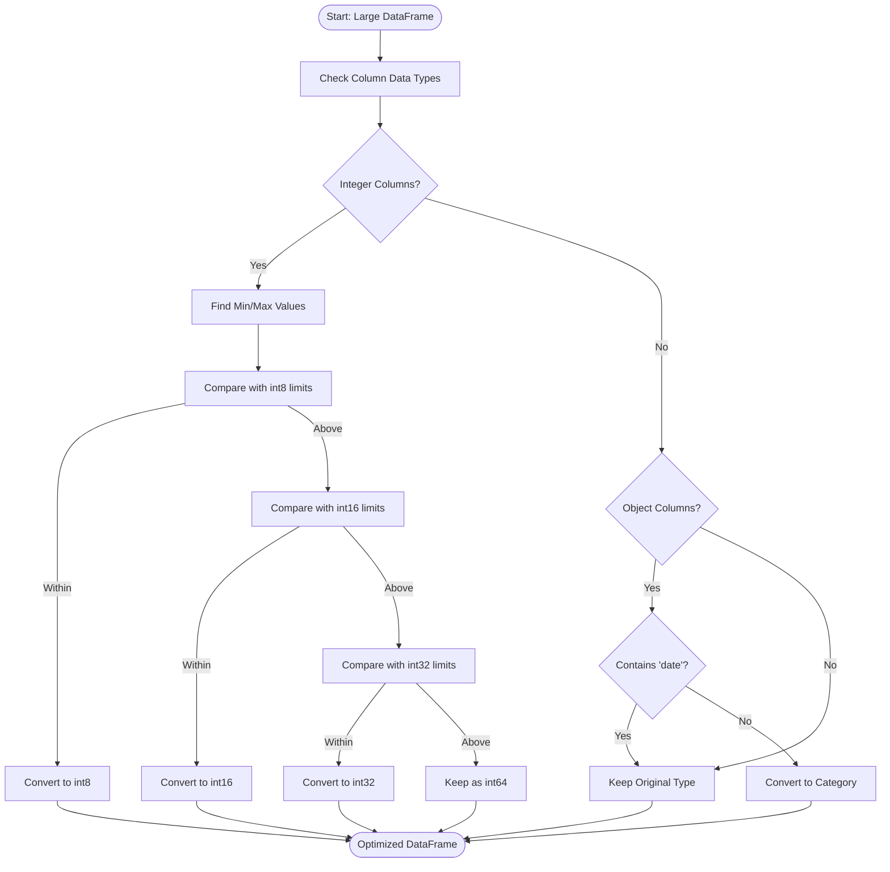
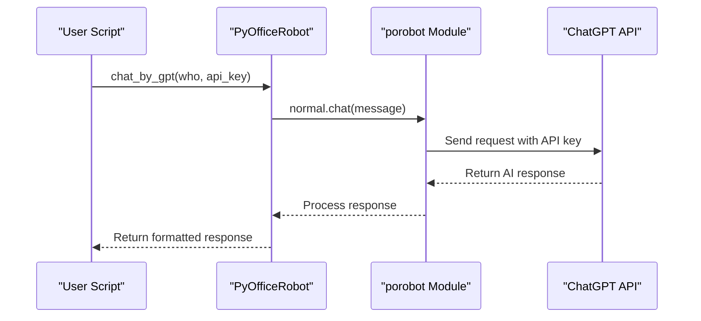

# Advanced Usage

<cite>
**Referenced Files in This Document**   
- [settings.py](file://settings.py)
- [office/api/excel.py](file://office/api/excel.py)
- [office/api/pdf.py](file://office/api/pdf.py)
- [office/api/word.py](file://office/api/word.py)
- [office/lib/utils/except_utils.py](file://office/lib/utils/except_utils.py)
- [office/lib/utils/pandas_mem.py](file://office/lib/utils/pandas_mem.py)
- [office/lib/conf/CONST.py](file://office/lib/conf/CONST.py)
- [examples/poexcel/批量模拟数据.py](file://examples/poexcel/批量模拟数据.py)
- [examples/popdf/合并PDF.py](file://examples/popdf/合并PDF.py)
- [examples/poword/合并word.py](file://examples/poword/合并word.py)
- [examples/PyOfficeRobot/001-发一条信息.py](file://examples/PyOfficeRobot/001-发一条信息.py)
- [examples/porobot/chat.py](file://examples/porobot/chat.py)
- [examples/PyOfficeRobot/011-chat_chatgpt.py](file://examples/PyOfficeRobot/011-chat_chatgpt.py)
- [README.md](file://README.md)
- [office/__init__.py](file://office/__init__.py)
</cite>

## Table of Contents
1. [Introduction](#introduction)
2. [Complex Automation Workflows](#complex-automation-workflows)
3. [Error Handling and Exception Management](#error-handling-and-exception-management)
4. [Performance Considerations and Memory Optimization](#performance-considerations-and-memory-optimization)
5. [Configuration Options and Customization](#configuration-options-and-customization)
6. [AI Integration with porobot Module](#ai-integration-with-porobot-module)
7. [Security Considerations](#security-considerations)
8. [Debugging Strategies and Logging Best Practices](#debugging-strategies-and-logging-best-practices)
9. [Conclusion](#conclusion)

## Introduction
The python-office library provides a comprehensive suite of tools for automating office-related tasks with minimal code. This document focuses on advanced usage scenarios, covering complex automation workflows, error handling, performance optimization, configuration options, AI integration, security considerations, and debugging strategies. The library's modular design allows for combining multiple operations across different modules to create sophisticated automation solutions.

**Section sources**
- [README.md](file://README.md)
- [office/__init__.py](file://office/__init__.py)

## Complex Automation Workflows

The python-office library enables the creation of complex automation workflows by combining operations from different modules. This section demonstrates how to chain multiple operations together to accomplish sophisticated tasks.

### Excel-PDF-Word Processing Pipeline
A common automation scenario involves processing data through multiple document formats. The library provides seamless integration between Excel, PDF, and Word modules, allowing users to create end-to-end document processing workflows.



**Diagram sources**
- [office/api/excel.py](file://office/api/excel.py#L25-L136)
- [office/api/pdf.py](file://office/api/pdf.py#L123-L167)
- [office/api/word.py](file://office/api/word.py#L20-L31)

### Cross-Module Automation Example
The following example demonstrates a complete workflow that combines multiple modules to process and transform documents:



**Diagram sources**
- [examples/poexcel/批量模拟数据.py](file://examples/poexcel/批量模拟数据.py)
- [examples/popdf/合并PDF.py](file://examples/popdf/合并PDF.py)
- [examples/poword/合并word.py](file://examples/poword/合并word.py)

**Section sources**
- [office/api/excel.py](file://office/api/excel.py)
- [office/api/pdf.py](file://office/api/pdf.py)
- [office/api/word.py](file://office/api/word.py)

## Error Handling and Exception Management

Robust error handling is critical for reliable automation scripts, especially when dealing with file operations that may fail due to permission issues, file corruption, or resource constraints.

### Exception Decorator Pattern
The library implements a consistent exception handling pattern using decorators, which provides standardized error reporting across all modules.

```mermaid
classDiagram
class except_dec {
+msg : str
+except_execute(func)
+execept_print(*args, **kwargs)
}
class SPLIT_LINE {
+value : str
}
except_dec --> SPLIT_LINE : "uses"
note right of except_dec
Decorator function that wraps target functions
with try-catch blocks and provides
standardized error reporting format
end note
```

**Diagram sources**
- [office/lib/utils/except_utils.py](file://office/lib/utils/except_utils.py#L10-L34)
- [office/lib/conf/CONST.py](file://office/lib/conf/CONST.py)

### Try-Catch Implementation
The exception handling system provides detailed error information including timestamp, function name, and error message, while also offering community support resources.

```python
# Example of exception handling in action
try:
    office.pdf.merge2pdf(input_file_list, output_file)
except Exception as e:
    print('=' * 30)
    print('糟糕，你的程序出现了异常')
    print(f'>>>异常时间：\t{datetime.now()}')
    print(f'>>>异常函数：\tmerge2pdf')
    print(f'>>>异常原因：\t{e}')
    print('别慌，你的异常也许【群友也遇到过】 → https://www.python4office.cn/wechat-group/')
    print('当然，也可以免费【加入星球，向我提问】 → http://t.cn/A6qeZpVt')
    print('='*30)
```

When implementing error handling in your scripts, follow these best practices:
- Wrap individual operations in try-catch blocks to isolate failures
- Log error details for debugging purposes
- Implement retry logic for transient failures
- Provide meaningful error messages to end users
- Clean up resources in exception handlers

**Section sources**
- [office/lib/utils/except_utils.py](file://office/lib/utils/except_utils.py)
- [examples/PyOfficeRobot/001-发一条信息.py](file://examples/PyOfficeRobot/001-发一条信息.py#L33-L43)

## Performance Considerations and Memory Optimization

Processing large datasets or performing batch operations requires careful attention to performance and memory usage to avoid system resource exhaustion.

### Memory Optimization Techniques
The library includes built-in functions to optimize memory usage when working with large pandas DataFrames.



**Diagram sources**
- [office/lib/utils/pandas_mem.py](file://office/lib/utils/pandas_mem.py#L4-L41)

### Batch Processing Strategies
For optimal performance when handling large datasets:

1. **Process files in batches** rather than loading everything into memory at once
2. **Use generators** for memory-efficient iteration over large collections
3. **Implement incremental processing** to avoid memory spikes
4. **Monitor system resources** during execution

The `reduce_pandas_mem_usage` function automatically optimizes DataFrame memory usage by:
- Converting integer columns to the smallest possible integer type
- Converting non-date object columns to categorical type
- Preserving date-related columns in their original format

This can reduce memory consumption by up to 70% depending on the data characteristics.

**Section sources**
- [office/lib/utils/pandas_mem.py](file://office/lib/utils/pandas_mem.py)

## Configuration Options and Customization

The python-office library provides configuration options to customize behavior and extend functionality according to specific requirements.

### Settings Configuration
The settings.py file contains configuration parameters that control various aspects of the library's behavior, particularly for web scraping and API interactions.

```mermaid
classDiagram
class Settings {
+BOT_NAME : str
+SPIDER_MODULES : list
+NEWSPIDER_MODULE : list
+ROBOTSTXT_OBEY : bool
+CONCURRENT_REQUESTS : int
+DOWNLOAD_DELAY : int
+DEFAULT_REQUEST_HEADERS : dict
+DOWNLOADER_MIDDLEWARES : dict
+ITEM_PIPELINES : dict
}
note right of Settings
Configuration settings for web scraping operations
Including request headers, concurrency limits,
and pipeline configurations
end note
```

**Diagram sources**
- [settings.py](file://settings.py)

### Extending Library Functionality
The library can be extended through several mechanisms:

1. **Custom modules**: Add new functionality by creating modules that follow the existing pattern
2. **Configuration overrides**: Modify behavior through settings
3. **Decorator extension**: Use existing decorators on custom functions
4. **API integration**: Connect with external services through the provided API structure

The modular architecture allows for easy integration of new features while maintaining consistency with the existing codebase.

**Section sources**
- [settings.py](file://settings.py)
- [office/__init__.py](file://office/__init__.py)

## AI Integration with porobot Module

The library provides integration with AI capabilities through the porobot module, enabling intelligent automation and natural language processing.

### ChatGPT Integration
The porobot module allows integration with ChatGPT for conversational AI capabilities.



**Diagram sources**
- [examples/porobot/chat.py](file://examples/porobot/chat.py)
- [examples/PyOfficeRobot/011-chat_chatgpt.py](file://examples/PyOfficeRobot/011-chat_chatgpt.py)

### AI-Powered Automation
The AI integration enables several advanced use cases:

- **Natural language commands**: Control automation workflows using conversational language
- **Content generation**: Automatically create documents, emails, or reports
- **Intelligent data processing**: Apply AI to analyze and transform data
- **Smart responses**: Implement context-aware responses in communication workflows

To use the AI capabilities:
1. Import the porobot module
2. Use the chat function with appropriate prompts
3. Process the AI-generated responses in your workflow

This integration transforms the library from a simple automation tool into an intelligent assistant capable of understanding and generating human-like text.

**Section sources**
- [examples/porobot/chat.py](file://examples/porobot/chat.py)
- [examples/PyOfficeRobot/011-chat_chatgpt.py](file://examples/PyOfficeRobot/011-chat_chatgpt.py)

## Security Considerations

When handling sensitive documents and emails, several security considerations must be addressed to protect data integrity and confidentiality.

### Document Security
The library provides features for securing sensitive documents:

- **PDF encryption**: Protect PDF files with password protection
- **Watermarking**: Add visible or invisible watermarks to documents
- **Secure file handling**: Proper management of temporary files
- **Access control**: Limit access to sensitive operations

The `encrypt4pdf` function allows password protection of PDF files, while `decrypt4pdf` enables access to encrypted documents with the correct credentials.

### Email Security
When automating email operations:
- Use secure connections (SSL/TLS) for email transmission
- Store credentials securely, preferably using environment variables
- Implement proper error handling to avoid exposing sensitive information
- Validate recipients to prevent accidental disclosure

### Data Protection Best Practices
1. **Minimize data retention**: Delete temporary files immediately after use
2. **Secure storage**: Store sensitive documents in protected directories
3. **Access logging**: Maintain logs of who accessed sensitive documents
4. **Regular audits**: Review security practices periodically
5. **Update dependencies**: Keep all library components up to date

The library's design emphasizes security by providing built-in functions for common security operations while encouraging secure coding practices.

**Section sources**
- [office/api/pdf.py](file://office/api/pdf.py#L92-L130)
- [README.md](file://README.md)

## Debugging Strategies and Logging Best Practices

Effective debugging and logging are essential for maintaining and troubleshooting complex automation scripts.

### Built-in Debugging Features
The library's exception handling system provides comprehensive debugging information:

- **Timestamped errors**: Precise timing of when errors occur
- **Function context**: Identification of the failing function
- **Error details**: Specific information about the cause
- **Community support**: Links to resources for resolving common issues

### Logging Best Practices
Implement the following logging practices in your automation scripts:

1. **Structured logging**: Use consistent formats for log entries
2. **Level-based logging**: Differentiate between debug, info, warning, and error messages
3. **Contextual information**: Include relevant variables and state information
4. **Performance monitoring**: Log execution times for critical operations
5. **Error correlation**: Link related log entries for easier troubleshooting

The standardized error output format helps quickly identify issues and provides immediate access to community support resources.

### Troubleshooting Workflow
When encountering issues with automation scripts:

1. **Check the error message**: Use the detailed information provided by the exception handler
2. **Review recent changes**: Identify any modifications that might have introduced the issue
3. **Test components individually**: Isolate the problematic operation
4. **Consult documentation**: Verify correct usage of functions
5. **Seek community support**: Use the provided resources for assistance

The combination of comprehensive error reporting and community support makes troubleshooting more efficient and effective.

**Section sources**
- [office/lib/utils/except_utils.py](file://office/lib/utils/except_utils.py)
- [examples/PyOfficeRobot/001-发一条信息.py](file://examples/PyOfficeRobot/001-发一条信息.py)

## Conclusion
The python-office library offers extensive capabilities for advanced automation scenarios. By combining operations across multiple modules, implementing robust error handling, optimizing for performance, leveraging AI integration, and following security best practices, users can create sophisticated automation workflows that significantly enhance productivity. The library's design emphasizes simplicity while providing powerful features for complex use cases, making it suitable for both beginners and advanced users. With proper implementation of the practices outlined in this document, users can build reliable, efficient, and secure automation solutions for a wide range of office-related tasks.