# Core Modules Reference

<cite>
**Referenced Files in This Document**   
- [__init__.py](file://office/__init__.py)
- [api/__init__.py](file://office/api/__init__.py)
- [api/excel.py](file://office/api/excel.py)
- [api/pdf.py](file://office/api/pdf.py)
- [api/word.py](file://office/api/word.py)
- [api/image.py](file://office/api/image.py)
- [api/email.py](file://office/api/email.py)
- [api/ocr.py](file://office/api/ocr.py)
- [api/file.py](file://office/api/file.py)
- [api/ppt.py](file://office/api/ppt.py)
- [lib/utils/except_utils.py](file://office/lib/utils/except_utils.py)
- [lib/conf/CONST.py](file://office/lib/conf/CONST.py)
- [settings.py](file://settings.py)
- [setup.py](file://setup.py)
- [README.md](file://README.md)
</cite>

## Table of Contents
1. [Introduction](#introduction)
2. [Project Structure](#project-structure)
3. [Core Components](#core-components)
4. [Architecture Overview](#architecture-overview)
5. [Detailed Component Analysis](#detailed-component-analysis)
6. [Dependency Analysis](#dependency-analysis)
7. [Performance Considerations](#performance-considerations)
8. [Troubleshooting Guide](#troubleshooting-guide)
9. [Conclusion](#conclusion)

## Introduction
python-office is a comprehensive Python library designed to simplify office automation tasks through a facade pattern that provides simplified interfaces to complex operations. The library offers a unified API for handling various office-related tasks including Excel, Word, PDF, email, image, file, PPT, and OCR processing. This architectural documentation describes the high-level design principles, component interactions, and technical decisions behind the modular architecture that balances simplicity and functionality.

## Project Structure

The python-office project follows a modular structure with clear separation of concerns. The core functionality is organized under the `office` package, with specialized sub-modules in the `api` directory for different office automation tasks. The project includes example scripts, test files, and contributor modules that demonstrate usage patterns and extend functionality.

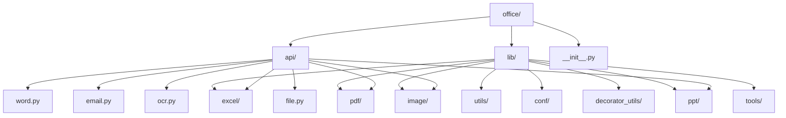

**Diagram sources**
- [office/__init__.py](file://office/__init__.py)
- [office/api/__init__.py](file://office/api/__init__.py)

**Section sources**
- [office/__init__.py](file://office/__init__.py#L1-L30)
- [README.md](file://README.md#L47-L150)

## Core Components

The core components of python-office implement a facade pattern that provides simplified interfaces to complex office automation tasks. The main entry point is the `office` package, which exposes specialized sub-modules for different functionality areas. Each API module acts as a facade that abstracts away the complexity of underlying libraries and provides a simple, consistent interface for common operations.

**Section sources**
- [office/__init__.py](file://office/__init__.py#L7-L21)
- [README.md](file://README.md#L84-L110)

## Architecture Overview

The architecture of python-office follows a layered approach with a clear separation between the facade interface and the underlying implementation. The top layer consists of API modules that provide simplified interfaces for specific office automation tasks. These facade modules delegate to specialized third-party libraries while handling configuration, error management, and cross-cutting concerns.

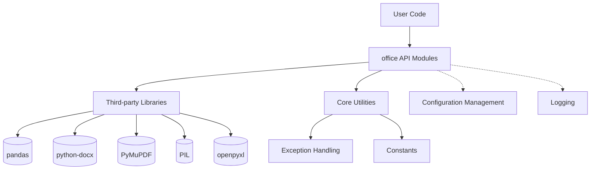

**Diagram sources**
- [office/__init__.py](file://office/__init__.py#L1-L30)
- [office/api/excel.py](file://office/api/excel.py#L1-L137)
- [office/api/pdf.py](file://office/api/pdf.py#L1-L226)
- [office/lib/utils/except_utils.py](file://office/lib/utils/except_utils.py#L1-L35)

## Detailed Component Analysis

### Excel Module Analysis
The Excel module provides a facade interface for common Excel operations such as data simulation, file merging, and format conversion. It abstracts the complexity of working with pandas and openpyxl libraries, offering simple functions that require minimal parameters.

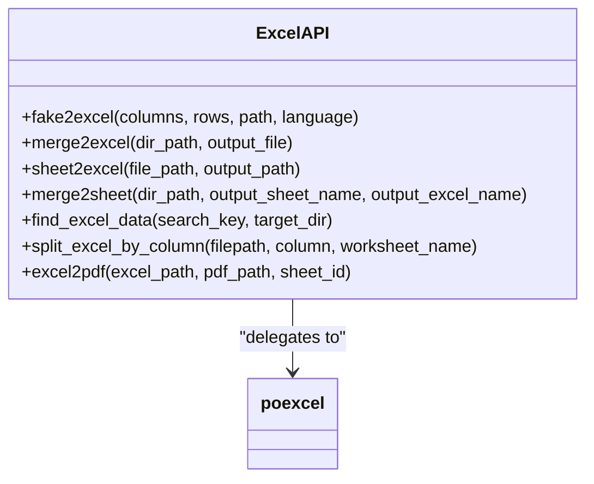

**Diagram sources**
- [office/api/excel.py](file://office/api/excel.py#L25-L136)

**Section sources**
- [office/api/excel.py](file://office/api/excel.py#L1-L137)
- [examples/poexcel/](file://examples/poexcel/)

### PDF Module Analysis
The PDF module implements a comprehensive facade for PDF processing operations including format conversion, encryption/decryption, watermarking, and document manipulation. It simplifies interactions with PyMuPDF and other PDF libraries through a consistent interface.

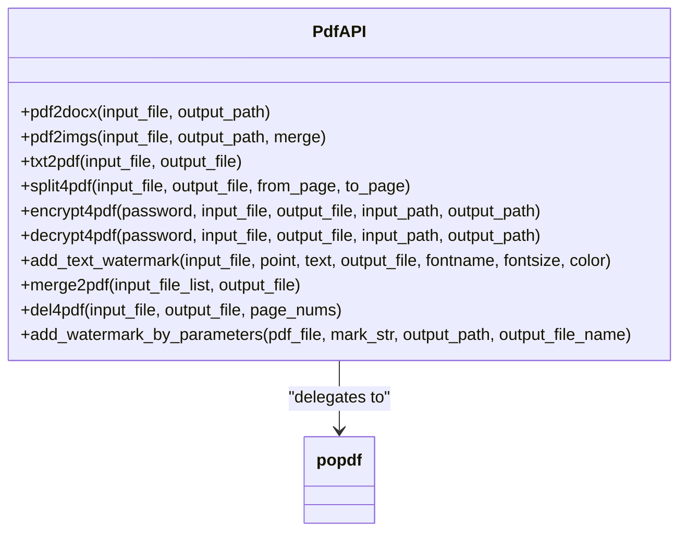

**Diagram sources**
- [office/api/pdf.py](file://office/api/pdf.py#L28-L225)

**Section sources**
- [office/api/pdf.py](file://office/api/pdf.py#L1-L226)
- [examples/popdf/](file://examples/popdf/)

### Word Module Analysis
The Word module provides a simplified interface for Word document operations including format conversion, document merging, and content extraction. It abstracts the complexity of working with python-docx and other Word processing libraries.

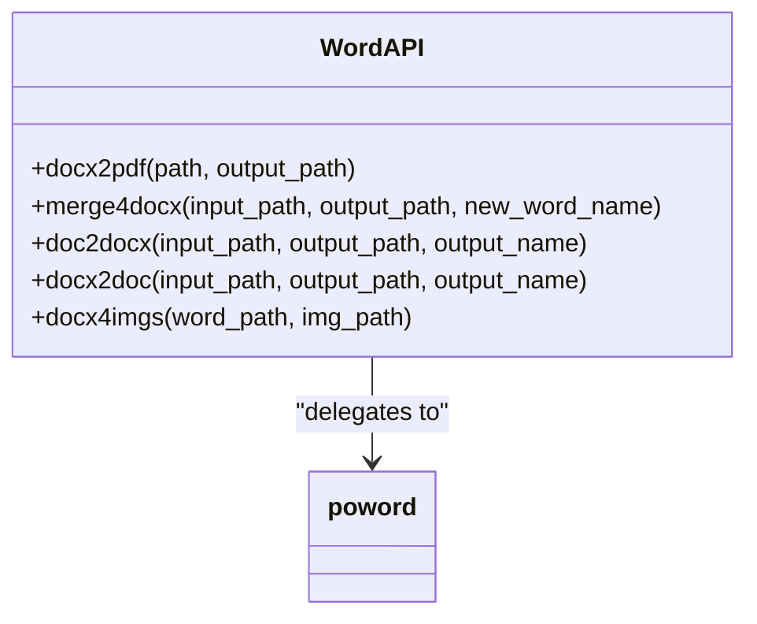

**Diagram sources**
- [office/api/word.py](file://office/api/word.py#L6-L71)

**Section sources**
- [office/api/word.py](file://office/api/word.py#L1-L72)
- [examples/poword/](file://examples/poword/)

### Image Module Analysis
The image processing module offers a facade for various image operations including compression, format conversion, watermarking, and special effects. It simplifies interactions with PIL and other image processing libraries.

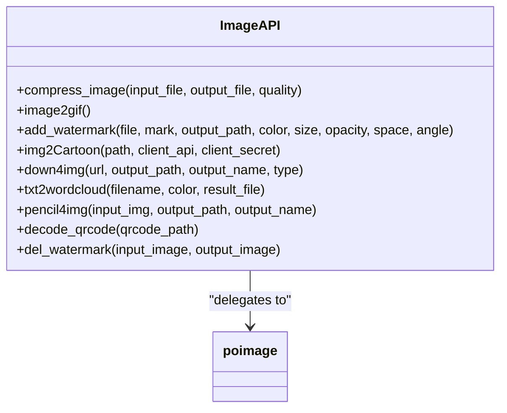

**Diagram sources**
- [office/api/image.py](file://office/api/image.py#L5-L152)

**Section sources**
- [office/api/image.py](file://office/api/image.py#L1-L153)
- [examples/poimage/](file://examples/poimage/)

### Email Module Analysis
The email module provides a simplified interface for sending and receiving emails, abstracting the complexity of SMTP and IMAP protocols and various email service providers.

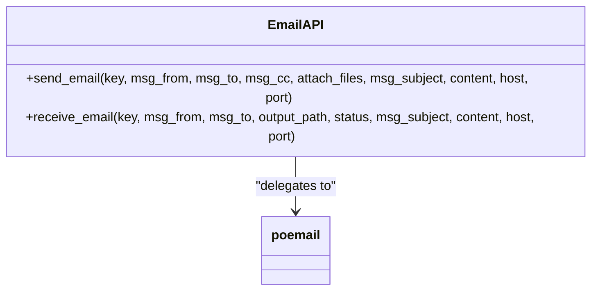

**Diagram sources**
- [office/api/email.py](file://office/api/email.py#L9-L34)

**Section sources**
- [office/api/email.py](file://office/api/email.py#L1-L45)
- [examples/poemail/](file://examples/poemail/)

### OCR Module Analysis
The OCR module implements a facade for optical character recognition operations, particularly focused on invoice processing and data extraction to Excel format.

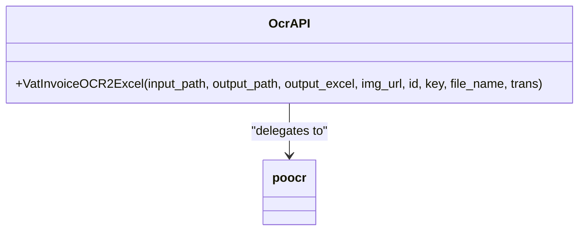

**Diagram sources**
- [office/api/ocr.py](file://office/api/ocr.py#L6-L27)

**Section sources**
- [office/api/ocr.py](file://office/api/ocr.py#L1-L29)
- [examples/poocr/](file://examples/poocr/)

### File Module Analysis
The file management module provides a comprehensive set of tools for file operations including batch renaming, searching, and organization.

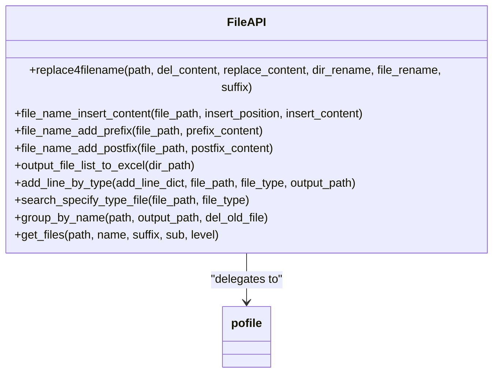

**Diagram sources**
- [office/api/file.py](file://office/api/file.py#L29-L162)

**Section sources**
- [office/api/file.py](file://office/api/file.py#L1-L163)
- [examples/pofile/](file://examples/pofile/)

### PPT Module Analysis
The PowerPoint module offers a simplified interface for PPT operations including format conversion and document merging.

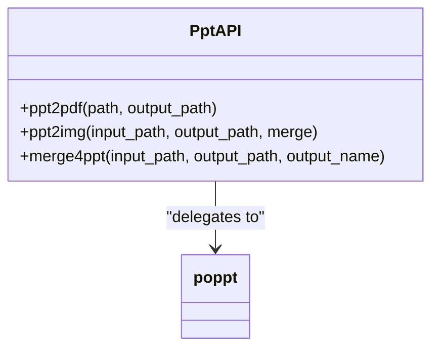

**Diagram sources**
- [office/api/ppt.py](file://office/api/ppt.py#L7-L45)

**Section sources**
- [office/api/ppt.py](file://office/api/ppt.py#L1-L46)
- [examples/poppt/](file://examples/poppt/)

## Dependency Analysis

The python-office library follows a modular dependency structure where the main package imports and exposes functionality from specialized sub-modules. The architecture minimizes coupling between components while maintaining a consistent interface across all modules.

```mermaid
graph TD
office.__init__[office/__init__.py] --> office.api.email[office/api/email.py]
office.__init__ --> office.api.excel[office/api/excel.py]
office.__init__ --> office.api.file[office/api/file.py]
office.__init__ --> office.api.finance[office/api/finance.py]
office.__init__ --> office.api.image[office/api/image.py]
office.__init__ --> office.api.markdown[office/api/markdown.py]
office.__init__ --> office.api.ocr[office/api/ocr.py]
office.__init__ --> office.api.pdf[office/api/pdf.py]
office.__init__ --> office.api.ppt[office/api/ppt.py]
office.__init__ --> office.api.tools[office/api/tools.py]
office.__init__ --> office.api.video[office/api/video.py]
office.__init__ --> office.api.wechat[office/api/wechat.py]
office.__init__ --> office.api.word[office/api/word.py]
office.__init__ --> office.compatibility[office/compatibility.py]
office.api.email --> poemail[poemail]
office.api.excel --> poexcel[poexcel]
office.api.file --> pofile[pofile]
office.api.image --> poimage[poimage]
office.api.ocr --> poocr[poocr]
office.api.pdf --> popdf[popdf]
office.api.ppt --> poppt[poppt]
office.api.word --> poword[poword]
office.lib.utils.except_utils --> office.lib.conf.CONST[office/lib/conf/CONST.py]
```

**Diagram sources**
- [office/__init__.py](file://office/__init__.py#L7-L21)
- [office/api/email.py](file://office/api/email.py#L5)
- [office/api/excel.py](file://office/api/excel.py#L22)
- [office/api/file.py](file://office/api/file.py#L23)
- [office/api/image.py](file://office/api/image.py#L2)
- [office/api/ocr.py](file://office/api/ocr.py#L4)
- [office/api/pdf.py](file://office/api/pdf.py#L25)
- [office/api/ppt.py](file://office/api/ppt.py#L4)
- [office/api/word.py](file://office/api/word.py#L3)
- [office/lib/utils/except_utils.py](file://office/lib/utils/except_utils.py#L7)

**Section sources**
- [office/__init__.py](file://office/__init__.py#L1-L30)
- [office/api/email.py](file://office/api/email.py#L1-L45)
- [office/api/excel.py](file://office/api/excel.py#L1-L137)
- [office/api/file.py](file://office/api/file.py#L1-L163)
- [office/api/image.py](file://office/api/image.py#L1-L153)
- [office/api/ocr.py](file://office/api/ocr.py#L1-L29)
- [office/api/pdf.py](file://office/api/pdf.py#L1-L226)
- [office/api/ppt.py](file://office/api/ppt.py#L1-L46)
- [office/api/word.py](file://office/api/word.py#L1-L72)

## Performance Considerations

The facade pattern implemented in python-office prioritizes developer experience and ease of use over performance optimization. Each API call involves delegation to underlying libraries with minimal intermediate processing, which helps maintain reasonable performance characteristics. However, the abstraction layer does introduce some overhead compared to direct library usage. For performance-critical applications, users may consider bypassing the facade and using the underlying libraries directly while sacrificing some simplicity.

## Troubleshooting Guide

The python-office library includes built-in error handling mechanisms to help users diagnose and resolve issues. The exception handling system provides informative error messages with timestamps and function context to aid debugging.

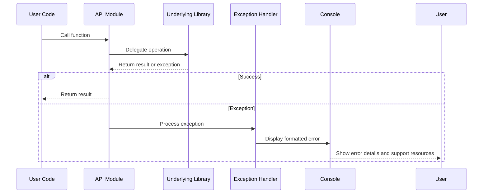

**Diagram sources**
- [office/lib/utils/except_utils.py](file://office/lib/utils/except_utils.py#L10-L34)

**Section sources**
- [office/lib/utils/except_utils.py](file://office/lib/utils/except_utils.py#L1-L35)
- [README.md](file://README.md#L128-L134)

## Conclusion

The python-office library successfully implements a facade pattern that provides simplified interfaces to complex office automation tasks. The modular architecture separates concerns effectively, with specialized sub-modules for different functionality areas. This design enables users to perform sophisticated operations with minimal code while maintaining flexibility and extensibility. The trade-off between simplicity and functionality is well-balanced, making the library accessible to beginners while still useful for experienced developers. The consistent interface across all modules reduces the learning curve and promotes code maintainability.