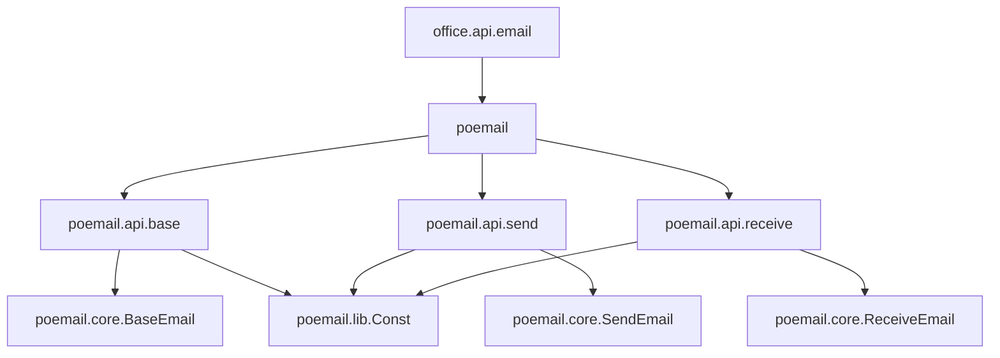
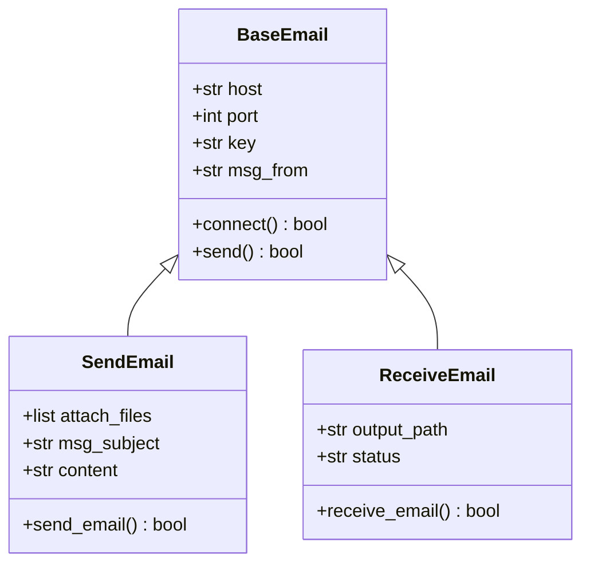
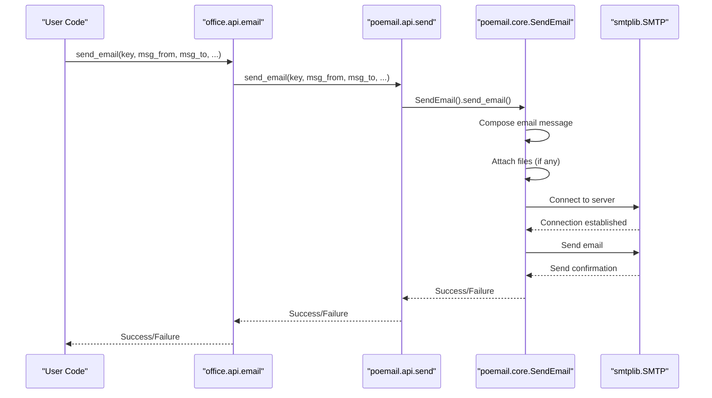
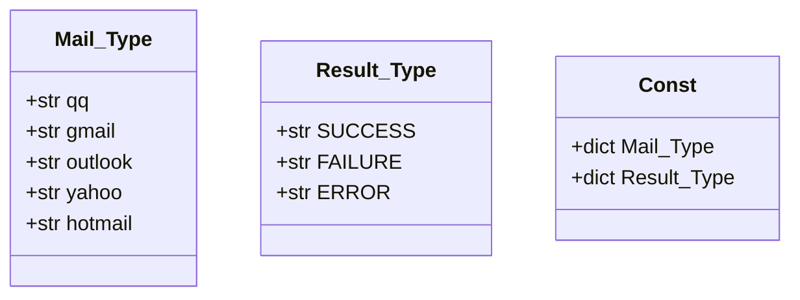
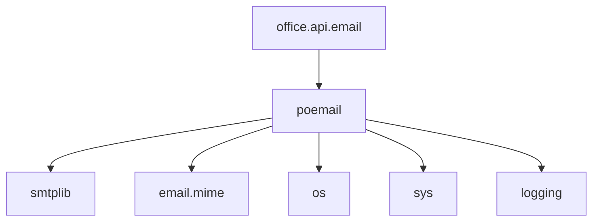

# Email Processing (poemail)

<cite>
**Referenced Files in This Document**   
- [email.py](file://office/api/email.py)
- [发送邮件.py](file://examples/poemail/发送邮件.py)
- [base.py](file://venv/Lib/site-packages/poemail/api/base.py)
- [send.py](file://venv/Lib/site-packages/poemail/api/send.py)
- [receive.py](file://venv/Lib/site-packages/poemail/api/receive.py)
- [BaseEmail.py](file://venv/Lib/site-packages/poemail/core/BaseEmail.py)
- [SendEmail.py](file://venv/Lib/site-packages/poemail/core/SendEmail.py)
- [ReceiveEmail.py](file://venv/Lib/site-packages/poemail/core/ReceiveEmail.py)
- [Const.py](file://venv/Lib/site-packages/poemail/lib/Const.py)
</cite>

## Table of Contents
1. [Introduction](#introduction)
2. [Project Structure](#project-structure)
3. [Core Components](#core-components)
4. [Architecture Overview](#architecture-overview)
5. [Detailed Component Analysis](#detailed-component-analysis)
6. [Dependency Analysis](#dependency-analysis)
7. [Performance Considerations](#performance-considerations)
8. [Troubleshooting Guide](#troubleshooting-guide)
9. [Conclusion](#conclusion)

## Introduction
The poemail module in python-office provides a simplified interface for sending and receiving emails with attachments. Built on top of Python's smtplib, the module abstracts the complexity of SMTP configuration and email composition, making it accessible for automation tasks in office environments. The module supports various email providers through predefined server configurations and offers functionality for both sending emails with attachments and receiving emails.

## Project Structure
The email processing functionality is organized across multiple layers in the python-office package. The public interface is exposed through the office.api.email module, which acts as a wrapper for the underlying poemail package. The actual implementation resides in the poemail package with a clear separation of concerns between base functionality, sending, and receiving operations.

**Diagram sources**
- [email.py](file://office/api/email.py)
- [base.py](file://venv/Lib/site-packages/poemail/api/base.py)
- [send.py](file://venv/Lib/site-packages/poemail/api/send.py)
- [receive.py](file://venv/Lib/site-packages/poemail/api/receive.py)

**Section sources**
- [email.py](file://office/api/email.py)
- [base.py](file://venv/Lib/site-packages/poemail/api/base.py)

## Core Components
The email processing module consists of several core components that work together to provide email functionality. The main components include the email interface in the office package, the base email functionality, and specialized classes for sending and receiving emails. The module leverages smtplib for SMTP communication and uses predefined constants for common email providers.

**Section sources**
- [email.py](file://office/api/email.py)
- [BaseEmail.py](file://venv/Lib/site-packages/poemail/core/BaseEmail.py)
- [SendEmail.py](file://venv/Lib/site-packages/poemail/core/SendEmail.py)

## Architecture Overview
The email processing architecture follows a layered approach with clear separation between the public API, implementation logic, and core email functionality. The office.api.email module provides a simplified interface that delegates to the poemail package, which contains the actual implementation. The core.BaseEmail class provides foundational SMTP connectivity, while SendEmail and ReceiveEmail classes extend this functionality for specific use cases.

**Diagram sources**
- [BaseEmail.py](file://venv/Lib/site-packages/poemail/core/BaseEmail.py)
- [SendEmail.py](file://venv/Lib/site-packages/poemail/core/SendEmail.py)
- [ReceiveEmail.py](file://venv/Lib/site-packages/poemail/core/ReceiveEmail.py)

## Detailed Component Analysis

### Email Sending Component
The email sending functionality is implemented through a chain of modules that provide a simplified interface for sending emails with attachments. The process begins with the office.email.send_email function, which acts as a facade for the underlying poemail implementation.

#### API Interface
The public API for sending emails is exposed through the office.api.email module. This interface provides a simplified function signature that abstracts the underlying complexity of SMTP configuration and email composition.

**Diagram sources**
- [email.py](file://office/api/email.py)
- [send.py](file://venv/Lib/site-packages/poemail/api/send.py)
- [SendEmail.py](file://venv/Lib/site-packages/poemail/core/SendEmail.py)

**Section sources**
- [email.py](file://office/api/email.py)
- [send.py](file://venv/Lib/site-packages/poemail/api/send.py)
- [SendEmail.py](file://venv/Lib/site-packages/poemail/core/SendEmail.py)

### Configuration and Constants
The email module uses a configuration system to manage SMTP server settings for different email providers. These configurations are stored in the Const.py file and include hostnames and port numbers for popular email services.

**Diagram sources**
- [Const.py](file://venv/Lib/site-packages/poemail/lib/Const.py)

**Section sources**
- [Const.py](file://venv/Lib/site-packages/poemail/lib/Const.py)

## Dependency Analysis
The email processing module has a clear dependency hierarchy with well-defined interfaces between components. The office package depends on the poemail package for email functionality, which in turn depends on Python's standard library modules for SMTP communication.

**Diagram sources**
- [email.py](file://office/api/email.py)
- [BaseEmail.py](file://venv/Lib/site-packages/poemail/core/BaseEmail.py)

**Section sources**
- [email.py](file://office/api/email.py)
- [BaseEmail.py](file://venv/Lib/site-packages/poemail/core/BaseEmail.py)

## Performance Considerations
The email processing module is designed for reliability rather than high-performance bulk operations. Each email operation establishes a new SMTP connection, which can be a bottleneck for sending large volumes of emails. For bulk email operations, consider implementing connection pooling or using a dedicated email service with API support.

## Troubleshooting Guide
Common issues with the email processing module typically relate to SMTP configuration and authentication. Ensure that the email account has SMTP access enabled and that an app-specific password or authorization code is used instead of the regular login password. Check that the firewall allows outbound connections on the SMTP port (typically 465 for SSL or 587 for TLS).

**Section sources**
- [发送邮件.py](file://examples/poemail/发送邮件.py)
- [BaseEmail.py](file://venv/Lib/site-packages/poemail/core/BaseEmail.py)

## Conclusion
The poemail module in python-office provides a straightforward interface for email automation tasks. By abstracting the complexity of SMTP configuration and email composition, it enables developers to quickly implement email functionality in their applications. The module's architecture follows a clean separation of concerns, making it maintainable and extensible. For production use, consider implementing additional error handling and logging to monitor email delivery success rates.