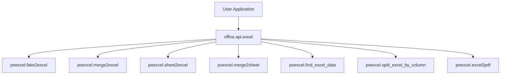
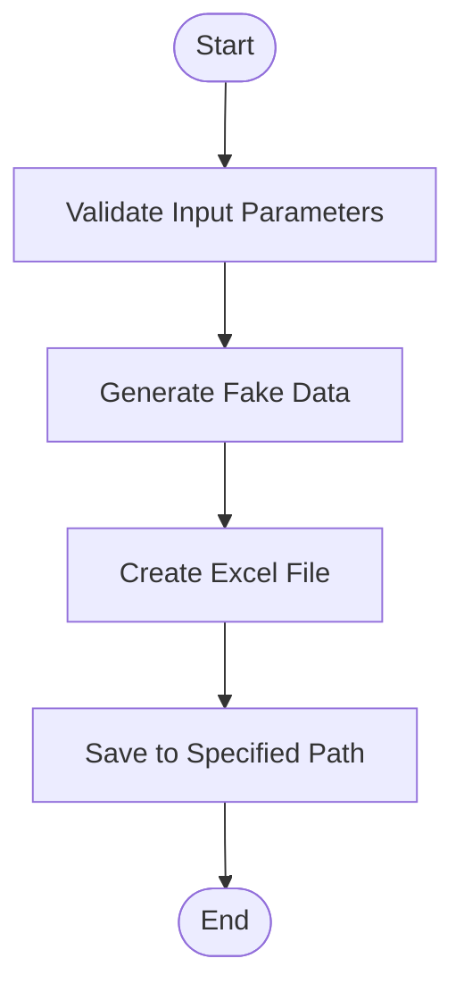
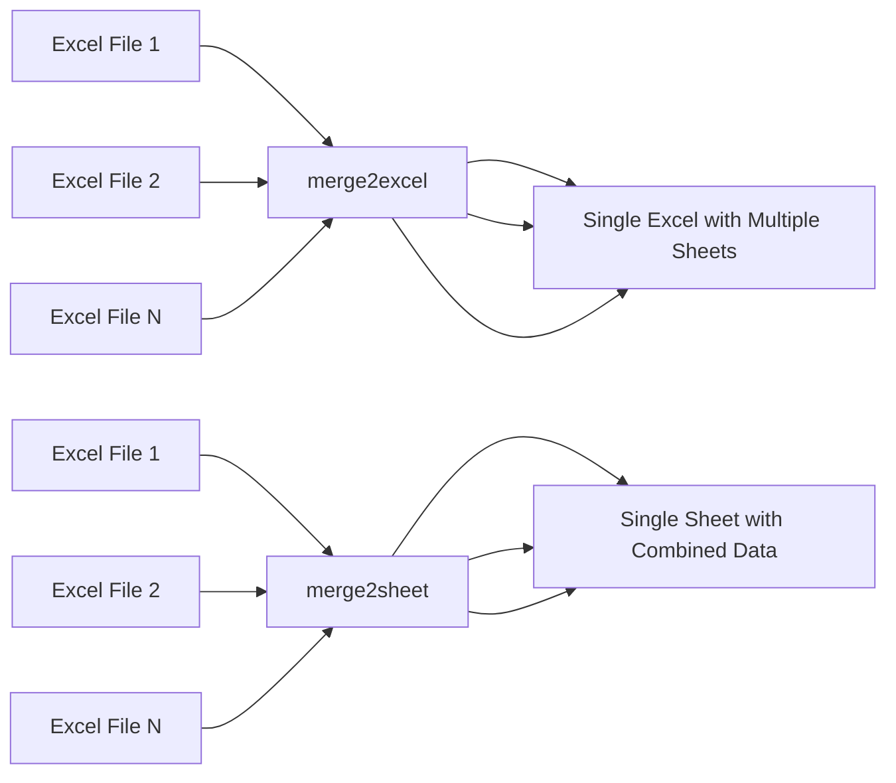
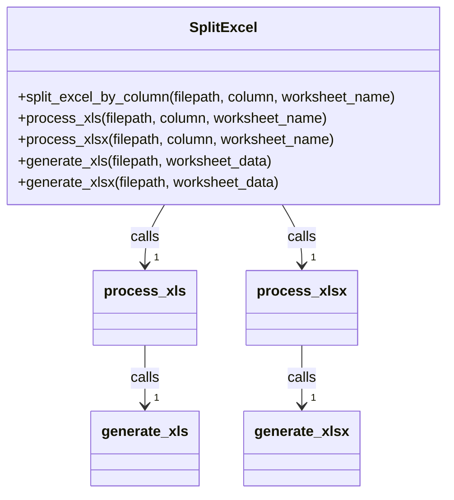
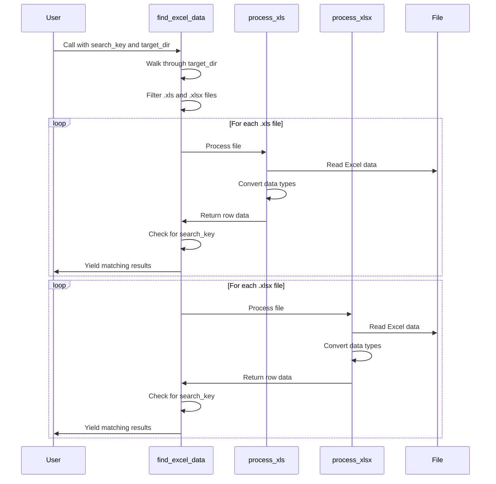

# Excel Processing (poexcel)

<cite>
**Referenced Files in This Document**   
- [excel.py](file://office/api/excel.py)
- [SplitExcel.py](file://office/lib/excel/SplitExcel.py)
- [SearchExcel.py](file://contributors/bulabean/SearchExcel.py)
- [创建Excel文件.py](file://examples/poexcel/创建Excel文件.py)
- [批量模拟数据.py](file://examples/poexcel/批量模拟数据.py)
- [合并多个Excel到一个Excel的不同sheet中.py](file://examples/poexcel/合并多个Excel到一个Excel的不同sheet中.py)
- [合并2个Excel的内容到一个sheet中.py](file://examples/poexcel/合并2个Excel的内容到一个sheet中.py)
- [根据指定的列，拆分excel.py](file://examples/poexcel/根据指定的列，拆分excel.py)
- [Excel转PDF.py](file://examples/poexcel/Excel转PDF.py)
- [根据内容，查询Excel.py](file://examples/poexcel/根据内容，查询Excel.py)
</cite>

## Table of Contents
1. [Introduction](#introduction)
2. [Core Functions Overview](#core-functions-overview)
3. [Creating Excel Files with Fake Data](#creating-excel-files-with-fake-data)
4. [Merging Excel Files](#merging-excel-files)
5. [Splitting Excel Files](#splitting-excel-files)
6. [Searching Content in Excel Files](#searching-content-in-excel-files)
7. [Converting Excel to PDF](#converting-excel-to-pdf)
8. [Aggregating Data from Multiple Excel Files](#aggregating-data-from-multiple-excel-files)
9. [Library Dependencies and Integration](#library-dependencies-and-integration)
10. [Error Handling and Common Issues](#error-handling-and-common-issues)
11. [Performance Considerations](#performance-considerations)

## Introduction
The poexcel module in python-office provides a comprehensive suite of Excel processing functions designed to simplify common data manipulation tasks. This documentation details the implementation and usage of key functions including creating Excel files with simulated data, merging and splitting Excel files, searching content within Excel files, converting Excel to PDF, and aggregating data from multiple Excel sources. The module serves as a high-level interface to powerful underlying libraries, making complex Excel operations accessible through simple function calls.

**Section sources**
- [excel.py](file://office/api/excel.py#L1-L20)

## Core Functions Overview
The poexcel module offers several core functions for Excel processing:

- **fake2excel**: Creates Excel files with simulated/fake data
- **merge2excel**: Merges multiple Excel files into a single file with different sheets
- **sheet2excel**: Splits a single Excel file's sheets into separate files
- **merge2sheet**: Combines data from multiple Excel files into a single sheet
- **find_excel_data**: Searches for specific content across Excel files
- **split_excel_by_column**: Splits an Excel file based on values in a specified column
- **excel2pdf**: Converts Excel files to PDF format

These functions are exposed through the office.api.excel module and provide a simplified interface to more complex operations.

**Diagram sources**
- [excel.py](file://office/api/excel.py#L25-L136)

**Section sources**
- [excel.py](file://office/api/excel.py#L1-L136)

## Creating Excel Files with Fake Data
The fake2excel function enables users to automatically create Excel files populated with simulated data. This is particularly useful for testing, demonstrations, or creating sample datasets.

The function accepts parameters for specifying column names, number of rows, output path, and language for the generated data. It supports various data types that can be simulated, with Chinese being the default language.

**Diagram sources**
- [excel.py](file://office/api/excel.py#L25-L39)

**Section sources**
- [excel.py](file://office/api/excel.py#L25-L39)
- [创建Excel文件.py](file://examples/poexcel/创建Excel文件.py#L1-L19)
- [批量模拟数据.py](file://examples/poexcel/批量模拟数据.py#L1-L25)

## Merging Excel Files
The poexcel module provides two distinct approaches for merging Excel files:

1. **merge2excel**: Combines multiple Excel files into a single file where each source file becomes a separate sheet
2. **merge2sheet**: Combines data from multiple Excel files into a single sheet

The merge2excel function is ideal when preserving the original structure of each file while consolidating them into a single workbook. The merge2sheet function is useful when you need to aggregate data from multiple sources into a unified dataset.

**Diagram sources**
- [excel.py](file://office/api/excel.py#L42-L55)
- [excel.py](file://office/api/excel.py#L75-L88)

**Section sources**
- [excel.py](file://office/api/excel.py#L42-L88)
- [合并多个Excel到一个Excel的不同sheet中.py](file://examples/poexcel/合并多个Excel到一个Excel的不同sheet中.py#L1-L20)
- [合并2个Excel的内容到一个sheet中.py](file://examples/poexcel/合并2个Excel的内容到一个sheet中.py#L1-L28)

## Splitting Excel Files
The poexcel module offers multiple methods for splitting Excel files:

1. **sheet2excel**: Splits a single Excel file by its sheets, creating separate files for each sheet
2. **split_excel_by_column**: Splits an Excel file based on the values in a specified column

The split_excel_by_column function is implemented in the office/lib/excel/SplitExcel.py file and supports both .xls and .xlsx formats. It reads the source file, organizes data by the values in the specified column, and creates separate files for each unique value.

**Diagram sources**
- [SplitExcel.py](file://office/lib/excel/SplitExcel.py#L117-L136)
- [SplitExcel.py](file://office/lib/excel/SplitExcel.py#L6-L136)

**Section sources**
- [excel.py](file://office/api/excel.py#L109-L121)
- [SplitExcel.py](file://office/lib/excel/SplitExcel.py#L1-L144)
- [根据指定的列，拆分excel.py](file://examples/poexcel/根据指定的列，拆分excel.py#L1-L33)

## Searching Content in Excel Files
The find_excel_data function enables users to search for specific content across multiple Excel files in a directory. This functionality is implemented in the contributors/bulabean/SearchExcel.py file.

The search process involves:
1. Walking through the target directory to find all Excel files
2. Processing both .xls and .xlsx file formats
3. Reading each sheet in the Excel files
4. Converting cell data to strings for comparison
5. Checking if the search key is present in the row content
6. Yielding results that match the search criteria

**Diagram sources**
- [SearchExcel.py](file://contributors/bulabean/SearchExcel.py#L117-L142)

**Section sources**
- [excel.py](file://office/api/excel.py#L92-L105)
- [SearchExcel.py](file://contributors/bulabean/SearchExcel.py#L1-L154)
- [根据内容，查询Excel.py](file://examples/poexcel/根据内容，查询Excel.py#L1-L11)

## Converting Excel to PDF
The excel2pdf function converts Excel files to PDF format, allowing for easy sharing and printing of spreadsheet data. The function accepts parameters for the input Excel path, output PDF path, and the sheet ID to convert (defaulting to the first sheet).

This functionality provides a simple interface for converting Excel content to a more universally accessible format, preserving the visual layout of the spreadsheet as much as possible during the conversion process.

**Section sources**
- [excel.py](file://office/api/excel.py#L123-L136)
- [Excel转PDF.py](file://examples/poexcel/Excel转PDF.py#L1-L25)

## Aggregating Data from Multiple Excel Files
While not explicitly detailed in the provided code, the example file "把100个Excel中符合条件的数据，汇总到1个Excel里.py" suggests the existence of a query4excel function for aggregating data from multiple Excel files based on specified criteria.

This functionality would involve:
1. Searching through multiple Excel files for data matching specific conditions
2. Extracting the matching data
3. Consolidating the extracted data into a single output Excel file

The approach would likely build upon the search functionality already implemented in find_excel_data, extending it to collect and aggregate the matching data rather than just reporting its location.

**Section sources**
- [把100个Excel中符合条件的数据，汇总到1个Excel里.py](file://examples/poexcel/把100个Excel中符合条件的数据，汇总到1个Excel里.py#L1-L23)

## Library Dependencies and Integration
The poexcel module integrates several key Python libraries for Excel processing:

- **pandas**: Likely used for high-level data manipulation and Excel I/O operations
- **openpyxl**: Used for reading and writing .xlsx files, providing access to Excel features and formatting
- **xlrd/xlwt**: Used for handling the older .xls file format

The module acts as a wrapper around these libraries, providing simplified function calls that abstract away the complexity of direct library usage. This allows users to perform complex Excel operations without needing to understand the intricacies of the underlying libraries.

The architecture follows a pattern where the office.api.excel module provides the user-facing interface, which then calls into the poexcel package for implementation. Specific functionality like splitting Excel files by column is implemented in dedicated modules within the office/lib/excel directory.

**Section sources**
- [excel.py](file://office/api/excel.py#L22)
- [SplitExcel.py](file://office/lib/excel/SplitExcel.py#L2-L3)
- [SearchExcel.py](file://contributors/bulabean/SearchExcel.py#L2-L3)

## Error Handling and Common Issues
The poexcel module implements several error handling strategies to address common issues in Excel processing:

1. **File Format Validation**: The split_excel_by_column function checks for valid file extensions (.xls or .xlsx) and returns appropriate error messages for unsupported formats.

2. **Column Boundary Checking**: When splitting by column, the function verifies that the specified column exists in the worksheet, preventing index out of range errors.

3. **File Reading Exceptions**: Both the split and search functions use try-except blocks to handle file reading errors, returning descriptive error messages when files cannot be read.

4. **Data Type Conversion**: The search functionality includes a change_datatype function that handles various Excel data types (datetime, string, int, float, None) and converts them to strings for consistent searching.

Common issues that users might encounter include:
- Encoding problems when dealing with non-ASCII characters
- Loss of formatting during conversion operations
- Performance issues with very large Excel files
- Formula preservation (or lack thereof) when manipulating Excel files

**Section sources**
- [SplitExcel.py](file://office/lib/excel/SplitExcel.py#L95-L98)
- [SplitExcel.py](file://office/lib/excel/SplitExcel.py#L103-L104)
- [SearchExcel.py](file://contributors/bulabean/SearchExcel.py#L62-L65)
- [SearchExcel.py](file://contributors/bulabean/SearchExcel.py#L96-L99)
- [SearchExcel.py](file://contributors/bulabean/SearchExcel.py#L8-L32)

## Performance Considerations
When processing large Excel files, several performance considerations should be taken into account:

1. **Memory Usage**: Reading large Excel files into memory can be resource-intensive. The use of read_only=True mode in openpyxl helps reduce memory consumption when processing large .xlsx files.

2. **Processing Time**: Operations on large datasets can be time-consuming. The implementation uses efficient data structures and algorithms to minimize processing time.

3. **Batch Processing**: For operations involving multiple files, processing can be optimized by implementing batch processing strategies rather than loading all files into memory simultaneously.

4. **File Format Impact**: The .xlsx format is generally more efficient than the older .xls format for large datasets due to its compressed, XML-based structure.

5. **I/O Operations**: Minimizing the number of read/write operations can significantly improve performance, especially when dealing with network storage or slow disks.

The current implementation shows awareness of performance considerations through the use of read-only mode for large files and the use of generators (yield) in the search functionality to avoid loading all results into memory at once.

**Section sources**
- [SplitExcel.py](file://office/lib/excel/SplitExcel.py#L96)
- [SearchExcel.py](file://contributors/bulabean/SearchExcel.py#L97)
- [SearchExcel.py](file://contributors/bulabean/SearchExcel.py#L117-L142)