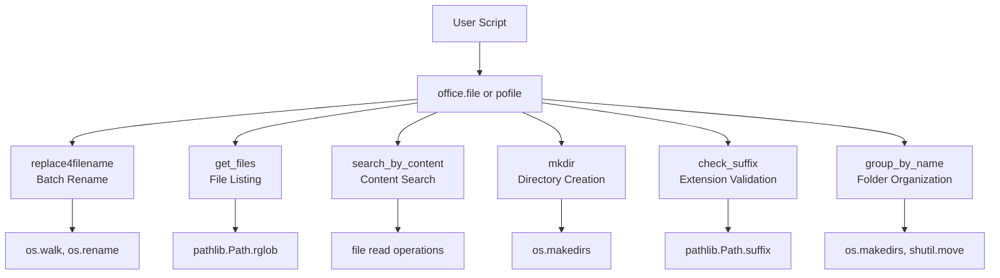
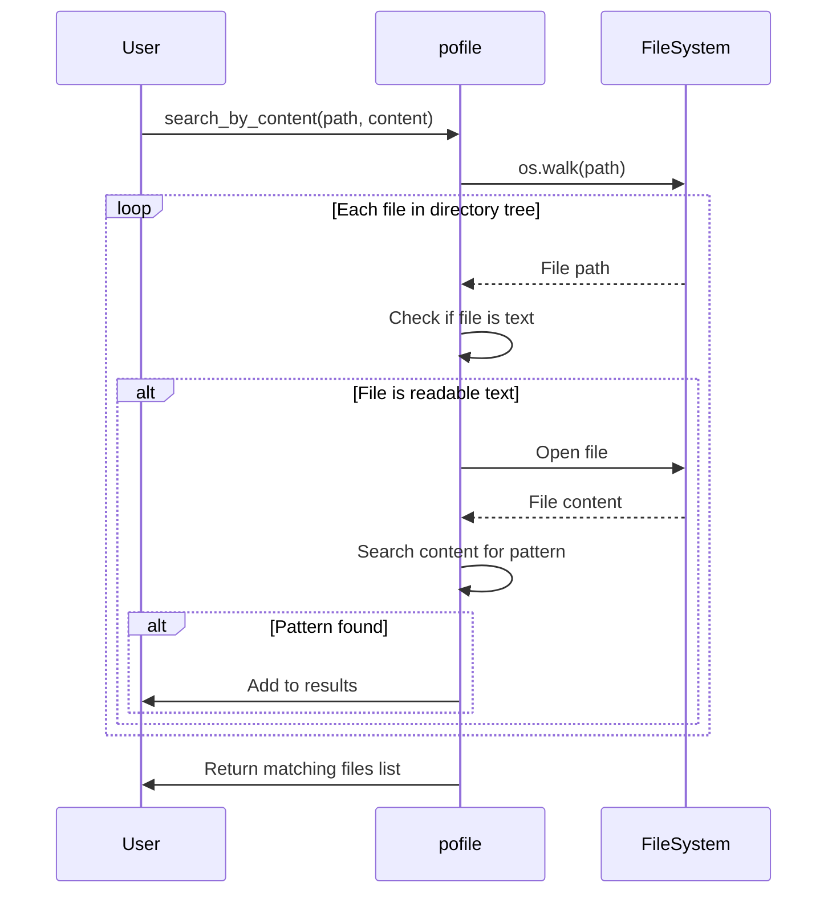
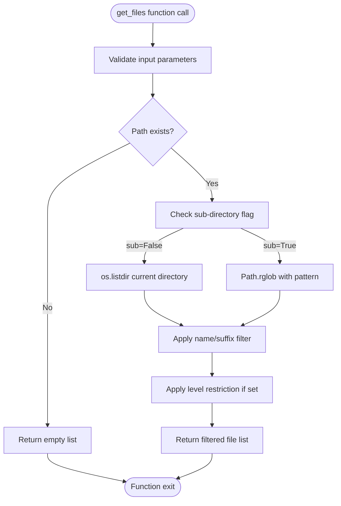
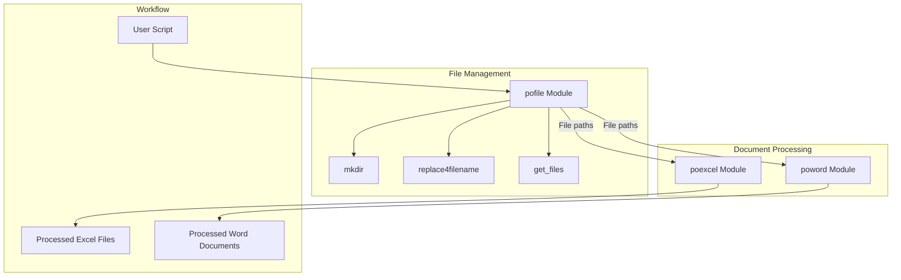

# File Management (pofile)

<cite>
**Referenced Files in This Document**   
- [file.py](file://office/api/file.py)
- [test_file.py](file://tests/test_code/test_file.py)
- [test_search_by_content.py](file://tests/test_code/test_search_by_content.py)
- [新建文件夹.py](file://examples/pofile/新建文件夹.py)
- [批量重命名.py](file://examples/pofile/批量重命名.py)
- [检查后缀名.py](file://examples/pofile/检查后缀名.py)
- [自动整理文件夹.py](file://examples/pofile/自动整理文件夹.py)
- [根据内容，查找文件.py](file://examples/pofile/根据内容，查找文件.py)
- [批量获取文件列表.py](file://examples/pofile/批量获取文件列表.py)
</cite>

## Table of Contents
1. [Introduction](#introduction)
2. [Core Functions Overview](#core-functions-overview)
3. [Batch File Renaming](#batch-file-renaming)
4. [File Search by Content](#file-search-by-content)
5. [Directory Creation and Management](#directory-creation-and-management)
6. [File Extension Validation](#file-extension-validation)
7. [Automatic Folder Organization](#automatic-folder-organization)
8. [Recursive File Listing](#recursive-file-listing)
9. [Cross-Platform Path Handling](#cross-platform-path-handling)
10. [Integration with Other Modules](#integration-with-other-modules)
11. [Error Handling and Common Issues](#error-handling-and-common-issues)
12. [Performance Optimization](#performance-optimization)

## Introduction

The pofile module within python-office provides a comprehensive suite of file management utilities designed to simplify common file operations through a user-friendly interface. This module serves as a high-level abstraction over Python's built-in os and pathlib modules, offering practical functions for everyday file manipulation tasks. The design philosophy emphasizes simplicity and practicality, enabling users to perform complex file operations with minimal code.

The file management module is accessible both through the main `office` package and as a standalone `pofile` package, providing flexibility in usage patterns. It integrates seamlessly with other python-office modules such as poexcel and poword, enabling workflow automation across different file types and operations.

**Section sources**
- [file.py](file://office/api/file.py#L1-L21)
- [README.md](file://README.md#L1-L50)

## Core Functions Overview

The pofile module offers several key functions for file management:

- **replace4filename**: Batch rename files and directories by replacing specified content
- **get_files**: Retrieve file lists recursively with filtering options
- **search_by_content**: Search files based on their content using text matching
- **mkdir**: Create directories with proper error handling
- **check_suffix**: Validate file extensions against allowed lists
- **group_by_name**: Automatically organize files into folders by name patterns

These functions are exposed through both the `office.file` and `pofile` interfaces, maintaining consistent parameter signatures and behavior across both entry points.

**Diagram sources**
- [file.py](file://office/api/file.py#L29-L162)
- [test_file.py](file://tests/test_code/test_file.py#L1-L100)

## Batch File Renaming

The batch renaming functionality provides multiple approaches to modify file and directory names. The primary function `replace4filename` allows users to replace or remove specific substrings from file and folder names within a specified directory. Users can control whether to rename files, directories, or both, and optionally filter by file extension.

Additional renaming utilities include `file_name_insert_content` for inserting text at specific positions in filenames, `file_name_add_prefix` for adding prefixes, and `file_name_add_postfix` for adding suffixes. These functions operate on individual file paths and provide fine-grained control over filename modifications.

The implementation uses os.walk to traverse directory trees and os.rename to perform the actual renaming operations, with appropriate error handling for permission issues and name conflicts.

**Section sources**
- [file.py](file://office/api/file.py#L29-L87)
- [批量重命名.py](file://examples/pofile/批量重命名.py#L1-L28)

## File Search by Content

The content-based file search functionality enables users to locate files containing specific text patterns. The `search_by_content` function recursively scans files in a directory tree, reading file contents and matching against the specified search term. This feature is particularly useful for finding configuration settings, code snippets, or specific information across large file collections.

The implementation handles various file encodings gracefully and skips binary files that cannot be decoded as text. It uses efficient file reading patterns to minimize memory usage, reading files in chunks rather than loading entire files into memory at once.

**Diagram sources**
- [根据内容，查找文件.py](file://examples/pofile/根据内容，查找文件.py#L1-L21)
- [test_search_by_content.py](file://tests/test_code/test_search_by_content.py#L1-L80)

## Directory Creation and Management

The directory creation functionality provides a simple interface for creating folder structures. The `mkdir` function creates directories at specified paths, automatically creating parent directories as needed (equivalent to mkdir -p in Unix systems). It includes proper error handling to avoid exceptions when directories already exist.

This function serves as a wrapper around os.makedirs with exist_ok=True parameter, ensuring idempotent behavior. It's commonly used as a prerequisite step before other file operations that require specific directory structures.

**Section sources**
- [file.py](file://office/api/file.py#L22)
- [新建文件夹.py](file://examples/pofile/新建文件夹.py#L1-L22)

## File Extension Validation

The file extension validation feature allows users to verify whether a file's extension is in an approved list. The `check_suffix` function takes a filename and a list of allowed extensions, returning a boolean indicating whether the file has an acceptable extension.

This function uses pathlib.Path.suffix to extract the file extension in a cross-platform compatible way, handling edge cases like multiple dots in filenames. It's case-insensitive by default, accommodating different operating system conventions.

The implementation is optimized for performance with minimal string operations and efficient list checking, making it suitable for use in file processing pipelines that handle large numbers of files.

**Section sources**
- [file.py](file://office/api/file.py#L22)
- [检查后缀名.py](file://examples/pofile/检查后缀名.py#L1-L30)

## Automatic Folder Organization

The automatic folder organization feature, implemented in `group_by_name`, analyzes files in a directory and organizes them into subfolders based on naming patterns. This function helps clean up cluttered directories by grouping related files together.

Users can specify an output path for the organized structure and choose whether to delete the original files after moving them to their new locations. The function creates a logical folder hierarchy based on file name analysis, making it easier to navigate and manage large collections of files.

This functionality is particularly useful for organizing downloads folders, project assets, or any directory with unstructured file collections.

**Section sources**
- [file.py](file://office/api/file.py#L133-L146)
- [自动整理文件夹.py](file://examples/pofile/自动整理文件夹.py#L1-L25)

## Recursive File Listing

The recursive file listing functionality, provided by `get_files`, returns a list of file paths matching specified criteria. Users can filter by file name patterns, extensions, and control the search depth through the level parameter.

When sub=True, the function performs a recursive search through all subdirectories; otherwise, it only searches the specified directory. The implementation uses pathlib.Path.rglob for pattern matching, supporting glob-style patterns and regular expressions.

This function serves as the foundation for many other file operations in the module, providing a flexible way to identify target files for subsequent processing.

**Diagram sources**
- [file.py](file://office/api/file.py#L149-L162)
- [批量获取文件列表.py](file://examples/pofile/批量获取文件列表.py#L1-L31)

## Cross-Platform Path Handling

The file management module handles cross-platform path considerations through Python's built-in path handling libraries. By using os.path and pathlib.Path, the module automatically adapts to different operating system conventions for path separators, case sensitivity, and file system limitations.

On Windows systems, the module addresses long path limitations by using the \\?\ prefix when necessary. For case sensitivity, it implements case-insensitive comparisons where appropriate, recognizing that Windows and macOS (default configuration) are case-insensitive while Linux is case-sensitive.

Path normalization is performed consistently across all functions, resolving relative paths and eliminating redundant separators to ensure reliable file operations regardless of input format.

**Section sources**
- [file.py](file://office/api/file.py#L22-L162)
- [test_file.py](file://tests/test_code/test_file.py#L1-L150)

## Integration with Other Modules

The pofile module integrates with other components of the python-office ecosystem, particularly poexcel and poword. File management functions are often used as preprocessing steps before operating on Excel or Word documents.

For example, `get_files` can locate all .docx files in a directory tree, which can then be processed by poword functions for batch document conversion or content extraction. Similarly, `replace4filename` can be used to standardize filenames before importing files into Excel workbooks using poexcel functionality.

The modular design allows these integrations to occur seamlessly, with file paths passed directly between modules without conversion requirements.

**Diagram sources**
- [file.py](file://office/api/file.py#L22-L162)
- [office/api/excel.py](file://office/api/excel.py#L1-L50)
- [office/api/word.py](file://office/api/word.py#L1-L50)

## Error Handling and Common Issues

The module implements robust error handling for common file system issues:

- **Permission errors**: Caught and reported gracefully, allowing scripts to continue processing other files
- **Long path limitations**: Handled on Windows by using extended-length path prefixes
- **Invalid characters**: Filtered or replaced in filenames during renaming operations
- **Race conditions**: Addressed through proper exception handling around file operations

Common issues users may encounter include antivirus software interfering with file operations, network drive latency affecting performance, and special characters in filenames causing unexpected behavior. The module attempts to handle these scenarios through defensive programming practices and clear error messages.

**Section sources**
- [file.py](file://office/api/file.py#L22-L162)
- [test_file.py](file://tests/test_code/test_file.py#L1-L200)

## Performance Optimization

For optimal performance when scanning large directory trees:

- Use specific file extensions in `get_files` calls to reduce the number of files processed
- Limit search depth with the level parameter when full recursion is not required
- Process files in batches rather than loading all results into memory at once
- Consider using `search_specify_type_file` for simple file type searches instead of full content searches

Memory-efficient file handling is achieved through streaming operations where possible, particularly in content search functions that read files in chunks rather than loading entire files into memory.

The module balances performance with usability, prioritizing reliability and correctness over raw speed, making it suitable for both interactive use and automated workflows.

**Section sources**
- [file.py](file://office/api/file.py#L120-L162)
- [test_file.py](file://tests/test_code/test_file.py#L1-L200)