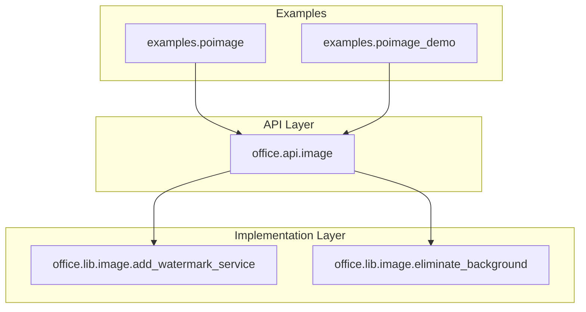
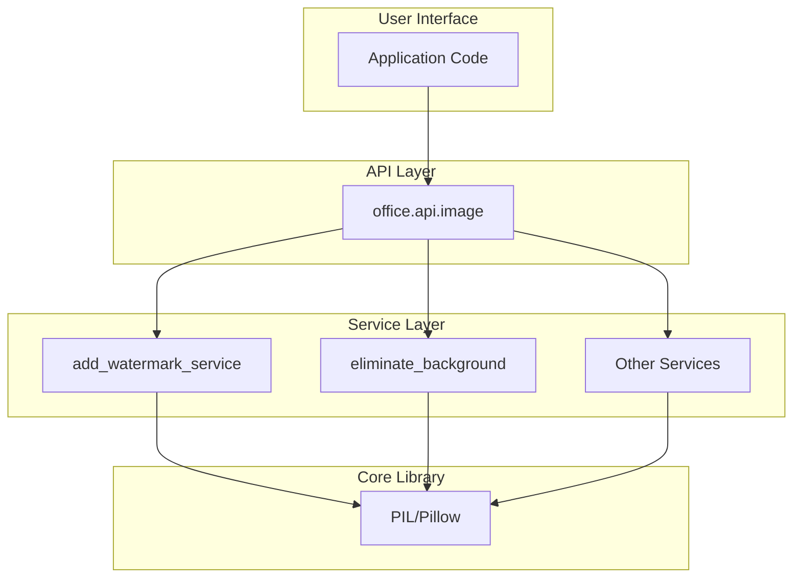
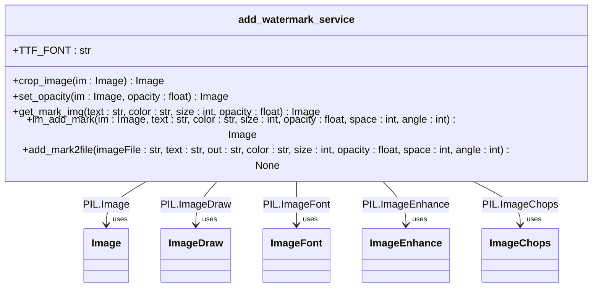
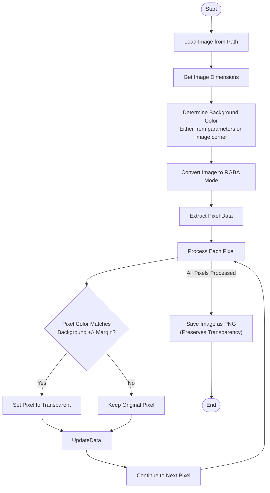
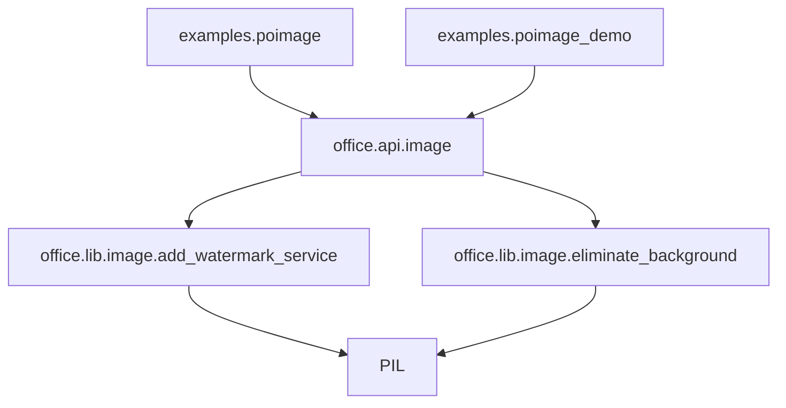

# Image Processing (poimage)

<cite>
**Referenced Files in This Document**   
- [image.py](file://office/api/image.py)
- [add_watermark_service.py](file://office/lib/image/add_watermark_service.py)
- [eliminate_background.py](file://office/lib/image/eliminate_background.py)
- [图片加水印.py](file://examples/poimage/图片加水印.py)
- [图片去水印.py](file://examples/poimage/图片去水印.py)
- [下载图片.py](file://examples/poimage/下载图片.py)
- [文本转词云.py](file://examples/poimage/文本转词云.py)
- [compress_image.py](file://examples/poimage_demo/compress_image.py)
</cite>

## Table of Contents
1. [Introduction](#introduction)
2. [Project Structure](#project-structure)
3. [Core Components](#core-components)
4. [Architecture Overview](#architecture-overview)
5. [Detailed Component Analysis](#detailed-component-analysis)
6. [Dependency Analysis](#dependency-analysis)
7. [Performance Considerations](#performance-considerations)
8. [Troubleshooting Guide](#troubleshooting-guide)
9. [Conclusion](#conclusion)

## Introduction
The poimage module within the python-office ecosystem provides a comprehensive suite of image processing capabilities designed to simplify common image manipulation tasks for developers and end users. This documentation details the implementation of key functions including watermarking (both text and image), watermark removal, image compression, word cloud generation from text, image downloading from URLs, and format conversion. The module leverages the PIL/Pillow library as its core imaging engine, providing robust handling of various image formats such as JPEG, PNG, and GIF. The design emphasizes simplicity and accessibility, exposing complex image processing operations through straightforward function calls while managing underlying technical complexities like color space conversion, transparency preservation, and memory management.

## Project Structure
The image processing functionality in python-office follows a layered architecture with clear separation between API interfaces and implementation services. The public API is exposed through the office.api.image module, which serves as a facade to the underlying implementation in office.lib.image. This design pattern allows for stable public interfaces while enabling internal implementation changes without affecting users. The examples directory contains practical demonstrations of each function, providing ready-to-use code samples for common use cases. The separation of concerns is evident in the organization, with watermark-related functionality isolated in add_watermark_service.py and background elimination in eliminate_background.py, promoting maintainability and focused development.

**Diagram sources**
- [image.py](file://office/api/image.py)
- [add_watermark_service.py](file://office/lib/image/add_watermark_service.py)
- [eliminate_background.py](file://office/lib/image/eliminate_background.py)

**Section sources**
- [image.py](file://office/api/image.py)
- [add_watermark_service.py](file://office/lib/image/add_watermark_service.py)
- [eliminate_background.py](file://office/lib/image/eliminate_background.py)

## Core Components
The poimage module consists of several core components that provide distinct image processing capabilities. The watermarking system supports both text and image watermarks with configurable parameters for appearance and layout. The background elimination feature enables transparent background creation by identifying and removing specified background colors. Image compression functionality allows for quality-based file size reduction, while the word cloud generator transforms text content into visual representations. Additional utilities include image downloading from URLs, format conversion, and specialized image effects like pencil sketches and cartoonization. These components are designed to work independently but can be combined in workflows for more complex image processing pipelines.

**Section sources**
- [image.py](file://office/api/image.py)
- [add_watermark_service.py](file://office/lib/image/add_watermark_service.py)
- [eliminate_background.py](file://office/lib/image/eliminate_background.py)

## Architecture Overview
The architecture of the poimage module follows a clean separation between interface and implementation. The office.api.image module provides a high-level API that abstracts the complexity of image processing operations, making them accessible through simple function calls. This API layer delegates to specialized service modules in office.lib.image that contain the actual implementation logic. The use of PIL/Pillow as the underlying imaging library ensures compatibility with a wide range of image formats and provides a robust foundation for image manipulation. The architecture supports both direct file operations and in-memory image processing, allowing for flexibility in handling different use cases from simple file conversions to complex image transformations.

**Diagram sources**
- [image.py](file://office/api/image.py)
- [add_watermark_service.py](file://office/lib/image/add_watermark_service.py)
- [eliminate_background.py](file://office/lib/image/eliminate_background.py)

## Detailed Component Analysis

### Watermarking System Analysis
The watermarking functionality in poimage provides comprehensive control over text watermark appearance and placement. The implementation creates semi-transparent watermark patterns that can be tiled across the entire image surface at specified angles and spacing. The system handles font loading, text rendering, and transparency effects through PIL's imaging capabilities. Watermarks are generated as separate RGBA images with transparency, which are then composited onto the original image using alpha blending. This approach preserves image quality while ensuring watermarks are visible but not overly intrusive.

**Diagram sources**
- [add_watermark_service.py](file://office/lib/image/add_watermark_service.py)

**Section sources**
- [add_watermark_service.py](file://office/lib/image/add_watermark_service.py#L1-L140)
- [图片加水印.py](file://examples/poimage/图片加水印.py#L1-L25)

### Background Elimination Analysis
The background elimination component provides functionality to make image backgrounds transparent by identifying and removing specified colors. The implementation analyzes pixel values and compares them against a target background color within a configurable tolerance margin. Pixels matching the background criteria are converted to full transparency, while foreground pixels are preserved. The system supports both automatic background detection (using the image's corner pixels) and manual color specification in hexadecimal or RGB formats. This approach enables effective background removal for images with uniform backgrounds while preserving image details in the foreground.

**Diagram sources**
- [eliminate_background.py](file://office/lib/image/eliminate_background.py)

**Section sources**
- [eliminate_background.py](file://office/lib/image/eliminate_background.py#L1-L72)
- [图片去水印.py](file://examples/poimage/图片去水印.py#L1-L12)

### Image Compression Analysis
The image compression functionality provides quality-based file size reduction while maintaining visual fidelity. The implementation leverages PIL's built-in compression capabilities, exposing quality parameters that control the compression algorithm's aggressiveness. The system handles format conversion automatically when necessary, such as converting RGBA images to RGB before saving as JPEG (which doesn't support transparency). The quality parameter follows standard JPEG quality scales, allowing users to balance file size against visual quality. This approach enables significant file size reductions for web and mobile applications where bandwidth and storage are concerns.

**Section sources**
- [image.py](file://office/api/image.py#L5-L17)
- [compress_image.py](file://examples/poimage_demo/compress_image.py#L1-L8)

### Word Cloud Generation Analysis
The word cloud generation component transforms text content into visual representations where word frequency determines visual prominence. The implementation processes input text files, analyzes word frequencies, and generates images where more frequent words appear larger and more centrally located. The system supports customization of background colors and output file names, allowing integration into various visualization workflows. This functionality bridges text analysis and visual representation, enabling users to quickly identify key themes and patterns in textual data through intuitive visual formats.

**Section sources**
- [image.py](file://office/api/image.py#L94-L106)
- [文本转词云.py](file://examples/poimage/文本转词云.py#L1-L15)

### Image Downloading Analysis
The image downloading functionality provides a simple interface for retrieving images from web URLs and saving them locally. The implementation handles HTTP requests, binary data retrieval, and file system operations to store downloaded images with user-specified names and formats. The system includes sensible defaults for output paths and file types, reducing the configuration burden for common use cases. This component enables automation of image collection workflows, such as gathering reference materials or building image datasets from online sources.

**Section sources**
- [image.py](file://office/api/image.py#L76-L91)
- [下载图片.py](file://examples/poimage/下载图片.py#L1-L37)

## Dependency Analysis
The poimage module has a well-defined dependency structure centered around the PIL/Pillow library for core image processing operations. The API layer depends on the implementation services, which in turn depend on PIL for low-level image manipulation. This layered dependency structure ensures that changes to the underlying imaging library can be accommodated with minimal impact on the public API. The module also demonstrates dependencies on standard Python libraries for file operations, mathematical calculations, and color space conversions. The examples directory shows dependencies on the core module, illustrating how external code can leverage the provided functionality.

**Diagram sources**
- [image.py](file://office/api/image.py)
- [add_watermark_service.py](file://office/lib/image/add_watermark_service.py)
- [eliminate_background.py](file://office/lib/image/eliminate_background.py)

**Section sources**
- [image.py](file://office/api/image.py#L1-L152)
- [add_watermark_service.py](file://office/lib/image/add_watermark_service.py#L1-L140)
- [eliminate_background.py](file://office/lib/image/eliminate_background.py#L1-L72)

## Performance Considerations
The poimage module's performance characteristics are primarily determined by the underlying PIL/Pillow library and the size/resolution of processed images. Large images consume significant memory during processing, as PIL typically loads entire images into memory for manipulation. The watermarking system's performance scales with image dimensions and watermark density, as larger images require more extensive compositing operations. Background elimination performance depends on image size and complexity, as every pixel must be evaluated against the background criteria. For optimal performance with large images, users should consider processing images in smaller batches or using lower resolution versions when full quality is not required. The module does not currently implement streaming or chunked processing, which could reduce memory footprint for very large images.

## Troubleshooting Guide
Common issues with the poimage module include problems with file paths containing non-ASCII characters, particularly Chinese characters, which can cause failures in file operations. Users should ensure that input and output paths use ASCII characters only. Another common issue is related to format compatibility, such as attempting to save transparency in JPEG format, which is not supported. When this occurs, the system automatically converts RGBA images to RGB mode before saving as JPEG. Memory limitations can occur when processing very large images, potentially causing crashes or excessive processing times. For watermarking operations, users should verify that the msyh.ttc font file is available in the expected location, as missing fonts will prevent text watermark creation. When downloading images, network connectivity issues or invalid URLs will result in download failures that should be handled by the calling code.

**Section sources**
- [add_watermark_service.py](file://office/lib/image/add_watermark_service.py#L11-L140)
- [eliminate_background.py](file://office/lib/image/eliminate_background.py#L1-L72)
- [图片去水印.py](file://examples/poimage/图片去水印.py#L8-L9)

## Conclusion
The poimage module in python-office provides a comprehensive set of image processing tools that simplify complex operations through an intuitive API. By leveraging the robust PIL/Pillow library, the module offers reliable handling of various image formats and operations while abstracting technical complexities from end users. The architecture's clear separation between interface and implementation promotes maintainability and extensibility. While the current implementation covers essential image processing needs, opportunities exist for enhancement in areas such as performance optimization for large images, expanded format support, and improved error handling. The module serves as an effective tool for developers and non-technical users alike, enabling automation of common image manipulation tasks in office workflows and data processing pipelines.