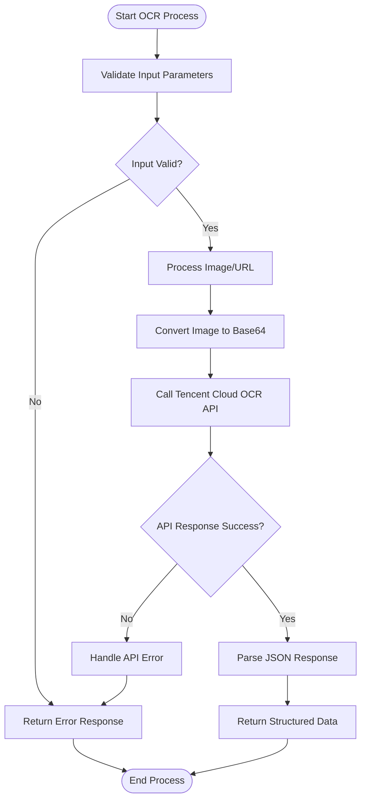
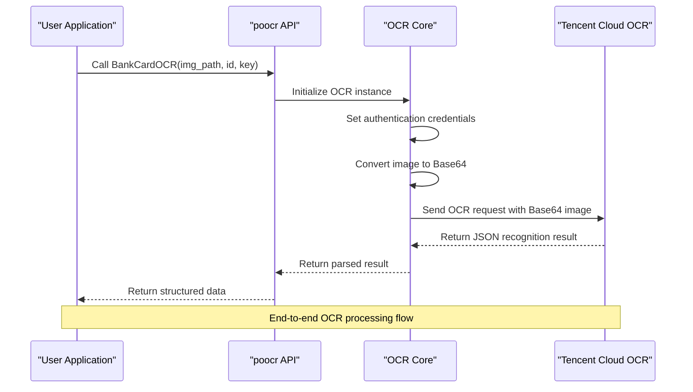
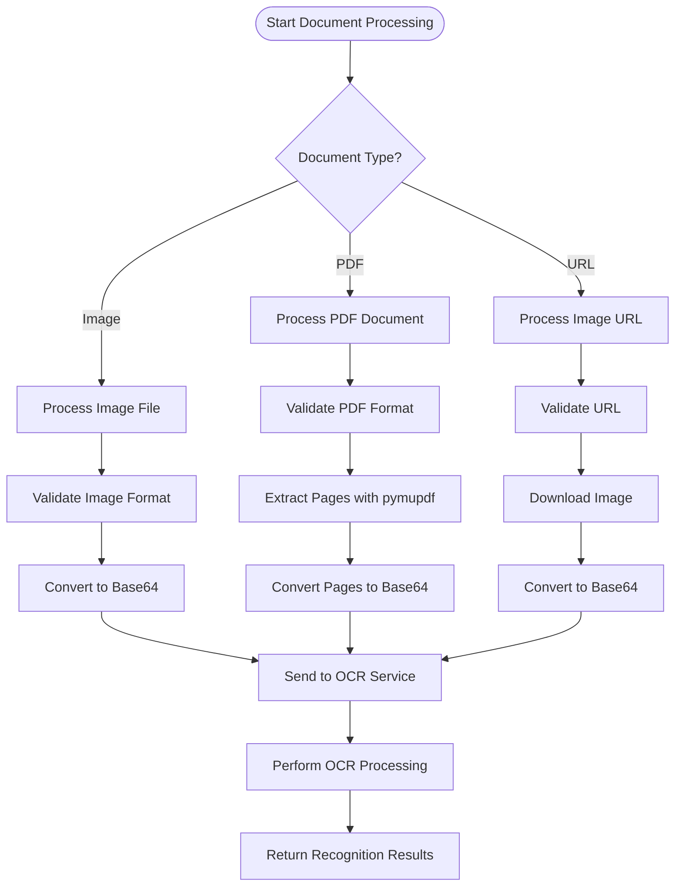
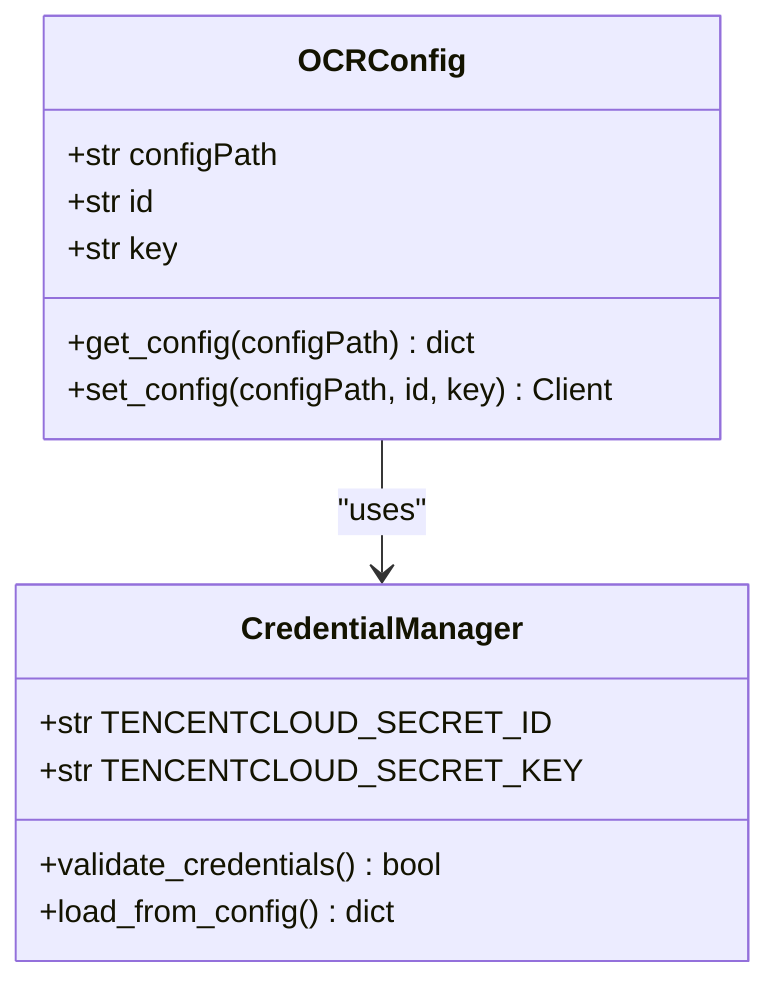
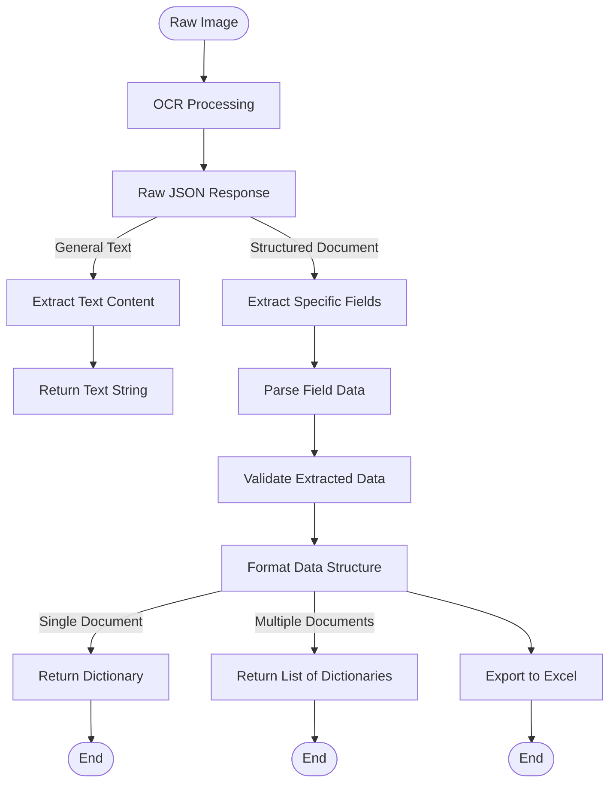
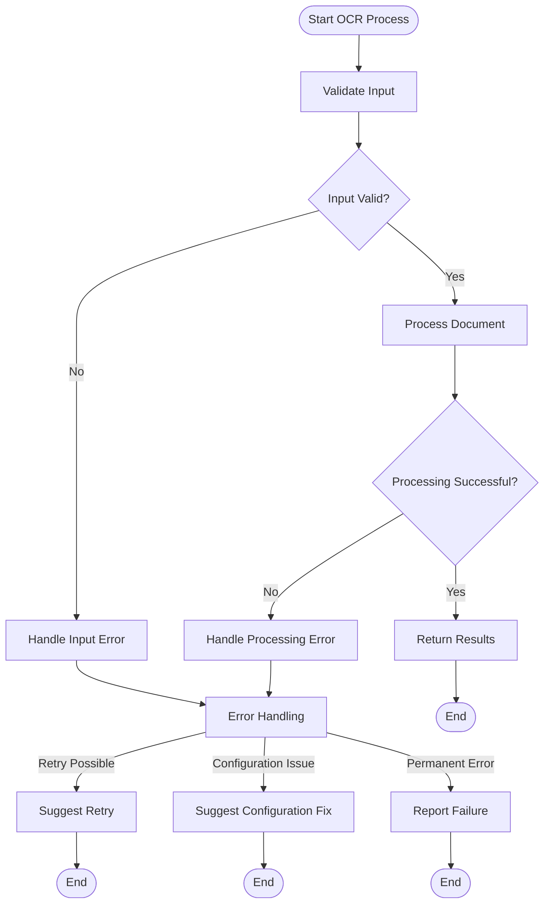

# OCR Processing (poocr)

<cite>
**Referenced Files in This Document**   
- [ocr.py](file://office/api/ocr.py)
- [通用文字识别.py](file://examples/poocr/通用文字识别.py)
- [识别银行卡.py](file://examples/poocr/识别银行卡.py)
- [poocr/api/ocr.py](file://venv/Lib/site-packages/poocr/api/ocr.py)
- [poocr/api/ocr2excel.py](file://venv/Lib/site-packages/poocr/api/ocr2excel.py)
- [poocr/core/OCR.py](file://venv/Lib/site-packages/poocr/core/OCR.py)
- [poocr/lib/CommonUtils.py](file://venv/Lib/site-packages/poocr/lib/CommonUtils.py)
- [README.md](file://README.md)
</cite>

## Table of Contents
1. [Introduction](#introduction)
2. [Core OCR Functionality](#core-ocr-functionality)
3. [Specialized Recognition Features](#specialized-recognition-features)
4. [Architecture and Integration](#architecture-and-integration)
5. [Image and PDF Processing](#image-and-pdf-processing)
6. [Configuration and Authentication](#configuration-and-authentication)
7. [Data Extraction and Structuring](#data-extraction-and-structuring)
8. [Error Handling and Troubleshooting](#error-handling-and-troubleshooting)
9. [Performance Considerations](#performance-considerations)
10. [Best Practices](#best-practices)

## Introduction

The OCR Processing module (poocr) in python-office provides comprehensive optical character recognition capabilities for extracting text from images and documents. This module enables users to automate data extraction from various document types including invoices, identification cards, bank cards, and general text documents. The implementation leverages cloud-based OCR services, primarily Tencent Cloud's OCR API, to provide accurate text recognition across multiple document types and languages.

The poocr module serves as a bridge between local file systems and cloud-based OCR engines, handling the complexities of image encoding, API authentication, and result parsing. It supports both direct image processing and batch processing of multiple files, with options to export recognized data to structured formats like Excel.

**Section sources**
- [README.md](file://README.md#L91-L92)

## Core OCR Functionality

The poocr module provides multiple OCR functions for different use cases, with GeneralBasicOCR serving as the primary interface for general text recognition. This function accepts either a local image path or a URL to an online image, converts the image to Base64 encoding, and sends it to the Tencent Cloud OCR service for processing.

The OCR process begins with image preprocessing, where the input image is converted to Base64 format for transmission to the cloud API. The module handles various image formats and automatically detects the input type (local file or URL). For PDF documents, the module uses pymupdf to extract individual pages and process them as separate images.

Text recognition accuracy is influenced by image quality, resolution, and lighting conditions. The module does not perform extensive image preprocessing locally but relies on the cloud service's built-in image enhancement capabilities. Users are advised to provide high-quality images with clear text for optimal recognition results.

**Diagram sources**
- [poocr/api/ocr.py](file://venv/Lib/site-packages/poocr/api/ocr.py#L142-L144)
- [poocr/lib/CommonUtils.py](file://venv/Lib/site-packages/poocr/lib/CommonUtils.py#L20-L26)

**Section sources**
- [通用文字识别.py](file://examples/poocr/通用文字识别.py#L11-L15)
- [poocr/api/ocr.py](file://venv/Lib/site-packages/poocr/api/ocr.py#L142-L144)

## Specialized Recognition Features

The poocr module offers specialized OCR functions for specific document types, including BankCardOCR for bank card information extraction. These specialized functions are designed to recognize structured data from standardized document formats, extracting specific fields with high accuracy.

For bank card recognition, the module extracts key information such as card number, bank name, card type, and validity period. The recognition process is optimized for the specific layout and formatting of bank cards, allowing for accurate extraction even when cards are slightly rotated or partially obscured.

Other specialized recognition functions include VatInvoiceOCR for invoice processing, IDCardOCR for identification documents, and LicensePlateOCR for vehicle license plates. Each function is tailored to the specific characteristics of its target document type, leveraging the cloud OCR service's specialized models for improved accuracy.

```mermaid
classDiagram
class OCRProcessor {
+str img_path
+str img_url
+str configPath
+str id
+str key
+process() str
}
class GeneralOCR {
+GeneralBasicOCR(img_path, img_url, configPath, id, key) dict
+GeneralAccurateOCR(img_path, img_url, configPath, id, key) dict
+GeneralHandwritingOCR(img_path, img_url, configPath, id, key) dict
}
class SpecializedOCR {
+BankCardOCR(img_path, img_url, configPath, id, key) dict
+VatInvoiceOCR(img_path, img_url, configPath, id, key) dict
+IDCardOCR(img_path, img_url, configPath, id, key) dict
+LicensePlateOCR(img_path, img_url, configPath, id, key) dict
}
OCRProcessor <|-- GeneralOCR
OCRProcessor <|-- SpecializedOCR
```

**Diagram sources**
- [识别银行卡.py](file://examples/poocr/识别银行卡.py#L12-L15)
- [poocr/api/ocr.py](file://venv/Lib/site-packages/poocr/api/ocr.py#L74-L75)

**Section sources**
- [识别银行卡.py](file://examples/poocr/识别银行卡.py#L12-L15)
- [poocr/api/ocr.py](file://venv/Lib/site-packages/poocr/api/ocr.py#L74-L75)

## Architecture and Integration

The poocr module architecture follows a layered design pattern, with clear separation between the API interface, core processing logic, and utility functions. The module integrates with Tencent Cloud's OCR service through their Python SDK, handling authentication, request formatting, and response parsing.

The integration process begins with the API layer, which provides user-friendly functions for different OCR use cases. These functions delegate to the core OCR class, which manages the connection to the cloud service and handles the technical aspects of API communication. The core class uses the Tencent Cloud SDK to create authenticated client instances and send properly formatted requests.

Authentication is handled through API credentials (ID and key) that can be provided directly or loaded from a configuration file. The module supports both explicit credential passing and configuration-based authentication, providing flexibility for different deployment scenarios.

**Diagram sources**
- [poocr/core/OCR.py](file://venv/Lib/site-packages/poocr/core/OCR.py#L16-L44)
- [poocr/api/ocr.py](file://venv/Lib/site-packages/poocr/api/ocr.py#L74-L75)

**Section sources**
- [poocr/core/OCR.py](file://venv/Lib/site-packages/poocr/core/OCR.py#L16-L44)
- [poocr/api/ocr.py](file://venv/Lib/site-packages/poocr/api/ocr.py#L74-L75)

## Image and PDF Processing

The poocr module handles both image and PDF inputs through a unified processing pipeline. For image files, the module supports common formats like JPG, PNG, and BMP, converting them to Base64 encoding for transmission to the OCR service. For PDF documents, the module uses pymupdf to extract individual pages and process them as separate images.

PDF processing supports both single-page and multi-page documents. When processing multi-page PDFs, the module returns a list of recognition results, one for each page. This allows users to maintain the document structure while extracting text from each page individually.

The module also supports processing images from URLs, enabling direct OCR processing of online images without requiring local storage. This feature is particularly useful for processing images from web sources or cloud storage.

**Diagram sources**
- [poocr/api/ocr.py](file://venv/Lib/site-packages/poocr/api/ocr.py#L27-L54)
- [poocr/lib/CommonUtils.py](file://venv/Lib/site-packages/poocr/lib/CommonUtils.py#L29-L38)

**Section sources**
- [poocr/api/ocr.py](file://venv/Lib/site-packages/poocr/api/ocr.py#L27-L54)
- [poocr/lib/CommonUtils.py](file://venv/Lib/site-packages/poocr/lib/CommonUtils.py#L29-L38)

## Configuration and Authentication

The poocr module supports multiple authentication methods for accessing the OCR service. Users can provide their Tencent Cloud API credentials directly through function parameters or store them in a configuration file for reuse across multiple operations.

The configuration system allows users to define default credentials that are automatically loaded when no explicit credentials are provided. This simplifies repeated operations by eliminating the need to specify credentials for each function call. The module also supports environment variables for credential management in production environments.

Authentication credentials consist of an ID (SecretId) and key (SecretKey) obtained from the Tencent Cloud console. These credentials are used to create an authenticated client instance that can securely communicate with the OCR service.

**Diagram sources**
- [poocr/core/OCR.py](file://venv/Lib/site-packages/poocr/core/OCR.py#L23-L38)
- [poocr/lib/Config.py](file://venv/Lib/site-packages/poocr/lib/Config.py)

**Section sources**
- [poocr/core/OCR.py](file://venv/Lib/site-packages/poocr/core/OCR.py#L23-L38)

## Data Extraction and Structuring

The poocr module provides robust data extraction capabilities, converting unstructured text from images into structured data formats. For specialized document types like bank cards and invoices, the module extracts specific fields and organizes them into dictionaries with standardized key names.

The data structuring process involves parsing the JSON response from the OCR service and transforming it into a more user-friendly format. For batch processing operations, the module can automatically export extracted data to Excel files, creating organized spreadsheets with appropriate column headers.

The module includes utility functions for handling nested data structures and flattening complex JSON responses into tabular formats. This is particularly useful for documents with hierarchical information, such as invoices with multiple line items.

**Diagram sources**
- [poocr/api/ocr2excel.py](file://venv/Lib/site-packages/poocr/api/ocr2excel.py#L264-L307)
- [poocr/lib/CommonUtils.py](file://venv/Lib/site-packages/poocr/lib/CommonUtils.py#L42-L63)

**Section sources**
- [poocr/api/ocr2excel.py](file://venv/Lib/site-packages/poocr/api/ocr2excel.py#L264-L307)
- [poocr/lib/CommonUtils.py](file://venv/Lib/site-packages/poocr/lib/CommonUtils.py#L42-L63)

## Error Handling and Troubleshooting

The poocr module implements comprehensive error handling to manage various failure scenarios during OCR processing. Common issues include invalid image formats, network connectivity problems, authentication failures, and API rate limiting.

For image-related errors, the module validates input parameters and checks file existence before processing. Network-related errors are caught and reported with descriptive messages to help users diagnose connectivity issues. Authentication errors are handled by validating credentials and providing guidance for resolving common configuration problems.

The module uses Python's exception handling mechanisms to catch and process errors from the Tencent Cloud SDK. Error responses are logged using the loguru library, providing detailed information for debugging while maintaining a clean user interface.

**Diagram sources**
- [poocr/core/OCR.py](file://venv/Lib/site-packages/poocr/core/OCR.py#L78-L80)
- [poocr/api/ocr2excel.py](file://venv/Lib/site-packages/poocr/api/ocr2excel.py#L294-L296)

**Section sources**
- [poocr/core/OCR.py](file://venv/Lib/site-packages/poocr/core/OCR.py#L78-L80)
- [poocr/api/ocr2excel.py](file://venv/Lib/site-packages/poocr/api/ocr2excel.py#L294-L296)

## Performance Considerations

The performance of the poocr module is primarily determined by the network latency to the Tencent Cloud OCR service and the complexity of the documents being processed. Large images and multi-page PDFs require more processing time, both for image encoding and OCR analysis.

To optimize performance, users should consider processing documents in batches when possible, as this reduces the overhead of establishing multiple API connections. The module supports batch processing through functions like BankCardOCR2Excel, which can process multiple images and export results to a single Excel file.

Network bandwidth and connection stability are critical factors affecting processing speed. Users with limited bandwidth may experience slower processing times, especially for high-resolution images. Compressing images before processing can improve performance without significantly affecting recognition accuracy.

Rate limiting is another important consideration, as the Tencent Cloud OCR service has request limits (10 requests per second for some APIs). Applications that require high-volume processing should implement appropriate throttling mechanisms to avoid exceeding these limits.

**Section sources**
- [poocr/core/OCR.py](file://venv/Lib/site-packages/poocr/core/OCR.py#L86-L87)
- [poocr/api/ocr2excel.py](file://venv/Lib/site-packages/poocr/api/ocr2excel.py#L102-L117)

## Best Practices

To achieve optimal results with the poocr module, users should follow several best practices for image preparation and processing. High-quality images with clear text, good lighting, and minimal distortion produce the most accurate recognition results.

For bank card and document recognition, users should ensure that the entire document is visible in the image, with minimal shadows or reflections. Images should be captured as straight-on as possible to avoid perspective distortion, which can affect recognition accuracy.

When processing sensitive information like bank card details, users should ensure that their API credentials are stored securely and not exposed in code repositories. Using configuration files with appropriate file permissions is recommended over hard-coding credentials.

For batch processing operations, organizing input files in a dedicated directory and using consistent naming conventions can simplify processing and result tracking. The module's Excel export functions provide a convenient way to organize and analyze large volumes of extracted data.

**Section sources**
- [通用文字识别.py](file://examples/poocr/通用文字识别.py#L13-L14)
- [识别银行卡.py](file://examples/poocr/识别银行卡.py#L14-L15)
- [poocr/api/ocr2excel.py](file://venv/Lib/site-packages/poocr/api/ocr2excel.py#L264-L307)