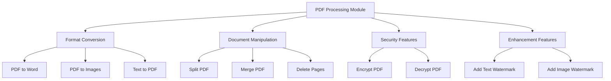
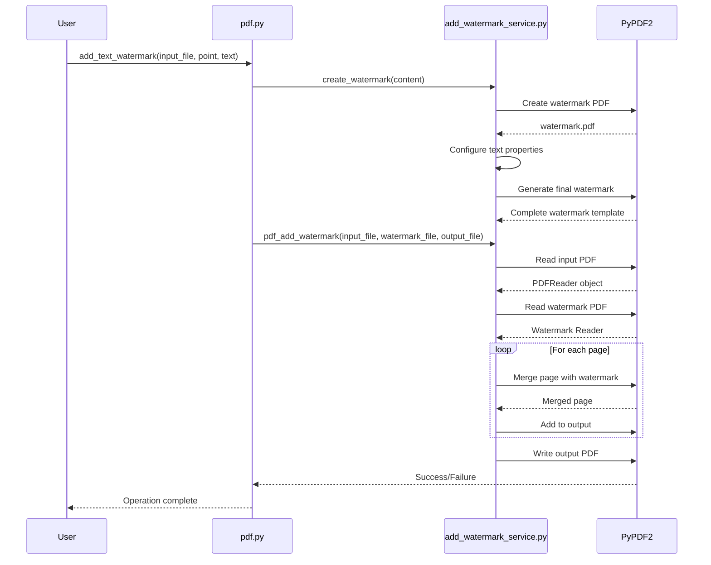
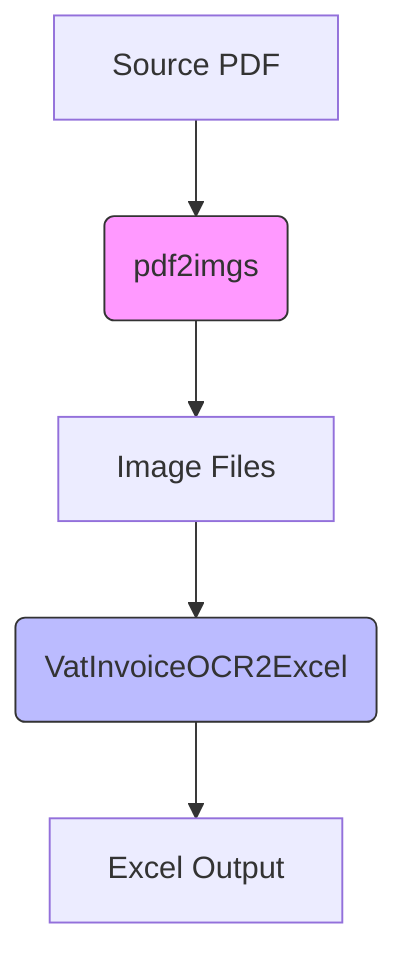
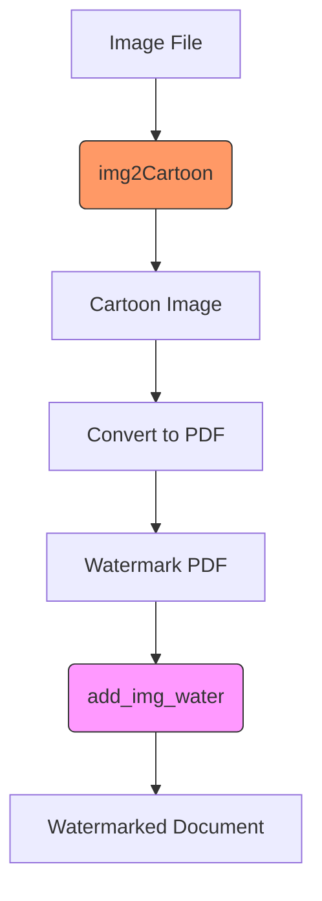

# PDF Processing (popdf)

<cite>
**Referenced Files in This Document**   
- [pdf.py](file://office/api/pdf.py)
- [add_watermark_service.py](file://office/lib/pdf/add_watermark_service.py)
- [test_pdf.py](file://tests/test_code/test_pdf.py)
- [pdf2imgs.py](file://contributors/old_from_gitee/bob-zhao/pdf2imgs.py)
- [pdf.py](file://contributors/old_from_gitee/CNSeniorious000/pdf.py)
- [pdf转word.py](file://examples/popdf/pdf转word.py)
- [pdf转图片.py](file://examples/popdf/pdf转图片.py)
- [合并PDF.py](file://examples/popdf/合并PDF.py)
- [PDF加密.py](file://examples/popdf/PDF加密.py)
- [PDF加水印.py](file://examples/popdf/PDF加水印.py)
- [TXT转PDF.py](file://examples/popdf/TXT转PDF.py)
- [ocr.py](file://office/api/ocr.py)
- [image.py](file://office/api/image.py)
</cite>

## Table of Contents
1. [Introduction](#introduction)
2. [Core Functionality](#core-functionality)
3. [Implementation Details](#implementation-details)
4. [Integration with Other Modules](#integration-with-other-modules)
5. [Usage Examples](#usage-examples)
6. [Security Considerations](#security-considerations)
7. [Performance Optimization](#performance-optimization)
8. [Common Issues and Troubleshooting](#common-issues-and-troubleshooting)
9. [Conclusion](#conclusion)

## Introduction
The PDF processing module (popdf) in python-office provides a comprehensive suite of tools for manipulating PDF documents. This module enables users to perform various operations such as converting PDFs to other formats, splitting and merging documents, applying encryption, adding watermarks, and more. Built on top of the popdf library, this module offers a user-friendly interface for both simple and complex PDF operations, making it accessible to developers and non-technical users alike.

The module is designed to handle a wide range of PDF processing tasks with minimal code, following the "one line of code" philosophy that characterizes the python-office ecosystem. It integrates seamlessly with other modules in the package, such as OCR and image processing, enabling sophisticated document workflows.

**Section sources**
- [pdf.py](file://office/api/pdf.py#L1-L23)

## Core Functionality

The popdf module provides several key functions for PDF manipulation:

- **PDF to Word conversion**: Converts PDF documents to editable Word format
- **PDF to images conversion**: Extracts pages from PDFs as image files
- **Text to PDF conversion**: Creates PDF documents from plain text files
- **PDF splitting**: Extracts specific pages or ranges from a PDF document
- **PDF merging**: Combines multiple PDF files into a single document
- **PDF encryption/decryption**: Secures PDFs with password protection
- **Watermarking**: Adds text or image watermarks to PDF documents
- **Page deletion**: Removes specified pages from a PDF document

These functions are exposed through a clean, consistent API that follows Python best practices for parameter naming and documentation.



**Diagram sources**
- [pdf.py](file://office/api/pdf.py#L7-L16)

**Section sources**
- [pdf.py](file://office/api/pdf.py#L7-L16)

## Implementation Details

### PDF Conversion Functions

The module implements conversion functions that leverage external libraries to handle the complex task of format transformation. The `pdf2docx` function converts PDF documents to Word format, preserving text content and basic formatting. This function relies on the popdf library to perform the actual conversion, acting as a wrapper that provides a simplified interface.

The `pdf2imgs` function converts PDF pages to image files, with an option to merge all pages into a single image. This functionality is particularly useful for creating thumbnails or for OCR processing. The implementation uses pdf2image as a backend, which in turn relies on Poppler to render PDF pages as images.

The `txt2pdf` function creates PDF documents from plain text files, providing a simple way to generate formatted documents from unstructured text. This function uses reportlab to generate the PDF output, allowing for basic text formatting and layout control.

### Document Manipulation Functions

The document manipulation functions are built around PyPDF2, a pure Python library for working with PDF files. The `split4pdf` function extracts a range of pages from a source PDF, while `merge2pdf` combines multiple PDF files into a single document. Both functions use PyPDF2's PdfReader and PdfWriter classes to read and write PDF content.

The `del4pdf` function removes specified pages from a PDF document by creating a new document that excludes the pages listed in the page_nums parameter. This function iterates through the source document's pages, adding all pages except those specified for deletion to the output document.

### Security Features

The security features of the module are implemented through PyPDF2's encryption capabilities. The `encrypt4pdf` function applies password protection to PDF files, supporting both user and owner passwords with configurable permissions. The function can process single files or entire directories when provided with input_path and output_path parameters.

The `decrypt4pdf` function removes password protection from encrypted PDF files. It handles both single file and batch processing scenarios, with appropriate error handling for incorrect passwords. The implementation includes interactive password prompting when processing encrypted files without a provided password.

### Watermarking Implementation

The watermarking functionality is implemented in the `add_watermark_service.py` file, which provides two key functions: `create_watermark` and `pdf_add_watermark`. The `create_watermark` function generates a PDF template containing the watermark text, using reportlab to create a semi-transparent, rotated text element.

The `pdf_add_watermark` function applies the watermark to each page of the input PDF by merging the watermark template with each page. This is accomplished using PyPDF2's page merging capabilities, which overlay the watermark PDF on top of each source page. The function includes compression of content streams to minimize file size growth.



**Diagram sources**
- [add_watermark_service.py](file://office/lib/pdf/add_watermark_service.py#L10-L73)
- [pdf.py](file://office/api/pdf.py#L133-L153)

**Section sources**
- [add_watermark_service.py](file://office/lib/pdf/add_watermark_service.py#L10-L73)
- [pdf.py](file://office/api/pdf.py#L28-L226)

## Integration with Other Modules

### OCR Module Integration

The popdf module integrates with the OCR functionality through shared document processing workflows. While the modules are implemented separately, they can be combined to create powerful document processing pipelines. For example, a PDF can be converted to images using `pdf2imgs`, and then the resulting images can be processed with OCR functions to extract text content.

The OCR module (`ocr.py`) provides functions like `VatInvoiceOCR2Excel` that can process image files, making it compatible with the output of PDF-to-image conversion. This integration enables users to extract structured data from scanned documents or PDFs with image-based content.



**Diagram sources**
- [pdf.py](file://office/api/pdf.py#L43-L57)
- [ocr.py](file://office/api/ocr.py#L6-L29)

### Image Module Integration

The image processing module (`image.py`) shares common functionality with the PDF module, particularly in the area of watermarking. Both modules provide watermarking capabilities, with the PDF module focusing on document-level watermarks and the image module handling image file watermarks.

The integration between these modules allows for sophisticated document enhancement workflows. For example, an image can be processed with effects like cartoonization or pencil sketch using the image module, and then used as a watermark in a PDF document. The `add_img_water` function specifically enables the use of PDF files as watermarks for other PDF documents.



**Diagram sources**
- [image.py](file://office/api/image.py#L58-L73)
- [pdf.py](file://office/api/pdf.py#L186-L187)

**Section sources**
- [image.py](file://office/api/image.py#L1-L153)
- [pdf.py](file://office/api/pdf.py#L1-L226)

## Usage Examples

### PDF to Word Conversion

The `pdf2docx` function provides a simple interface for converting PDF documents to Word format. Users need only specify the input PDF file and the output directory.

```python
import office

office.pdf.pdf2docx(
    file_path=r'D:\pdf\程序员晚枫.pdf',
    output_path=r'D:\download'
)
```

**Section sources**
- [pdf转word.py](file://examples/popdf/pdf转word.py#L1-L36)

### PDF to Images Conversion

Converting PDFs to images is accomplished with the `pdf2imgs` function, which extracts each page as a separate image file.

```python
import office

office.pdf.pdf2imgs(
    pdf_path='D://程序员晚枫的文件夹//程序员晚枫.pdf',
    out_dir='./点赞+关注文件夹'
)
```

**Section sources**
- [pdf转图片.py](file://examples/popdf/pdf转图片.py#L1-L13)

### Merging PDF Files

Multiple PDF files can be combined into a single document using the `merge2pdf` function.

```python
import office

office.pdf.merge2pdf(
    one_by_one=['程序员晚枫.pdf', '一键三连.pdf'], 
    output='走起.pdf'
)
```

**Section sources**
- [合并PDF.py](file://examples/popdf/合并PDF.py#L1-L25)

### PDF Encryption

The `encrypt4pdf` function secures PDF files with password protection.

```python
import office

office.pdf.encrypt4pdf(
    path='./test_files/encrypt4pdf/程序员晚枫（作品合集）.pdf',
    password='你想添加的密码'
)
```

**Section sources**
- [PDF加密.py](file://examples/popdf/PDF加密.py#L1-L27)

### Adding Watermarks

Text watermarks can be added to PDF documents using the `add_mark` function.

```python
import office

office.pdf.add_mark(
    pdf_file=r'./test_files/add_mark/程序员晚枫（没加水印）.pdf', 
    mark_str='程序员晚枫',
    output_path=r'./test_files/add_mark/output', 
    output_file_name='程序员晚枫（加了水印）.pdf'
)
```

**Section sources**
- [PDF加水印.py](file://examples/popdf/PDF加水印.py#L1-L7)

### Text to PDF Conversion

Plain text files can be converted to PDF format with the `txt2pdf` function.

```python
import office

office.pdf.txt2pdf(
    path=r'./test_files/txt2pdf/程序员晚枫.txt', 
    res_pdf='txt2pdf.popdf', 
    output_path=r'./test_files/txt2pdf/output'
)
```

**Section sources**
- [TXT转PDF.py](file://examples/popdf/TXT转PDF.py#L1-L7)

## Security Considerations

### PDF Encryption Implementation

The encryption functionality in the popdf module uses PyPDF2's built-in encryption methods, which implement the standard PDF encryption algorithms. When a PDF is encrypted, the module can apply both user and owner passwords with different permission levels.

The user password restricts opening the document, while the owner password controls permissions such as printing, editing, and copying content. The implementation supports both RC4 and AES encryption algorithms, with key lengths of 40, 128, or 256 bits depending on the PDF version and security requirements.

### Password Handling

The module handles passwords securely by avoiding logging or displaying them in plain text. When processing encrypted files without a provided password, the implementation prompts the user interactively rather than storing passwords in configuration files or command-line arguments.

For batch processing of encrypted files, users are encouraged to use secure credential management practices, such as environment variables or encrypted configuration files, rather than hardcoding passwords in scripts.

### Watermark Security

While watermarks provide a visual indication of document ownership or status, they should not be considered a robust security measure. The current implementation creates watermarks as part of the PDF content, which can be removed by users with appropriate tools and permissions.

For documents requiring stronger protection against unauthorized use, the module should be used in conjunction with PDF encryption and access control features rather than relying solely on watermarks.

**Section sources**
- [pdf.py](file://office/api/pdf.py#L92-L131)
- [add_watermark_service.py](file://office/lib/pdf/add_watermark_service.py#L34-L73)

## Performance Optimization

### Batch Processing

The module supports batch processing for several operations, particularly encryption and decryption. When processing multiple files, it's more efficient to use the input_path and output_path parameters rather than calling the function repeatedly for individual files.

This approach reduces the overhead of initializing the PDF processing engine for each file and allows for better resource management. The batch processing functions automatically iterate through all PDF files in the specified directory, applying the requested operation to each file.

### Memory Management

PDF processing can be memory-intensive, especially for large documents or batch operations. The implementation includes several memory management strategies:

- Using PdfReader in non-strict mode to reduce memory overhead
- Compressing content streams when adding watermarks or modifying pages
- Closing file handles promptly after processing
- Using generators where appropriate to avoid loading entire documents into memory

For processing very large PDF files, users are advised to ensure sufficient system memory and to process files in smaller batches when possible.

### Processing Large Documents

When working with large PDF files, performance can be optimized by:

- Using solid-state drives for input and output operations
- Ensuring adequate RAM to handle document buffering
- Processing files during periods of low system activity
- Monitoring system resources during batch operations

The module does not currently support streaming processing for very large files, so memory requirements scale with document size.

**Section sources**
- [pdf.py](file://office/api/pdf.py#L92-L131)
- [add_watermark_service.py](file://office/lib/pdf/add_watermark_service.py#L46-L71)

## Common Issues and Troubleshooting

### Text Extraction Accuracy

When converting PDFs to other formats, text extraction accuracy can vary depending on the source document. Scanned documents or PDFs with complex layouts may not convert perfectly, as the module relies on the underlying text extraction capabilities of the popdf library.

For documents with poor text extraction results, users can:
- Convert the PDF to images first, then use OCR to extract text
- Manually correct the output in the target format
- Use specialized PDF conversion tools for complex layouts

### Image Quality Degradation

Converting PDFs to images may result in quality degradation, particularly when the output resolution is not properly configured. The default settings may produce images that are too low resolution for certain use cases.

To maintain image quality:
- Ensure adequate DPI settings in the conversion process
- Use lossless image formats (PNG) when quality is critical
- Avoid multiple conversion cycles between formats

### Font Substitution

When converting PDFs to other formats or creating PDFs from text, font substitution may occur if the requested fonts are not available on the system. This can affect document appearance and layout.

To minimize font substitution issues:
- Use standard, widely-available fonts when possible
- Embed fonts in PDF documents when creating them
- Test document appearance on different systems

### Handling Encrypted Files

When processing encrypted PDF files without the correct password, the module will fail to read the content. The error handling provides clear feedback about authentication failures, but users must ensure they have the correct credentials before processing.

For files with unknown passwords, there is no recovery mechanism in the module, as this would compromise the security purpose of encryption.

**Section sources**
- [test_pdf.py](file://tests/test_code/test_pdf.py#L1-L104)
- [pdf.py](file://office/api/pdf.py#L50-L56)

## Conclusion

The PDF processing module in python-office provides a comprehensive set of tools for manipulating PDF documents with minimal code. By wrapping powerful underlying libraries like PyPDF2, pdf2image, and reportlab, it offers an accessible interface for common PDF operations while maintaining the flexibility needed for more complex workflows.

The module's integration with other components of the python-office ecosystem, particularly the OCR and image processing modules, enables sophisticated document processing pipelines that can handle a wide range of business and personal use cases.

While the current implementation covers the most common PDF manipulation needs, users working with highly specialized PDF features or requiring advanced text extraction capabilities may need to supplement with additional tools or libraries. However, for the majority of PDF processing tasks, the popdf module provides a reliable, easy-to-use solution that aligns with the python-office philosophy of simplicity and practicality.