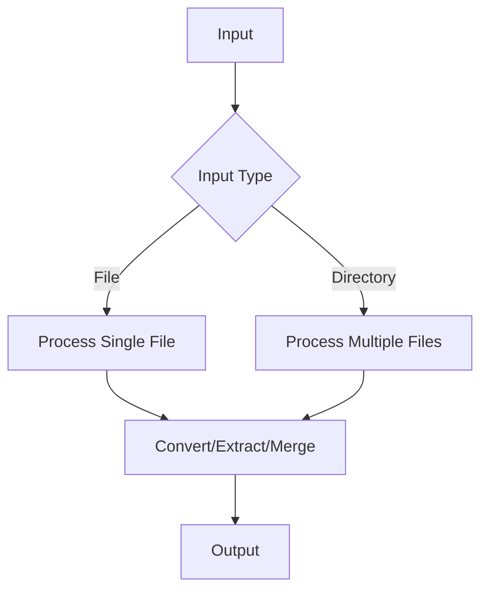
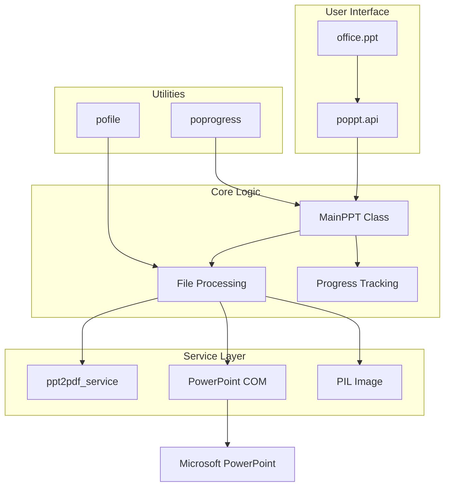
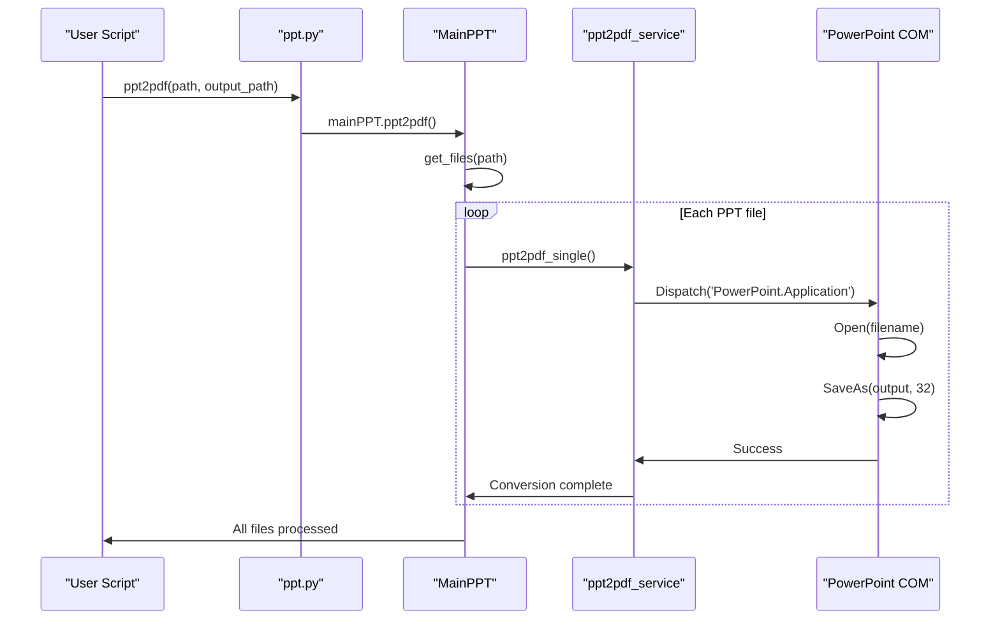
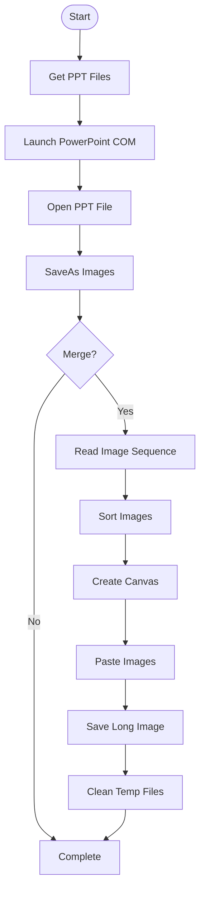
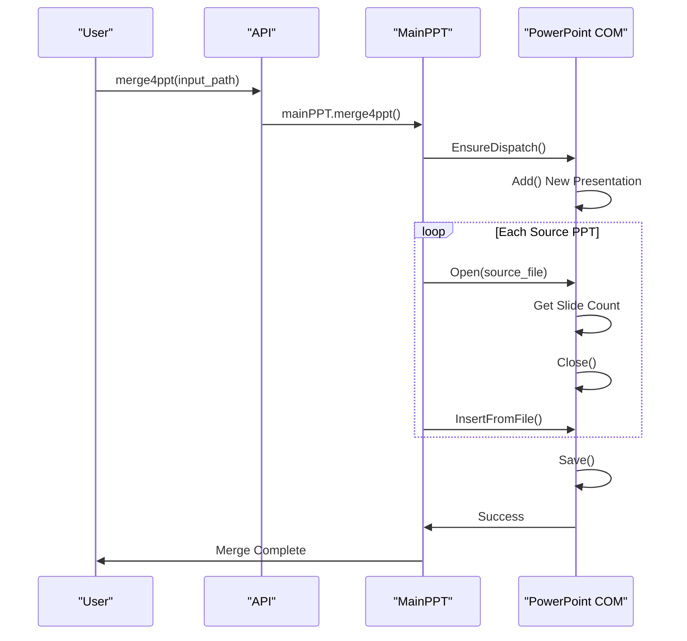
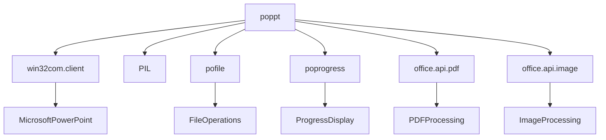

# PPT Processing (poppt)

<cite>
**Referenced Files in This Document**   
- [ppt.py](file://office/api/ppt.py)
- [ppt2pdf_service.py](file://office/lib/ppt/ppt2pdf_service.py)
- [PPTType.py](file://venv/Lib/site-packages/poppt/core/PPTType.py)
- [ppt2pdf.py](file://examples/poppt/ppt2pdf.py)
- [ppt2img.py](file://examples/poppt/ppt2img.py)
- [merge4ppt.py](file://examples/poppt/merge4ppt.py)
- [test_ppt.py](file://tests/test_code/test_ppt.py)
</cite>

## Table of Contents
1. [Introduction](#introduction)
2. [Core Functionality](#core-functionality)
3. [Architecture Overview](#architecture-overview)
4. [Detailed Component Analysis](#detailed-component-analysis)
5. [Dependency Analysis](#dependency-analysis)
6. [Performance Considerations](#performance-considerations)
7. [Troubleshooting Guide](#troubleshooting-guide)
8. [Conclusion](#conclusion)

## Introduction
The PPT processing module (poppt) in python-office provides comprehensive automation capabilities for Microsoft PowerPoint files. This module enables users to convert presentations to PDF format, extract slides as images, and merge multiple presentations into a single file. Built on Windows COM automation through win32com.client, the module leverages Microsoft PowerPoint's native rendering engine to ensure high-fidelity conversion of complex presentations while preserving formatting, fonts, and layout integrity.

**Section sources**
- [ppt.py](file://office/api/ppt.py#L1-L46)

## Core Functionality

The poppt module offers three primary functions for PowerPoint automation:

1. **PPT to PDF Conversion**: Converts PPT/PPTX files to PDF format using PowerPoint's built-in export functionality
2. **PPT to Image Conversion**: Extracts individual slides as image files or combines them into a single long image
3. **Presentation Merging**: Combines multiple PPT/PPTX files into a single presentation

These functions support both single file and batch processing, accepting either individual file paths or directory paths as input. The module handles various PowerPoint versions (PPT and PPTX) transparently, providing a unified interface for different presentation formats.

**Diagram sources**
- [PPTType.py](file://venv/Lib/site-packages/poppt/core/PPTType.py#L21-L121)

**Section sources**
- [ppt.py](file://office/api/ppt.py#L7-L45)

## Architecture Overview

The PPT processing module follows a layered architecture with clear separation between API interfaces, business logic, and service implementations. The design pattern follows a facade pattern where high-level functions expose simplified interfaces while encapsulating complex operations.

**Diagram sources**
- [ppt.py](file://office/api/ppt.py#L4)
- [PPTType.py](file://venv/Lib/site-packages/poppt/core/PPTType.py#L13-L121)
- [ppt2pdf_service.py](file://office/lib/ppt/ppt2pdf_service.py#L12-L34)

## Detailed Component Analysis

### PPT to PDF Conversion
The PPT to PDF functionality uses Microsoft PowerPoint's COM interface to open and export presentations. The process involves launching the PowerPoint application, opening the source file, and using the SaveAs method with format code 32 (PDF format). This approach ensures that all formatting, fonts, and layout elements are preserved during conversion, as the native PowerPoint engine handles the rendering.

The implementation supports batch processing by iterating through all files in a directory and applying the conversion to files with .ppt or .pptx extensions. Output filenames are automatically generated by replacing the source extension with .pdf.

#### Implementation Flow

**Diagram sources**
- [ppt.py](file://office/api/ppt.py#L7-L17)
- [PPTType.py](file://venv/Lib/site-packages/poppt/core/PPTType.py#L21-L35)
- [ppt2pdf_service.py](file://office/lib/ppt/ppt2pdf_service.py#L12-L34)

**Section sources**
- [ppt.py](file://office/api/ppt.py#L7-L17)
- [PPTType.py](file://venv/Lib/site-packages/poppt/core/PPTType.py#L21-L35)
- [ppt2pdf_service.py](file://office/lib/ppt/ppt2pdf_service.py#L12-L34)

### PPT to Image Conversion
The image conversion functionality extracts slides as individual image files or combines them into a single long image. The process uses PowerPoint's SaveAs method with format code 17 (JPG format) to export each slide. For long image generation, the module first exports all slides as separate images, then uses PIL (Python Imaging Library) to concatenate them vertically into a single image.

The merge parameter controls whether individual slide images are preserved (merge=False) or combined and deleted (merge=True). When merging, the module creates a temporary directory for each presentation, processes the slides, generates the long image, and cleans up intermediate files.

#### Image Processing Workflow

**Diagram sources**
- [PPTType.py](file://venv/Lib/site-packages/poppt/core/PPTType.py#L60-L121)

**Section sources**
- [ppt.py](file://office/api/ppt.py#L20-L31)
- [PPTType.py](file://venv/Lib/site-packages/poppt/core/PPTType.py#L60-L121)

### Presentation Merging
The merge functionality combines multiple PowerPoint presentations into a single file. The process creates a new presentation and inserts slides from source files using the InsertFromFile method. This approach preserves the original slide formatting, animations, and transitions from each source presentation.

The implementation iterates through all PPT files in the input directory, opens each file to determine the number of slides, and inserts them into the target presentation. The resulting merged presentation maintains the slide order from the source files and preserves all embedded objects and multimedia elements.

#### Merge Process Sequence

**Diagram sources**
- [PPTType.py](file://venv/Lib/site-packages/poppt/core/PPTType.py#L36-L58)

**Section sources**
- [ppt.py](file://office/api/ppt.py#L34-L45)
- [PPTType.py](file://venv/Lib/site-packages/poppt/core/PPTType.py#L36-L58)

## Dependency Analysis

The PPT processing module relies on several key dependencies and integrates with other modules in the python-office ecosystem:

The module has a strong dependency on Microsoft PowerPoint being installed on the system, as it uses COM automation to control the application. This ensures high-fidelity rendering but limits cross-platform compatibility to Windows systems with PowerPoint installed.

The integration with pofile enables robust file system operations, including recursive file searching and directory creation. The poprogress dependency provides visual feedback during long-running operations, enhancing user experience for batch processing tasks.

**Diagram sources**
- [ppt.py](file://office/api/ppt.py#L4)
- [PPTType.py](file://venv/Lib/site-packages/poppt/core/PPTType.py#L7-L8)
- [ppt2pdf_service.py](file://office/lib/ppt/ppt2pdf_service.py#L8)

**Section sources**
- [PPTType.py](file://venv/Lib/site-packages/poppt/core/PPTType.py#L7-L8)
- [ppt2pdf_service.py](file://office/lib/ppt/ppt2pdf_service.py#L8)

## Performance Considerations

The PPT processing module is designed to handle large presentations and batch operations efficiently. However, several performance considerations should be noted:

1. **Memory Management**: Each operation launches the PowerPoint application, which can consume significant memory, especially when processing large presentations. The application is properly closed after each operation to release resources.

2. **Batch Processing**: The module processes files sequentially rather than in parallel, as PowerPoint COM automation is not thread-safe. This ensures stability but limits throughput for large batches.

3. **Progress Tracking**: The integration with poprogress provides real-time feedback during operations, helping users estimate completion time for long-running tasks.

4. **Temporary Files**: The image merging functionality creates temporary directories and files, which are cleaned up after processing. This prevents disk space issues during extended operations.

For optimal performance with large presentations, it is recommended to ensure sufficient system memory and to process files in smaller batches when possible.

**Section sources**
- [PPTType.py](file://venv/Lib/site-packages/poppt/core/PPTType.py#L28-L34)
- [PPTType.py](file://venv/Lib/site-packages/poppt/core/PPTType.py#L51-L58)

## Troubleshooting Guide

Common issues and their solutions when using the PPT processing module:

1. **PowerPoint Not Installed**: The module requires Microsoft PowerPoint to be installed on the system. Without PowerPoint, COM automation fails with "Class not registered" errors.

2. **File Path Issues**: Ensure that input and output paths are correctly specified and accessible. Use raw strings (r'path') or forward slashes to avoid escape character issues.

3. **Permission Errors**: Running the script in directories where write permissions are restricted can cause output failures. Ensure the output directory is writable.

4. **Font Substitution**: If source presentations use fonts not available on the system, PowerPoint may substitute them, potentially affecting layout. Install required fonts to maintain visual fidelity.

5. **Large File Performance**: Very large presentations may take significant time to process. Monitor system resources and consider breaking large presentations into smaller sections.

6. **COM Registration Issues**: In some environments, the PowerPoint COM interface may not be properly registered. Running the script with administrative privileges or repairing Office installation can resolve this.

The test suite in test_ppt.py provides validation for core functionality and can be used to verify proper operation in your environment.

**Section sources**
- [test_ppt.py](file://tests/test_code/test_ppt.py#L1-L26)
- [ppt2pdf_service.py](file://office/lib/ppt/ppt2pdf_service.py#L20-L31)

## Conclusion

The PPT processing module in python-office provides robust automation capabilities for PowerPoint files through a simple, intuitive interface. By leveraging Microsoft PowerPoint's native rendering engine via COM automation, the module ensures high-fidelity conversion and manipulation of presentations while preserving formatting, fonts, and layout integrity.

The architecture follows a clean separation of concerns, with well-defined layers for API, business logic, and service implementation. This design enables easy maintenance and extension of functionality. The integration with other python-office modules creates a comprehensive office automation ecosystem.

While the dependency on Microsoft PowerPoint limits cross-platform compatibility, it ensures reliable processing of complex presentations with advanced features like animations, transitions, and embedded objects. For Windows environments with PowerPoint installed, the module offers a powerful solution for automating repetitive PPT tasks at scale.