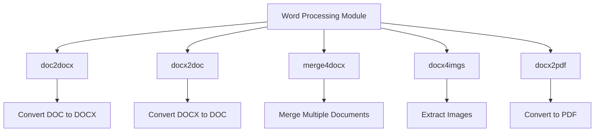
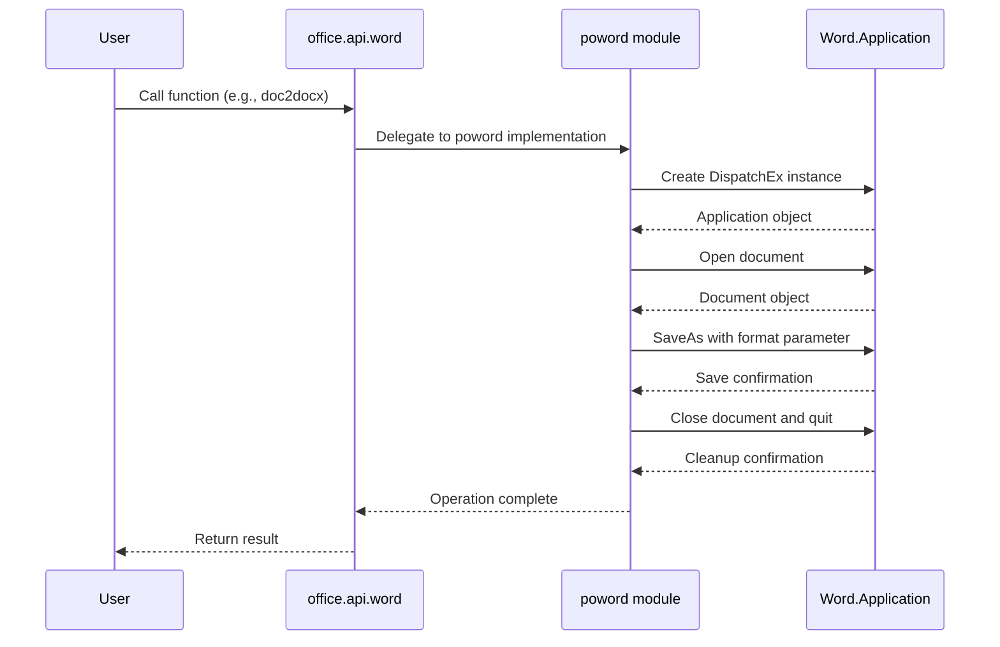
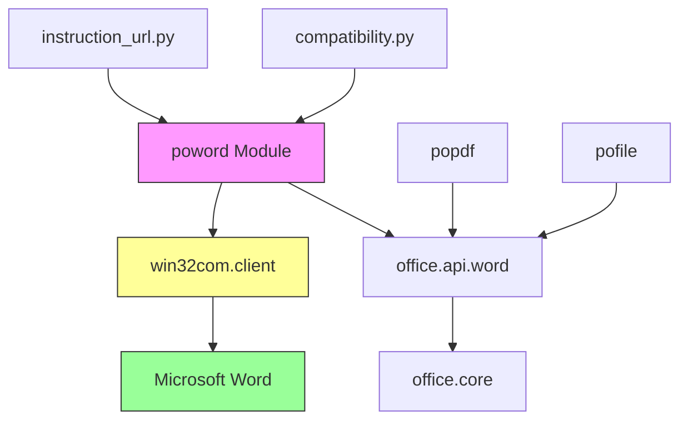

# Word Processing (poword)

<cite>
**Referenced Files in This Document**   
- [word.py](file://office/api/word.py)
- [doc2docx.py](file://contributors/CatchDr/doc2docx.py)
- [docx2doc.py](file://contributors/CatchDr/docx2doc.py)
- [WordType.py](file://contributors/demo/WordType.py)
- [test_word.py](file://tests/test_code/test_word.py)
- [compatibility.py](file://office/compatibility.py)
- [instruction_url.py](file://office/lib/decorator_utils/instruction_url.py)
</cite>

## Table of Contents
1. [Introduction](#introduction)
2. [Core Functionality](#core-functionality)
3. [Implementation Details](#implementation-details)
4. [File Format Conversion](#file-format-conversion)
5. [Document Merging](#document-merging)
6. [Image Extraction](#image-extraction)
7. [PDF Conversion](#pdf-conversion)
8. [Integration with Other Modules](#integration-with-other-modules)
9. [Compatibility and Limitations](#compatibility-and-limitations)
10. [Error Handling and Troubleshooting](#error-handling-and-troubleshooting)
11. [Performance Considerations](#performance-considerations)
12. [Best Practices](#best-practices)

## Introduction
The Word Processing module (poword) in python-office provides a comprehensive set of tools for automating Microsoft Word document operations. This module enables users to perform various Word document manipulations with minimal code, following the project's philosophy of solving automation tasks with single-line commands. The poword module leverages Windows COM automation through the win32com library to interact with Microsoft Word applications, allowing for robust document processing capabilities including format conversion, document merging, image extraction, and PDF conversion. As a Windows-only solution, it requires Microsoft Word to be installed on the system for full functionality.

**Section sources**
- [word.py](file://office/api/word.py#L1-L71)
- [compatibility.py](file://office/compatibility.py#L62-L64)

## Core Functionality
The poword module offers five primary functions for Word document processing: converting between .doc and .docx formats, merging multiple Word documents, extracting images from Word files, and converting Word documents to PDF. These functions are exposed through the office.api.word interface, which acts as a wrapper that imports and delegates operations to the underlying poword implementation. The API design follows a consistent pattern with clear parameter definitions for input paths, output paths, and optional configuration parameters. Each function is designed to handle both single files and batch processing of directories, making it suitable for various automation scenarios.

**Diagram sources**
- [word.py](file://office/api/word.py#L34-L60)
- [doc2docx.py](file://contributors/CatchDr/doc2docx.py#L36-L68)
- [docx2doc.py](file://contributors/CatchDr/docx2doc.py#L40-L74)

**Section sources**
- [word.py](file://office/api/word.py#L1-L71)

## Implementation Details
The poword module implements Word document processing through Windows COM automation using the win32com.client library. This approach directly interfaces with the Microsoft Word application, enabling reliable format conversions and document manipulations that maintain formatting integrity. The implementation creates a Word.Application object using DispatchEx, opens the source document, and uses the SaveAs method with specific FileFormat parameters to convert between formats. For .doc to .docx conversion, FileFormat=12 is used, while .docx to .doc conversion uses FileFormat=11. The module handles both individual files and directory processing, recursively searching for files with specified extensions. Error handling includes path validation and proper cleanup of Word application instances after processing.

**Diagram sources**
- [doc2docx.py](file://contributors/CatchDr/doc2docx.py#L29-L33)
- [docx2doc.py](file://contributors/CatchDr/docx2doc.py#L33-L37)
- [word.py](file://office/api/word.py#L3-L60)

**Section sources**
- [doc2docx.py](file://contributors/CatchDr/doc2docx.py#L1-L69)
- [docx2doc.py](file://contributors/CatchDr/docx2doc.py#L1-L74)

## File Format Conversion
The poword module provides bidirectional conversion between .doc and .docx formats through the doc2docx and docx2doc functions. The conversion process uses Microsoft Word's native save functionality via COM automation, ensuring high fidelity in preserving document formatting, styles, and content. The doc2docx function converts legacy .doc files to the modern .docx format (Office Open XML), while docx2doc performs the reverse operation. Both functions support processing single files or entire directories, automatically detecting files with the appropriate extensions. The implementation handles path normalization and creates output directories as needed. When no output path is specified, the converted files are saved in the current directory with the same base name as the source file.

**Section sources**
- [word.py](file://office/api/word.py#L34-L45)
- [doc2docx.py](file://contributors/CatchDr/doc2docx.py#L36-L68)
- [docx2doc.py](file://contributors/CatchDr/docx2doc.py#L40-L74)

## Document Merging
The merge4docx function enables combining multiple Word documents into a single file. This functionality is particularly useful for consolidating reports, proposals, or other documents that need to be presented as a unified file. The implementation processes input files in alphabetical order by default, maintaining the sequence of content from each source document. The function accepts both individual file paths and directory paths as input, automatically identifying .docx files for merging. Users can specify a custom name for the output file, with a default name of 'merge4docx.docx' if none is provided. The merging process preserves the formatting and structure of each individual document, inserting them sequentially in the output file.

**Section sources**
- [word.py](file://office/api/word.py#L20-L31)
- [test_word.py](file://tests/test_code/test_word.py#L17-L32)

## Image Extraction
The docx4imgs function extracts images embedded in Word documents and saves them to a specified location. When processing a document, the function creates a subdirectory named after the source document within the specified output path, organizing extracted images systematically. This feature is valuable for recovering visual assets from documents or analyzing image content. The extraction process leverages the underlying Word application's ability to access document elements, ensuring that all image types supported by Word are properly extracted. The function handles various image formats including JPEG, PNG, GIF, and EMF, preserving the original quality and format of the extracted images.

**Section sources**
- [word.py](file://office/api/word.py#L61-L71)

## PDF Conversion
The docx2pdf function converts Word documents to PDF format, supporting both single files and batch processing of directories. This conversion uses Microsoft Word's built-in PDF export capabilities, ensuring high-quality output with accurate rendering of complex layouts, fonts, and graphics. The function accepts an optional output_path parameter, creating the destination directory if it doesn't exist. When no output path is specified, the PDF files are saved in the same location as the source documents. The implementation maintains document formatting, hyperlinks, and metadata during conversion, producing professional-quality PDFs suitable for sharing and archiving. This functionality is particularly useful for creating standardized document outputs or preparing files for digital distribution.

**Section sources**
- [word.py](file://office/api/word.py#L6-L18)
- [test_word.py](file://tests/test_code/test_word.py#L17-L18)
- [WordType.py](file://contributors/demo/WordType.py#L21-L47)

## Integration with Other Modules
The poword module integrates with other components in the python-office ecosystem through the unified office.api interface. It shares common patterns with modules like popdf and pofile for file path handling and error reporting. The instruction_url.py decorator in the office.lib.decorator_utils package provides consistent documentation links across all modules, including poword functions. The compatibility.py module explicitly identifies poword as a Windows-only feature that requires Microsoft Word, aligning with similar dependencies in the poppt module. This integration ensures a consistent user experience across different automation tasks while acknowledging platform-specific requirements.

**Diagram sources**
- [word.py](file://office/api/word.py#L3-L71)
- [compatibility.py](file://office/compatibility.py#L62-L64)
- [instruction_url.py](file://office/lib/decorator_utils/instruction_url.py#L113-L115)

**Section sources**
- [word.py](file://office/api/word.py#L1-L71)
- [compatibility.py](file://office/compatibility.py#L40-L198)
- [instruction_url.py](file://office/lib/decorator_utils/instruction_url.py#L118-L130)

## Compatibility and Limitations
The poword module has specific compatibility requirements and limitations that users must consider. As documented in the compatibility.py file, this module is Windows-only and requires Microsoft Word to be installed on the system. This dependency limits its use in cross-platform environments or server-based applications without Word installation. The reliance on COM automation means that the module requires a graphical Windows environment and may not work in headless server configurations. Additionally, the conversion quality depends on the version of Microsoft Word installed, with older versions potentially having limited support for modern document features. Users should also be aware that processing large documents or high volumes of files may trigger Word's stability protections or require significant system resources.

**Section sources**
- [compatibility.py](file://office/compatibility.py#L62-L64)
- [word.py](file://office/api/word.py#L3-L71)

## Error Handling and Troubleshooting
The poword module implements basic error handling for common issues such as invalid file paths and missing source files. The implementation includes checks for path existence before attempting document operations, providing clear error messages when files or directories cannot be found. Resource management is handled through proper cleanup of Word application instances after processing completes. However, the module has limited error recovery capabilities, particularly for issues related to Word application crashes or document corruption. Users may encounter COM exceptions if Word is not properly installed or configured. For troubleshooting, the test_word.py file provides example usage patterns and expected behavior, serving as a reference for correct function calls and parameter configurations.

**Section sources**
- [doc2docx.py](file://contributors/CatchDr/doc2docx.py#L45-L47)
- [docx2doc.py](file://contributors/CatchDr/docx2doc.py#L52-L54)
- [test_word.py](file://tests/test_code/test_word.py#L17-L32)

## Performance Considerations
Processing Word documents through COM automation involves performance considerations that users should understand. Each document operation requires launching the Word application, which incurs startup overhead. For batch processing, this means that processing multiple files sequentially will have cumulative startup costs. The memory usage scales with document complexity and size, with large documents containing many images or complex formatting requiring significant RAM. Users should avoid processing extremely large documents or high volumes of files in single operations to prevent memory exhaustion. The module does not implement parallel processing, so operations are executed synchronously. For optimal performance, it's recommended to process files in smaller batches and ensure adequate system resources are available during execution.

**Section sources**
- [doc2docx.py](file://contributors/CatchDr/doc2docx.py#L29-L33)
- [docx2doc.py](file://contributors/CatchDr/docx2doc.py#L33-L37)

## Best Practices
When using the poword module, several best practices should be followed to ensure reliable operation. Always verify that Microsoft Word is installed and properly licensed on the system before attempting document operations. Use absolute paths when specifying input and output locations to avoid ambiguity. For batch operations, consider the system resources available and process files in manageable batches rather than all at once. Regularly monitor system memory usage, especially when processing large documents. Keep Microsoft Word updated to ensure compatibility with modern document formats and improved stability. When automating document processing, implement error handling around poword function calls to gracefully handle potential COM exceptions. Finally, test conversion operations with sample documents before processing critical files to verify formatting integrity.

**Section sources**
- [word.py](file://office/api/word.py#L1-L71)
- [doc2docx.py](file://contributors/CatchDr/doc2docx.py#L1-L69)
- [docx2doc.py](file://contributors/CatchDr/docx2doc.py#L1-L74)