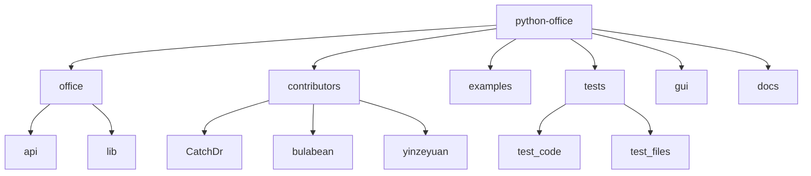
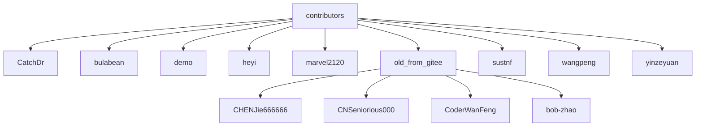
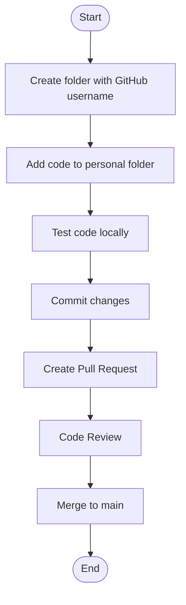
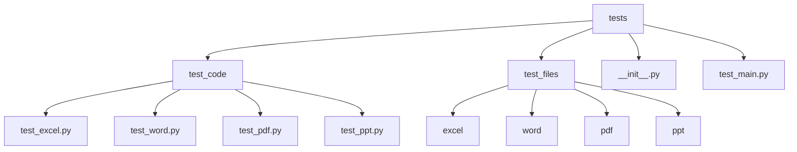
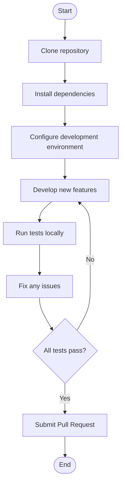

# Development and Contribution

<cite>
**Referenced Files in This Document**   
- [README.md](file://README.md)
- [setup.py](file://setup.py)
- [setup.cfg](file://setup.cfg)
- [office/__init__.py](file://office/__init__.py)
- [office/api/__init__.py](file://office/api/__init__.py)
- [tests/test_main.py](file://tests/test_main.py)
- [tests/__init__.py](file://tests/__init__.py)
- [tests/test_code/test_excel.py](file://tests/test_code/test_excel.py)
- [tests/test_code/test_word.py](file://tests/test_code/test_word.py)
- [contributors/CatchDr/doc2docx.py](file://contributors/CatchDr/doc2docx.py)
- [contributors/yinzeyuan/Rename-AddSomething.py](file://contributors/yinzeyuan/Rename-AddSomething.py)
- [examples/readme.md](file://examples/readme.md)
</cite>

## Table of Contents
1. [Introduction](#introduction)
2. [Project Structure](#project-structure)
3. [Contributors Directory Organization](#contributors-directory-organization)
4. [Adding New Features](#adding-new-features)
5. [Testing Procedures](#testing-procedures)
6. [Contribution Guidelines](#contribution-guidelines)
7. [Branch Management Strategy](#branch-management-strategy)
8. [Successful Contribution Examples](#successful-contribution-examples)
9. [Development Environment Setup](#development-environment-setup)
10. [Conclusion](#conclusion)

## Introduction
This document provides comprehensive guidance for development and contribution to the python-office project. It covers the code structure, contribution workflow, testing procedures, and development environment setup. The python-office library is a Python automation office third-party library designed to solve most automation office problems with minimal code, making it accessible even to users without extensive Python knowledge.

**Section sources**
- [README.md](file://README.md#L47-L50)

## Project Structure
The python-office repository follows a modular structure with clearly defined directories for different purposes. The main components include the office module containing the core functionality, contributors directory for community contributions, examples directory with usage demonstrations, tests directory for test cases, and documentation files.

The project structure is organized to separate core functionality from community contributions and testing code, ensuring maintainability and clear ownership of different code sections.

**Diagram sources**
- [project_structure](file://project_structure)
- [README.md](file://README.md#L123-L125)

**Section sources**
- [project_structure](file://project_structure)
- [README.md](file://README.md#L123-L125)

## Contributors Directory Organization
The contributors directory is organized by GitHub usernames, providing a clear structure for community contributions. Each contributor has their own subdirectory where they can add their code without interfering with others' work. This organization promotes independent development and prevents code conflicts.

The directory structure includes both active contributors and legacy contributions from the old_from_gitee subdirectory, preserving historical contributions while maintaining a clean main contributors structure.

**Diagram sources**
- [project_structure](file://project_structure)
- [README.md](file://README.md#L123-L125)

**Section sources**
- [project_structure](file://project_structure)
- [README.md](file://README.md#L123-L125)

## Adding New Features
To add new features to python-office, contributors should follow the PR guidelines outlined in the README. The process involves creating a personal folder in the contributors directory using their GitHub username and submitting code within this folder without modifying others' work.

The contribution workflow emphasizes isolation of changes to prevent conflicts and maintain code stability. Contributors are advised not to modify code in other folders and to address any questions about existing code through GitHub issues rather than direct modifications.

**Diagram sources**
- [README.md](file://README.md#L123-L126)
- [project_structure](file://project_structure)

**Section sources**
- [README.md](file://README.md#L123-L126)

## Testing Procedures
The testing framework in python-office is organized in the tests directory with a structured approach to unit testing. The test_code directory contains specific test files for different modules, while test_files provides sample data for testing purposes.

The testing process uses pytest as the primary testing framework, with HTML reporting capabilities for test results visualization. Test cases are organized by functionality, with separate test files for each major component of the library.

**Diagram sources**
- [project_structure](file://project_structure)
- [tests/test_main.py](file://tests/test_main.py#L13-L25)

**Section sources**
- [tests/test_main.py](file://tests/test_main.py#L13-L25)
- [tests/test_code/test_excel.py](file://tests/test_code/test_excel.py#L6-L81)

## Contribution Guidelines
The contribution guidelines for python-office emphasize code isolation, proper documentation, and adherence to coding standards. Contributors must create their own directory using their GitHub username and place all their code within this directory.

Code style requirements include proper documentation strings, type hints, and clear function descriptions. All contributions should include appropriate error handling and follow the existing code patterns in the project.

The guidelines also specify that contributors should not modify code in other directories, maintaining clear ownership and preventing conflicts between different contributors' work.

**Section sources**
- [README.md](file://README.md#L123-L126)
- [contributors/CatchDr/doc2docx.py](file://contributors/CatchDr/doc2docx.py#L1-L69)

## Branch Management Strategy
The branch management strategy for python-office uses master as the main branch for PyPI releases. This stable branch contains production-ready code that has been thoroughly tested and reviewed.

The strategy ensures that only well-tested and approved changes are included in official releases, maintaining stability for end users. Feature development and contributions are managed through pull requests, allowing for code review and testing before merging into the main branch.

This approach provides a clear separation between development and production code, ensuring that the library remains stable while still allowing for continuous improvement through community contributions.

**Section sources**
- [README.md](file://README.md#L123-L126)
- [setup.cfg](file://setup.cfg#L1-L45)

## Successful Contribution Examples
Several successful contributions demonstrate the effectiveness of the contributors directory organization. For example, CatchDr has contributed multiple file conversion utilities including doc2docx.py, ppt2pptx.py, and xls2xlsx.py, showing a focused contribution in the document conversion space.

Another example is yinzeyuan's contributions including Rename-AddSomething.py and SearchSpecifyTypeFile.py, which provide file management utilities. These contributions showcase how individual developers can add valuable functionality to the library while maintaining isolation from other code.

The bulabean contributions of SearchExcel.py and SplitExcel.py demonstrate specialized Excel processing capabilities added by a community member, highlighting the diversity of functionality that can be incorporated through this contribution model.

**Section sources**
- [contributors/CatchDr/doc2docx.py](file://contributors/CatchDr/doc2docx.py#L1-L69)
- [contributors/yinzeyuan/Rename-AddSomething.py](file://contributors/yinzeyuan/Rename-AddSomething.py#L1-L77)
- [contributors/bulabean/SearchExcel.py](file://contributors/bulabean/SearchExcel.py)
- [contributors/bulabean/SplitExcel.py](file://contributors/bulabean/SplitExcel.py)

## Development Environment Setup
To set up a development environment for python-office, contributors should first clone the repository and install the required dependencies. The setup.cfg file specifies the project dependencies, which can be installed using pip.

Before submitting a pull request, contributors should run the test suite locally to ensure their code does not break existing functionality. The test_main.py file provides the entry point for running tests, generating an HTML report for review.

The development environment should include Python 3.6 or higher, as specified in the setup.cfg file, along with the required third-party libraries listed in the install_requires section.

**Diagram sources**
- [setup.cfg](file://setup.cfg#L1-L45)
- [tests/test_main.py](file://tests/test_main.py#L13-L25)
- [README.md](file://README.md#L72-L74)

**Section sources**
- [setup.cfg](file://setup.cfg#L1-L45)
- [tests/test_main.py](file://tests/test_main.py#L13-L25)
- [README.md](file://README.md#L72-L74)

## Conclusion
The python-office project provides a well-structured framework for community contributions through its organized directory structure and clear contribution guidelines. By using the contributors directory organized by GitHub usernames, the project enables multiple developers to contribute simultaneously without conflicts.

The testing framework and development workflow ensure code quality and stability, while the branch management strategy maintains a reliable main branch for PyPI releases. This comprehensive approach to development and contribution has enabled python-office to grow its functionality while maintaining code quality and stability.

**Section sources**
- [README.md](file://README.md#L47-L148)
- [setup.cfg](file://setup.cfg#L1-L45)
- [project_structure](file://project_structure)