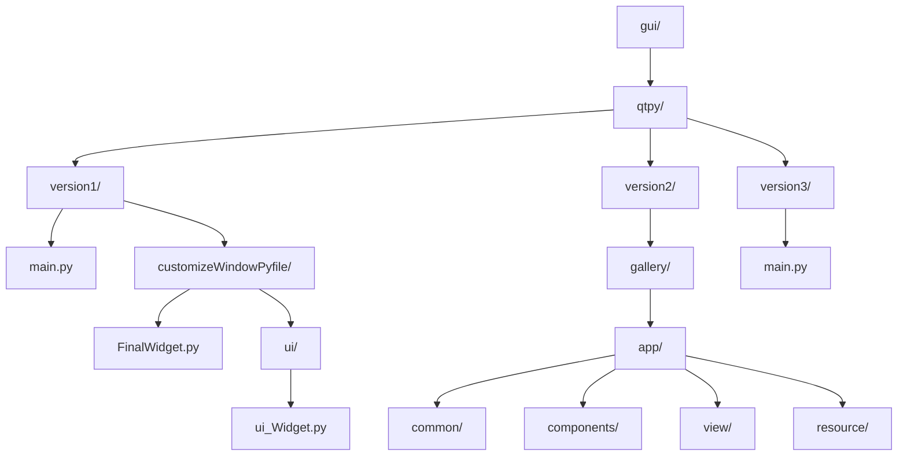
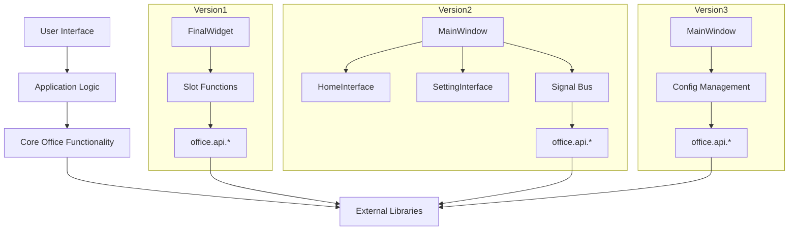
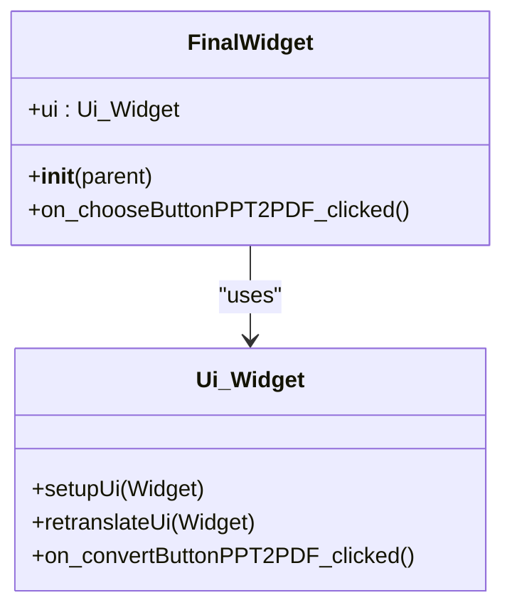
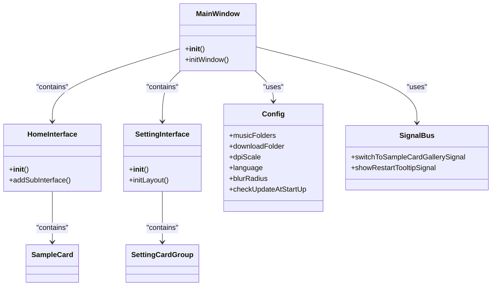
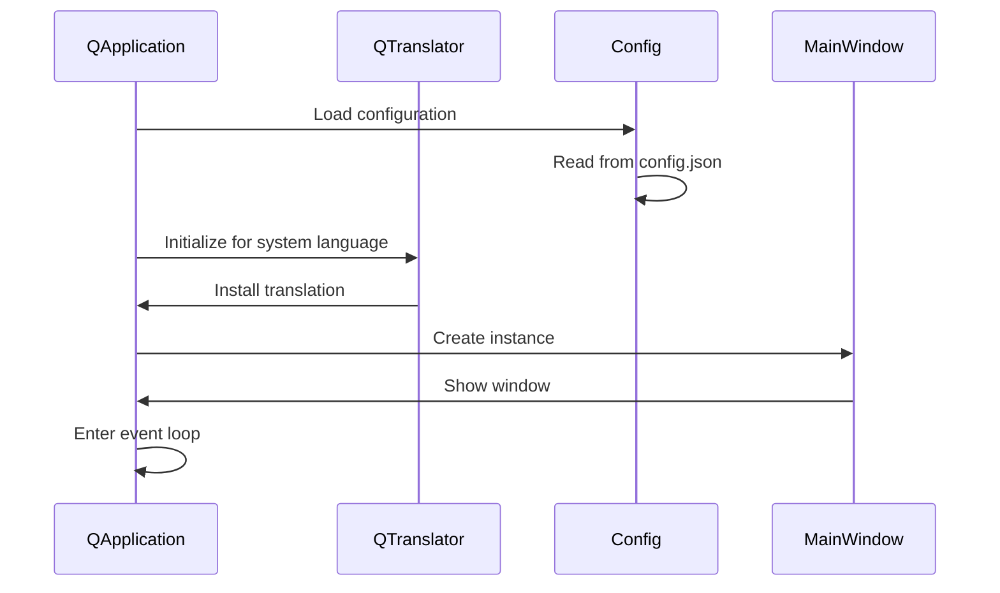
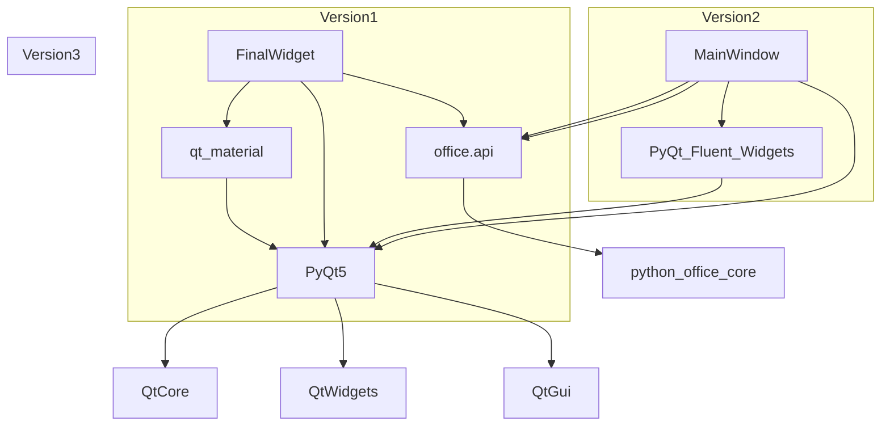

# GUI Interface

<cite>
**Referenced Files in This Document**   
- [main.py](file://gui/qtpy/version1/main.py)
- [FinalWidget.py](file://gui/qtpy/version1/customizeWindowPyfile/FinalWidget.py)
- [ui_Widget.py](file://gui/qtpy/version1/customizeWindowPyfile/ui/ui_Widget.py)
- [main.py](file://gui/qtpy/version3/main.py)
- [config.py](file://gui/qtpy/version2/gallery/app/common/config.py)
- [main_window.py](file://gui/qtpy/version2/gallery/app/view/main_window.py)
- [home_interface.py](file://gui/qtpy/version2/gallery/app/view/home_interface.py)
- [setting_interface.py](file://gui/qtpy/version2/gallery/app/view/setting_interface.py)
</cite>

## Table of Contents
1. [Introduction](#introduction)
2. [Project Structure](#project-structure)
3. [Core Components](#core-components)
4. [Architecture Overview](#architecture-overview)
5. [Detailed Component Analysis](#detailed-component-analysis)
6. [Dependency Analysis](#dependency-analysis)
7. [Performance Considerations](#performance-considerations)
8. [Troubleshooting Guide](#troubleshooting-guide)
9. [Conclusion](#conclusion)

## Introduction
The python-office GUI interface provides a user-friendly way to access various office automation functionalities through a graphical interface built with QtPy. The project implements three distinct versions of the GUI, each with different design philosophies and technology stacks, all aimed at making office automation tasks more accessible to users without programming expertise. This documentation details the visual appearance, behavior, and user interaction patterns across these versions, explaining the architectural decisions and providing guidance for users and developers.

## Project Structure
The GUI interface for python-office is organized into three separate versions within the `gui/qtpy` directory, each representing a different evolutionary stage of the interface design. The structure reflects a progression from a simple, function-focused interface to a more sophisticated, feature-rich application with modern design elements.

**Diagram sources**
- [version1/main.py](file://gui/qtpy/version1/main.py#L1-L21)
- [version2/gallery](file://gui/qtpy/version2/gallery#L1-L10)
- [version3/main.py](file://gui/qtpy/version3/main.py#L1-L56)

**Section sources**
- [gui/qtpy](file://gui/qtpy#L1-L10)

## Core Components
The python-office GUI interface consists of three main versions, each with its own architectural approach. Version 1 uses a basic QtPy implementation with material design styling, Version 2 leverages the PyQt-Fluent-Widgets library for a modern fluent design, and Version 3 appears to be a streamlined version of the fluent design approach. The core components across all versions include the main application entry point, the main window or widget class, and the UI definition files that describe the visual layout.

**Section sources**
- [version1/main.py](file://gui/qtpy/version1/main.py#L1-L21)
- [version1/FinalWidget.py](file://gui/qtpy/version1/customizeWindowPyfile/FinalWidget.py#L1-L34)
- [version1/ui_Widget.py](file://gui/qtpy/version1/customizeWindowPyfile/ui/ui_Widget.py#L1-L418)
- [version3/main.py](file://gui/qtpy/version3/main.py#L1-L56)

## Architecture Overview
The architecture of the python-office GUI applications follows a layered approach with clear separation between the presentation layer, application logic, and core functionality. The three versions represent different architectural decisions in how these layers are implemented and connected.

**Diagram sources**
- [version1/FinalWidget.py](file://gui/qtpy/version1/customizeWindowPyfile/FinalWidget.py#L1-L34)
- [version2/app/view/main_window.py](file://gui/qtpy/version2/gallery/app/view/main_window.py#L1-L10)
- [version3/main.py](file://gui/qtpy/version3/main.py#L1-L56)

## Detailed Component Analysis

### Version 1 Analysis
Version 1 of the python-office GUI represents the initial implementation with a straightforward tab-based interface. It uses a simple widget-based approach with direct connections between UI elements and functionality.

**Diagram sources**
- [version1/FinalWidget.py](file://gui/qtpy/version1/customizeWindowPyfile/FinalWidget.py#L13-L34)
- [version1/ui_Widget.py](file://gui/qtpy/version1/customizeWindowPyfile/ui/ui_Widget.py#L16-L418)

**Section sources**
- [version1/FinalWidget.py](file://gui/qtpy/version1/customizeWindowPyfile/FinalWidget.py#L1-L34)
- [version1/ui_Widget.py](file://gui/qtpy/version1/customizeWindowPyfile/ui/ui_Widget.py#L1-L418)

### Version 2 Analysis
Version 2 represents a significant architectural evolution, adopting the PyQt-Fluent-Widgets library to create a modern, fluent design interface. This version introduces a more sophisticated component structure with dedicated modules for configuration, signals, and styling.

**Diagram sources**
- [version2/app/view/main_window.py](file://gui/qtpy/version2/gallery/app/view/main_window.py#L1-L10)
- [version2/app/view/home_interface.py](file://gui/qtpy/version2/gallery/app/view/home_interface.py#L1-L10)
- [version2/app/view/setting_interface.py](file://gui/qtpy/version2/gallery/app/view/setting_interface.py#L1-L10)
- [version2/app/common/config.py](file://gui/qtpy/version2/gallery/app/common/config.py#L1-L52)

**Section sources**
- [version2/app/common/config.py](file://gui/qtpy/version2/gallery/app/common/config.py#L1-L52)

### Version 3 Analysis
Version 3 appears to be a refined implementation that maintains the fluent design principles while streamlining the architecture. It focuses on essential configuration and internationalization features while maintaining compatibility with the core office functionality.

**Diagram sources**
- [version3/main.py](file://gui/qtpy/version3/main.py#L1-L56)

**Section sources**
- [version3/main.py](file://gui/qtpy/version3/main.py#L1-L56)

## Dependency Analysis
The GUI applications depend on several external libraries and internal modules to provide their functionality. The dependency structure varies between versions, reflecting the different design approaches.

**Diagram sources**
- [version1/requirements.txt](file://gui/qtpy/version1/requirements.txt#L1-L2)
- [version2/requirements.txt](file://gui/qtpy/version2/requirements.txt#L1-L2)
- [version1/main.py](file://gui/qtpy/version1/main.py#L1-L21)
- [version3/main.py](file://gui/qtpy/version3/main.py#L1-L56)

**Section sources**
- [version1/requirements.txt](file://gui/qtpy/version1/requirements.txt#L1-L2)
- [version2/requirements.txt](file://gui/qtpy/version2/requirements.txt#L1-L2)

## Performance Considerations
The three versions of the python-office GUI exhibit different performance characteristics based on their architectural choices. Version 1, with its simpler design, likely has the smallest memory footprint and fastest startup time. Version 2, while offering a more modern interface, may have higher resource requirements due to the additional fluent widgets library. Version 3 appears to strike a balance between modern design and performance efficiency.

Cross-platform compatibility is addressed through the use of QtPy, which abstracts the underlying Qt implementation and ensures consistent behavior across Windows, macOS, and Linux. The DPI scaling configuration in all versions helps maintain proper display on high-resolution screens regardless of the operating system.

## Troubleshooting Guide
When encountering issues with the python-office GUI applications, users should first verify that all required dependencies are installed according to the specific version's requirements.txt file. For display issues, checking the DPI scaling settings in the configuration may resolve problems with interface elements appearing too small or too large. Language display problems can often be addressed by verifying the translation files are properly installed and the system locale is correctly detected.

**Section sources**
- [version1/main.py](file://gui/qtpy/version1/main.py#L10-L13)
- [version3/main.py](file://gui/qtpy/version3/main.py#L22-L30)
- [version2/app/common/config.py](file://gui/qtpy/version2/gallery/app/common/config.py#L29-L32)

## Conclusion
The python-office GUI interface demonstrates an evolutionary approach to application design, with three distinct versions that showcase different architectural patterns and design philosophies. Users can choose the version that best fits their needs: Version 1 for simplicity and minimal dependencies, Version 2 for a feature-rich modern interface, or Version 3 for a balanced approach with internationalization support. The consistent use of QtPy ensures cross-platform compatibility across all versions, while the modular design allows for easy extension and customization.