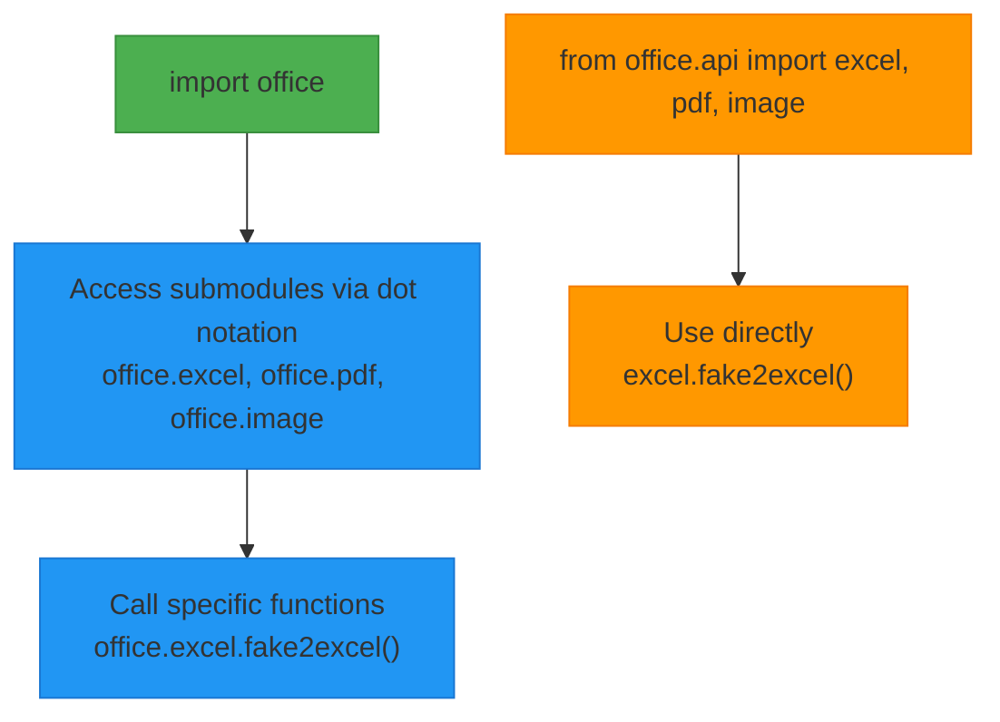
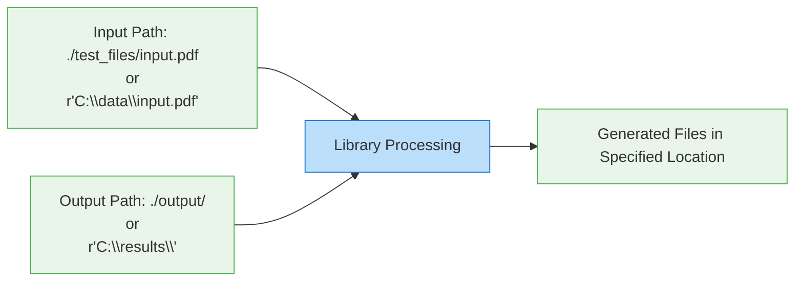
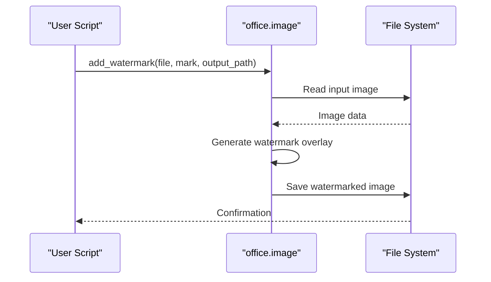
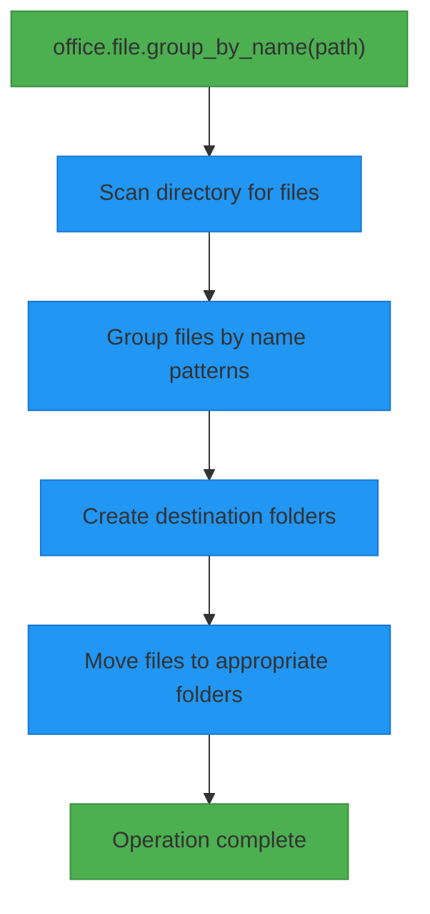
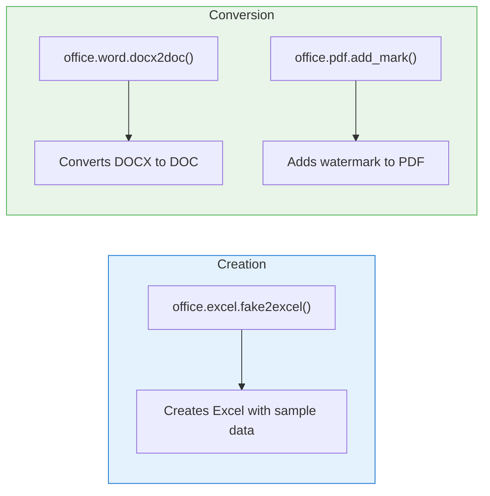
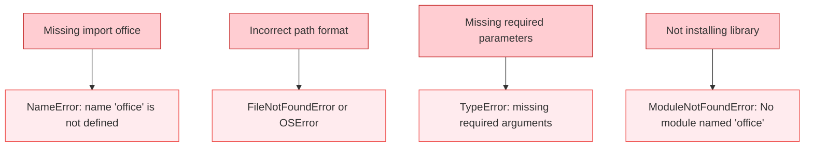

# Getting Started

<cite>
**Referenced Files in This Document**   
- [__init__.py](file://office/__init__.py)
- [image.py](file://office/api/image.py)
- [file.py](file://office/api/file.py)
- [pdf.py](file://office/api/pdf.py)
- [excel.py](file://office/api/excel.py)
- [word.py](file://office/api/word.py)
- [图片加水印.py](file://examples/poimage/图片加水印.py)
- [自动整理文件夹.py](file://examples/pofile/自动整理文件夹.py)
- [PDF加水印.py](file://examples/popdf/PDF加水印.py)
- [创建Excel文件.py](file://examples/poexcel/创建Excel文件.py)
- [doc和docx互转.py](file://examples/poword/doc和docx互转.py)
</cite>

## Table of Contents
1. [Import Strategies](#import-strategies)
2. [Basic Usage Patterns](#basic-usage-patterns)
3. [File Path Handling Conventions](#file-path-handling-conventions)
4. [Common Use Cases](#common-use-cases)
5. [Common Beginner Mistakes](#common-beginner-mistakes)
6. [Performance Considerations](#performance-considerations)

## Import Strategies

python-office provides two primary import strategies for accessing its functionality. The first approach uses the main office module to access all sub-modules, while the second allows direct import of specific sub-modules.

The recommended approach is to import the main office module, which provides access to all functionality through a consistent namespace. This method ensures compatibility and simplifies code maintenance as the library evolves.

**Diagram sources**
- [__init__.py](file://office/__init__.py#L7-L21)
- [api/__init__.py](file://office/api/__init__.py)

**Section sources**
- [__init__.py](file://office/__init__.py#L1-L30)

## Basic Usage Patterns

The python-office library follows a consistent pattern for function calls across all modules. Each sub-module provides specific functionality for handling different file types and operations. The library is designed to be intuitive and accessible for beginners while providing powerful features for advanced users.

All functions are accessed through the office namespace followed by the specific module name. For example, image processing functions are accessed via `office.image`, PDF operations through `office.pdf`, and Excel functions through `office.excel`. This hierarchical structure makes it easy to discover and use the appropriate functions for your needs.

The library automatically handles compatibility checks when imported, ensuring that your environment meets the requirements for all functionality. This is managed by the compatibility module that runs upon import, as shown in the `__init__.py` file.

**Section sources**
- [__init__.py](file://office/__init__.py#L1-L30)
- [image.py](file://office/api/image.py#L1-L153)
- [file.py](file://office/api/file.py#L1-L163)

## File Path Handling Conventions

python-office uses flexible file path handling that supports both relative and absolute paths. The library follows Python's standard path handling conventions, with some additional features to simplify common operations.

When specifying file paths, you can use forward slashes (/) or raw strings with backslashes (r'path\to\file') to avoid escape character issues. The library accepts both formats and handles them appropriately. For cross-platform compatibility, it's recommended to use forward slashes in path specifications.

Many functions include default path parameters that point to the current directory ('./') if no output path is specified. This allows for quick testing and simple operations without requiring explicit path definitions. However, for production code, it's recommended to always specify explicit input and output paths to ensure predictable behavior.

**Diagram sources**
- [图片加水印.py](file://examples/poimage/图片加水印.py#L22-L24)
- [自动整理文件夹.py](file://examples/pofile/自动整理文件夹.py#L24-L25)
- [PDF加水印.py](file://examples/popdf/PDF加水印.py#L5-L6)

**Section sources**
- [image.py](file://office/api/image.py#L35-L52)
- [file.py](file://office/api/file.py#L133-L147)
- [pdf.py](file://office/api/pdf.py#L196-L200)

## Common Use Cases

The python-office library provides practical solutions for common office automation tasks. These use cases demonstrate the library's capabilities and provide templates for implementing similar functionality in your projects.

### Adding Watermarks to Images

One of the most common use cases is adding watermarks to images. This can be accomplished with a simple function call that specifies the input image, watermark text, and output location.

**Diagram sources**
- [图片加水印.py](file://examples/poimage/图片加水印.py#L22-L24)
- [image.py](file://office/api/image.py#L35-L52)

### Organizing Files by Name

Another common task is organizing files into folders based on their names. The library provides a simple function to automatically group files by name patterns.

**Diagram sources**
- [自动整理文件夹.py](file://examples/pofile/自动整理文件夹.py#L24-L25)
- [file.py](file://office/api/file.py#L133-L147)

### Creating and Converting Office Documents

The library also supports creating and converting various office document formats. This includes creating Excel files with sample data, converting between Word document formats, and adding watermarks to PDFs.

**Diagram sources**
- [创建Excel文件.py](file://examples/poexcel/创建Excel文件.py#L17-L18)
- [doc和docx互转.py](file://examples/poword/doc和docx互转.py#L7-L8)
- [PDF加水印.py](file://examples/popdf/PDF加水印.py#L5-L6)

**Section sources**
- [excel.py](file://office/api/excel.py#L25-L39)
- [word.py](file://office/api/word.py#L34-L59)
- [pdf.py](file://office/api/pdf.py#L196-L200)

## Common Beginner Mistakes

When starting with python-office, users often encounter several common mistakes that can be easily avoided with proper understanding of the library's patterns and conventions.

One frequent error is not installing the library correctly before attempting to use it. Always ensure that `pip install python-office` completes successfully before importing the module. Another common issue is incorrect path specification, particularly with backslashes in Windows paths. Using raw strings (r'path\to\file') or forward slashes (/) can prevent path-related errors.

Some users attempt to call functions without understanding the required parameters. Each function has specific input requirements that must be met for successful execution. Refer to the function documentation and examples to ensure all required parameters are provided.

**Diagram sources**
- [__init__.py](file://office/__init__.py#L1-L6)
- [图片加水印.py](file://examples/poimage/图片加水印.py#L20-L24)

**Section sources**
- [__init__.py](file://office/__init__.py#L1-L30)
- [examples/readme.md](file://examples/readme.md#L33-L38)

## Performance Considerations

When processing large files or performing batch operations with python-office, several performance considerations should be taken into account to ensure efficient execution and optimal resource usage.

For batch operations involving multiple files, it's recommended to process files in smaller batches rather than attempting to process all files at once. This approach helps manage memory usage and prevents potential out-of-memory errors when working with large datasets.

The library's functions are designed to be memory-efficient, but processing very large files (such as high-resolution images or complex PDFs) may still require significant system resources. Monitor your system's memory usage when processing large files and consider processing them sequentially rather than in parallel if memory becomes a constraint.

For operations that involve creating sample data or generating reports, consider the impact of data size on processing time. Large datasets will naturally take longer to process and generate, so plan accordingly when working with extensive data requirements.

**Section sources**
- [excel.py](file://office/api/excel.py#L25-L39)
- [image.py](file://office/api/image.py#L5-L153)
- [pdf.py](file://office/api/pdf.py#L1-L200)