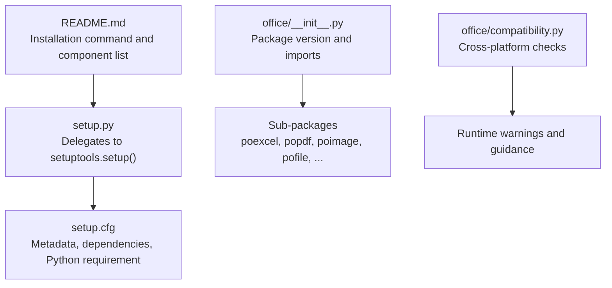
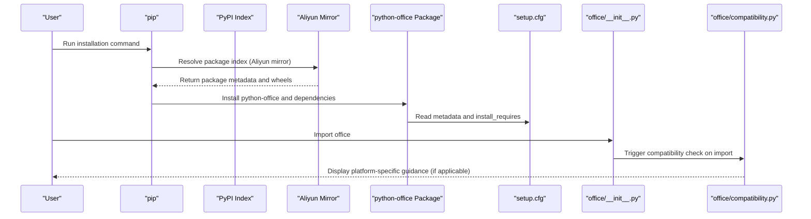
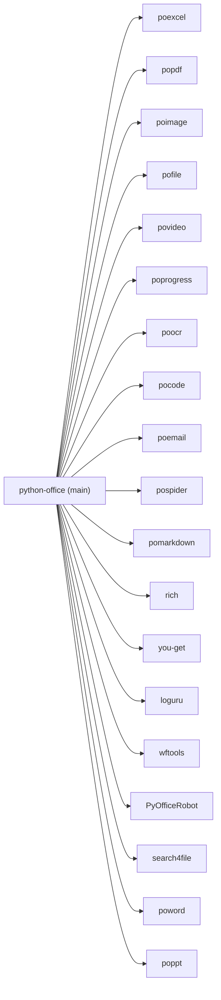

# Installation and Setup

<cite>
**Referenced Files in This Document**
- [README.md](file://README.md)
- [README-EN.md](file://README-EN.md)
- [setup.py](file://setup.py)
- [setup.cfg](file://setup.cfg)
- [office/__init__.py](file://office/__init__.py)
- [office/compatibility.py](file://office/compatibility.py)
- [test_compatibility.py](file://test_compatibility.py)
</cite>

## Table of Contents
1. [Introduction](#introduction)
2. [Project Structure](#project-structure)
3. [Core Components](#core-components)
4. [Architecture Overview](#architecture-overview)
5. [Detailed Component Analysis](#detailed-component-analysis)
6. [Dependency Analysis](#dependency-analysis)
7. [Performance Considerations](#performance-considerations)
8. [Troubleshooting Guide](#troubleshooting-guide)
9. [Conclusion](#conclusion)
10. [Appendices](#appendices)

## Introduction
This section explains how to install and set up the python-office ecosystem. It covers:
- Recommended installation using pip with the Aliyun mirror for faster downloads
- Environment requirements including Python version and operating system support
- Configuration exposed via setup.py and setup.cfg
- Differences between installing the full python-office package versus individual sub-packages
- Verification steps after installation
- Security considerations and best practices for virtual environments

## Project Structure
The installation and setup process centers around the packaging metadata and installation commands documented in the repository’s README files, and the packaging configuration defined in setup.py and setup.cfg. The main office package exposes a version and imports submodules that are distributed as separate packages.

**Diagram sources**
- [README.md](file://README.md#L68-L110)
- [setup.py](file://setup.py#L1-L14)
- [setup.cfg](file://setup.cfg#L1-L45)
- [office/__init__.py](file://office/__init__.py#L1-L30)
- [office/compatibility.py](file://office/compatibility.py#L1-L250)

**Section sources**
- [README.md](file://README.md#L68-L110)
- [setup.py](file://setup.py#L1-L14)
- [setup.cfg](file://setup.cfg#L1-L45)
- [office/__init__.py](file://office/__init__.py#L1-L30)

## Core Components
- Installation command: The repository recommends using pip with the Aliyun mirror to accelerate downloads.
- Packaging metadata: setup.cfg defines the package name, version, author, license, project URLs, and install_requires entries. setup.py delegates to setuptools.setup().
- Version exposure: The main office package exposes a version string.
- Platform compatibility: The compatibility module provides runtime guidance for non-Windows systems.

**Section sources**
- [README.md](file://README.md#L68-L110)
- [setup.cfg](file://setup.cfg#L1-L45)
- [setup.py](file://setup.py#L1-L14)
- [office/__init__.py](file://office/__init__.py#L1-L30)
- [office/compatibility.py](file://office/compatibility.py#L1-L250)

## Architecture Overview
The installation architecture ties together the user-facing installation command, packaging configuration, and runtime compatibility checks.

**Diagram sources**
- [README.md](file://README.md#L68-L110)
- [setup.cfg](file://setup.cfg#L1-L45)
- [office/__init__.py](file://office/__init__.py#L1-L30)
- [office/compatibility.py](file://office/compatibility.py#L1-L250)

## Detailed Component Analysis

### Installation Command and Mirror Usage
- The repository documents a recommended pip installation command that uses the Aliyun mirror to speed up downloads.
- The command also updates the package to the latest compatible version.

Practical guidance:
- Use the documented command to install python-office.
- If you encounter slow downloads or network issues, the Aliyun mirror is recommended.

**Section sources**
- [README.md](file://README.md#L68-L110)
- [README-EN.md](file://README-EN.md#L74-L81)

### Environment Requirements
- Python version requirement: The packaging configuration specifies a minimum Python version.
- Operating system note: The compatibility module detects the platform and provides guidance for non-Windows systems.

Key points:
- Minimum Python version is defined in the packaging configuration.
- On non-Windows platforms, the library displays a compatibility warning and suggests alternatives for Windows-only features.

**Section sources**
- [setup.cfg](file://setup.cfg#L42-L45)
- [office/compatibility.py](file://office/compatibility.py#L1-L250)

### Configuration Options in setup.py and setup.cfg
- setup.py: Delegates to setuptools.setup(), relying on configuration in setup.cfg.
- setup.cfg: Defines:
  - Metadata: name, version, author, license, project URLs
  - Options: packages discovery, install_requires, python_requires, include_package_data, zip_safe
  - Platform-specific dependency: Certain sub-packages are restricted to Windows.

Notes:
- The install_requires list enumerates the sub-packages that are included when installing the full python-office package.
- The python_requires field enforces a minimum Python version.

**Section sources**
- [setup.py](file://setup.py#L1-L14)
- [setup.cfg](file://setup.cfg#L1-L45)

### Full Package vs. Individual Sub-packages
- Full package: Installing python-office pulls in all listed sub-packages as dependencies.
- Individual sub-packages: Users can install specific sub-packages (for example, poexcel, popdf) to minimize dependencies and tailor the installation to their needs.

Benefits of choosing individual sub-packages:
- Smaller footprint
- Faster installs
- Reduced risk of pulling in unnecessary dependencies

**Section sources**
- [README.md](file://README.md#L84-L110)
- [setup.cfg](file://setup.cfg#L19-L41)

### Verifying the Installation
After installation, verify that the package is available and check its version:
- Import the main office package
- Access the package version attribute

This allows you to confirm that the installation succeeded and to identify the installed version.

**Section sources**
- [office/__init__.py](file://office/__init__.py#L1-L30)

### Security Considerations and Virtual Environments
- Security considerations:
  - Prefer installing from trusted mirrors (the repository recommends the Aliyun mirror).
  - Keep pip and setuptools updated to reduce risks.
  - Review the install_requires list to understand what is being pulled in.
- Best practices:
  - Use a virtual environment for isolation during installation and development.
  - Pin versions when reproducing environments for production or CI.
  - Periodically audit installed packages for known vulnerabilities.

**Section sources**
- [README.md](file://README.md#L68-L110)
- [setup.cfg](file://setup.cfg#L19-L41)

## Dependency Analysis
The installation depends on the declared metadata and dependencies in setup.cfg. The main office package imports sub-modules that correspond to the listed sub-packages.

**Diagram sources**
- [setup.cfg](file://setup.cfg#L19-L41)
- [office/__init__.py](file://office/__init__.py#L1-L30)

**Section sources**
- [setup.cfg](file://setup.cfg#L19-L41)
- [office/__init__.py](file://office/__init__.py#L1-L30)

## Performance Considerations
- Network performance: The repository recommends using the Aliyun mirror to improve download speeds.
- Dependency size: Installing the full python-office package includes many sub-packages. If you only need specific capabilities, consider installing individual sub-packages to reduce installation time and disk usage.

**Section sources**
- [README.md](file://README.md#L68-L110)
- [setup.cfg](file://setup.cfg#L19-L41)

## Troubleshooting Guide
Common installation issues and resolutions:

- Dependency conflicts:
  - Symptom: pip fails to resolve compatible versions for some sub-packages.
  - Resolution: Install individual sub-packages that match your needs, or update pip/setuptools and retry.

- Network problems when downloading from PyPI:
  - Symptom: Slow or failed downloads.
  - Resolution: Use the Aliyun mirror as documented in the README.

- Non-Windows platform limitations:
  - Symptom: Some features are not available on macOS or Linux.
  - Resolution: The compatibility module displays guidance and suggests alternatives for Windows-only features. Consider using LibreOffice or online conversion tools as suggested.

Verification after resolving issues:
- Re-run the installation command.
- Verify the installation by importing the main package and checking its version.

**Section sources**
- [README.md](file://README.md#L68-L110)
- [office/compatibility.py](file://office/compatibility.py#L1-L250)
- [test_compatibility.py](file://test_compatibility.py#L1-L94)

## Conclusion
- Install python-office using the documented pip command with the Aliyun mirror for faster downloads.
- Ensure your Python version meets the minimum requirement defined in the packaging configuration.
- Choose between the full package and individual sub-packages depending on your needs.
- Use a virtual environment and follow security best practices.
- If you encounter issues, leverage the compatibility guidance and mirror-based installation.

## Appendices

### Appendix A: Installation Commands
- Recommended installation command using the Aliyun mirror is documented in the README files.

**Section sources**
- [README.md](file://README.md#L68-L110)
- [README-EN.md](file://README-EN.md#L74-L81)

### Appendix B: Version Exposure
- The main office package exposes a version attribute that can be used to verify the installation.

**Section sources**
- [office/__init__.py](file://office/__init__.py#L1-L30)