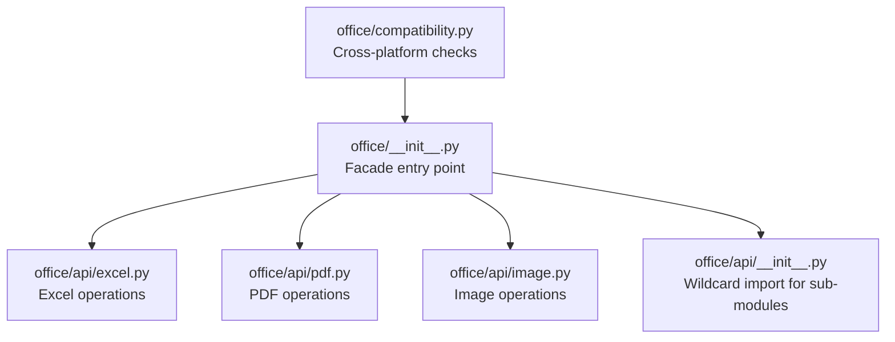
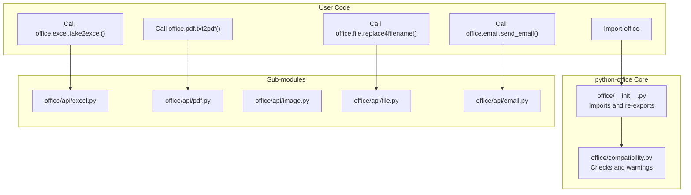
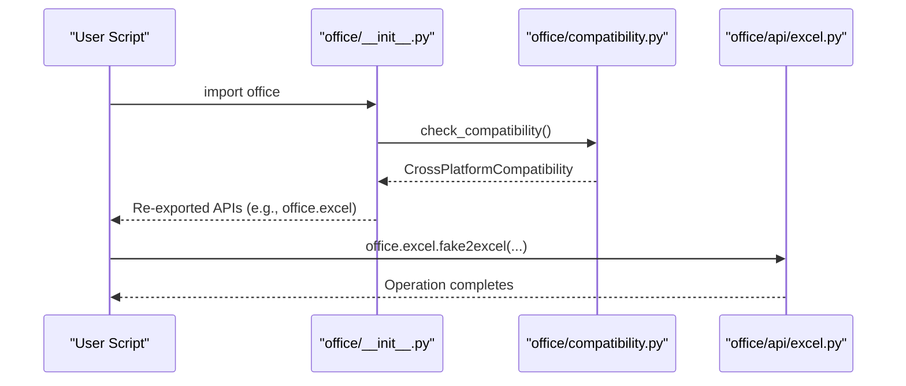
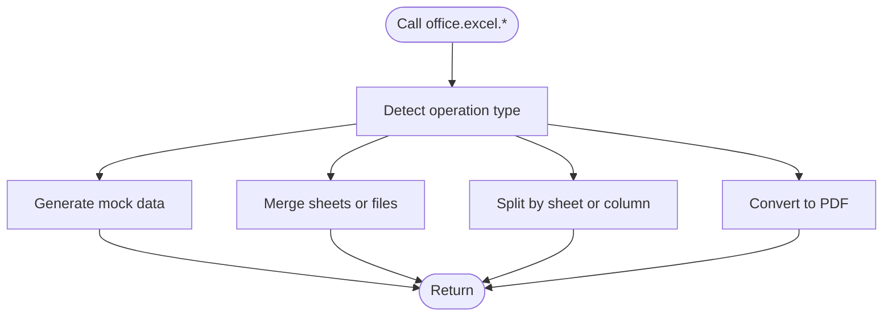
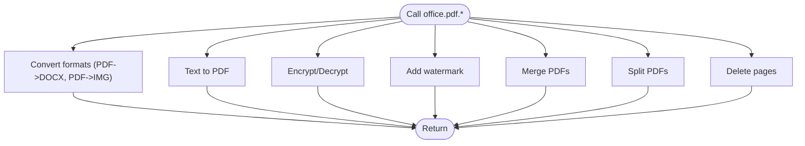
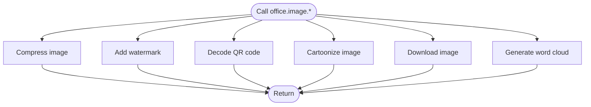
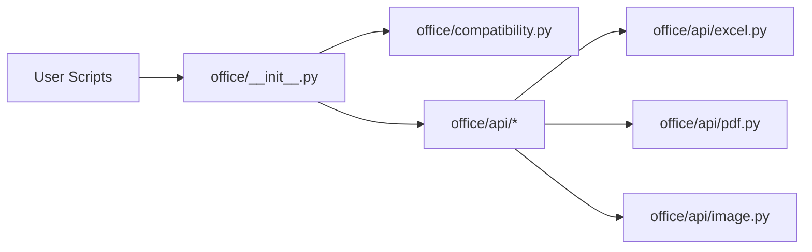
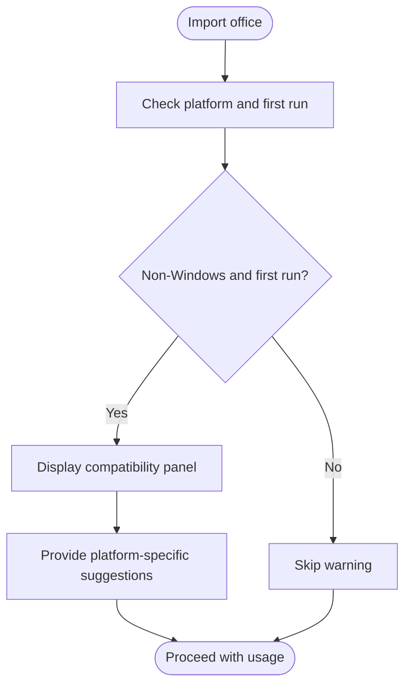

# Introduction

<cite>
**Referenced Files in This Document**
- [README.md](file://README.md)
- [office/__init__.py](file://office/__init__.py)
- [office/api/__init__.py](file://office/api/__init__.py)
- [office/api/excel.py](file://office/api/excel.py)
- [office/api/pdf.py](file://office/api/pdf.py)
- [office/api/image.py](file://office/api/image.py)
- [office/compatibility.py](file://office/compatibility.py)
- [examples/poexcel/创建Excel文件.py](file://examples/poexcel/创建Excel文件.py)
- [examples/popdf/TXT转PDF.py](file://examples/popdf/TXT转PDF.py)
- [examples/pofile/批量重命名.py](file://examples/pofile/批量重命名.py)
- [examples/poemail/发送邮件.py](file://examples/poemail/发送邮件.py)
</cite>

## Table of Contents
1. [Introduction](#introduction)
2. [Project Structure](#project-structure)
3. [Core Components](#core-components)
4. [Architecture Overview](#architecture-overview)
5. [Detailed Component Analysis](#detailed-component-analysis)
6. [Dependency Analysis](#dependency-analysis)
7. [Performance Considerations](#performance-considerations)
8. [Troubleshooting Guide](#troubleshooting-guide)
9. [Conclusion](#conclusion)

## Introduction
Python-office is a Python-based automation toolkit designed to simplify everyday office tasks with minimal effort. Its primary goal is to reduce the learning curve for beginners while delivering powerful, ready-to-use capabilities across common automation scenarios. The library achieves this by offering a modular facade that wraps complex operations behind simple, one-line command APIs.

Key benefits highlighted by the project:
- Zero learning curve for beginners: Tasks can be accomplished with a single line of code.
- Out-of-the-box functionality: Ready-to-use features for common office workflows.
- Broad applicability: Supports Excel manipulation, PDF conversion, file management, email automation, OCR, image processing, and more.

Practical usage patterns demonstrated in the examples include:
- Creating Excel files with a single command.
- Converting text to PDF.
- Performing batch file renaming.
- Sending emails programmatically.

These examples illustrate how the library exposes a streamlined interface that abstracts away the underlying complexity, enabling users to focus on outcomes rather than implementation details.

**Section sources**
- [README.md](file://README.md#L45-L70)
- [examples/poexcel/创建Excel文件.py](file://examples/poexcel/创建Excel文件.py#L1-L19)
- [examples/popdf/TXT转PDF.py](file://examples/popdf/TXT转PDF.py#L1-L7)
- [examples/pofile/批量重命名.py](file://examples/pofile/批量重命名.py#L1-L28)
- [examples/poemail/发送邮件.py](file://examples/poemail/发送邮件.py#L1-L68)

## Project Structure
At a high level, the library is organized around a core package that provides a unified facade and a set of sub-modules that encapsulate domain-specific functionality. The core package exposes a simple API surface, while internal modules delegate to specialized libraries for each task domain.

High-level structure:
- Core package: Provides the main entry point and aggregates sub-module APIs.
- Sub-modules: Each focuses on a specific domain (Excel, PDF, Image, Email, etc.) and delegates to dedicated third-party libraries.
- Examples: Demonstrate practical usage patterns for common tasks.

**Diagram sources**
- [office/__init__.py](file://office/__init__.py#L1-L30)
- [office/api/__init__.py](file://office/api/__init__.py#L1-L2)
- [office/api/excel.py](file://office/api/excel.py#L1-L137)
- [office/api/pdf.py](file://office/api/pdf.py#L1-L200)
- [office/api/image.py](file://office/api/image.py#L1-L153)
- [office/compatibility.py](file://office/compatibility.py#L1-L250)

**Section sources**
- [office/__init__.py](file://office/__init__.py#L1-L30)
- [office/api/__init__.py](file://office/api/__init__.py#L1-L2)
- [office/compatibility.py](file://office/compatibility.py#L1-L250)

## Core Components
The core of the library is the facade exposed by the main package. It performs cross-platform compatibility checks during import and then re-exports APIs from sub-modules, allowing users to call functions directly from the top-level package.

Highlights:
- Compatibility checks: On import, the library detects the platform and displays helpful guidance for non-Windows environments.
- Unified API: Functions from sub-modules are imported into the main package namespace, enabling a single import and straightforward usage.

Practical example references:
- Single-line Excel creation via the facade.
- Single-line PDF text conversion via the facade.
- Batch file renaming via the facade.
- Email sending via the facade.

These examples demonstrate how the facade simplifies usage by exposing domain-specific functions directly under the main package.

**Section sources**
- [office/__init__.py](file://office/__init__.py#L1-L30)
- [office/compatibility.py](file://office/compatibility.py#L227-L240)
- [examples/poexcel/创建Excel文件.py](file://examples/poexcel/创建Excel文件.py#L1-L19)
- [examples/popdf/TXT转PDF.py](file://examples/popdf/TXT转PDF.py#L1-L7)
- [examples/pofile/批量重命名.py](file://examples/pofile/批量重命名.py#L1-L28)
- [examples/poemail/发送邮件.py](file://examples/poemail/发送邮件.py#L1-L68)

## Architecture Overview
The architecture follows a modular facade pattern:
- The main package initializes compatibility checks and re-exports sub-module APIs.
- Each sub-module acts as a thin wrapper around a specialized library for its domain.
- Users interact with the library through the unified facade, which shields them from the complexity of underlying dependencies.

**Diagram sources**
- [office/__init__.py](file://office/__init__.py#L1-L30)
- [office/compatibility.py](file://office/compatibility.py#L227-L240)
- [office/api/excel.py](file://office/api/excel.py#L1-L137)
- [office/api/pdf.py](file://office/api/pdf.py#L1-L200)
- [office/api/image.py](file://office/api/image.py#L1-L153)

## Detailed Component Analysis

### Facade and Compatibility Layer
The facade initializes compatibility checks upon import and re-exports APIs from sub-modules. This ensures that users receive helpful guidance when running on non-Windows platforms and still get access to the same unified API surface.

**Diagram sources**
- [office/__init__.py](file://office/__init__.py#L1-L30)
- [office/compatibility.py](file://office/compatibility.py#L227-L240)
- [office/api/excel.py](file://office/api/excel.py#L1-L137)

**Section sources**
- [office/__init__.py](file://office/__init__.py#L1-L30)
- [office/compatibility.py](file://office/compatibility.py#L1-L250)

### Excel Module (poexcel)
The Excel module provides a set of convenience functions for common Excel tasks. These functions act as thin wrappers around a dedicated Excel-processing library, exposing a simple API for operations such as generating mock data, merging sheets, splitting files, and converting to PDF.

**Diagram sources**
- [office/api/excel.py](file://office/api/excel.py#L1-L137)

**Section sources**
- [office/api/excel.py](file://office/api/excel.py#L1-L137)

### PDF Module (popdf)
The PDF module offers functions for converting PDFs to other formats, adding watermarks, encrypting/decrypting, merging, splitting, and deleting pages. These functions wrap a dedicated PDF-processing library, providing a unified interface for common PDF workflows.

**Diagram sources**
- [office/api/pdf.py](file://office/api/pdf.py#L1-L200)

**Section sources**
- [office/api/pdf.py](file://office/api/pdf.py#L1-L200)

### Image Module (poimage)
The image module provides functions for compression, watermarking, QR code decoding, cartoonization, downloading images, and generating word clouds from text. These functions wrap a dedicated image-processing library, enabling quick and easy image manipulation.

**Diagram sources**
- [office/api/image.py](file://office/api/image.py#L1-L153)

**Section sources**
- [office/api/image.py](file://office/api/image.py#L1-L153)

### Practical Usage Examples
The examples showcase how to use the facade to accomplish common tasks with a single line of code:
- Creating an Excel file with mock data.
- Converting a text file to PDF.
- Performing batch file renaming.
- Sending an email programmatically.

These examples highlight the library’s ability to deliver powerful functionality with minimal code.

**Section sources**
- [examples/poexcel/创建Excel文件.py](file://examples/poexcel/创建Excel文件.py#L1-L19)
- [examples/popdf/TXT转PDF.py](file://examples/popdf/TXT转PDF.py#L1-L7)
- [examples/pofile/批量重命名.py](file://examples/pofile/批量重命名.py#L1-L28)
- [examples/poemail/发送邮件.py](file://examples/poemail/发送邮件.py#L1-L68)

## Dependency Analysis
The library’s design relies on a clear separation of concerns:
- The facade depends on compatibility checks and re-exports sub-module APIs.
- Each sub-module depends on a dedicated third-party library for its domain.
- Users depend on the facade for a unified, beginner-friendly interface.

**Diagram sources**
- [office/__init__.py](file://office/__init__.py#L1-L30)
- [office/compatibility.py](file://office/compatibility.py#L1-L250)
- [office/api/excel.py](file://office/api/excel.py#L1-L137)
- [office/api/pdf.py](file://office/api/pdf.py#L1-L200)
- [office/api/image.py](file://office/api/image.py#L1-L153)

**Section sources**
- [office/__init__.py](file://office/__init__.py#L1-L30)
- [office/compatibility.py](file://office/compatibility.py#L1-L250)

## Performance Considerations
- The facade adds negligible overhead compared to direct calls to sub-modules.
- For large-scale operations (e.g., merging many files), consider batching and streaming to manage memory usage.
- When using external tools (e.g., LibreOffice for Office file conversions on non-Windows), expect I/O-bound performance characteristics typical of subprocess-based integrations.

[No sources needed since this section provides general guidance]

## Troubleshooting Guide
Common issues and resolutions:
- Non-Windows environments: The library automatically displays compatibility guidance and suggests alternatives for Windows-only features.
- Platform-specific advice: Guidance is tailored for macOS and Linux users, recommending alternative tools where applicable.
- First-run detection: A marker file is created on first run to avoid repeated warnings.

**Diagram sources**
- [office/compatibility.py](file://office/compatibility.py#L1-L250)

**Section sources**
- [office/compatibility.py](file://office/compatibility.py#L1-L250)

## Conclusion
Python-office delivers a streamlined, beginner-friendly facade for automating common office tasks. By wrapping complex operations behind simple APIs and providing cross-platform compatibility guidance, it enables users to achieve significant productivity gains with minimal learning effort. The modular architecture allows users to adopt the library incrementally, starting with the facade and leveraging domain-specific sub-modules as needed.

[No sources needed since this section summarizes without analyzing specific files]