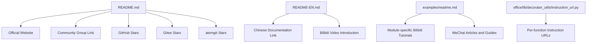
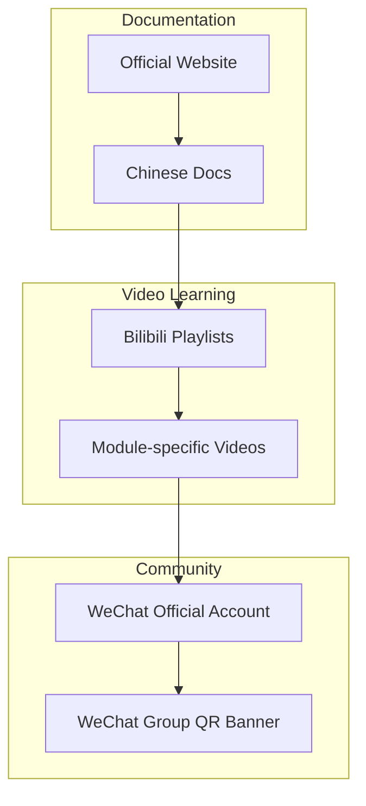
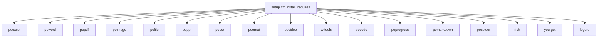

# Resources

<cite>
**Referenced Files in This Document**
- [README.md](file://README.md)
- [README-EN.md](file://README-EN.md)
- [setup.cfg](file://setup.cfg)
- [office/__init__.py](file://office/__init__.py)
- [examples/readme.md](file://examples/readme.md)
- [office/lib/decorator_utils/instruction_url.py](file://office/lib/decorator_utils/instruction_url.py)
- [docs/html/404.html](file://docs/html/404.html)
- [tests/test_code/test_dev.py](file://tests/test_code/test_dev.py)
</cite>

## Table of Contents
1. [Introduction](#introduction)
2. [Project Structure](#project-structure)
3. [Core Components](#core-components)
4. [Architecture Overview](#architecture-overview)
5. [Detailed Component Analysis](#detailed-component-analysis)
6. [Dependency Analysis](#dependency-analysis)
7. [Performance Considerations](#performance-considerations)
8. [Troubleshooting Guide](#troubleshooting-guide)
9. [Conclusion](#conclusion)
10. [Appendices](#appendices)

## Introduction
This document compiles comprehensive reference material for python-office resources. It consolidates official website links, video tutorials on Bilibili, community support channels, and the project’s presence across GitHub, Gitee, and atomgit. It also outlines related projects and sub-packages, external documentation and tutorials created by the community, and practical guidance for staying updated with new features and releases.

## Project Structure
The repository organizes learning and community resources primarily in the README files, examples documentation, and internal URL mapping utilities. The official documentation and tutorial links are prominently featured in both the Chinese and English READMEs, while the examples documentation aggregates Bilibili videos and WeChat articles for each functional module.

**Diagram sources**
- [README.md](file://README.md#L1-L36)
- [README-EN.md](file://README-EN.md#L84-L114)
- [examples/readme.md](file://examples/readme.md#L1-L338)
- [office/lib/decorator_utils/instruction_url.py](file://office/lib/decorator_utils/instruction_url.py#L34-L83)

**Section sources**
- [README.md](file://README.md#L1-L36)
- [README-EN.md](file://README-EN.md#L84-L114)
- [examples/readme.md](file://examples/readme.md#L1-L338)

## Core Components
- Official website and documentation: The primary site provides the central hub for documentation and announcements.
- Bilibili video tutorials: Structured playlists and individual video links for each major module (Word, Excel, PDF, PPT, image, OCR, tools, video, finance, AI, Chinese programming, and WeChat robot).
- Community support channels: Links to the official WeChat group QR code and banners for joining the community.
- Related projects and sub-packages: The README lists several sub-packages such as PyOfficeRobot, poocr, popdf, poemail, porobot, poimage, poai, poexcel, poword, pofile, search4file, poppt, wftools, pofinance, pohan, povideo, potime, poprogress, and pocode.

**Section sources**
- [README.md](file://README.md#L80-L114)
- [README-EN.md](file://README-EN.md#L84-L114)
- [examples/readme.md](file://examples/readme.md#L1-L338)

## Architecture Overview
The resource architecture centers around three pillars:
- Centralized documentation and announcements on the official website.
- Video-first learning on Bilibili with curated playlists and module-specific tutorials.
- Community-driven support via WeChat group and WeChat official accounts.

**Diagram sources**
- [README.md](file://README.md#L8-L12)
- [README-EN.md](file://README-EN.md#L84-L114)
- [examples/readme.md](file://examples/readme.md#L1-L338)

## Detailed Component Analysis

### Official Website and Documentation
- Official website: The primary entry point for documentation and announcements.
- Chinese documentation: A dedicated link to the Chinese documentation site.
- Additional documentation links: The English README includes a Chinese documentation link and a Bilibili video introduction.

Practical usage:
- Use the official website for latest updates and in-depth guides.
- Cross-reference with the Chinese documentation link for localized content.

**Section sources**
- [README.md](file://README.md#L8-L12)
- [README-EN.md](file://README-EN.md#L84-L90)

### Bilibili Video Tutorials
- Module playlists: The examples documentation enumerates Bilibili videos for Word, Excel, PDF, PPT, file management, image processing, OCR, tools, video, finance, AI, Chinese programming, and WeChat robot.
- Individual function tutorials: Per-module videos are linked for specific functions (e.g., PDF watermarking, PPT conversion, image compression, OCR, translation, weather, etc.).
- Additional content: The examples documentation includes links to broader learning resources, books, projects, and promotional banners.

Practical usage:
- Browse the examples documentation for a structured learning path.
- Use the per-function instruction URLs for quick access to specific tutorials.

**Section sources**
- [examples/readme.md](file://examples/readme.md#L1-L338)
- [office/lib/decorator_utils/instruction_url.py](file://office/lib/decorator_utils/instruction_url.py#L34-L83)

### Community Support Channels
- WeChat group QR banner: The README contains a QR banner linking to the official WeChat group.
- WeChat official account: The English README includes images for the WeChat official account and the open source group.
- Additional banners: The examples documentation includes banners for joining the AI group and other community resources.

Practical usage:
- Scan the QR banner in the README to join the official WeChat group.
- Follow the WeChat official account for announcements and updates.

**Section sources**
- [README.md](file://README.md#L53-L58)
- [README-EN.md](file://README-EN.md#L186-L191)
- [examples/readme.md](file://examples/readme.md#L242-L249)

### Related Projects and Sub-packages
- Sub-packages: The README lists numerous sub-packages that extend functionality, including PyOfficeRobot, poocr, popdf, poemail, porobot, poimage, poai, poexcel, poword, pofile, search4file, poppt, wftools, pofinance, pohan, povideo, potime, poprogress, and pocode.
- Installation guidance: The README emphasizes that users can install individual sub-packages or import the entire office namespace.

Practical usage:
- Install only the sub-packages you need to reduce download size and complexity.
- Import the full office namespace if you want a unified interface.

**Section sources**
- [README.md](file://README.md#L88-L114)
- [README-EN.md](file://README-EN.md#L92-L112)

### External Documentation and Community Tutorials
- WeChat articles: The examples documentation links to WeChat articles covering topics like weather, creating articles, WiFi password tools, and more.
- Community contributions: The examples documentation highlights community-created demos and tutorials.

Practical usage:
- Explore the WeChat article links for supplementary tutorials and tips.
- Review community demos for real-world usage patterns.

**Section sources**
- [examples/readme.md](file://examples/readme.md#L115-L170)
- [examples/readme.md](file://examples/readme.md#L187-L241)

### Staying Updated with New Features and Releases
- Official website: Subscribe to announcements on the official website for release notes and feature updates.
- Bilibili: Follow the Bilibili playlists for video updates and new tutorials.
- WeChat group: Join the WeChat group to receive timely updates and engage with the community.
- Issue trackers: Use the issue trackers on GitHub, Gitee, and atomgit to track bugs and feature requests.

Practical usage:
- Bookmark the official website and Bilibili playlists.
- Join the WeChat group to stay informed during live discussions and Q&A sessions.

**Section sources**
- [README.md](file://README.md#L132-L135)
- [README-EN.md](file://README-EN.md#L158-L166)
- [docs/html/404.html](file://docs/html/404.html#L243-L252)

## Dependency Analysis
The project’s distribution metadata defines the set of sub-packages included in the main bundle. These sub-packages collectively provide the functionality documented across the README and examples.

**Diagram sources**
- [setup.cfg](file://setup.cfg#L21-L41)

**Section sources**
- [setup.cfg](file://setup.cfg#L21-L41)

## Performance Considerations
- Selective installation: Install only the sub-packages you need to minimize download size and improve performance.
- Version alignment: Use the version reported by the test utility to ensure compatibility across modules.

**Section sources**
- [tests/test_code/test_dev.py](file://tests/test_code/test_dev.py#L1-L3)

## Troubleshooting Guide
- Community support: Use the WeChat group QR banner and banners in the examples documentation to join the community and seek help.
- Issue reporting: Report issues via the issue trackers on GitHub, Gitee, and atomgit as listed in the README.

**Section sources**
- [README.md](file://README.md#L132-L135)
- [README-EN.md](file://README-EN.md#L158-L166)
- [examples/readme.md](file://examples/readme.md#L242-L249)

## Conclusion
The python-office ecosystem offers a robust combination of centralized documentation, structured Bilibili video tutorials, and active community support through WeChat. By leveraging the official website, Bilibili playlists, and the WeChat group, users can efficiently learn, troubleshoot, and stay updated with new features and releases. Installing only the necessary sub-packages ensures a streamlined experience tailored to your automation needs.

## Appendices
- Quick links summary:
  - Official website: [Project Website](file://README.md#L8-L12)
  - Chinese documentation: [Chinese Docs](file://README-EN.md#L84-L90)
  - Bilibili video introduction: [Bilibili Intro](file://README-EN.md#L88-L90)
  - Module-specific Bilibili tutorials: [Examples README](file://examples/readme.md#L1-L338)
  - WeChat group QR banner: [Group Banner](file://README.md#L53-L58)
  - WeChat official account and group images: [Official Account Images](file://README-EN.md#L186-L191)
  - Sub-packages list: [Sub-packages](file://README.md#L88-L114)