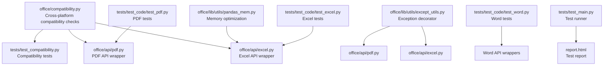
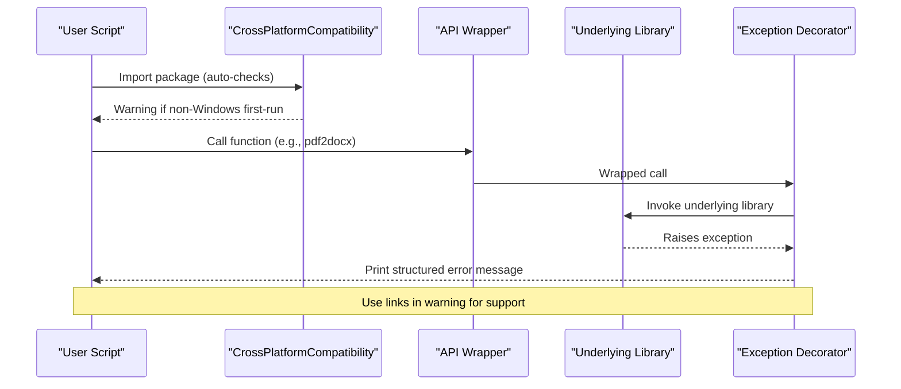
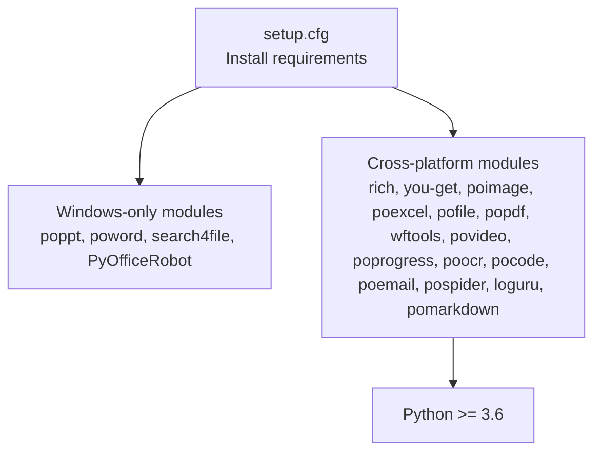

# Troubleshooting

<cite>
**Referenced Files in This Document**
- [office/compatibility.py](file://office/compatibility.py)
- [test_compatibility.py](file://test_compatibility.py)
- [README.md](file://README.md)
- [setup.cfg](file://setup.cfg)
- [office/api/pdf.py](file://office/api/pdf.py)
- [office/api/excel.py](file://office/api/excel.py)
- [office/lib/utils/except_utils.py](file://office/lib/utils/except_utils.py)
- [office/lib/utils/pandas_mem.py](file://office/lib/utils/pandas_mem.py)
- [tests/test_main.py](file://tests/test_main.py)
- [tests/test_code/test_pdf.py](file://tests/test_code/test_pdf.py)
- [tests/test_code/test_excel.py](file://tests/test_code/test_excel.py)
- [tests/test_code/test_word.py](file://tests/test_code/test_word.py)
</cite>

## Table of Contents
1. [Introduction](#introduction)
2. [Project Structure](#project-structure)
3. [Core Components](#core-components)
4. [Architecture Overview](#architecture-overview)
5. [Detailed Component Analysis](#detailed-component-analysis)
6. [Dependency Analysis](#dependency-analysis)
7. [Performance Considerations](#performance-considerations)
8. [Troubleshooting Guide](#troubleshooting-guide)
9. [Conclusion](#conclusion)
10. [Appendices](#appendices)

## Introduction
This document provides a comprehensive troubleshooting guide for the python-office library. It focuses on compatibility issues across Python versions, operating systems, and dependency library versions, and explains how to interpret error messages and locate diagnostic information. It also covers solutions for common problems such as file format conversion failures, missing dependencies, permission errors, and performance bottlenecks when processing large files. Finally, it outlines debugging workflows and guidance on reporting issues effectively.

## Project Structure
The troubleshooting guide centers around the compatibility module and test suites that reveal typical failure modes. The compatibility module detects the platform and displays warnings for non-Windows environments, while the test suites demonstrate expected behaviors and highlight areas where exceptions commonly occur.

**Diagram sources**
- [office/compatibility.py](file://office/compatibility.py#L1-L250)
- [test_compatibility.py](file://test_compatibility.py#L1-L94)
- [office/api/pdf.py](file://office/api/pdf.py#L1-L200)
- [office/api/excel.py](file://office/api/excel.py#L1-L137)
- [office/lib/utils/except_utils.py](file://office/lib/utils/except_utils.py#L1-L34)
- [office/lib/utils/pandas_mem.py](file://office/lib/utils/pandas_mem.py#L1-L41)
- [tests/test_code/test_pdf.py](file://tests/test_code/test_pdf.py#L1-L104)
- [tests/test_code/test_excel.py](file://tests/test_code/test_excel.py#L1-L81)
- [tests/test_code/test_word.py](file://tests/test_code/test_word.py#L1-L33)
- [tests/test_main.py](file://tests/test_main.py#L1-L26)

**Section sources**
- [office/compatibility.py](file://office/compatibility.py#L1-L250)
- [test_compatibility.py](file://test_compatibility.py#L1-L94)

## Core Components
- CrossPlatformCompatibility: Detects OS, marks first-run, and displays compatibility warnings. It also exposes module compatibility checks and platform-specific advice.
- Exception decorator: Provides a standardized way to catch and print exceptions with contextual information.
- Memory optimization utilities: Reduce memory usage for pandas DataFrames, helpful when processing large Excel files.
- API wrappers: Thin wrappers around underlying libraries (e.g., popdf, poexcel) that surface errors from lower-level libraries.

Key responsibilities:
- Compatibility detection and warning display for non-Windows platforms.
- Module-level compatibility checks for Windows-only modules.
- Centralized exception handling and diagnostic printing.
- Memory optimization for data-heavy operations.

**Section sources**
- [office/compatibility.py](file://office/compatibility.py#L14-L225)
- [office/lib/utils/except_utils.py](file://office/lib/utils/except_utils.py#L1-L34)
- [office/lib/utils/pandas_mem.py](file://office/lib/utils/pandas_mem.py#L1-L41)
- [office/api/pdf.py](file://office/api/pdf.py#L1-L200)
- [office/api/excel.py](file://office/api/excel.py#L1-L137)

## Architecture Overview
The troubleshooting architecture integrates compatibility checks, exception handling, and API wrappers. Tests exercise the APIs and help identify failure points.

**Diagram sources**
- [office/compatibility.py](file://office/compatibility.py#L227-L250)
- [office/api/pdf.py](file://office/api/pdf.py#L28-L41)
- [office/lib/utils/except_utils.py](file://office/lib/utils/except_utils.py#L10-L34)

## Detailed Component Analysis

### CrossPlatformCompatibility
- Purpose: Detect OS, manage first-run marker, display compatibility warnings, and provide module compatibility checks.
- Key behaviors:
  - First-run detection via a hidden marker file under the user’s home directory.
  - Conditional warning display only on non-Windows systems during first-run.
  - Module compatibility checks for Windows-only modules.
  - Platform-specific advice for macOS/Linux users.

Common issues and resolutions:
- Warning appears repeatedly: Ensure the first-run marker file exists and is not deleted.
- Rich output unavailable: The module gracefully falls back to plain text output if the rich library is not installed.
- Windows-only modules fail on non-Windows: Use alternatives suggested by the compatibility info.

**Section sources**
- [office/compatibility.py](file://office/compatibility.py#L14-L225)
- [test_compatibility.py](file://test_compatibility.py#L13-L94)

### Exception Handling Decorator
- Purpose: Wrap functions to uniformly capture exceptions and print structured diagnostics including timestamp, function name, and error message.
- Behavior: Prints a friendly message and links to community support channels.

Common issues and resolutions:
- Silent failures: Apply the decorator to suspected functions to surface exceptions.
- Ambiguous errors: Use the printed function name and timestamp to correlate logs.

**Section sources**
- [office/lib/utils/except_utils.py](file://office/lib/utils/except_utils.py#L1-L34)

### Memory Optimization Utilities
- Purpose: Reduce memory footprint for pandas DataFrames by downcasting numeric dtypes and converting object columns to category where appropriate.
- When to use: After loading large Excel sheets into DataFrames before heavy processing.

Common issues and resolutions:
- Out-of-memory errors: Apply memory optimization before processing large datasets.
- Performance degradation: Verify that categorical conversions are beneficial for repeated string comparisons.

**Section sources**
- [office/lib/utils/pandas_mem.py](file://office/lib/utils/pandas_mem.py#L1-L41)

### API Wrappers (PDF and Excel)
- Purpose: Provide thin wrappers around underlying libraries (e.g., popdf, poexcel). Exceptions raised by these libraries bubble up and can be caught by the exception decorator.
- Typical failure points:
  - File path issues (missing files, invalid paths).
  - Permission errors (read/write access).
  - Unsupported formats or corrupted files.
  - Missing external tools (e.g., LibreOffice for conversions on non-Windows).

Common issues and resolutions:
- PDF conversion failures: Validate input file path and permissions; ensure the underlying library supports the operation.
- Excel conversion failures: Confirm the target sheet exists and paths are accessible; optimize memory for large files.

**Section sources**
- [office/api/pdf.py](file://office/api/pdf.py#L1-L200)
- [office/api/excel.py](file://office/api/excel.py#L1-L137)

## Dependency Analysis
The project declares platform-specific and cross-platform dependencies. Windows-only modules are gated by environment markers.

**Diagram sources**
- [setup.cfg](file://setup.cfg#L19-L42)

**Section sources**
- [setup.cfg](file://setup.cfg#L19-L42)

## Performance Considerations
- Large Excel processing:
  - Use memory optimization utilities to reduce DataFrame memory usage.
  - Process files in chunks or streams when possible.
  - Avoid loading entire sheets into memory if not necessary.
- PDF operations:
  - Validate input files and ensure external tools are installed to prevent retries and timeouts.
  - Limit concurrent operations to avoid resource contention.
- General:
  - Enable the exception decorator to quickly identify slow or failing operations.
  - Use test reports to measure performance regressions.

[No sources needed since this section provides general guidance]

## Troubleshooting Guide

### Compatibility Problems Across Python Versions, Operating Systems, and Dependencies
- Python version:
  - Minimum supported version is 3.6. Ensure your environment meets this requirement.
- Operating systems:
  - Windows-only modules (PPT, Word, file search, WeChat robot) are gated by environment markers. On macOS/Linux, these modules are not installed automatically and will cause import errors if used.
- Dependencies:
  - Cross-platform modules are declared in the install requirements. If rich is missing, warnings will fall back to plain text.
  - Some operations rely on external tools; ensure they are installed and accessible.

Resolution steps:
- Verify Python version meets the minimum requirement.
- Install Windows-only modules only on Windows environments.
- Install missing dependencies as indicated by import errors or warnings.
- Use the compatibility module’s advice to select alternative workflows on non-Windows systems.

**Section sources**
- [setup.cfg](file://setup.cfg#L19-L42)
- [office/compatibility.py](file://office/compatibility.py#L14-L225)

### Interpreting Error Messages and Finding Diagnostic Information
- Structured exception messages:
  - The exception decorator prints a timestamp, function name, and error message. Use this information to locate the failing call site.
- Community resources:
  - The compatibility warning includes links to official documentation, issue tracker, and community groups. Use these for additional context and support.
- Test reports:
  - The test runner generates an HTML report. Review it to identify failed tests and their logs.

Resolution steps:
- Capture the timestamp and function name from the exception output.
- Search the test report for similar failures and logs.
- Consult the linked resources for known limitations or workarounds.

**Section sources**
- [office/lib/utils/except_utils.py](file://office/lib/utils/except_utils.py#L1-L34)
- [office/compatibility.py](file://office/compatibility.py#L140-L184)
- [tests/test_main.py](file://tests/test_main.py#L1-L26)

### Solutions for Specific Issues

#### File Format Conversion Failures
- Symptoms:
  - Conversion functions raise exceptions or produce unexpected output.
- Causes:
  - Unsupported input formats, corrupted files, or missing external tools.
- Resolutions:
  - Validate input file paths and formats.
  - Ensure external tools are installed and accessible.
  - Use the exception decorator to capture detailed error information.
  - For non-Windows systems, use the compatibility module’s suggested alternatives.

**Section sources**
- [office/api/pdf.py](file://office/api/pdf.py#L28-L41)
- [office/api/excel.py](file://office/api/excel.py#L25-L40)
- [office/compatibility.py](file://office/compatibility.py#L140-L184)
- [office/lib/utils/except_utils.py](file://office/lib/utils/except_utils.py#L1-L34)

#### Missing Dependencies
- Symptoms:
  - ImportError when importing Windows-only modules or rich for colored output.
- Causes:
  - Environment markers prevent installation of Windows-only modules on non-Windows.
  - Missing rich library for colored warnings.
- Resolutions:
  - Install Windows-only modules only on Windows.
  - Install rich for colored terminal output.
  - Re-run installation to ensure all declared dependencies are present.

**Section sources**
- [setup.cfg](file://setup.cfg#L19-L42)
- [office/compatibility.py](file://office/compatibility.py#L140-L184)

#### Permission Errors
- Symptoms:
  - Access denied when reading or writing files.
- Causes:
  - Insufficient permissions for input/output paths.
- Resolutions:
  - Run with elevated privileges if necessary.
  - Ensure the process has read/write access to the specified paths.
  - Use absolute paths to avoid ambiguity.

**Section sources**
- [office/api/pdf.py](file://office/api/pdf.py#L28-L41)
- [office/api/excel.py](file://office/api/excel.py#L25-L40)

#### Performance Bottlenecks and Memory Issues with Large Files
- Symptoms:
  - Slow processing or out-of-memory errors.
- Causes:
  - Loading entire files into memory.
- Resolutions:
  - Apply memory optimization utilities to reduce DataFrame memory usage.
  - Process files in smaller chunks or streams.
  - Limit concurrent operations.

**Section sources**
- [office/lib/utils/pandas_mem.py](file://office/lib/utils/pandas_mem.py#L1-L41)

### Debugging Workflows and Tools
Recommended workflow:
1. Reproduce the issue with minimal input.
2. Wrap suspect functions with the exception decorator to capture structured error messages.
3. Review the compatibility warning for platform-specific limitations.
4. Validate file paths and permissions.
5. Use the test runner to generate an HTML report and inspect logs.
6. Consult the compatibility module’s advice for alternative approaches on non-Windows systems.

Tools:
- Exception decorator for uniform error reporting.
- Compatibility module for platform-specific guidance.
- Test runner and HTML report for regression analysis.

**Section sources**
- [office/lib/utils/except_utils.py](file://office/lib/utils/except_utils.py#L1-L34)
- [office/compatibility.py](file://office/compatibility.py#L140-L184)
- [tests/test_main.py](file://tests/test_main.py#L1-L26)

### When to Report Issues and How to Provide Useful Information
- When to report:
  - After confirming the issue persists across environments and with minimal reproducible examples.
  - When compatibility limitations are not clearly documented or when the compatibility module’s advice does not resolve the problem.
- What to include:
  - Python version and OS details.
  - Installed dependencies and environment markers.
  - Exact error messages and timestamps from the exception decorator.
  - Steps to reproduce and minimal input files.
  - Links to the compatibility warning and test report for context.

**Section sources**
- [README.md](file://README.md#L128-L135)
- [office/compatibility.py](file://office/compatibility.py#L140-L184)
- [tests/test_main.py](file://tests/test_main.py#L1-L26)

## Conclusion
This guide consolidates practical troubleshooting strategies for python-office, focusing on compatibility across platforms, dependency management, exception handling, and performance optimization. By leveraging the compatibility module, exception decorator, and test reports, most issues can be diagnosed and resolved efficiently. When necessary, follow the issue-reporting guidance to provide actionable information for maintainers.

[No sources needed since this section summarizes without analyzing specific files]

## Appendices

### Quick Reference: Common Failure Scenarios and Fixes
- Non-Windows systems using Windows-only modules:
  - Use alternatives suggested by the compatibility module.
- Missing rich for colored warnings:
  - Install rich to enable colored output.
- Import errors for Windows-only modules:
  - Install only on Windows environments.
- Permission errors:
  - Verify read/write access and use absolute paths.
- Large file memory issues:
  - Optimize memory usage for DataFrames.
- PDF/Excel conversion failures:
  - Validate input formats and external tool availability.

**Section sources**
- [office/compatibility.py](file://office/compatibility.py#L140-L184)
- [office/lib/utils/pandas_mem.py](file://office/lib/utils/pandas_mem.py#L1-L41)
- [office/api/pdf.py](file://office/api/pdf.py#L28-L41)
- [office/api/excel.py](file://office/api/excel.py#L25-L40)