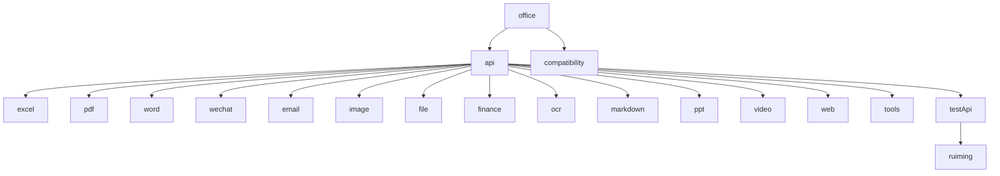

# API参考

<cite>
**本文档中引用的文件**   
- [office/__init__.py](file://office/__init__.py)
- [office/api/__init__.py](file://office/api/__init__.py)
- [office/api/excel.py](file://office/api/excel.py)
- [office/api/email.py](file://office/api/email.py)
- [office/api/pdf.py](file://office/api/pdf.py)
- [office/api/wechat.py](file://office/api/wechat.py)
- [office/api/word.py](file://office/api/word.py)
- [office/api/image.py](file://office/api/image.py)
- [office/api/tools.py](file://office/api/tools.py)
- [office/api/file.py](file://office/api/file.py)
- [office/api/finance.py](file://office/api/finance.py)
- [office/api/ocr.py](file://office/api/ocr.py)
- [office/api/markdown.py](file://office/api/markdown.py)
- [office/api/ppt.py](file://office/api/ppt.py)
- [office/api/video.py](file://office/api/video.py)
- [office/api/web.py](file://office/api/web.py)
- [office/api/testApi/ruiming.py](file://office/api/testApi/ruiming.py)
</cite>

## 目录
1. [简介](#简介)
2. [API聚合机制](#api聚合机制)
3. [Excel API](#excel-api)
4. [邮件 API](#邮件-api)
5. [PDF API](#pdf-api)
6. [微信 API](#微信-api)
7. [Word API](#word-api)
8. [图片 API](#图片-api)
9. [工具 API](#工具-api)
10. [文件 API](#文件-api)
11. [金融 API](#金融-api)
12. [OCR API](#ocr-api)
13. [Markdown API](#markdown-api)
14. [PPT API](#ppt-api)
15. [视频 API](#视频-api)
16. [Web API](#web-api)
17. [测试API](#测试api)

## 简介
`python-office` 是一个功能丰富的Python库，旨在简化办公自动化任务。该库提供了处理Excel、PDF、Word、邮件、微信等多种办公文档和通信工具的API。每个API模块都封装了特定功能，使开发者能够通过简单的函数调用来完成复杂的办公自动化任务。本API参考文档详细记录了`office.api`包下所有公开接口，包括函数签名、参数说明、返回值和使用示例。

## API聚合机制
`python-office`库通过精心设计的模块结构，实现了API的聚合和便捷访问。核心机制位于`office/__init__.py`文件中，它将各个功能模块聚合并暴露给用户，使得开发者可以通过`import office`后直接访问`office.excel`、`office.pdf`等功能。



**图源**
- [office/__init__.py](file://office/__init__.py)
- [office/api/__init__.py](file://office/api/__init__.py)

**节源**
- [office/__init__.py](file://office/__init__.py#L1-L30)
- [office/api/__init__.py](file://office/api/__init__.py#L1-L2)

### 模块聚合实现
`office/__init__.py`文件通过一系列导入语句，将`office.api`包中的所有模块聚合到`office`命名空间下：

```python
from office.api import email
from office.api import excel
from office.api import file
from office.api import finance
from office.api import image
from office.api import pdf
from office.api import ppt
from office.api import tools
from office.api import video
from office.api import wechat
from office.api import word
from office.api import markdown
from office.api import ocr
# 以下是beta版本
from office.api.testApi import ruiming
```

这种设计模式使得用户只需导入`office`包，即可访问所有子模块，极大地简化了API的使用。例如，用户可以直接使用`office.excel.fake2excel()`来调用Excel模块的功能，而无需关心底层的模块结构。

## Excel API
Excel API模块提供了丰富的Excel文件处理功能，包括数据模拟、文件合并拆分、格式转换等。

**节源**
- [office/api/excel.py](file://office/api/excel.py#L1-L137)

### fake2excel
自动创建Excel并模拟数据。

**参数**
- **columns** (list): 列名。可以模拟的列有：https://www.python4office.cn/python-office/fake2excel/，默认值：['name']
- **rows** (int): 生成多少行数据，默认值：1
- **path** (str): 生成的Excel的位置和名称
- **language** (str): 数据用什么语言，默认是中文，可以填english

**返回值**
- None

**示例**
```python
office.excel.fake2excel(columns=['姓名', '年龄', '邮箱'], rows=100, path='模拟数据.xlsx', language='zh_CN')
```

### merge2excel
多个Excel合并到一个文件的不同sheet中。

**参数**
- **dir_path** (str): 包含多个Excel文件的目录路径
- **output_file** (str): 合并后的Excel文件路径，默认为'merge2excel.xlsx'

**返回值**
- None

**示例**
```python
office.excel.merge2excel(dir_path='./excel_files', output_file='合并结果.xlsx')
```

### sheet2excel
同一个Excel的不同sheet拆分为不同文件。

**参数**
- **file_path** (str): 需要拆分的Excel文件路径
- **output_path** (str): 拆分后文件的输出目录，默认为当前目录

**返回值**
- None

**示例**
```python
office.excel.sheet2excel(file_path='多个sheet.xlsx', output_path='./拆分结果/')
```

### merge2sheet
实现多个Excel的多个sheet的自动合并。

**参数**
- **dir_path** (str): 包含多个Excel文件的目录路径
- **output_sheet_name** (str): 合并后的sheet名称，默认为'Sheet1'
- **output_excel_name** (str): 合并后的Excel文件名，默认为'merge2sheet'

**返回值**
- None

**示例**
```python
office.excel.merge2sheet(dir_path='./待合并文件/', output_sheet_name='汇总数据', output_excel_name='合并工作簿')
```

### find_excel_data
搜索Excel中指定内容的文件、行数、内容详情。

**参数**
- **search_key** (str): 需要搜索的关键词
- **target_dir** (str): 搜索的目录路径

**返回值**
- None

**示例**
```python
office.excel.find_excel_data(search_key='重要客户', target_dir='./财务数据/')
```

### split_excel_by_column
按指定列的内容拆分Excel。

**参数**
- **filepath** (str): 需要拆分的Excel文件路径
- **column** (int): 按哪一列的内容进行拆分
- **worksheet_name** (str, 可选): 指定工作表名称，默认为None表示第一个工作表

**返回值**
- None

**示例**
```python
office.excel.split_excel_by_column(filepath='销售数据.xlsx', column=2, worksheet_name='2023年销售')
```

### excel2pdf
将指定的Excel文件的指定工作表转换为PDF文件。

**参数**
- **excel_path** (str): Excel文件的路径
- **pdf_path** (str): 转换后生成的PDF文件的路径
- **sheet_id** (int): 工作表的索引，默认为0，表示第一个工作表

**返回值**
- None

**示例**
```python
office.excel.excel2pdf(excel_path='报告.xlsx', pdf_path='报告.pdf', sheet_id=0)
```

## 邮件 API
邮件API模块提供了发送和接收邮件的功能。

**节源**
- [office/api/email.py](file://office/api/email.py#L1-L45)

### send_email
自动发送邮件。

**参数**
- **key** (str): 邮箱账户密钥
- **msg_from** (str): 发件人邮箱地址
- **msg_to** (str): 收件人邮箱地址
- **msg_cc** (str, 可选): 抄送人邮箱地址
- **attach_files** (list, 可选): 邮件附件路径列表，默认为空列表
- **msg_subject** (str, 可选): 邮件主题，默认为空字符串
- **content** (str, 可选): 邮件内容，默认为空字符串
- **host** (str, 可选): 邮箱服务器地址，默认为'qq'
- **port** (int, 可选): 邮箱服务器端口号，默认为465

**返回值**
- None

**示例**
```python
office.email.send_email(
    key='your_password',
    msg_from='sender@example.com',
    msg_to='recipient@example.com',
    msg_subject='测试邮件',
    content='这是一封测试邮件',
    host='smtp.qq.com',
    port=465
)
```

### receive_email
接收邮件。

**参数**
- **key** (str): 邮箱账户密钥
- **msg_from** (str): 发件人邮箱地址
- **msg_to** (str): 收件人邮箱地址
- **output_path** (str, 可选): 输出路径，默认为当前目录
- **status** (str, 可选): 邮件状态，默认为"UNSEEN"
- **msg_subject** (str, 可选): 邮件主题
- **content** (str, 可选): 邮件内容
- **host** (str, 可选): 邮箱服务器地址，默认为'qq'
- **port** (int, 可选): 邮箱服务器端口号，默认为465

**返回值**
- None

**示例**
```python
office.email.receive_email(
    key='your_password',
    msg_from='sender@example.com',
    msg_to='your_email@example.com',
    output_path='./received_emails/',
    status="UNSEEN"
)
```

## PDF API
PDF API模块提供了丰富的PDF文件处理功能，包括格式转换、加密解密、水印添加等。

**节源**
- [office/api/pdf.py](file://office/api/pdf.py#L1-L226)

### pdf2docx
PDF转Word。

**参数**
- **input_file** (str): PDF文件路径
- **output_path** (str, 可选): 输出Word文件路径，默认为当前目录

**返回值**
- None

**示例**
```python
office.pdf.pdf2docx(input_file='文档.pdf', output_path='./转换结果/')
```

### pdf2imgs
PDF转图片。

**参数**
- **input_file** (str): PDF文件路径
- **output_path** (str): 输出图片路径
- **merge** (bool, 可选): 是否合并为一张图片，默认为False

**返回值**
- None

**示例**
```python
office.pdf.pdf2imgs(input_file='文档.pdf', output_path='./图片结果/', merge=True)
```

### txt2pdf
将文本文件转换为PDF文件。

**参数**
- **input_file** (str): 文本文件路径
- **output_file** (str, 可选): 输出PDF文件路径，默认为'txt2pdf.pdf'

**返回值**
- None

**示例**
```python
office.pdf.txt2pdf(input_file='文章.txt', output_file='文章.pdf')
```

### split4pdf
拆分PDF文件。

**参数**
- **input_file** (str): PDF文件路径
- **output_file** (str, 可选): 输出拆分后的PDF文件路径
- **from_page** (int, 可选): 起始页码，默认为-1（从第一页开始）
- **to_page** (int, 可选): 结束页码，默认为-1（到最后一页结束）

**返回值**
- None

**示例**
```python
office.pdf.split4pdf(input_file='长文档.pdf', output_file='拆分结果.pdf', from_page=5, to_page=10)
```

### encrypt4pdf
加密PDF文件。

**参数**
- **password** (str): PDF文件的加密密码
- **input_file** (str, 可选): 输入的PDF文件名（包含路径）
- **output_file** (str, 可选): 输出的加密PDF文件名（包含路径）
- **input_path** (str, 可选): 输入文件的完整路径
- **output_path** (str, 可选): 输出文件的完整路径

**返回值**
- None

**示例**
```python
office.pdf.encrypt4pdf(
    password='123456',
    input_file='文档.pdf',
    output_file='加密文档.pdf'
)
```

### decrypt4pdf
解密PDF文件。

**参数**
- **password** (str): PDF文件的解密密码
- **input_file** (str, 可选): 输入的PDF文件名（包含路径）
- **output_file** (str, 可选): 输出的解密PDF文件名（包含路径）
- **input_path** (str, 可选): 输入文件的完整路径
- **output_path** (str, 可选): 输出文件的完整路径

**返回值**
- None

**示例**
```python
office.pdf.decrypt4pdf(
    password='123456',
    input_file='加密文档.pdf',
    output_file='解密文档.pdf'
)
```

### add_text_watermark
在PDF文档中添加文本水印。

**参数**
- **input_file** (str): PDF文件路径
- **point** (tuple): 水印位置坐标
- **text** (str, 可选): 水印文本内容，默认为'python-office'
- **output_file** (str, 可选): 输出PDF文件路径
- **fontname** (str, 可选): 字体名称，默认为'Helvetica'
- **fontsize** (int, 可选): 字体大小，默认为12
- **color** (tuple, 可选): 字体颜色，默认为红色(1, 0, 0)

**返回值**
- None

**示例**
```python
office.pdf.add_text_watermark(
    input_file='文档.pdf',
    point=(100, 100),
    text='机密文件',
    output_file='带水印文档.pdf',
    fontsize=20,
    color=(0.5, 0.5, 0.5)
)
```

### merge2pdf
合并多个PDF文件。

**参数**
- **input_file_list** (list): PDF文件路径列表
- **output_file** (str): 合并后的PDF文件路径

**返回值**
- None

**示例**
```python
pdf_files = ['文档1.pdf', '文档2.pdf', '文档3.pdf']
office.pdf.merge2pdf(input_file_list=pdf_files, output_file='合并文档.pdf')
```

### del4pdf
删除PDF文件中的指定页面。

**参数**
- **input_file** (str): PDF文件路径
- **output_file** (str): 输出PDF文件路径
- **page_nums** (list): 要删除的页码列表

**返回值**
- None

**示例**
```python
office.pdf.del4pdf(input_file='文档.pdf', output_file='删除页面后.pdf', page_nums=[3, 5, 7])
```

### add_mark
给PDF添加水印。

**参数**
- **pdf_file** (str): PDF文件的位置
- **mark_str** (str): 需要添加的水印内容
- **output_path** (str, 可选): 保存文件的位置
- **output_file_name** (str, 可选): 指定添加了水印的文件名称

**返回值**
- None

**示例**
```python
office.pdf.add_mark(
    pdf_file='文档.pdf',
    mark_str='内部资料',
    output_path='./水印结果/',
    output_file_name='内部文档.pdf'
)
```

### add_watermark_by_parameters
给PDF添加水印（带参数）。

**参数**
- **pdf_file** (str): PDF文件的位置
- **mark_str** (str): 需要添加的水印内容
- **output_path** (str, 可选): 保存文件的位置
- **output_file_name** (str, 可选): 指定添加了水印的文件名称

**返回值**
- None

**示例**
```python
office.pdf.add_watermark_by_parameters(
    pdf_file='文档.pdf',
    mark_str='草稿',
    output_path='./水印结果/',
    output_file_name='草稿文档.pdf'
)
```

### add_img_water
给PDF添加图片水印。

**参数**
- **pdf_file_in** (str): 原始PDF文件路径
- **pdf_file_mark** (str): 水印PDF文件路径
- **pdf_file_out** (str): 输出PDF文件路径

**返回值**
- None

**示例**
```python
office.pdf.add_img_water(
    pdf_file_in='文档.pdf',
    pdf_file_mark='水印.pdf',
    pdf_file_out='带图片水印.pdf'
)
```

## 微信 API
微信API模块提供了与微信机器人交互的功能，包括发送消息、发送文件、群发等。

**节源**
- [office/api/wechat.py](file://office/api/wechat.py#L1-L95)

### send_message
发送消息给指定联系人。

**参数**
- **who** (str): 接收消息的联系人名称
- **message** (str): 要发送的消息内容

**返回值**
- None

**示例**
```python
office.wechat.send_message(who='张三', message='你好，今天的工作完成了吗？')
```

### send_message_by_time
在指定时间发送消息给指定联系人。

**参数**
- **who** (str): 接收消息的联系人名称
- **message** (str): 要发送的消息内容
- **time** (str): 发送消息的预定时间

**返回值**
- None

**示例**
```python
office.wechat.send_message_by_time(who='李四', message='记得参加会议', time='2023-12-01 14:00:00')
```

### chat_by_keywords
根据关键词与指定联系人聊天。

**参数**
- **who** (str): 进行聊天的联系人名称
- **keywords** (list): 触发聊天的关键词列表

**返回值**
- None

**示例**
```python
office.wechat.chat_by_keywords(who='王五', keywords=['你好', '在吗', '忙吗'])
```

### send_file
发送文件给指定联系人。

**参数**
- **who** (str): 接收文件的联系人名称
- **file** (str): 要发送的文件路径

**返回值**
- None

**示例**
```python
office.wechat.send_file(who='赵六', file='./报告.pdf')
```

### group_send
群发消息。

**参数**
- 无

**返回值**
- None

**示例**
```python
office.wechat.group_send()
```

### receive_message
接收微信机器人消息并保存到指定路径。

**参数**
- **who** (str, 可选): 发送消息的微信联系人，默认为'文件传输助手'
- **txt** (str, 可选): 消息内容的文本文件名，默认为'userMessage.txt'
- **output_path** (str, 可选): 消息内容的保存路径，默认为当前目录

**返回值**
- None

**示例**
```python
office.wechat.receive_message(who='张三', txt='聊天记录.txt', output_path='./微信消息/')
```

### chat_robot
智能聊天。

**参数**
- **who** (str, 可选): 指定聊天对象，可以是备注名称，不支持特殊字符，默认为'程序员晚枫'

**返回值**
- None

**示例**
```python
office.wechat.chat_robot(who='李四')
```

## Word API
Word API模块提供了Word文档处理功能，包括格式转换、文件合并等。

**节源**
- [office/api/word.py](file://office/api/word.py#L1-L72)

### docx2pdf
Word转PDF。

**参数**
- **path** (str): Word文件的位置，支持批量处理：填写文件夹位置
- **output_path** (str, 可选): 转换后的输出位置，如果不存在会自动创建

**返回值**
- None

**示例**
```python
office.word.docx2pdf(path='./word_files/', output_path='./pdf_results/')
```

### merge4docx
合并多个Docx文件为一个文件。

**参数**
- **input_path** (str): 输入文件的路径，可以是单个文件或文件夹路径
- **output_path** (str): 输出合并后文件的路径
- **new_word_name** (str, 可选): 合并后新文件的名称，默认为'merge4docx'

**返回值**
- None

**示例**
```python
office.word.merge4docx(
    input_path='./待合并文档/',
    output_path='./合并结果/',
    new_word_name='年度报告'
)
```

### doc2docx
将Doc文件转换为Docx文件。

**参数**
- **input_path** (str): 输入Doc文件的路径
- **output_path** (str, 可选): 输出Docx文件的路径，默认为当前目录
- **output_name** (str, 可选): 输出Docx文件的名称，默认为原文件名

**返回值**
- None

**示例**
```python
office.word.doc2docx(
    input_path='./旧文档/报告.doc',
    output_path='./新文档/',
    output_name='更新报告.docx'
)
```

### docx2doc
将Docx文件转换为Doc文件。

**参数**
- **input_path** (str): 输入Docx文件的路径
- **output_path** (str, 可选): 输出Doc文件的路径，默认为当前目录
- **output_name** (str, 可选): 输出Doc文件的名称，默认为原文件名

**返回值**
- None

**示例**
```python
office.word.docx2doc(
    input_path='./新文档/报告.docx',
    output_path='./旧格式/',
    output_name='兼容报告.doc'
)
```

### docx4imgs
从Word里提取图片。

**参数**
- **word_path** (str): Word文档的路径
- **img_path** (str): 提取图片的存储位置，会自动根据word名称，在指定文件夹下，生成一个子目录

**返回值**
- None

**示例**
```python
office.word.docx4imgs(word_path='./文档/报告.docx', img_path='./提取图片/')
```

## 图片 API
图片API模块提供了图像处理功能，包括压缩、转换、添加水印等。

**节源**
- [office/api/image.py](file://office/api/image.py#L1-L153)

### compress_image
压缩图像文件，以减小其文件大小，同时尽量保持视觉质量。

**参数**
- **input_file** (str): 需要压缩的输入图像文件的路径
- **output_file** (str): 压缩后的图像文件保存路径
- **quality** (int): 压缩质量等级，取值范围为0到95。数值越高，表示图像质量越好，但文件体积也越大

**返回值**
- None

**示例**
```python
office.image.compress_image(
    input_file='./原图/风景.jpg',
    output_file='./压缩图/风景.jpg',
    quality=75
)
```

### image2gif
将图像转换为GIF格式。

**参数**
- 无

**返回值**
- None

**示例**
```python
office.image.image2gif()
```

### add_watermark
给图片加水印。

**参数**
- **file** (str): 图片位置
- **mark** (str): 水印内容
- **output_path** (str, 可选): 输出位置，默认为当前目录
- **color** (str, 可选): 水印颜色，默认为"#eaeaea"
- **size** (int, 可选): 水印大小，默认为30
- **opacity** (float, 可选): 不透明度，0.01~1，默认为0.35
- **space** (int, 可选): 水印间距，默认为200
- **angle** (int, 可选): 水印角度，默认为30

**返回值**
- None

**示例**
```python
office.image.add_watermark(
    file='./图片/产品.jpg',
    mark='公司名称',
    output_path='./带水印/',
    color="#808080",
    size=40,
    opacity=0.5,
    space=150,
    angle=45
)
```

### img2Cartoon
将图片转换为卡通风格。

**参数**
- **path** (str): 图片文件的路径
- **client_api** (str, 可选): 客户端的API密钥，默认值为'OVALewIvPyLmiNITnceIhrYf'
- **client_secret** (str, 可选): 客户端的密钥秘密，默认值为'rpBQH8WuXP4ldRQo5tbDkv3t0VgzwvCN'

**返回值**
- None

**示例**
```python
office.image.img2Cartoon(
    path='./照片/人像.jpg',
    client_api='your_api_key',
    client_secret='your_secret_key'
)
```

### down4img
下载图片并保存到指定路径。

**参数**
- **url** (str): 图片的URL地址
- **output_path** (str, 可选): 保存图片的路径，默认为当前目录
- **output_name** (str, 可选): 保存图片时使用的文件名，默认为'down4img'
- **type** (str, 可选): 图片的文件类型，默认为'jpg'

**返回值**
- None

**示例**
```python
office.image.down4img(
    url='https://example.com/image.jpg',
    output_path='./下载图片/',
    output_name='示例图片',
    type='png'
)
```

### txt2wordcloud
根据指定的文本文件生成词云图像。

**参数**
- **filename** (str): 文本文件的路径
- **color** (str, 可选): 词云的背景颜色，默认为"white"
- **result_file** (str, 可选): 生成的词云图像文件名，默认为"your_wordcloud.png"

**返回值**
- None

**示例**
```python
office.image.txt2wordcloud(
    filename='./文本/文章.txt',
    color="black",
    result_file='词云图.png'
)
```

### pencil4img
使用pencil4img算法处理图像。

**参数**
- **input_img** (str): 输入的图像文件路径
- **output_path** (str, 可选): 输出图像的路径，默认为当前目录
- **output_name** (str, 可选): 转换后的图像文件名，默认为'pencil4img.jpg'

**返回值**
- None

**示例**
```python
office.image.pencil4img(
    input_img='./图片/风景.jpg',
    output_path='./铅笔画/',
    output_name='艺术风景.jpg'
)
```

### decode_qrcode
解析二维码。

**参数**
- **qrcode_path** (str): 二维码图片的路径

**返回值**
- None

**示例**
```python
office.image.decode_qrcode(qrcode_path='./二维码/链接.png')
```

### del_watermark
从输入的图片中删除水印，并保存处理后的图片到指定路径。

**参数**
- **input_image** (str): 输入图片的路径，这是需要进行水印删除处理的图片
- **output_image** (str, 可选): 处理后图片的保存路径，默认为当前目录下的'del_water_mark.jpg'

**返回值**
- None

**示例**
```python
office.image.del_watermark(
    input_image='./带水印/图片.jpg',
    output_image='./去水印/图片.jpg'
)
```

## 工具 API
工具API模块提供了各种实用工具功能，包括翻译、二维码生成、密码生成等。

**节源**
- [office/api/tools.py](file://office/api/tools.py#L1-L146)

### transtools
将内容从一种语言翻译为另一种语言。

**参数**
- **to_lang** (str): 目标语言
- **content** (str): 待翻译的内容
- **from_lang** (str, 可选): 源语言，默认为'zh'（中文）

**返回值**
- str: 翻译后的结果

**示例**
```python
translated = office.tools.transtools(to_lang='en', content='你好，世界', from_lang='zh')
print(translated)  # 输出: Hello, world
```

### qrcodetools
生成二维码图片。

**参数**
- **url** (str): 用于生成二维码的URL地址
- **output** (str, 可选): 生成的二维码图片保存路径，默认为当前目录下的'./qrcode_img.png'

**返回值**
- None

**示例**
```python
office.tools.qrcodetools(url='https://www.python-office.com', output='./二维码/官网.png')
```

### passwordtools
生成一个指定长度的密码。

**参数**
- **len** (int, 可选): 密码长度，默认为8

**返回值**
- str: 生成的密码

**示例**
```python
password = office.tools.passwordtools(len=12)
print(password)  # 输出: 生成的12位密码
```

### weather
获取当前天气信息。

**参数**
- 无

**返回值**
- None

**示例**
```python
office.tools.weather()
```

### url2ip
将URL转换为IP地址。

**参数**
- **url** (str): 需要转换的URL字符串

**返回值**
- str: 解析得到的IP地址字符串

**示例**
```python
ip = office.tools.url2ip(url='https://www.python-office.com')
print(ip)  # 输出: 解析得到的IP地址
```

### lottery8ticket
生成一张8位彩票号码。

**参数**
- 无

**返回值**
- None

**示例**
```python
office.tools.lottery8ticket()
```

### create_article
创建文章。

**参数**
- **theme** (str): 文章的主题
- **line_num** (int, 可选): 文章的行数，默认为200行

**返回值**
- None

**示例**
```python
office.tools.create_article(theme='人工智能', line_num=100)
```

### pwd4wifi
生成WiFi密码列表。

**参数**
- **len_pwd** (int, 可选): 密码长度，默认为8
- **pwd_list** (list, 可选): 密码列表，默认为空列表

**返回值**
- None

**示例**
```python
office.tools.pwd4wifi(len_pwd=12, pwd_list=['company', 'office'])
```

### net_speed_test
网络速度测试函数。

**参数**
- 无

**返回值**
- None

**示例**
```python
office.tools.net_speed_test()
```

### course
显示python-office库的相关信息和资源链接。

**参数**
- 无

**返回值**
- None

**示例**
```python
office.tools.course()
```

## 文件 API
文件API模块提供了文件管理功能，包括批量重命名、文件搜索、目录整理等。

**节源**
- [office/api/file.py](file://office/api/file.py#L1-L163)

### replace4filename
批量重命名：批量修改文件/文件夹名称。

**参数**
- **path** (str): 需要修改文件夹/文件名称的根目录，注意：该根目录名称不会被修改
- **del_content** (str): 需要替换/删除的内容
- **replace_content** (str, 可选): 替换后的内容，不填则实现删除效果
- **dir_rename** (bool, 可选): 是否修改文件夹名称，默认：修改
- **file_rename** (bool, 可选): 是否修改文件名称，默认：修改
- **suffix** (str, 可选): 指定修改的文件类型，默认：所有

**返回值**
- None

**示例**
```python
office.file.replace4filename(
    path='./文档/',
    del_content='旧名称',
    replace_content='新名称',
    dir_rename=True,
    file_rename=True,
    suffix='.txt'
)
```

### file_name_insert_content
批量重命名：在文件名中间插入字符。

**参数**
- **file_path** (str): 文件路径
- **insert_position** (int): 插入位置
- **insert_content** (str): 插入的内容

**返回值**
- None

**示例**
```python
office.file.file_name_insert_content(
    file_path='./文档/报告.txt',
    insert_position=2,
    insert_content='2023_'
)
```

### file_name_add_prefix
批量重命名：给文件名增加前缀。

**参数**
- **file_path** (str): 文件路径
- **prefix_content** (str): 前缀内容

**返回值**
- None

**示例**
```python
office.file.file_name_add_prefix(
    file_path='./文档/报告.txt',
    prefix_content='重要_'
)
```

### file_name_add_postfix
批量重命名：给文件名增加后缀。

**参数**
- **file_path** (str): 文件路径
- **postfix_content** (str): 后缀内容

**返回值**
- None

**示例**
```python
office.file.file_name_add_postfix(
    file_path='./文档/报告.txt',
    postfix_content='_最终版'
)
```

### output_file_list_to_excel
整理当前文件夹下的文件名，到一个Excel里。

**参数**
- **dir_path** (str): 目录路径

**返回值**
- None

**示例**
```python
office.file.output_file_list_to_excel(dir_path='./项目文件/')
```

### add_line_by_type
根据类型添加行。

**参数**
- **add_line_dict** (dict): 添加行的字典
- **file_path** (str): 文件路径
- **file_type** (str, 可选): 文件类型，默认为'.py'
- **output_path** (str, 可选): 输出路径，默认为'add_line'

**返回值**
- None

**示例**
```python
add_dict = {'.py': '# coding: utf-8'}
office.file.add_line_by_type(
    add_line_dict=add_dict,
    file_path='./代码/',
    file_type='.py',
    output_path='./处理后代码/'
)
```

### search_specify_type_file
当前路径下，搜索指定类型的文件。

**参数**
- **file_path** (str): 文件路径
- **file_type** (str): 文件类型

**返回值**
- None

**示例**
```python
office.file.search_specify_type_file(file_path='./文档/', file_type='.pdf')
```

### group_by_name
按名称分组。

**参数**
- **path** (str): 路径
- **output_path** (str, 可选): 输出路径
- **del_old_file** (bool, 可选): 是否删除旧文件

**返回值**
- None

**示例**
```python
office.file.group_by_name(path='./文件/', output_path='./分组结果/', del_old_file=False)
```

### get_files
搜索当前路径下，所有指定类型的文件，并以列表的形式返回。

**参数**
- **path** (str): 路径
- **name** (str, 可选): 文件名
- **suffix** (str, 可选): 文件后缀
- **sub** (bool, 可选): 是否搜索子目录
- **level** (int, 可选): 搜索层级

**返回值**
- list: 文件路径列表

**示例**
```python
files = office.file.get_files(path='./项目/', name='main', suffix='.py', sub=True, level=2)
print(files)  # 输出: 找到的文件路径列表
```

## 金融 API
金融API模块提供了金融计算功能，如股票交易收益计算。

**节源**
- [office/api/finance.py](file://office/api/finance.py#L1-L35)

### t0
计算做T的收益。

**参数**
- **buy_price** (float): 买入成本
- **sale_price** (float): 卖出价格
- **shares** (int): 单笔数量
- **w_rate** (float, 可选): 手续费，默认万2.5
- **min_rate** (int, 可选): 单笔最低手续费，默认5元
- **stamp_tax** (float, 可选): 印花税，默认千1

**返回值**
- float: 做T后的收益金额

**示例**
```python
returns = office.finance.t0(
    buy_price=11.99,
    sale_price=12.26,
    shares=700,
    w_rate=2.5/10000,
    min_rate=5,
    stamp_tax=1/1000
)
print(f"交易收益: {returns}元")
```

## OCR API
OCR API模块提供了光学字符识别功能，如发票信息提取。

**节源**
- [office/api/ocr.py](file://office/api/ocr.py#L1-L29)

### VatInvoiceOCR2Excel
使用光学字符识别（OCR）技术将增值税发票信息提取并导出到Excel文件中。

**参数**
- **input_path** (str): 发票图片文件的路径或包含多个发票图片的文件夹路径
- **output_path** (str, 可选): 输出Excel文件的文件夹路径，默认为当前目录
- **output_excel** (str, 可选): 输出Excel文件的名称，默认为'VatInvoiceOCR2Excel.xlsx'
- **img_url** (str, 可选): 如果提供了input_path，则此参数将被忽略。用于指定网络发票图片的URL
- **id** (str, 可选): 百度OCR API的识别ID，如果在configPath中已配置，则不需要提供
- **key** (str, 可选): 百度OCR API的密钥，如果在configPath中已配置，则不需要提供
- **file_name** (bool, 可选): 是否使用图片文件名作为Sheet名称，默认为False
- **trans** (bool, 可选): 是否将识别结果翻译成英文，默认为False

**返回值**
- None

**示例**
```python
office.ocr.VatInvoiceOCR2Excel(
    input_path='./发票图片/',
    output_path='./发票结果/',
    output_excel='发票汇总.xlsx',
    id='your_baidu_ocr_id',
    key='your_baidu_ocr_key',
    file_name=True,
    trans=False
)
```

## Markdown API
Markdown API模块提供了Markdown格式转换功能。

**节源**
- [office/api/markdown.py](file://office/api/markdown.py#L1-L21)

### excel2markdown
将Excel文件转换为Markdown格式的文件。

**参数**
- **input_file** (str): 输入Excel文件的路径
- **output_file** (str, 可选): 输出Markdown文件的路径，默认为当前目录下的'excel2markdown.md'
- **sheet_name** (str, 可选): 需要转换的Excel工作表名称，默认为None，表示转换所有工作表

**返回值**
- None

**示例**
```python
office.markdown.excel2markdown(
    input_file='数据表.xlsx',
    output_file='数据表.md',
    sheet_name='销售数据'
)
```

## PPT API
PPT API模块提供了PPT文件处理功能，包括格式转换、文件合并等。

**节源**
- [office/api/ppt.py](file://office/api/ppt.py#L1-L46)

### ppt2pdf
PPT转换为PDF。

**参数**
- **path** (str): PPT文件路径
- **output_path** (str, 可选): 输出PDF文件路径，默认为当前目录

**返回值**
- None

**示例**
```python
office.ppt.ppt2pdf(path='./演示文稿/报告.pptx', output_path='./PDF版本/')
```

### ppt2img
PPT转图片，可以转为长图。

**参数**
- **input_path** (str): 存放PPT的位置，转换单个文件可以写文件的路径，转换文件夹可以写文件夹的路径
- **output_path** (str, 可选): 结果图片的存储位置，默认为当前目录
- **merge** (bool, 可选): True转为1张图片，False转为多张图片，默认为False

**返回值**
- None

**示例**
```python
office.ppt.ppt2img(
    input_path='./演示文稿/报告.pptx',
    output_path='./图片版本/',
    merge=True
)
```

### merge4ppt
合并多个PPT文件。

**参数**
- **input_path** (str): 输入PPT文件路径
- **output_path** (str, 可选): 输出PPT文件路径，默认为当前目录
- **output_name** (str, 可选): 合并后的PPT文件名，默认为'merge4ppt.pptx'

**返回值**
- None

**示例**
```python
office.ppt.merge4ppt(
    input_path='./待合并PPT/',
    output_path='./合并结果/',
    output_name='年度汇报.pptx'
)
```

## 视频 API
视频API模块提供了视频处理功能。

**节源**
- [office/api/video.py](file://office/api/video.py)

### mark2video
视频加水印。

**参数**
- **video_path** (str): 视频文件路径
- **mark_path** (str): 水印图片路径
- **output_path** (str): 输出视频路径

**返回值**
- None

**示例**
```python
office.video.mark2video(
    video_path='./视频/宣传片.mp4',
    mark_path='./水印/logo.png',
    output_path='./加水印视频/'
)
```

## Web API
Web API模块提供了网页处理功能。

**节源**
- [office/api/web.py](file://office/api/web.py)

### url2ip
将URL转换为IP地址。

**参数**
- **url** (str): 需要转换的URL

**返回值**
- str: IP地址

**示例**
```python
ip = office.web.url2ip('https://www.python-office.com')
print(ip)
```

### web2pdf
将网页转换为PDF。

**参数**
- **url** (str): 网页URL
- **output_path** (str): 输出PDF路径

**返回值**
- None

**示例**
```python
office.web.web2pdf(
    url='https://www.python-office.com',
    output_path='./网页PDF/官网.pdf'
)
```

## 测试API
测试API模块包含试验性功能，这些功能可能不稳定或正在开发中。

**节源**
- [office/api/testApi/ruiming.py](file://office/api/testApi/ruiming.py#L1-L19)

### screen_unmarked_image
筛选未标记的图片。

**参数**
- **dir_path** (str): 目录路径

**返回值**
- None

**示例**
```python
office.ruiming.screen_unmarked_image(dir_path='./图片集/')
```

### change_label_in_xml
修改XML文件中的标签。

**参数**
- **dir_path** (str): 目录路径
- **old_label** (str): 旧标签名称
- **new_label** (str): 新标签名称

**返回值**
- None

**示例**
```python
office.ruiming.change_label_in_xml(
    dir_path='./标注数据/',
    old_label='person',
    new_label='human'
)
```

### screen_without_label_json_file
筛选没有标签的JSON文件。

**参数**
- **dir_path** (str): 目录路径

**返回值**
- None

**示例**
```python
office.ruiming.screen_without_label_json_file(dir_path='./JSON数据/')
```