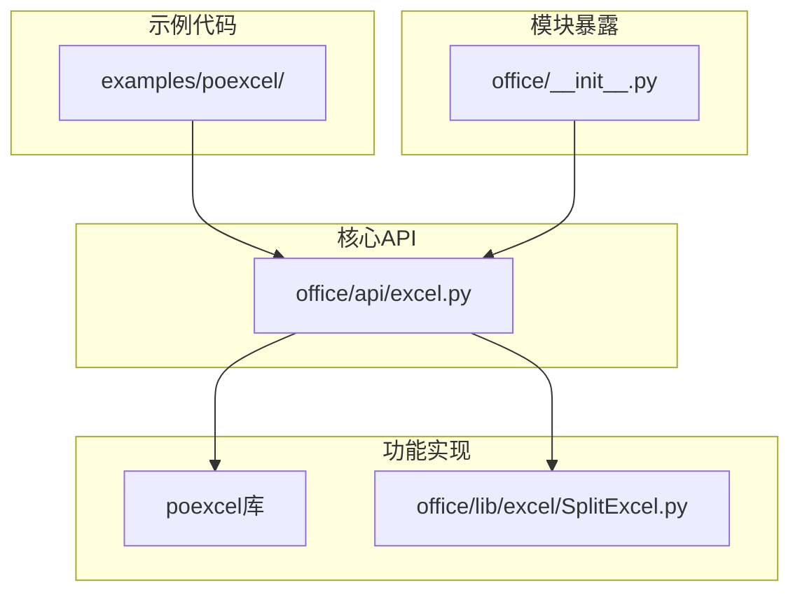
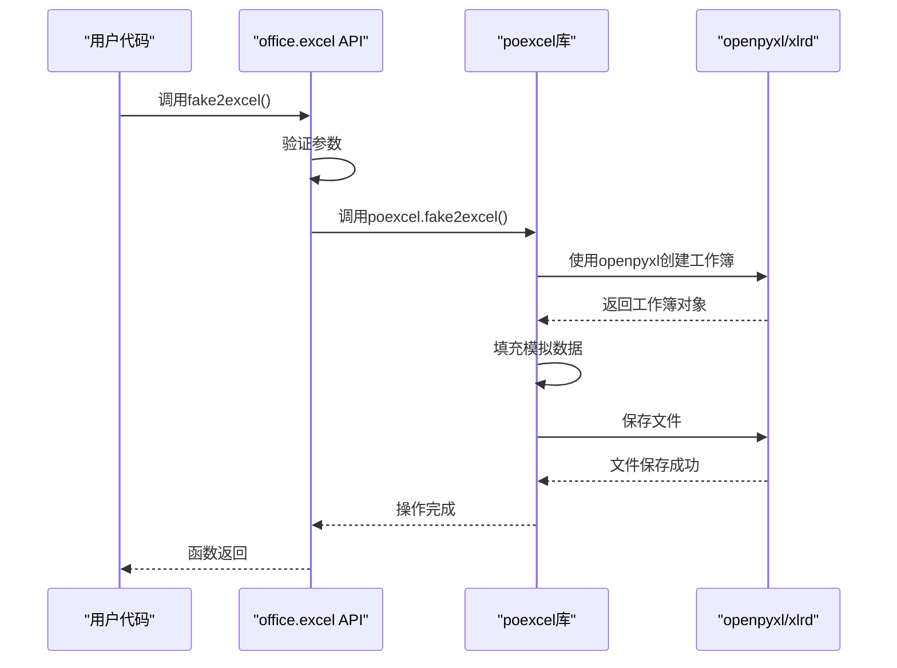
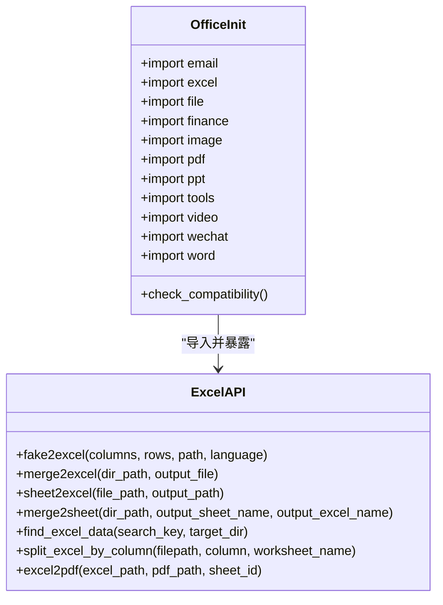

# Excel API

<cite>
**本文档中引用的文件**
- [excel.py](file://office/api/excel.py)
- [__init__.py](file://office/__init__.py)
- [创建Excel文件.py](file://examples/poexcel/创建Excel文件.py)
- [合并多个Excel到一个Excel的不同sheet中.py](file://examples/poexcel/合并多个Excel到一个Excel的不同sheet中.py)
- [根据指定的列，拆分excel.py](file://examples/poexcel/根据指定的列，拆分excel.py)
- [把100个Excel中符合条件的数据，汇总到1个Excel里.py](file://examples/poexcel/把100个Excel中符合条件的数据，汇总到1个Excel里.py)
- [SplitExcel.py](file://office/lib/excel/SplitExcel.py)
- [readme.md](file://examples/readme.md)
</cite>

## 目录
1. [简介](#简介)
2. [项目结构](#项目结构)
3. [核心功能](#核心功能)
4. [API接口定义](#api接口定义)
5. [使用示例](#使用示例)
6. [内部实现机制](#内部实现机制)
7. [性能优化建议](#性能优化建议)
8. [模块暴露机制](#模块暴露机制)
9. [结论](#结论)

## 简介
python-office库的Excel API模块提供了一套完整的Excel文件处理解决方案，旨在简化日常办公自动化任务。该模块封装了多种常用功能，包括创建带模拟数据的Excel文件、合并多个Excel文件、按条件拆分工作表、搜索内容等。通过简洁的函数接口，用户可以使用一行代码完成复杂的Excel操作，极大地提高了工作效率。本API基于openpyxl和pandas等成熟库构建，确保了功能的稳定性和可靠性。

## 项目结构
python-office项目的Excel相关功能分布在多个目录中，形成了清晰的层次结构。核心API定义在`office/api/excel.py`中，而具体实现则依赖于外部的`poexcel`库。示例代码位于`examples/poexcel/`目录下，为用户提供了丰富的使用参考。此外，项目还包含来自社区贡献者的功能实现，如`office/lib/excel/SplitExcel.py`中的拆分功能。这种结构设计使得核心接口保持简洁，同时允许功能的灵活扩展。



**图源**
- [excel.py](file://office/api/excel.py)
- [__init__.py](file://office/__init__.py)
- [SplitExcel.py](file://office/lib/excel/SplitExcel.py)

**本节来源**
- [excel.py](file://office/api/excel.py)
- [__init__.py](file://office/__init__.py)
- [SplitExcel.py](file://office/lib/excel/SplitExcel.py)

## 核心功能
Excel API模块提供了七个核心功能，覆盖了日常办公中最常见的Excel处理需求。首先是`fake2excel`函数，可以自动创建Excel文件并填充模拟数据，支持多种数据类型和语言。其次是文件合并功能，包括`merge2excel`（将多个文件合并到不同工作表）和`merge2sheet`（将多个文件内容合并到同一工作表）。文件拆分功能通过`sheet2excel`（按工作表拆分）和`split_excel_by_column`（按列值拆分）实现。此外，还提供了`find_excel_data`用于内容搜索，以及`excel2pdf`用于格式转换。这些功能共同构成了一个完整的Excel处理工具集。

**本节来源**
- [excel.py](file://office/api/excel.py)
- [readme.md](file://examples/readme.md)

## API接口定义
Excel API提供了清晰的函数接口，每个函数都有明确的参数定义和功能描述。以下是主要函数的接口定义：

### 创建与模拟数据
```markdown
**fake2excel**
- **功能**: 自动创建Excel文件并填充模拟数据
- **参数**:
  - columns (list): 列名列表，支持多种可模拟的数据类型
  - rows (int): 生成的数据行数，默认为1
  - path (str): 生成文件的路径和名称，默认为'./fake2excel.xlsx'
  - language (str): 数据语言，支持'zh_CN'（中文）和'english'
- **返回值**: None
```

### 文件合并
```markdown
**merge2excel**
- **功能**: 将多个Excel文件合并到一个文件的不同工作表中
- **参数**:
  - dir_path (str): 包含Excel文件的目录路径
  - output_file (str): 合并后文件的路径和名称，默认为'merge2excel.xlsx'
- **返回值**: None

**merge2sheet**
- **功能**: 将多个Excel文件的内容合并到同一个工作表中
- **参数**:
  - dir_path (str): 包含Excel文件的目录路径
  - output_sheet_name (str): 输出工作表名称，默认为'Sheet1'
  - output_excel_name (str): 输出Excel文件名称，默认为'merge2sheet'
- **返回值**: None
```

### 文件拆分
```markdown
**sheet2excel**
- **功能**: 将单个Excel文件中的不同工作表拆分为独立的文件
- **参数**:
  - file_path (str): 需要拆分的Excel文件路径
  - output_path (str): 拆分后文件的输出目录，默认为当前目录
- **返回值**: None

**split_excel_by_column**
- **功能**: 根据指定列的值将Excel文件拆分为多个文件
- **参数**:
  - filepath (str): 需要拆分的Excel文件路径
  - column (int): 用于拆分的列索引（从1开始）
  - worksheet_name (str, 可选): 指定工作表名称，默认为None表示第一个工作表
- **返回值**: None
```

### 内容搜索与格式转换
```markdown
**find_excel_data**
- **功能**: 在指定目录中搜索包含特定内容的Excel文件
- **参数**:
  - search_key (str): 需要搜索的关键词
  - target_dir (str): 搜索的目录路径
- **返回值**: None

**excel2pdf**
- **功能**: 将Excel文件转换为PDF格式
- **参数**:
  - excel_path (str): Excel文件的路径
  - pdf_path (str): 生成的PDF文件路径
  - sheet_id (int): 工作表索引，默认为0表示第一个工作表
- **返回值**: None
```

**本节来源**
- [excel.py](file://office/api/excel.py)

## 使用示例
以下是一些常见的使用场景和代码示例，展示了如何使用Excel API完成各种任务。

### 创建Excel文件
```python
import office

# 创建包含模拟数据的Excel文件
office.excel.fake2excel()
```
此代码将创建一个包含默认数据的Excel文件。用户可以通过指定参数来定制列名、行数、文件路径和语言。

### 合并多个Excel文件
```python
import office

# 将指定目录中的多个Excel文件合并到一个文件的不同工作表中
office.excel.merge2excel(dir_path=r'../../contributors/bulabean', 
                        output_file='test_merge2excel.xlsx')
```
此示例演示了如何将一个目录中的所有Excel文件合并到一个文件中，每个原始文件成为一个独立的工作表。

### 按列拆分Excel文件
```python
import poexcel

# 根据第一列的内容拆分Excel文件
poexcel.split_excel_by_column(
    filepath=r'D:\workplace\code\github\python-office\demo\poexcel\excel\split_excel_by_column.xlsx',
    column=1,
    worksheet_name='platform')
```
此代码将根据指定列的值将Excel文件拆分为多个文件，每个唯一值对应一个新文件。

### 汇总符合条件的数据
```python
import poexcel

# 从多个Excel文件中查询符合条件的数据并汇总
poexcel.query4excel(query_content='程序员晚枫',
                    query_path=r'必填，放Excel文件的位置')
```
此功能可以从大量Excel文件中提取包含特定内容的数据，并将结果汇总到一个文件中。

**本节来源**
- [创建Excel文件.py](file://examples/poexcel/创建Excel文件.py)
- [合并多个Excel到一个Excel的不同sheet中.py](file://examples/poexcel/合并多个Excel到一个Excel的不同sheet中.py)
- [根据指定的列，拆分excel.py](file://examples/poexcel/根据指定的列，拆分excel.py)
- [把100个Excel中符合条件的数据，汇总到1个Excel里.py](file://examples/poexcel/把100个Excel中符合条件的数据，汇总到1个Excel里.py)

## 内部实现机制
Excel API的内部实现采用了分层架构，上层API函数主要作为外部接口，负责参数验证和调用底层实现。实际的功能实现依赖于`poexcel`库和`office/lib/excel/SplitExcel.py`等模块。对于文件拆分功能，系统会根据文件扩展名（.xls或.xlsx）选择不同的处理方式：XLS文件使用`xlrd`和`xlwt`库处理，XLSX文件则使用`openpyxl`库。在处理大文件时，系统采用只读模式加载工作簿以减少内存占用，并使用生成器模式逐行处理数据。

数据处理方面，API充分利用了`pandas`库的强大功能。当需要进行复杂的数据操作时，会将Excel数据转换为DataFrame对象，利用pandas的高效算法进行处理，然后再写回Excel文件。这种设计既保证了功能的灵活性，又确保了处理效率。对于格式转换功能如Excel到PDF，系统会调用底层库的打印功能，将Excel工作表渲染为PDF文档。



**图源**
- [excel.py](file://office/api/excel.py)
- [SplitExcel.py](file://office/lib/excel/SplitExcel.py)

**本节来源**
- [excel.py](file://office/api/excel.py)
- [SplitExcel.py](file://office/lib/excel/SplitExcel.py)

## 性能优化建议
在处理大型Excel文件时，内存管理和处理效率是关键考虑因素。以下是一些性能优化建议：

1. **使用只读模式**: 当处理大型XLSX文件时，应使用`openpyxl`的只读模式加载工作簿，这可以显著减少内存占用。API在内部实现中已经采用了这一策略。

2. **分批处理**: 对于超大文件，建议将数据分批读取和处理，避免一次性加载所有数据到内存中。可以使用生成器模式逐行处理数据。

3. **选择合适的数据类型**: 在模拟数据时，选择合适的数据类型可以减少文件大小。例如，使用整数而不是字符串来存储数字数据。

4. **避免不必要的格式**: 纯数据文件比包含复杂格式的文件处理更快。如果不需要保留格式，可以在处理前清除不必要的样式。

5. **使用高效的库**: `pandas`在处理结构化数据方面比原生Excel库更高效。对于复杂的数据操作，建议先将数据转换为DataFrame进行处理。

6. **及时释放资源**: 在处理完文件后，应及时关闭工作簿对象，释放系统资源。

7. **并行处理**: 对于多个独立文件的处理任务，可以考虑使用多线程或多进程并行处理，充分利用多核CPU的优势。

**本节来源**
- [SplitExcel.py](file://office/lib/excel/SplitExcel.py)

## 模块暴露机制
Excel API通过`office/__init__.py`文件被暴露为`office.excel`接口。在`__init__.py`文件中，通过`from office.api import excel`语句将API模块导入到根命名空间。这种设计模式使得用户可以通过简洁的`import office`然后使用`office.excel.function_name()`的方式调用功能，而不需要了解底层的复杂目录结构。

模块的导入顺序也经过精心设计：首先导入兼容性检查模块，确保运行环境满足要求，然后依次导入各个功能模块。这种设计保证了库的稳定性和向后兼容性。API层作为抽象接口，屏蔽了底层实现的复杂性，即使底层实现发生变化，只要保持API接口不变，就不会影响用户的代码。



**图源**
- [__init__.py](file://office/__init__.py)
- [excel.py](file://office/api/excel.py)

**本节来源**
- [__init__.py](file://office/__init__.py)
- [excel.py](file://office/api/excel.py)

## 结论
python-office库的Excel API提供了一套功能强大且易于使用的Excel处理工具。通过简洁的函数接口，用户可以轻松完成创建、合并、拆分、搜索等常见任务。API设计合理，内部实现高效，充分利用了openpyxl、pandas等成熟库的优势。模块通过清晰的暴露机制，为用户提供了统一的访问接口。对于处理大型文件的场景，建议遵循性能优化建议，以确保最佳的处理效率。总体而言，这个API是办公自动化任务的有力工具，能够显著提高工作效率。