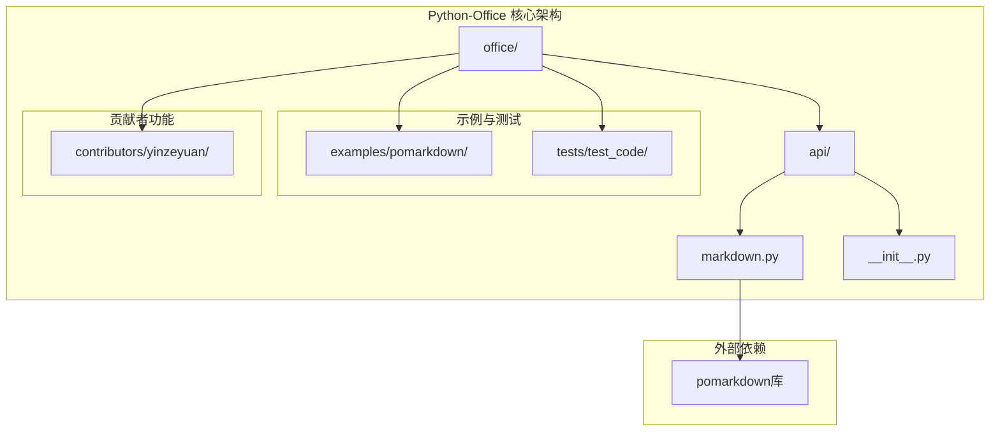
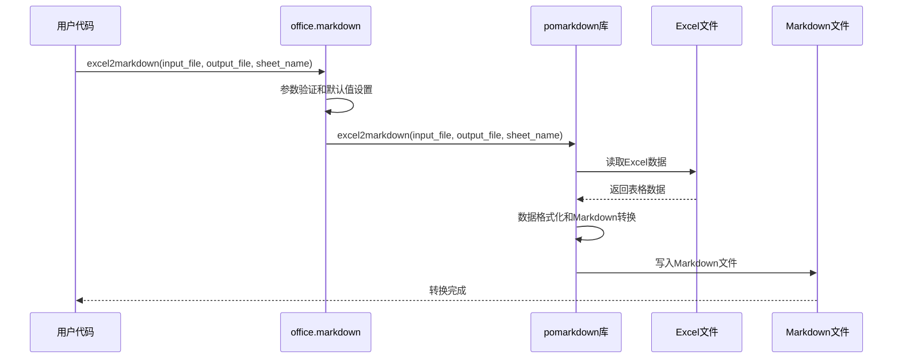
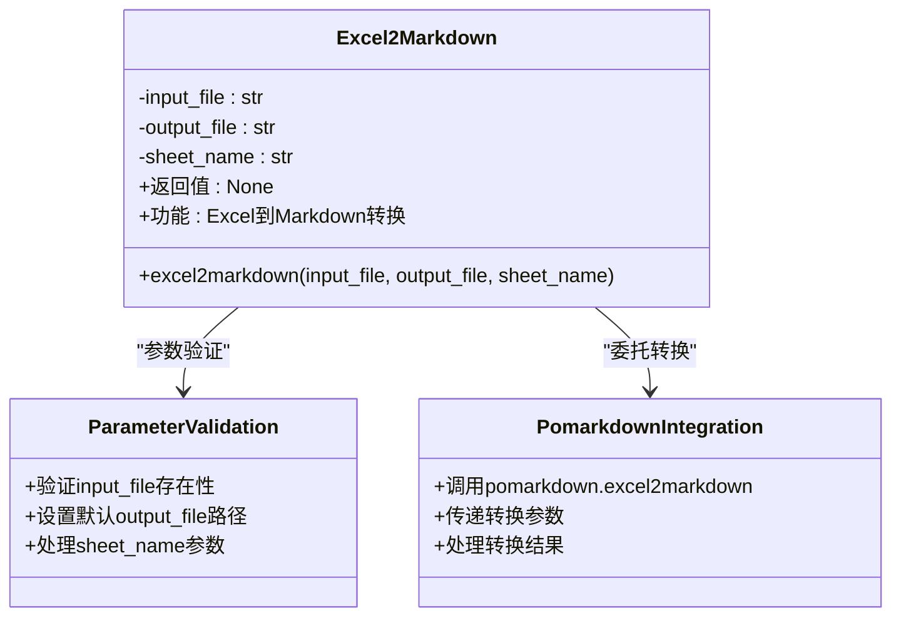
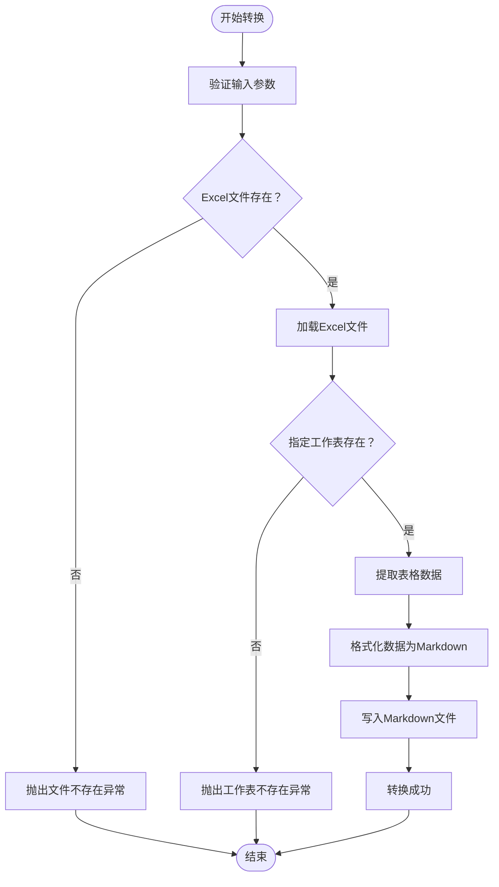
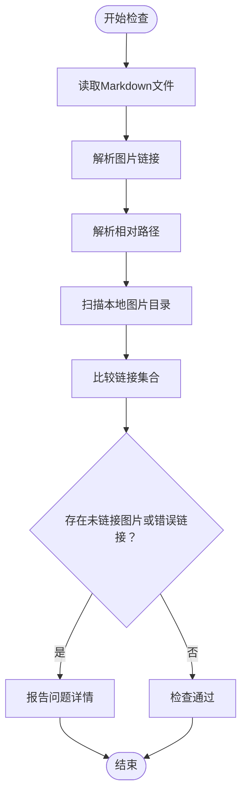
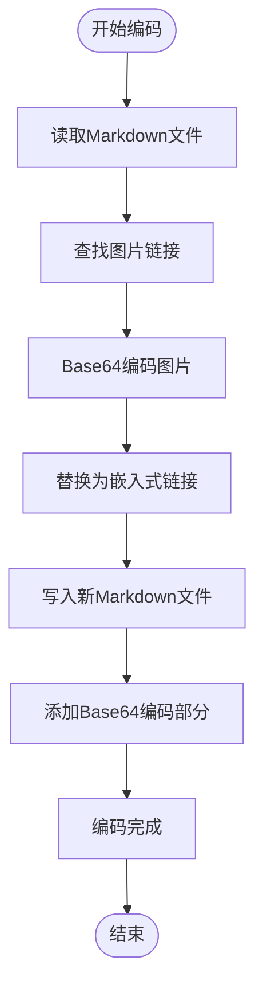
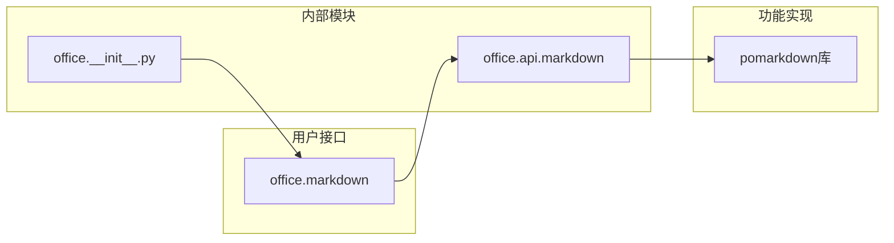
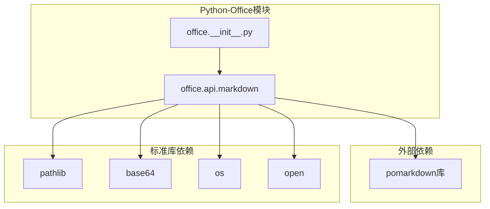

# Markdown处理API文档

<cite>
**本文档中引用的文件**
- [office/api/markdown.py](file://office/api/markdown.py)
- [office/__init__.py](file://office/__init__.py)
- [examples/pomarkdown/Excel转Markdown.py](file://examples/pomarkdown/Excel转Markdown.py)
- [tests/test_code/test_markdown.py](file://tests/test_code/test_markdown.py)
- [contributors/yinzeyuan/check_local_dir_image_link_markdown.py](file://contributors/yinzeyuan/check_local_dir_image_link_markdown.py)
- [contributors/yinzeyuan/markdown_link_image_to_base64.py](file://contributors/yinzeyuan/markdown_link_image_to_base64.py)
- [README.md](file://README.md)
</cite>

## 目录
1. [简介](#简介)
2. [项目结构](#项目结构)
3. [核心组件](#核心组件)
4. [架构概览](#架构概览)
5. [详细组件分析](#详细组件分析)
6. [依赖分析](#依赖分析)
7. [性能考虑](#性能考虑)
8. [故障排除指南](#故障排除指南)
9. [结论](#结论)

## 简介

Python-Office库的Markdown处理API模块提供了强大的文档生成和转换功能。该模块主要通过`office.api.markdown`模块实现，其中最核心的功能是将Excel表格数据转换为Markdown格式的文本，满足自动化文档生成的需求。

该模块的设计理念是简化复杂的文档处理流程，让用户能够通过简单的API调用来完成复杂的转换任务。通过集成pomarkdown库，该模块提供了稳定可靠的Markdown转换能力。

## 项目结构

Python-Office库采用模块化的架构设计，Markdown处理功能位于专门的API模块中：

**图表来源**
- [office/api/markdown.py](file://office/api/markdown.py#L1-L21)
- [office/__init__.py](file://office/__init__.py#L1-L30)

**章节来源**
- [office/api/markdown.py](file://office/api/markdown.py#L1-L21)
- [office/__init__.py](file://office/__init__.py#L1-L30)

## 核心组件

Markdown处理API模块的核心组件包括：

### excel2markdown函数
这是模块的主要入口点，负责将Excel文件转换为Markdown格式。该函数封装了底层的pomarkdown库功能，提供了简洁易用的接口。

### pomarkdown库集成
模块通过导入pomarkdown库来实现具体的转换逻辑，这种设计模式确保了功能的稳定性和可靠性。

**章节来源**
- [office/api/markdown.py](file://office/api/markdown.py#L4-L20)

## 架构概览

Markdown处理API的整体架构体现了清晰的分层设计理念：

**图表来源**
- [office/api/markdown.py](file://office/api/markdown.py#L4-L20)
- [examples/pomarkdown/Excel转Markdown.py](file://examples/pomarkdown/Excel转Markdown.py#L53-L57)

## 详细组件分析

### excel2markdown函数详解

#### 函数签名和参数说明

**图表来源**
- [office/api/markdown.py](file://office/api/markdown.py#L4-L20)

#### 参数详细说明

| 参数名 | 类型 | 默认值 | 必需 | 描述 |
|--------|------|--------|------|------|
| input_file | str | - | 是 | 输入Excel文件的完整路径 |
| output_file | str | './excel2markdown.md' | 否 | 输出Markdown文件的路径 |
| sheet_name | str | None | 否 | 要转换的工作表名称，None表示转换所有工作表 |

#### 数据转换流程

**图表来源**
- [office/api/markdown.py](file://office/api/markdown.py#L18-L20)

**章节来源**
- [office/api/markdown.py](file://office/api/markdown.py#L4-L20)

### 辅助Markdown处理功能

除了核心的Excel到Markdown转换功能外，项目还包含了其他有用的Markdown处理工具：

#### 图片链接检查器

该功能用于验证Markdown文件中的图片链接与本地图片目录的对应关系：

**图表来源**
- [contributors/yinzeyuan/check_local_dir_image_link_markdown.py](file://contributors/yinzeyuan/check_local_dir_image_link_markdown.py#L5-L64)

#### 图片Base64编码器

该工具将Markdown文件中的图片链接转换为Base64编码，便于嵌入式使用：

**图表来源**
- [contributors/yinzeyuan/markdown_link_image_to_base64.py](file://contributors/yinzeyuan/markdown_link_image_to_base64.py#L5-L46)

**章节来源**
- [contributors/yinzeyuan/check_local_dir_image_link_markdown.py](file://contributors/yinzeyuan/check_local_dir_image_link_markdown.py#L5-L64)
- [contributors/yinzeyuan/markdown_link_image_to_base64.py](file://contributors/yinzeyuan/markdown_link_image_to_base64.py#L5-L46)

### 模块暴露机制

Markdown功能通过Python-Office的统一接口暴露给用户：

**图表来源**
- [office/__init__.py](file://office/__init__.py#L18)
- [office/api/markdown.py](file://office/api/markdown.py#L1)

**章节来源**
- [office/__init__.py](file://office/__init__.py#L18)
- [office/api/markdown.py](file://office/api/markdown.py#L1)

## 依赖分析

Markdown处理API模块的依赖关系体现了良好的模块化设计：

**图表来源**
- [office/api/markdown.py](file://office/api/markdown.py#L1)
- [contributors/yinzeyuan/check_local_dir_image_link_markdown.py](file://contributors/yinzeyuan/check_local_dir_image_link_markdown.py#L2)
- [contributors/yinzeyuan/markdown_link_image_to_base64.py](file://contributors/yinzeyuan/markdown_link_image_to_base64.py#L1)

**章节来源**
- [office/api/markdown.py](file://office/api/markdown.py#L1)
- [contributors/yinzeyuan/check_local_dir_image_link_markdown.py](file://contributors/yinzeyuan/check_local_dir_image_link_markdown.py#L2)
- [contributors/yinzeyuan/markdown_link_image_to_base64.py](file://contributors/yinzeyuan/markdown_link_image_to_base64.py#L1)

## 性能考虑

在处理大型Excel文件时，需要注意以下性能优化策略：

1. **内存管理**：对于大文件，建议分批处理或限制同时加载的工作表数量
2. **缓存机制**：合理利用pomarkdown库的内部缓存功能
3. **文件I/O优化**：避免频繁的文件读写操作
4. **并发处理**：对于多个文件的转换，可以考虑使用多线程或异步处理

## 故障排除指南

### 常见问题及解决方案

#### 1. 文件路径问题
- **问题**：找不到输入的Excel文件
- **解决方案**：确保提供正确的绝对路径或相对路径

#### 2. 权限问题
- **问题**：无法写入输出文件
- **解决方案**：检查目标目录的写入权限

#### 3. 数据格式问题
- **问题**：Excel数据格式不支持
- **解决方案**：确保Excel文件包含有效的表格数据

**章节来源**
- [tests/test_code/test_markdown.py](file://tests/test_code/test_markdown.py#L18-L22)

## 结论

Python-Office库的Markdown处理API模块提供了一个完整而强大的文档转换解决方案。通过简洁的API设计和稳定的底层实现，该模块能够满足各种自动化文档生成的需求。

主要优势包括：
- **简单易用**：一行代码即可完成复杂的转换任务
- **功能完整**：支持多种Markdown处理场景
- **扩展性强**：模块化设计便于功能扩展
- **稳定性高**：基于成熟的pomarkdown库实现

该模块特别适用于需要将Excel数据转换为Markdown格式的自动化办公场景，为开发者提供了高效可靠的解决方案。