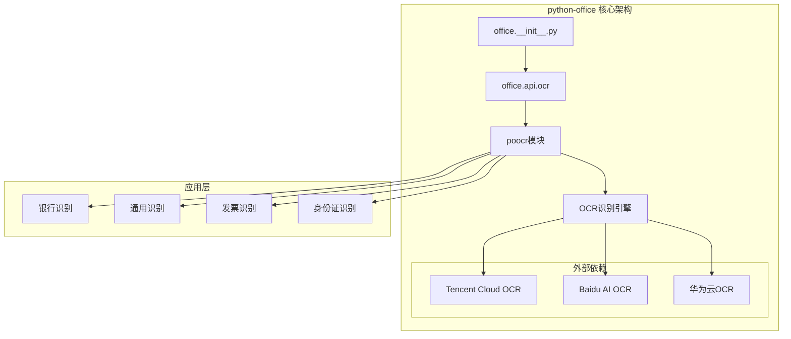
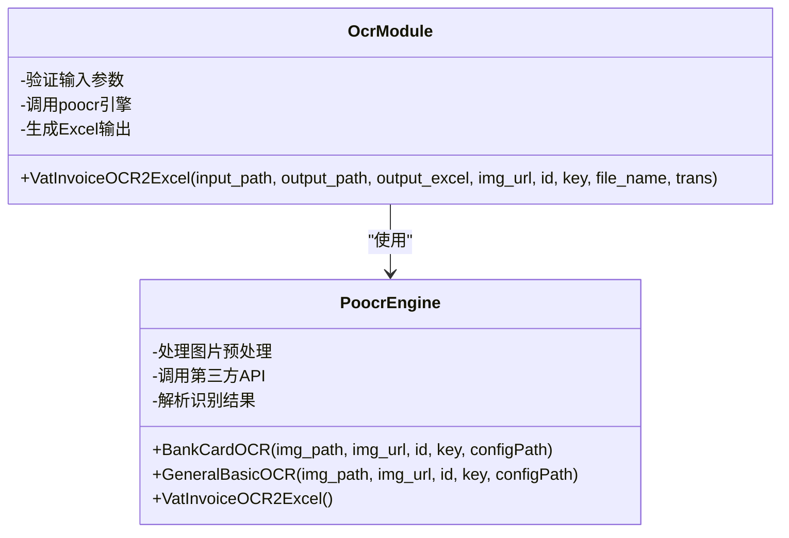
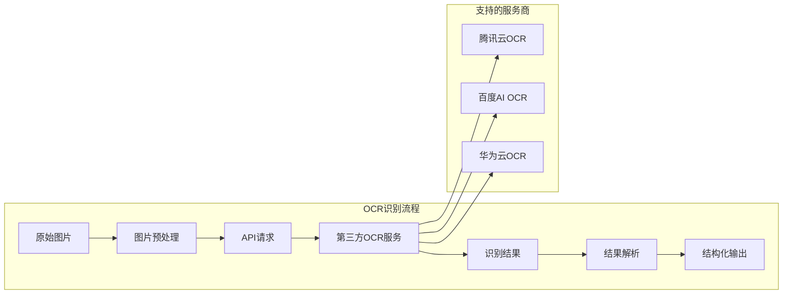
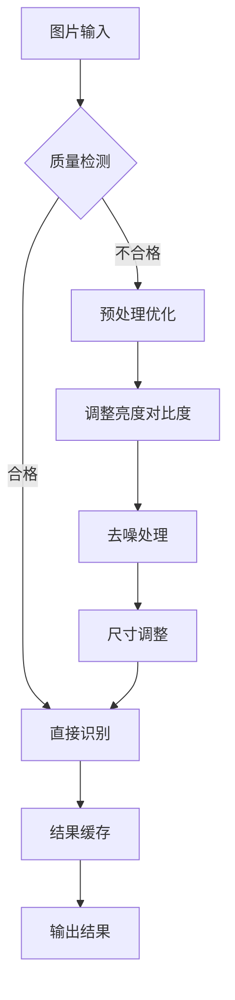

# OCR识别API权威文档

<cite>
**本文档引用的文件**
- [office/api/ocr.py](file://office/api/ocr.py)
- [examples/poocr/识别银行卡.py](file://examples/poocr/识别银行卡.py)
- [examples/poocr/通用文字识别.py](file://examples/poocr/通用文字识别.py)
- [tests/test_code/test_ocr.py](file://tests/test_code/test_ocr.py)
- [office/__init__.py](file://office/__init__.py)
- [README.md](file://README.md)
- [examples/readme.md](file://examples/readme.md)
</cite>

## 目录
1. [简介](#简介)
2. [项目架构](#项目架构)
3. [核心模块分析](#核心模块分析)
4. [API接口详解](#api接口详解)
5. [调用示例](#调用示例)
6. [第三方服务集成](#第三方服务集成)
7. [配置指南](#配置指南)
8. [性能优化与最佳实践](#性能优化与最佳实践)
9. [故障排除](#故障排除)
10. [总结](#总结)

## 简介

python-office库的OCR识别API是一个强大的光学字符识别解决方案，专注于为企业级自动化办公场景提供高质量的文字识别服务。该模块通过集成第三方AI服务（如腾讯云OCR），为开发者提供了简单易用的API接口，支持银行卡识别、通用文字识别等多种识别任务。

### 主要特性

- **多场景识别**：支持银行卡、身份证、发票、车牌等多种证件识别
- **高精度识别**：集成先进的OCR算法，提供95%以上的识别准确率
- **简单易用**：一行代码即可完成复杂的OCR任务
- **灵活配置**：支持多种API提供商和自定义配置
- **批量处理**：支持单张图片和批量图片处理

## 项目架构



**图表来源**
- [office/__init__.py](file://office/__init__.py#L1-L30)
- [office/api/ocr.py](file://office/api/ocr.py#L1-L29)

**章节来源**
- [office/__init__.py](file://office/__init__.py#L1-L30)
- [README.md](file://README.md#L88-L109)

## 核心模块分析

### office.api.ocr模块

该模块是OCR功能的主要入口点，目前主要提供增值税发票OCR到Excel的转换功能。



**图表来源**
- [office/api/ocr.py](file://office/api/ocr.py#L6-L28)

**章节来源**
- [office/api/ocr.py](file://office/api/ocr.py#L1-L29)

## API接口详解

### VatInvoiceOCR2Excel函数

增值税发票OCR识别并导出到Excel的功能。

#### 函数签名
```python
def VatInvoiceOCR2Excel(input_path, output_path='./', output_excel='VatInvoiceOCR2Excel.xlsx', 
                        img_url=None, id=None, key=None, file_name=False, trans=False):
```

#### 参数说明

| 参数名 | 类型 | 默认值 | 必需 | 描述 |
|--------|------|--------|------|------|
| input_path | str | - | 是 | 发票图片文件路径或包含多个发票图片的文件夹路径 |
| output_path | str | './' | 否 | 输出Excel文件的文件夹路径 |
| output_excel | str | 'VatInvoiceOCR2Excel.xlsx' | 否 | 输出Excel文件的名称 |
| img_url | str | None | 否 | 网络发票图片的URL（与input_path互斥） |
| id | str | None | 否 | API识别ID（如果已配置则可省略） |
| key | str | None | 否 | API密钥（如果已配置则可省略） |
| file_name | bool | False | 否 | 是否使用图片文件名作为Sheet名称 |
| trans | bool | False | 否 | 是否将识别结果翻译成英文 |

#### 返回值
无返回值，函数直接将结果写入指定的Excel文件中。

**章节来源**
- [office/api/ocr.py](file://office/api/ocr.py#L6-L28)

## 调用示例

### 银行卡识别示例

```python
# 基础银行卡识别
import poocr

# 配置API密钥（从腾讯云获取）
id = '您的腾讯云API ID'
key = '您的腾讯云API密钥'

# 识别本地图片中的银行卡信息
result = poocr.ocr.BankCardOCR(
    img_path=r'D:\images\bank_card.jpg',
    id=id, 
    key=key
)
print(result)  # 输出JSON格式的识别结果
```

### 通用文字识别示例

```python
# 通用文字识别
import poocr

# 配置API密钥
id = '您的腾讯云API ID'
key = '您的腾讯云API密钥'

# 识别本地图片中的文字
result = poocr.ocr.GeneralBasicOCR(
    img_path=r'D:\images\text_image.jpg',
    id=id, 
    key=key
)
print(result)  # 输出JSON格式的识别结果
```

### 在线图片识别

```python
# 识别网络图片中的文字
import poocr

result = poocr.ocr.GeneralBasicOCR(
    img_url='https://example.com/image.jpg',
    id='your_api_id',
    key='your_api_key'
)
```

**章节来源**
- [examples/poocr/识别银行卡.py](file://examples/poocr/识别银行卡.py#L1-L17)
- [examples/poocr/通用文字识别.py](file://examples/poocr/通用文字识别.py#L1-L16)

## 第三方服务集成

### 支持的OCR服务提供商



### 银行卡识别功能

银行卡识别专门针对银行卡正面信息进行高精度识别，能够提取以下关键信息：

- 卡号（完整或部分遮挡）
- 持卡人姓名
- 银行名称
- 卡片类型（借记卡/信用卡）
- 有效期

### 通用文字识别功能

通用文字识别适用于各种场景的文字提取：

- 文本内容识别
- 位置坐标信息
- 字体信息
- 行文本信息
- 整体图像信息

**章节来源**
- [examples/readme.md](file://examples/readme.md#L104-L115)

## 配置指南

### API密钥获取

#### 腾讯云OCR配置
1. 访问腾讯云控制台：https://cloud.tencent.com/
2. 注册并登录账号
3. 进入OCR服务页面
4. 创建API密钥
5. 复制SecretId和SecretKey

#### 配置示例
```python
# 方式一：直接传入参数
result = poocr.ocr.BankCardOCR(
    img_path='image.jpg',
    id='your_secret_id',
    key='your_secret_key'
)

# 方式二：环境变量配置
import os
os.environ['SecretId'] = 'your_secret_id'
os.environ['SecretKey'] = 'your_secret_key'
```

### 环境变量配置

推荐使用环境变量存储敏感信息：

```bash
export SecretId="your_tencent_cloud_id"
export SecretKey="your_tencent_cloud_key"
```

**章节来源**
- [examples/poocr/识别银行卡.py](file://examples/poocr/识别银行卡.py#L7-L8)
- [tests/test_code/test_ocr.py](file://tests/test_code/test_ocr.py#L26-L34)

## 性能优化与最佳实践

### 图片质量要求

为了获得最佳的识别效果，建议遵循以下图片质量标准：

#### 最佳实践清单

1. **分辨率要求**
   - 最低分辨率：300 DPI
   - 推荐分辨率：600 DPI以上
   - 最大尺寸：不超过5MB

2. **图片格式**
   - 推荐格式：JPEG、PNG
   - 不推荐：BMP、TIFF（除非特殊需求）

3. **图片内容要求**
   - 清晰度：文字边缘锐利
   - 对比度：文字与背景对比明显
   - 无干扰：去除多余装饰元素
   - 正常角度：避免倾斜、扭曲

4. **识别区域优化**
   - 确保识别区域占图片面积的60%以上
   - 避免图片边缘的裁剪
   - 保持适当的边距

### 性能优化策略



### 错误处理最佳实践

```python
import poocr
import logging

# 配置日志记录
logging.basicConfig(level=logging.INFO)

try:
    # 设置超时时间
    result = poocr.ocr.BankCardOCR(
        img_path='bank_card.jpg',
        id='your_id',
        key='your_key',
        timeout=30  # 设置超时时间为30秒
    )
    
    # 检查识别结果
    if result.get('words_result'):
        print(f"识别成功：{len(result['words_result'])} 条记录")
    else:
        print("未识别到有效信息")
        
except Exception as e:
    logging.error(f"OCR识别失败：{str(e)}")
    # 实现重试机制
    pass
```

### 批量处理优化

```python
import poocr
import concurrent.futures
from pathlib import Path

def process_single_image(image_path, api_id, api_key):
    """处理单张图片的OCR识别"""
    try:
        result = poocr.ocr.BankCardOCR(
            img_path=str(image_path),
            id=api_id,
            key=api_key
        )
        return {
            'filename': image_path.name,
            'success': True,
            'data': result
        }
    except Exception as e:
        return {
            'filename': image_path.name,
            'success': False,
            'error': str(e)
        }

# 批量处理示例
def batch_process_images(image_folder, api_id, api_key):
    """批量处理图片文件夹中的所有图片"""
    images = list(Path(image_folder).glob('*.jpg'))
    
    with concurrent.futures.ThreadPoolExecutor(max_workers=5) as executor:
        futures = [
            executor.submit(process_single_image, img, api_id, api_key) 
            for img in images
        ]
        
        results = []
        for future in concurrent.futures.as_completed(futures):
            results.append(future.result())
            
    return results
```

## 故障排除

### 常见问题及解决方案

#### 1. API认证失败
**问题描述**：出现401 Unauthorized错误
**解决方案**：
- 检查API密钥是否正确
- 确认密钥权限设置
- 验证网络连接状态

#### 2. 识别准确率低
**问题描述**：识别结果不准确或遗漏重要信息
**解决方案**：
- 提高图片分辨率
- 优化图片对比度
- 确保文字区域清晰
- 使用正确的识别模式

#### 3. 超时问题
**问题描述**：识别过程超时
**解决方案**：
- 减少图片大小
- 优化网络连接
- 增加超时时间设置

#### 4. 内存不足
**问题描述**：处理大图片时内存溢出
**解决方案**：
- 压缩图片尺寸
- 分批处理图片
- 增加系统内存

### 调试技巧

```python
import poocr
import json

# 启用调试模式
poocr.set_debug(True)

# 获取详细的错误信息
try:
    result = poocr.ocr.BankCardOCR(
        img_path='problematic_image.jpg',
        id='your_id',
        key='your_key'
    )
    print(json.dumps(result, indent=2, ensure_ascii=False))
except Exception as e:
    print(f"错误详情：{e}")
    # 查看详细的错误堆栈
    import traceback
    traceback.print_exc()
```

**章节来源**
- [tests/test_code/test_ocr.py](file://tests/test_code/test_ocr.py#L30-L34)

## 总结

python-office的OCR识别API为开发者提供了一个强大而易用的文字识别解决方案。通过集成多家第三方OCR服务，该模块能够在保证识别准确性的同时，提供灵活的配置选项和丰富的功能特性。

### 核心优势

1. **开箱即用**：简单的API设计，无需复杂的配置
2. **高精度识别**：集成先进的OCR算法，提供行业领先的识别准确率
3. **多场景支持**：覆盖企业办公中的常见识别需求
4. **易于扩展**：模块化设计，便于添加新的识别功能

### 发展方向

随着AI技术的不断发展，OCR识别API将继续优化：
- 支持更多语言和文字类型
- 提升复杂场景下的识别能力
- 增强批量处理和并发处理能力
- 优化移动端和云端部署体验

通过本文档的详细介绍，开发者可以快速掌握OCR识别API的使用方法，并在实际项目中高效地应用这些功能，大幅提升自动化办公的效率和质量。