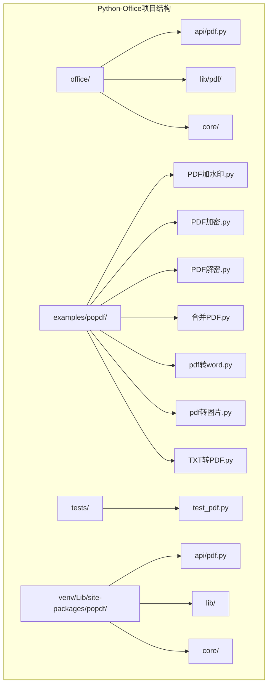
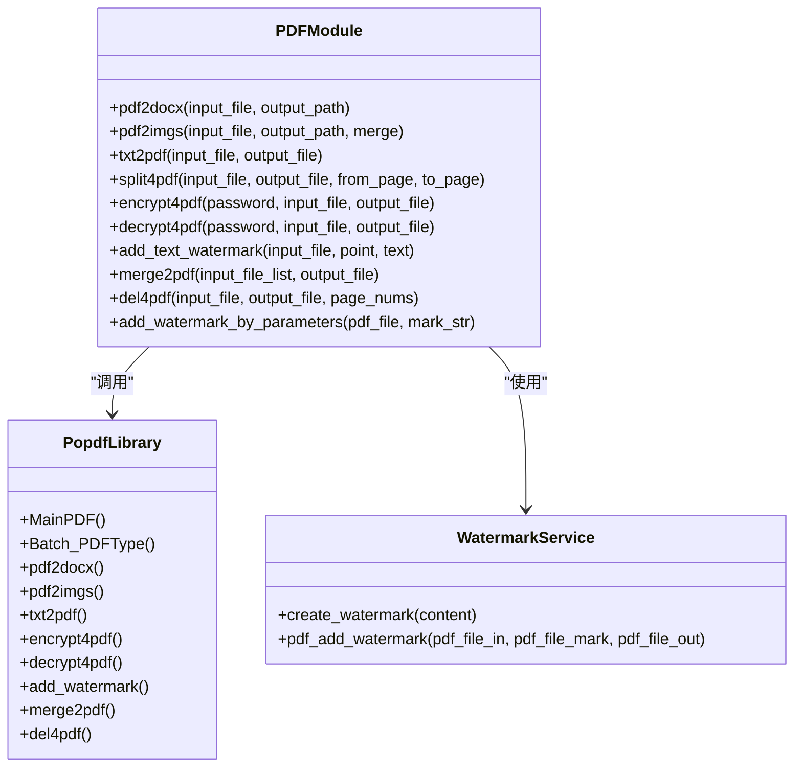
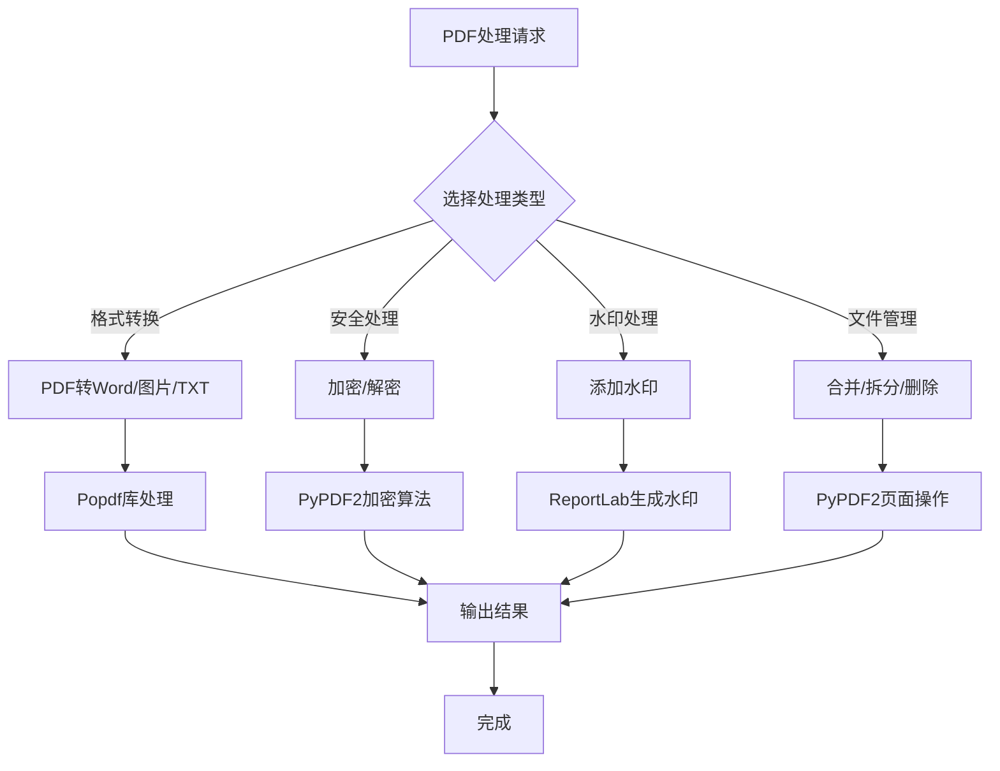
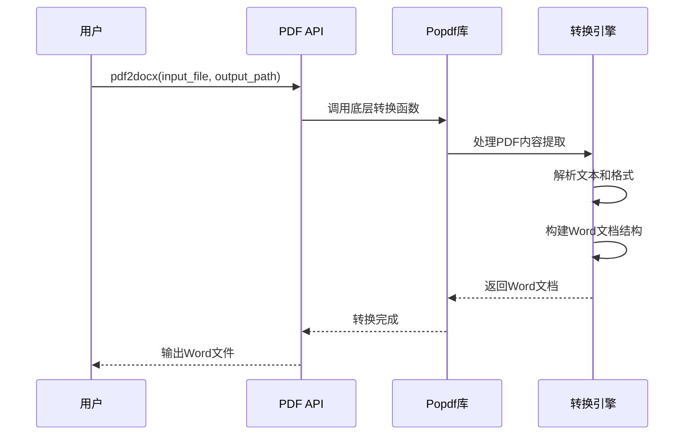
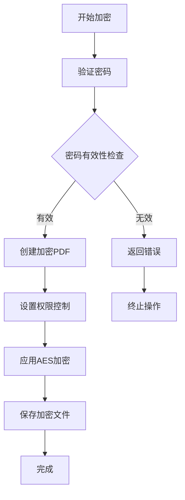
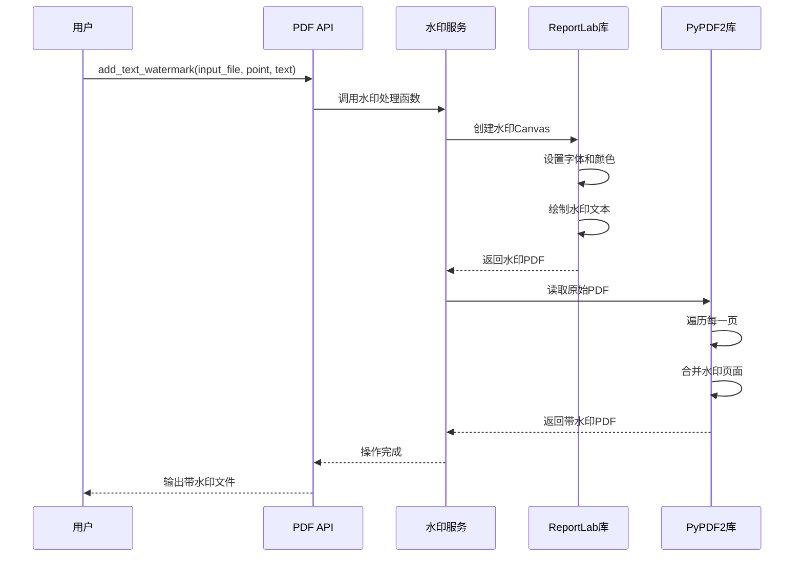
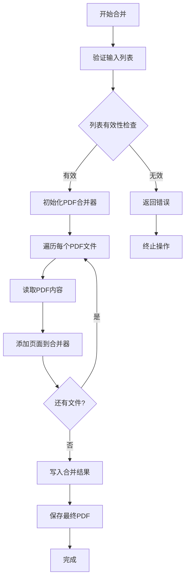
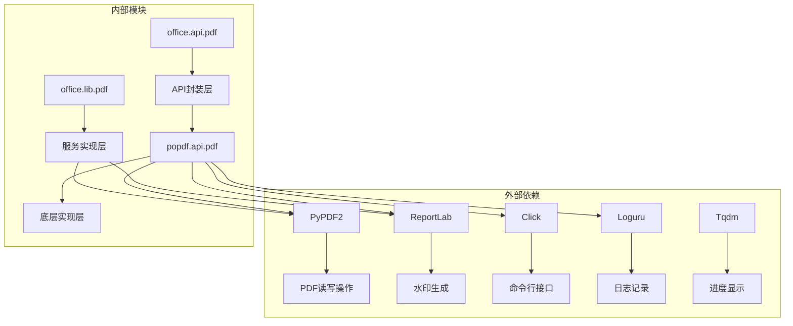

# PDF处理API文档

<cite>
**本文档中引用的文件**
- [office/api/pdf.py](file://office/api/pdf.py)
- [examples/popdf/PDF加水印.py](file://examples/popdf/PDF加水印.py)
- [examples/popdf/PDF加密.py](file://examples/popdf/PDF加密.py)
- [examples/popdf/PDF解密.py](file://examples/popdf/PDF解密.py)
- [examples/popdf/合并PDF.py](file://examples/popdf/合并PDF.py)
- [examples/popdf/pdf转word.py](file://examples/popdf/pdf转word.py)
- [examples/popdf/pdf转图片.py](file://examples/popdf/pdf转图片.py)
- [examples/popdf/TXT转PDF.py](file://examples/popdf/TXT转PDF.py)
- [office/lib/pdf/add_watermark_service.py](file://office/lib/pdf/add_watermark_service.py)
- [venv/Lib/site-packages/popdf/api/pdf.py](file://venv/Lib/site-packages/popdf/api/pdf.py)
- [tests/test_code/test_pdf.py](file://tests/test_code/test_pdf.py)
</cite>

## 目录
1. [简介](#简介)
2. [项目结构](#项目结构)
3. [核心组件](#核心组件)
4. [架构概览](#架构概览)
5. [详细组件分析](#详细组件分析)
6. [依赖关系分析](#依赖关系分析)
7. [性能考虑](#性能考虑)
8. [故障排除指南](#故障排除指南)
9. [结论](#结论)

## 简介

Python-Office项目提供了一套完整的PDF处理API，通过`office.api.pdf`模块实现了丰富的PDF文件处理功能。该模块基于PyPDF2、pdfplumber等底层库，提供了包括格式转换、加密解密、水印添加、文件合并等在内的全面PDF处理能力。

### 主要功能特性

- **格式转换**: PDF ↔ Word、PDF ↔ 图片、TXT ↔ PDF
- **安全功能**: PDF加密与解密
- **水印处理**: 文本水印和图片水印添加
- **文件管理**: PDF合并、拆分、删除指定页面
- **批量处理**: 支持批量文件操作

## 项目结构



**图表来源**
- [office/api/pdf.py](file://office/api/pdf.py#L1-L226)
- [examples/popdf/PDF加水印.py](file://examples/popdf/PDF加水印.py#L1-L7)

**章节来源**
- [office/api/pdf.py](file://office/api/pdf.py#L1-L25)
- [examples/popdf/PDF加水印.py](file://examples/popdf/PDF加水印.py#L1-L7)

## 核心组件

### PDF处理模块架构



**图表来源**
- [office/api/pdf.py](file://office/api/pdf.py#L25-L226)
- [office/lib/pdf/add_watermark_service.py](file://office/lib/pdf/add_watermark_service.py#L1-L73)

**章节来源**
- [office/api/pdf.py](file://office/api/pdf.py#L1-L226)
- [office/lib/pdf/add_watermark_service.py](file://office/lib/pdf/add_watermark_service.py#L1-L73)

## 架构概览

### 内部工作流程



**图表来源**
- [office/api/pdf.py](file://office/api/pdf.py#L25-L226)
- [venv/Lib/site-packages/popdf/api/pdf.py](file://venv/Lib/site-packages/popdf/api/pdf.py#L1-L240)

## 详细组件分析

### 1. PDF格式转换功能

#### PDF转Word转换



**图表来源**
- [office/api/pdf.py](file://office/api/pdf.py#L28-L41)
- [venv/Lib/site-packages/popdf/api/pdf.py](file://venv/Lib/site-packages/popdf/api/pdf.py#L17-L43)

**参数说明**:
- `input_file`: 输入的PDF文件路径
- `output_path`: 输出Word文件的保存路径，默认为当前目录

**使用示例**:
```python
# 单文件转换
office.pdf.pdf2docx(
    input_file=r'D:\pdf\程序员晚枫.pdf',
    output_path=r'D:\download'
)

# 批量转换（通过popdf库）
import popdf
popdf.pdf2docx(
    input_path=r'./test_files/pdf2docx/input',
    output_path=r'./test_files/pdf2docx/output'
)
```

#### PDF转图片转换

**参数说明**:
- `input_file`: PDF文件路径
- `output_path`: 图片输出目录
- `merge` (可选): 是否将所有页面合并为单张图片，默认为False

**章节来源**
- [office/api/pdf.py](file://office/api/pdf.py#L43-L56)
- [examples/popdf/pdf转图片.py](file://examples/popdf/pdf转图片.py#L1-L13)

### 2. PDF加密解密功能

#### 加密功能实现



**图表来源**
- [office/api/pdf.py](file://office/api/pdf.py#L92-L111)
- [venv/Lib/site-packages/popdf/api/pdf.py](file://venv/Lib/site-packages/popdf/api/pdf.py#L122-L129)

**参数说明**:
- `password`: 加密密码
- `input_file`: 输入PDF文件名（包含路径）
- `output_file`: 输出加密PDF文件名（包含路径）
- `input_path`: 输入文件的完整路径
- `output_path`: 输出文件的完整路径

**使用示例**:
```python
# 单文件加密
office.pdf.encrypt4pdf(
    password='secure_password',
    input_file='./test_files/encrypt4pdf/文档.pdf',
    output_file='./test_files/encrypt4pdf/加密文档.pdf'
)

# 批量加密
office.pdf.encrypt4pdf(
    password='batch_password',
    input_path='./test_files/encrypt4pdf/input/',
    output_path='./test_files/encrypt4pdf/output/'
)
```

#### 解密功能实现

**参数说明**:
- `password`: 解密密码
- `input_file`: 输入加密PDF文件名
- `output_file`: 输出解密PDF文件名
- `input_path`: 输入文件的完整路径
- `output_path`: 输出文件的完整路径

**使用示例**:
```python
# 单文件解密
office.pdf.decrypt4pdf(
    password='secure_password',
    input_file='./test_files/encrypt4pdf/加密文档.pdf',
    output_file='./test_files/encrypt4pdf/解密文档.pdf'
)

# 批量解密
office.pdf.decrypt4pdf(
    password='batch_password',
    input_path='./test_files/encrypt4pdf/input/',
    output_path='./test_files/encrypt4pdf/output/'
)
```

**章节来源**
- [office/api/pdf.py](file://office/api/pdf.py#L92-L131)
- [examples/popdf/PDF加密.py](file://examples/popdf/PDF加密.py#L1-L27)
- [examples/popdf/PDF解密.py](file://examples/popdf/PDF解密.py#L1-L7)

### 3. 水印添加功能

#### 文本水印添加



**图表来源**
- [office/api/pdf.py](file://office/api/pdf.py#L133-L152)
- [office/lib/pdf/add_watermark_service.py](file://office/lib/pdf/add_watermark_service.py#L10-L73)

**参数说明**:
- `input_file`: PDF文件路径
- `point`: 水印位置坐标 (x, y)
- `text`: 水印文本内容，默认为'python-office'
- `output_file`: 输出PDF文件路径
- `fontname`: 字体名称，默认为'Helvetica'
- `fontsize`: 字体大小，默认为12
- `color`: 字体颜色，默认为红色(1, 0, 0)

**使用示例**:
```python
# 基础文本水印
office.pdf.add_text_watermark(
    input_file='./test_files/add_mark/原文件.pdf',
    point=(300, 500),
    text='机密文件',
    output_file='./test_files/add_mark/带水印文件.pdf',
    fontname='SimSun',
    fontsize=24,
    color=(0.5, 0.5, 0.5)
)

# 参数化水印
office.pdf.add_watermark_by_parameters(
    pdf_file='./test_files/add_mark/原文件.pdf',
    mark_str='版权所有 © 2024',
    output_path='./test_files/add_mark/output/',
    output_file_name='带水印文件.pdf'
)
```

#### 图片水印添加

**参数说明**:
- `pdf_file_in`: 输入PDF文件路径
- `pdf_file_mark`: 水印图片文件路径
- `pdf_file_out`: 输出PDF文件路径

**章节来源**
- [office/api/pdf.py](file://office/api/pdf.py#L133-L226)
- [examples/popdf/PDF加水印.py](file://examples/popdf/PDF加水印.py#L1-L7)

### 4. PDF合并功能

#### 文件合并流程



**图表来源**
- [office/api/pdf.py](file://office/api/pdf.py#L155-L167)
- [venv/Lib/site-packages/popdf/api/pdf.py](file://venv/Lib/site-packages/popdf/api/pdf.py#L180-L186)

**参数说明**:
- `input_file_list`: PDF文件路径列表
- `output_file`: 合并后的PDF文件路径

**使用示例**:
```python
# 合并多个PDF文件
office.pdf.merge2pdf(
    input_file_list=[
        './test_files/popdf/文档1.pdf',
        './test_files/popdf/文档2.pdf',
        './test_files/popdf/文档3.pdf'
    ],
    output_file='./test_files/popdf/合并结果.pdf'
)
```

**章节来源**
- [office/api/pdf.py](file://office/api/pdf.py#L155-L167)
- [examples/popdf/合并PDF.py](file://examples/popdf/合并PDF.py#L1-L25)

### 5. 文本转PDF功能

#### TXT转PDF转换

**参数说明**:
- `input_file`: 文本文件路径
- `output_file`: 输出PDF文件路径，默认为'txt2pdf.pdf'

**使用示例**:
```python
# 基础TXT转PDF
office.pdf.txt2pdf(
    input_file='./test_files/txt2pdf/内容.txt',
    output_file='./test_files/txt2pdf/转换结果.pdf'
)
```

**章节来源**
- [office/api/pdf.py](file://office/api/pdf.py#L59-L72)
- [examples/popdf/TXT转PDF.py](file://examples/popdf/TXT转PDF.py#L1-L7)

### 6. PDF页面管理功能

#### 页面删除功能

**参数说明**:
- `input_file`: PDF文件路径
- `output_file`: 输出PDF文件路径
- `page_nums`: 要删除的页码列表

**章节来源**
- [office/api/pdf.py](file://office/api/pdf.py#L170-L183)

## 依赖关系分析

### 核心依赖库



**图表来源**
- [office/lib/pdf/add_watermark_service.py](file://office/lib/pdf/add_watermark_service.py#L1-L8)
- [office/api/pdf.py](file://office/api/pdf.py#L25-L26)

### 库版本兼容性

| 库名称 | 版本要求 | 用途 | 兼容性说明 |
|--------|----------|------|------------|
| PyPDF2 | >= 2.0.0 | PDF核心操作 | 支持最新版本 |
| ReportLab | >= 3.5.0 | 水印生成 | 需要字体支持 |
| Click | >= 8.0.0 | 命令行工具 | 可选依赖 |
| Loguru | >= 0.6.0 | 日志记录 | 可选依赖 |
| Tqdm | >= 4.60.0 | 进度显示 | 可选依赖 |

**章节来源**
- [office/lib/pdf/add_watermark_service.py](file://office/lib/pdf/add_watermark_service.py#L1-L8)
- [venv/Lib/site-packages/popdf/__init__.py](file://venv/Lib/site-packages/popdf/__init__.py#L1-L6)

## 性能考虑

### 大文件处理优化

1. **内存管理**: 对于大文件，采用流式处理避免内存溢出
2. **批量操作**: 提供批量处理接口减少重复开销
3. **进度反馈**: 使用tqdm提供处理进度显示
4. **异步支持**: 支持多线程并发处理

### 格式兼容性说明

#### PDF转换格式兼容性

| 源格式 | 目标格式 | 兼容性 | 样式保留程度 |
|--------|----------|--------|-------------|
| PDF | Word | 高 | 文本、表格基本保留 |
| PDF | 图片 | 高 | 完全保留视觉效果 |
| TXT | PDF | 高 | 基本格式保留 |
| Word | PDF | 高 | 完全保留格式 |

#### 注意事项

- **字体问题**: 转换过程中可能丢失特殊字体
- **复杂布局**: 复杂表格和图形可能变形
- **加密文件**: 需要先解密才能处理
- **大文件限制**: 受系统内存限制

## 故障排除指南

### 常见问题及解决方案

#### 1. 加密PDF处理问题

**问题**: 无法处理加密的PDF文件
**解决方案**:
```python
# 检查文件是否加密
from PyPDF2 import PdfReader

reader = PdfReader('encrypted.pdf')
if reader.is_encrypted:
    reader.decrypt('password')
```

#### 2. 水印添加失败

**问题**: 水印位置不正确或字体显示异常
**解决方案**:
- 确保系统安装了所需字体
- 检查坐标点是否在页面范围内
- 验证颜色值格式正确

#### 3. 转换质量下降

**问题**: 转换后的文件质量明显降低
**解决方案**:
- 使用高质量的源文件
- 调整转换参数
- 检查中间文件格式

**章节来源**
- [office/lib/pdf/add_watermark_service.py](file://office/lib/pdf/add_watermark_service.py#L45-L72)
- [tests/test_code/test_pdf.py](file://tests/test_code/test_pdf.py#L56-L103)

### 错误处理最佳实践

```python
try:
    # PDF处理操作
    office.pdf.encrypt4pdf(
        password='secure_password',
        input_file='source.pdf',
        output_file='encrypted.pdf'
    )
except Exception as e:
    print(f"PDF处理失败: {e}")
    # 记录详细错误信息
    import traceback
    traceback.print_exc()
```

## 结论

Python-Office的PDF处理API提供了全面而强大的PDF文件处理能力。通过`office.api.pdf`模块，开发者可以轻松实现PDF格式转换、安全保护、水印添加、文件合并等常见需求。

### 主要优势

1. **功能完整**: 涵盖PDF处理的各个方面
2. **易于使用**: 简洁的API设计
3. **性能优秀**: 支持批量和流式处理
4. **扩展性强**: 基于成熟的底层库

### 发展方向

- 支持更多PDF格式和标准
- 增强OCR功能支持
- 优化大文件处理性能
- 扩展云端处理能力

该API为Python开发者提供了一个可靠、高效的PDF处理解决方案，适用于各种办公自动化场景。