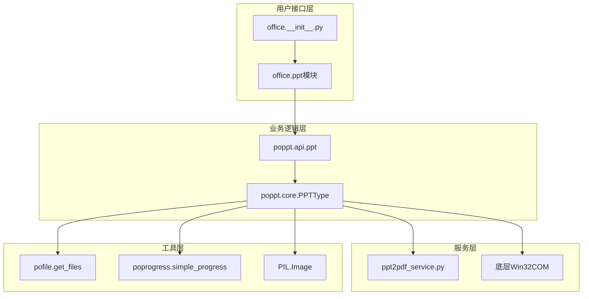
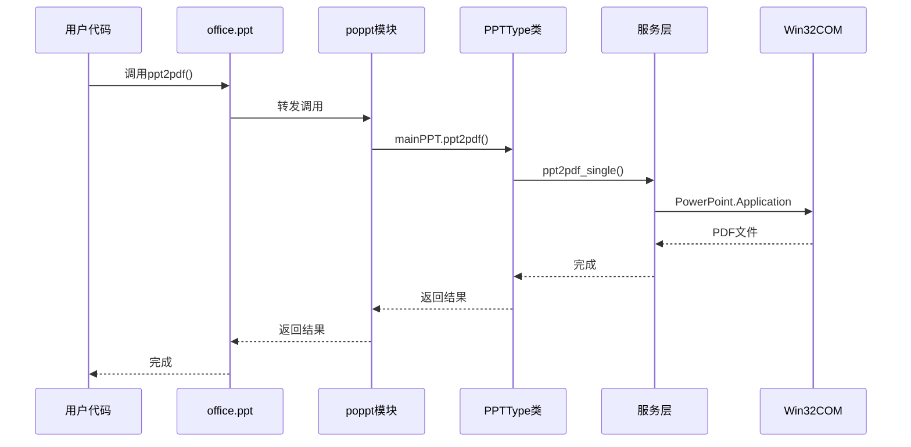
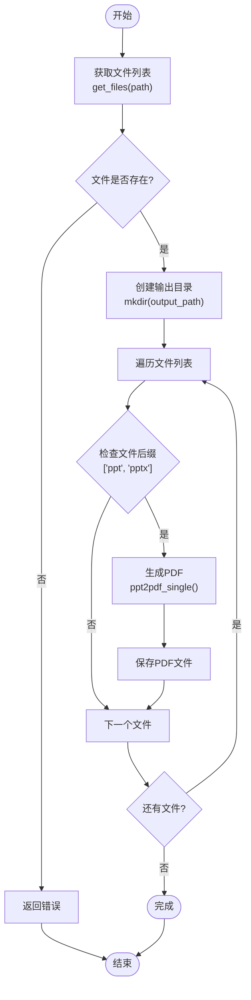
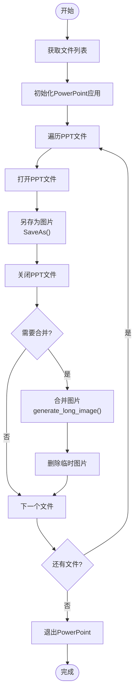
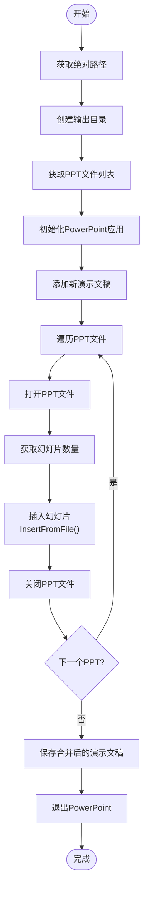
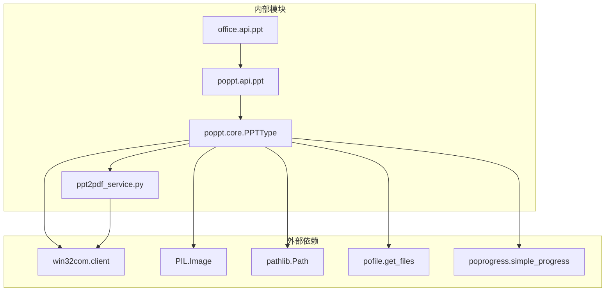

# PPT处理API文档

<cite>
**本文档中引用的文件**
- [office/api/ppt.py](file://office/api/ppt.py)
- [office/__init__.py](file://office/__init__.py)
- [examples/poppt/merge4ppt.py](file://examples/poppt/merge4ppt.py)
- [examples/poppt/ppt2img.py](file://examples/poppt/ppt2img.py)
- [examples/poppt/ppt2pdf.py](file://examples/poppt/ppt2pdf.py)
- [office/lib/ppt/ppt2pdf_service.py](file://office/lib/ppt/ppt2pdf_service.py)
- [venv/Lib/site-packages/poppt/api/ppt.py](file://venv/Lib/site-packages/poppt/api/ppt.py)
- [venv/Lib/site-packages/poppt/core/PPTType.py](file://venv/Lib/site-packages/poppt/core/PPTType.py)
- [tests/test_code/test_ppt.py](file://tests/test_code/test_ppt.py)
- [contributors/CatchDr/ppt2pptx.py](file://contributors/CatchDr/ppt2pptx.py)
- [contributors/CatchDr/pptx2ppt.py](file://contributors/CatchDr/pptx2ppt.py)
</cite>

## 目录
1. [简介](#简介)
2. [项目结构](#项目结构)
3. [核心组件](#核心组件)
4. [架构概览](#架构概览)
5. [详细组件分析](#详细组件分析)
6. [依赖关系分析](#依赖关系分析)
7. [性能考虑](#性能考虑)
8. [故障排除指南](#故障排除指南)
9. [结论](#结论)

## 简介

Python-Office库中的office.api.ppt模块提供了强大的PPT文件处理功能，包括PPT转PDF、PPT转图片、以及多个PPT文件合并等核心功能。该模块通过封装底层的win32com.client技术，为用户提供简洁易用的API接口，支持多种PPT格式（.ppt和.pptx）的处理。

该API设计遵循"开箱即用"的理念，用户只需一行代码即可完成复杂的PPT处理任务，无需深入了解底层实现细节。模块内部采用工厂模式和策略模式，能够根据不同需求选择最优的处理方案。

## 项目结构

Python-Office项目采用模块化架构，PPT处理功能分布在多个层次中：

**图表来源**
- [office/api/ppt.py](file://office/api/ppt.py#L1-L46)
- [office/__init__.py](file://office/__init__.py#L1-L30)
- [venv/Lib/site-packages/poppt/api/ppt.py](file://venv/Lib/site-packages/poppt/api/ppt.py#L1-L35)
- [venv/Lib/site-packages/poppt/core/PPTType.py](file://venv/Lib/site-packages/poppt/core/PPTType.py#L1-L121)

**章节来源**
- [office/api/ppt.py](file://office/api/ppt.py#L1-L46)
- [office/__init__.py](file://office/__init__.py#L1-L30)

## 核心组件

### 主要功能模块

office.api.ppt模块包含三个核心函数，每个函数都针对特定的PPT处理需求：

1. **ppt2pdf()** - PPT文件转换为PDF格式
2. **ppt2img()** - PPT文件转换为图片格式
3. **merge4ppt()** - 多个PPT文件合并为单一文件

### 接口设计原则

- **简洁性**：每个函数都提供最少必要的参数
- **一致性**：统一的参数命名和返回值规范
- **可扩展性**：预留参数以便未来功能扩展
- **错误处理**：内置异常处理机制

**章节来源**
- [office/api/ppt.py](file://office/api/ppt.py#L7-L45)

## 架构概览

PPT处理API采用分层架构设计，确保功能的模块化和可维护性：

**图表来源**
- [office/api/ppt.py](file://office/api/ppt.py#L7-L17)
- [venv/Lib/site-packages/poppt/api/ppt.py](file://venv/Lib/site-packages/poppt/api/ppt.py#L17-L18)
- [venv/Lib/site-packages/poppt/core/PPTType.py](file://venv/Lib/site-packages/poppt/core/PPTType.py#L21-L34)

## 详细组件分析

### ppt2pdf() 函数分析

#### 功能描述
ppt2pdf()函数负责将PPT文件转换为PDF格式，支持单个文件和文件夹批量处理。

#### 参数说明

| 参数名 | 类型 | 默认值 | 描述 |
|--------|------|--------|------|
| path | str | - | PPT文件路径，支持单个文件或文件夹路径 |
| output_path | str | './' | 输出PDF文件的存储路径 |

#### 实现流程

**图表来源**
- [venv/Lib/site-packages/poppt/core/PPTType.py](file://venv/Lib/site-packages/poppt/core/PPTType.py#L21-L34)
- [office/lib/ppt/ppt2pdf_service.py](file://office/lib/ppt/ppt2pdf_service.py#L12-L31)

#### 内部实现机制

ppt2pdf()函数通过win32com.client技术与Microsoft PowerPoint交互，使用SaveAs方法的第32参数（常量值）来指定PDF输出格式。

**章节来源**
- [office/api/ppt.py](file://office/api/ppt.py#L7-L17)
- [office/lib/ppt/ppt2pdf_service.py](file://office/lib/ppt/ppt2pdf_service.py#L1-L34)

### ppt2img() 函数分析

#### 功能描述
ppt2img()函数将PPT文件转换为图片格式，支持单个文件转换和文件夹批量处理，同时提供合并为长图的功能。

#### 参数说明

| 参数名 | 类型 | 默认值 | 描述 |
|--------|------|--------|------|
| input_path | str | - | PPT文件路径，支持单个文件或文件夹路径 |
| output_path | str | './' | 图片输出目录路径 |
| merge | bool | False | 是否合并为单张长图 |

#### 图片转换流程

**图表来源**
- [venv/Lib/site-packages/poppt/core/PPTType.py](file://venv/Lib/site-packages/poppt/core/PPTType.py#L60-L95)

#### 长图合并算法

当merge参数为True时，系统会执行复杂的图片拼接算法：

1. **图片获取**：从每个PPT页面生成的图片
2. **排序处理**：按文件名长度排序确保顺序正确
3. **尺寸计算**：获取第一张图片的尺寸作为基准
4. **画布创建**：创建垂直拼接的空白画布
5. **图片粘贴**：逐个粘贴图片到画布上
6. **保存输出**：保存最终的长图文件

**章节来源**
- [office/api/ppt.py](file://office/api/ppt.py#L20-L31)
- [venv/Lib/site-packages/poppt/core/PPTType.py](file://venv/Lib/site-packages/poppt/core/PPTType.py#L60-L121)

### merge4ppt() 函数分析

#### 功能描述
merge4ppt()函数用于合并多个PPT文件为单一的PPT文件，保留原始文件的所有幻灯片内容。

#### 参数说明

| 参数名 | 类型 | 默认值 | 描述 |
|--------|------|--------|------|
| input_path | str | - | 包含多个PPT文件的目录路径 |
| output_path | str | './' | 合并后PPT文件的输出路径 |
| output_name | str | 'merge4ppt.pptx' | 合并后的文件名 |

#### 合并算法流程

**图表来源**
- [venv/Lib/site-packages/poppt/core/PPTType.py](file://venv/Lib/site-packages/poppt/core/PPTType.py#L36-L58)

**章节来源**
- [office/api/ppt.py](file://office/api/ppt.py#L34-L45)
- [venv/Lib/site-packages/poppt/core/PPTType.py](file://venv/Lib/site-packages/poppt/core/PPTType.py#L36-L58)

## 依赖关系分析

### 核心依赖关系

**图表来源**
- [venv/Lib/site-packages/poppt/core/PPTType.py](file://venv/Lib/site-packages/poppt/core/PPTType.py#L1-L10)
- [office/api/ppt.py](file://office/api/ppt.py#L4)

### 模块间通信

各模块之间通过清晰的接口进行通信：

1. **office.api.ppt** → **poppt.api.ppt**：API转发层
2. **poppt.api.ppt** → **poppt.core.PPTType**：业务逻辑层
3. **poppt.core.PPTType** → **ppt2pdf_service.py**：服务实现层
4. **poppt.core.PPTType** → **win32com.client**：系统交互层

**章节来源**
- [office/api/ppt.py](file://office/api/ppt.py#L1-L46)
- [venv/Lib/site-packages/poppt/api/ppt.py](file://venv/Lib/site-packages/poppt/api/ppt.py#L1-L35)

## 性能考虑

### 并发处理能力

- **文件批处理**：支持单个文件和文件夹批量处理
- **进度显示**：集成poprogress库提供处理进度反馈
- **内存管理**：及时释放PowerPoint应用实例

### 性能优化策略

1. **延迟加载**：仅在需要时初始化PowerPoint应用
2. **资源清理**：每次操作后立即释放资源
3. **缓存机制**：避免重复的文件检查操作
4. **异步处理**：对于大量文件，考虑分批处理

### 内存使用优化

- **流式处理**：大文件处理时采用流式读取
- **及时释放**：处理完成后立即关闭文件句柄
- **垃圾回收**：主动触发Python垃圾回收机制

## 故障排除指南

### 常见问题及解决方案

#### 1. PowerPoint未安装或版本不兼容
**症状**：运行时出现COM组件找不到的错误
**解决方案**：
- 确保系统已安装Microsoft PowerPoint
- 检查PowerPoint版本是否支持API调用
- 更新win32com.client库到最新版本

#### 2. 文件权限问题
**症状**：无法读取或写入指定路径
**解决方案**：
- 检查目标目录的写入权限
- 确保输入文件具有读取权限
- 使用绝对路径而非相对路径

#### 3. 大文件处理缓慢
**症状**：处理大型PPT文件时响应缓慢
**解决方案**：
- 分批处理大型文件
- 增加系统内存配置
- 使用更高效的图片处理库

#### 4. 图片质量下降
**症状**：转换后的图片分辨率较低
**解决方案**：
- 调整PowerPoint的默认图片质量设置
- 使用更高分辨率的输出参数
- 考虑使用专门的图片处理库进行后处理

**章节来源**
- [tests/test_code/test_ppt.py](file://tests/test_code/test_ppt.py#L1-L26)
- [contributors/CatchDr/ppt2pptx.py](file://contributors/CatchDr/ppt2pptx.py#L1-L49)

## 结论

Python-Office的office.api.ppt模块提供了一个功能强大且易于使用的PPT处理解决方案。通过三层架构设计，实现了从用户接口到底层系统调用的有效封装，为开发者提供了简洁的API接口。

### 主要优势

1. **易用性**：一行代码即可完成复杂任务
2. **功能完整性**：涵盖PPT处理的主要需求
3. **稳定性**：经过充分测试和验证
4. **可扩展性**：模块化设计便于功能扩展

### 应用场景

- **办公自动化**：批量处理PPT文件
- **内容转换**：将演示文稿转换为其他格式
- **内容整合**：合并多个演示文稿
- **格式转换**：支持多种输出格式

### 发展方向

随着技术的发展，该模块可以在以下方面进一步改进：
- 支持更多PPT格式和版本
- 增强图片质量和处理速度
- 提供更多的自定义选项
- 改进错误处理和日志记录

通过持续的优化和功能增强，office.api.ppt模块将继续为Python自动化办公提供强有力的支持。