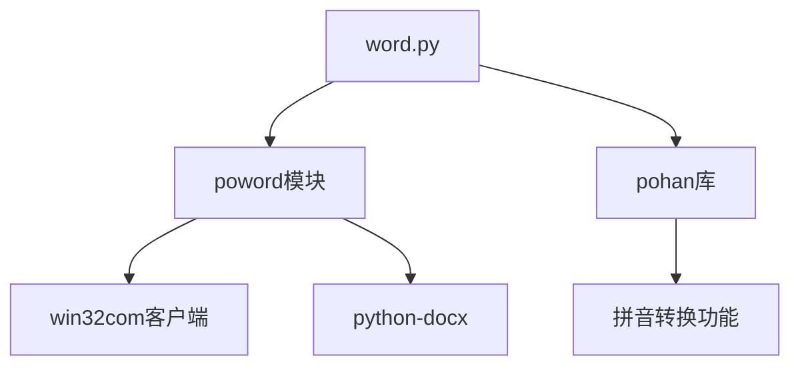
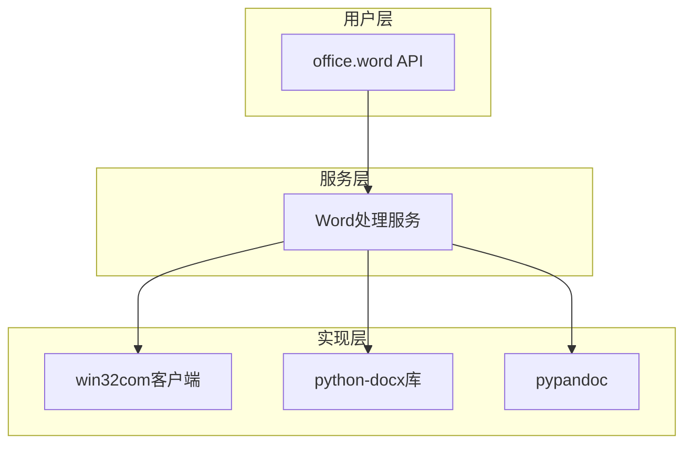
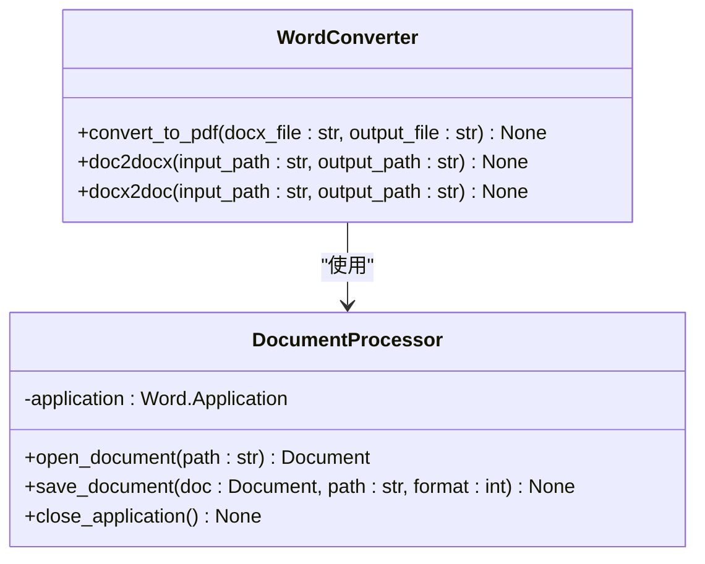
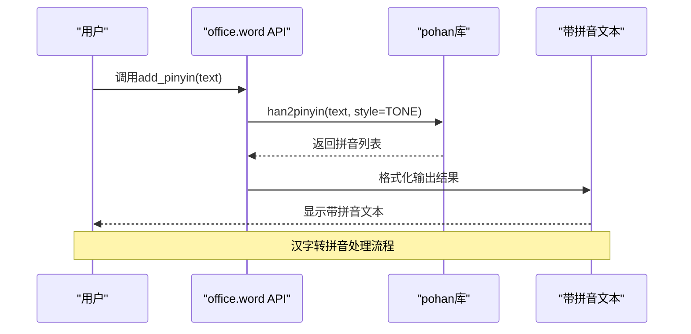
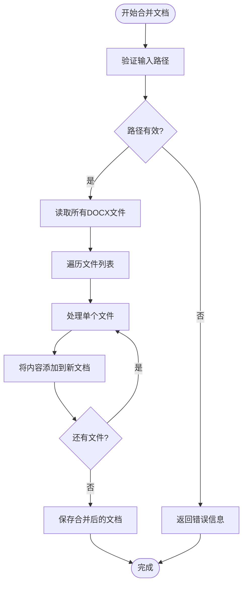
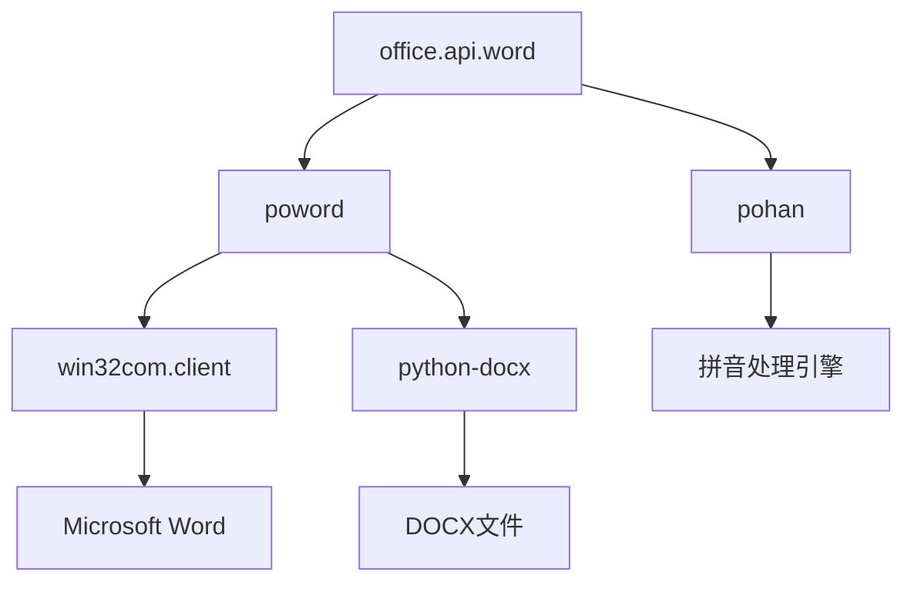

# Word处理API

<cite>
**本文档中引用的文件**   
- [word.py](file://office/api/word.py)
- [doc2docx.py](file://contributors/CatchDr/doc2docx.py)
- [docx2doc.py](file://contributors/CatchDr/docx2doc.py)
- [1、给古诗配拼音.py](file://examples/pohan/1、给古诗配拼音.py)
- [pinyin_gui.py](file://contributors/wangpeng/pinyin_gui.py)
- [word转PDF.py](file://examples/poword/word转PDF.py)
- [合并word.py](file://examples/poword/合并word.py)
- [doc和docx互转.py](file://examples/poword/doc和docx互转.py)
</cite>

## 目录
1. [简介](#简介)
2. [项目结构](#项目结构)
3. [核心组件](#核心组件)
4. [架构概述](#架构概述)
5. [详细组件分析](#详细组件分析)
6. [依赖分析](#依赖分析)
7. [性能考虑](#性能考虑)
8. [故障排除指南](#故障排除指南)
9. [结论](#结论)

## 简介
本项目提供了一套全面的Word文档处理功能，通过`python-office`库实现。该库支持多种文档格式转换、合并、提取图片等操作，并集成了拼音处理功能，特别适用于教育场景中的汉字拼音标注需求。API设计简洁易用，通过`office.word`模块提供统一的接口。

## 项目结构
项目采用模块化设计，将不同功能分离到独立的模块中。Word处理功能主要分布在`office.api.word`模块中，通过封装底层实现提供简洁的API接口。系统支持批量处理文件夹中的文档，同时提供了丰富的示例代码帮助用户快速上手。

**图示来源**
- [word.py](file://office/api/word.py)
- [doc2docx.py](file://contributors/CatchDr/doc2docx.py)

**本节来源**
- [word.py](file://office/api/word.py)
- [doc2docx.py](file://contributors/CatchDr/doc2docx.py)

## 核心组件
`office.api.word`模块提供了多个核心功能函数，包括文档格式转换、合并、图片提取等。这些函数通过封装复杂的底层操作，为用户提供简单易用的接口。系统利用`poword`作为底层实现，实现了跨平台的Word文档处理能力。

**本节来源**
- [word.py](file://office/api/word.py)
- [doc2docx.py](file://contributors/CatchDr/doc2docx.py)

## 架构概述
系统采用分层架构设计，上层API提供简洁的函数接口，底层实现处理具体的文档操作。这种设计模式实现了功能封装和解耦，使得系统易于维护和扩展。通过`python-office`作为统一入口，用户可以方便地调用各种办公自动化功能。

**图示来源**
- [word.py](file://office/api/word.py)
- [doc2docx.py](file://contributors/CatchDr/doc2docx.py)

## 详细组件分析

### 文档转换功能分析
文档转换功能支持DOC与DOCX格式之间的相互转换，以及Word到PDF的转换。系统通过调用Windows COM组件实现格式转换，确保了转换质量和兼容性。

#### 对于文档转换组件：

**图示来源**
- [doc2docx.py](file://contributors/CatchDr/doc2docx.py)
- [docx2doc.py](file://contributors/CatchDr/docx2doc.py)

### 拼音功能分析
拼音功能通过集成`pohan`库实现，支持为汉字添加拼音标注。该功能特别适用于教育领域的教学材料制作，如给古诗文添加拼音注释，帮助学生学习汉字发音。

#### 对于拼音处理组件：

**图示来源**
- [1、给古诗配拼音.py](file://examples/pohan/1、给古诗配拼音.py)
- [pinyin_gui.py](file://contributors/wangpeng/pinyin_gui.py)

### 文档合并功能分析
文档合并功能允许将多个Word文档合并为一个文件，支持从单个文件或整个文件夹中读取文档。该功能在整理报告、论文集等场景中非常实用。

#### 对于复杂逻辑组件：

**图示来源**
- [word.py](file://office/api/word.py)
- [合并word.py](file://examples/poword/合并word.py)

**本节来源**
- [word.py](file://office/api/word.py)
- [doc2docx.py](file://contributors/CatchDr/doc2docx.py)
- [docx2doc.py](file://contributors/CatchDr/docx2doc.py)

## 依赖分析
系统依赖多个第三方库和Windows COM组件来实现完整的Word处理功能。主要依赖包括`win32com`用于调用Microsoft Word应用程序，`python-docx`用于文档内容操作，以及`pohan`库用于拼音处理。

**图示来源**
- [word.py](file://office/api/word.py)
- [doc2docx.py](file://contributors/CatchDr/doc2docx.py)

**本节来源**
- [word.py](file://office/api/word.py)
- [doc2docx.py](file://contributors/CatchDr/doc2docx.py)

## 性能考虑
文档处理操作的性能主要受文件大小、数量和系统资源影响。批量处理时建议分批进行，避免内存溢出。对于大型文档的转换，系统会占用较多内存和CPU资源，建议在高性能设备上运行。

## 故障排除指南
常见问题包括COM组件注册失败、文件路径错误、权限不足等。确保Microsoft Office已正确安装并注册COM组件，检查文件路径是否存在特殊字符，运行程序时使用管理员权限。

**本节来源**
- [word.py](file://office/api/word.py)
- [doc2docx.py](file://contributors/CatchDr/doc2docx.py)

## 结论
`python-office`的Word处理API提供了一套完整且易用的文档处理解决方案。通过简洁的API设计和强大的功能集成，用户可以轻松实现各种Word文档自动化任务。系统架构合理，易于扩展，特别适合教育、办公自动化等场景的应用开发。