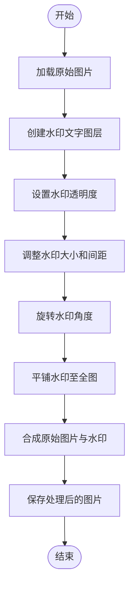
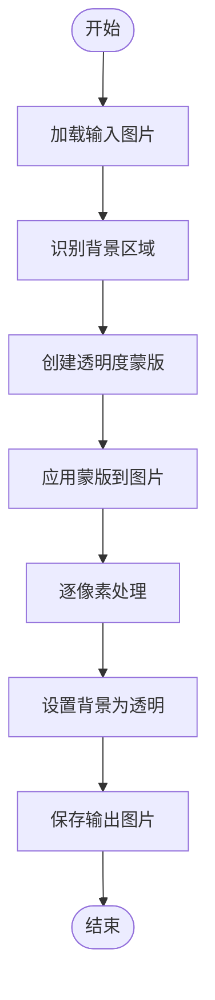
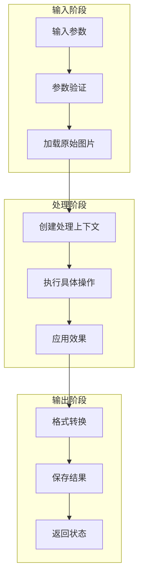

# 图像处理API

<cite>
**本文档中引用的文件**   
- [image.py](file://office/api/image.py)
- [add_watermark_service.py](file://office/lib/image/add_watermark_service.py)
- [eliminate_background.py](file://office/lib/image/eliminate_background.py)
- [图片加水印.py](file://examples/poimage/图片加水印.py)
- [图片去水印.py](file://examples/poimage/图片去水印.py)
- [文本转词云.py](file://examples/poimage/文本转词云.py)
- [下载图片.py](file://examples/poimage/下载图片.py)
- [test_image.py](file://tests/test_code/test_image.py)
</cite>

## 目录
1. [简介](#简介)
2. [核心功能](#核心功能)
3. [详细功能分析](#详细功能分析)
4. [内部依赖与处理流程](#内部依赖与处理流程)
5. [使用示例](#使用示例)
6. [技术限制与注意事项](#技术限制与注意事项)
7. [结论](#结论)

## 简介
`python-office` 是一个专注于自动化办公的Python第三方库，其中 `office.api.image` 模块提供了丰富的图像处理功能。该模块作为统一的入口，通过简单的API调用即可实现复杂的图像操作，包括添加水印、去除水印、下载图片和生成词云等。本模块封装了底层复杂的图像处理逻辑，使用户无需深入了解Pillow等库的细节即可完成专业级的图像处理任务。

## 核心功能
`office.api.image` 模块提供了以下核心图像处理功能：
- **添加水印**：为图片添加文字或图片水印，支持自定义颜色、大小、透明度、间距和角度
- **去除水印**：尝试从图片中移除水印，支持多种图片格式
- **下载图片**：从指定URL下载图片并保存到本地
- **生成词云**：根据文本内容生成视觉化的词云图片
- **图像压缩**：压缩图片文件大小，同时保持视觉质量
- **图像转换**：将图片转换为GIF格式或铅笔画风格

这些功能通过简洁的API设计，实现了"一行代码解决一个办公问题"的理念，极大地降低了图像处理的技术门槛。

## 详细功能分析

### 添加水印功能
`add_watermark` 函数为图片添加文字水印，是保护图片版权的重要工具。

**参数说明**
- `file` (str): 原始图片文件路径
- `mark` (str): 水印文字内容
- `output_path` (str, optional): 输出目录路径，默认为当前目录
- `color` (str, optional): 水印颜色（十六进制格式），默认为"#eaeaea"
- `size` (int, optional): 水印字体大小，默认为30
- `opacity` (float, optional): 水印透明度（0.01~1），默认为0.35
- `space` (int, optional): 水印间距，默认为200
- `angle` (int, optional): 水印旋转角度，默认为30度

该功能通过创建半透明的文字图层，并以指定角度和间距重复铺满整个水印图层，然后将此水印图层叠加到原始图片上，实现美观且不易去除的水印效果。



**Diagram sources**
- [image.py](file://office/api/image.py#L35-L52)
- [add_watermark_service.py](file://office/lib/image/add_watermark_service.py#L74-L111)

**Section sources**
- [image.py](file://office/api/image.py#L35-L52)
- [add_watermark_service.py](file://office/lib/image/add_watermark_service.py#L74-L111)
- [图片加水印.py](file://examples/poimage/图片加水印.py)

### 去除水印功能
`del_watermark` 函数用于尝试从图片中移除水印，是一项具有挑战性的图像处理任务。

**参数说明**
- `input_image` (str): 需要去除水印的输入图片路径
- `output_image` (str, optional): 处理后图片的保存路径，默认为"./del_water_mark.jpg"

去水印功能的技术实现基于背景消除算法，通过识别图片中的背景区域并将其透明化来达到去除水印的目的。该功能对于某些类型的水印（如均匀背景上的简单水印）效果较好，但对于复杂背景或深度嵌入的水印效果有限。



**Diagram sources**
- [image.py](file://office/api/image.py#L140-L151)
- [eliminate_background.py](file://office/lib/image/eliminate_background.py#L20-L62)

**Section sources**
- [image.py](file://office/api/image.py#L140-L151)
- [eliminate_background.py](file://office/lib/image/eliminate_background.py#L20-L62)
- [图片去水印.py](file://examples/poimage/图片去水印.py)

### 下载图片功能
`down4img` 函数实现了从网络URL下载图片并保存到本地的功能。

**参数说明**
- `url` (str): 图片的URL地址
- `output_path` (str, optional): 保存图片的目录路径，默认为当前目录
- `output_name` (str, optional): 保存的文件名，默认为"down4img"
- `type` (str, optional): 图片文件类型，默认为"jpg"

该功能封装了HTTP请求和文件保存的复杂性，用户只需提供图片URL即可完成下载任务，是自动化获取网络图片资源的便捷工具。

**Section sources**
- [image.py](file://office/api/image.py#L76-L91)
- [下载图片.py](file://examples/poimage/下载图片.py)

### 生成词云功能
`txt2wordcloud` 函数根据文本内容生成视觉化的词云图片，是数据可视化的重要工具。

**参数说明**
- `filename` (str): 文本文件的路径
- `color` (str, optional): 词云的背景颜色，默认为"white"
- `result_file` (str, optional): 生成的词云图片文件名，默认为"your_wordcloud.png"

词云生成过程会分析文本中词语的出现频率，频率越高的词语在词云中显示得越大，从而直观地展示文本的主题和重点内容。

**Section sources**
- [image.py](file://office/api/image.py#L94-L106)
- [文本转词云.py](file://examples/poimage/文本转词云.py)

## 内部依赖与处理流程

### 依赖库分析
`office.api.image` 模块主要依赖以下外部库：

**Pillow库**
- 作为核心的图像处理引擎
- 负责图像的加载、修改和保存
- 提供图像格式转换、裁剪、旋转等基础功能
- 支持多种图像格式（JPEG、PNG、GIF等）

**wordcloud库**
- 专门用于生成词云图片
- 分析文本词频并生成相应的视觉布局
- 支持自定义字体、颜色和形状

**其他依赖**
- `requests`：用于下载网络图片
- `numpy`：用于图像数据的数值处理

### 图像处理流程
图像处理功能遵循统一的处理流程：



**Diagram sources**
- [image.py](file://office/api/image.py)
- [add_watermark_service.py](file://office/lib/image/add_watermark_service.py)
- [eliminate_background.py](file://office/lib/image/eliminate_background.py)

## 使用示例

### 添加水印示例
使用 `add_watermark` 函数为图片添加文字水印：

```python
import office

office.image.add_watermark(
    file='./test_files/add_watermark/程序员晚枫-2.jpg',
    mark='程序员晚枫',
    output_path='./test_files/add_watermark/mark_img',
    color='#eaeaea',
    size=30,
    opacity=0.35,
    space=200,
    angle=30
)
```

### 去除水印示例
使用 `del_watermark` 函数尝试去除图片水印：

```python
import office

office.image.del_watermark(
    input_image='./test_files/del_watermark/img.png',
    output_image='./test_files/del_watermark/del_watermark.jpg'
)
```

### 下载图片示例
使用 `down4img` 函数从网络下载图片：

```python
import office

office.image.down4img(
    url='https://cos.python-office.com/icon2.jpg',
    output_name='./test_files/下载图片/B站：程序员晚枫',
    type='jpg'
)
```

### 生成词云示例
使用 `txt2wordcloud` 函数生成词云图片：

```python
import office

office.image.txt2wordcloud(
    filename='./test_files/md/test.txt',
    color='black',
    result_file='./test_files/wordcloud/res.jpg'
)
```

**Section sources**
- [图片加水印.py](file://examples/poimage/图片加水印.py)
- [图片去水印.py](file://examples/poimage/图片去水印.py)
- [下载图片.py](file://examples/poimage/下载图片.py)
- [文本转词云.py](file://examples/poimage/文本转词云.py)

## 技术限制与注意事项

### 去水印功能的限制
去水印功能存在以下技术限制：
- **算法局限性**：基于背景消除的算法对复杂背景或非均匀水印效果不佳
- **质量损失**：处理过程可能导致图片质量下降
- **不完全去除**：某些深度嵌入的水印可能无法完全去除
- **误判风险**：可能将图片中的正常内容误判为水印而错误处理

### 使用注意事项
- **文件路径**：避免在文件路径和名称中使用中文字符，以防出现编码问题
- **内存消耗**：处理大型图片时会消耗较多内存，建议在内存充足的环境中运行
- **依赖安装**：确保已正确安装Pillow、wordcloud等相关依赖库
- **错误处理**：建议在生产环境中添加适当的异常处理机制
- **性能考虑**：批量处理图片时，考虑使用循环或并发处理以提高效率

**Section sources**
- [eliminate_background.py](file://office/lib/image/eliminate_background.py)
- [图片去水印.py](file://examples/poimage/图片去水印.py)

## 结论
`office.api.image` 模块提供了一套完整且易于使用的图像处理API，通过简洁的函数接口封装了复杂的图像处理逻辑。该模块作为 `python-office` 库的统一入口，实现了添加水印、去除水印、下载图片和生成词云等核心功能，极大地简化了图像处理任务的实现。

尽管去水印功能存在一定的技术限制，但整体而言，该模块为开发者和非专业用户提供了强大的图像处理能力。通过合理使用这些API，用户可以轻松实现各种自动化办公场景中的图像处理需求，提高工作效率。