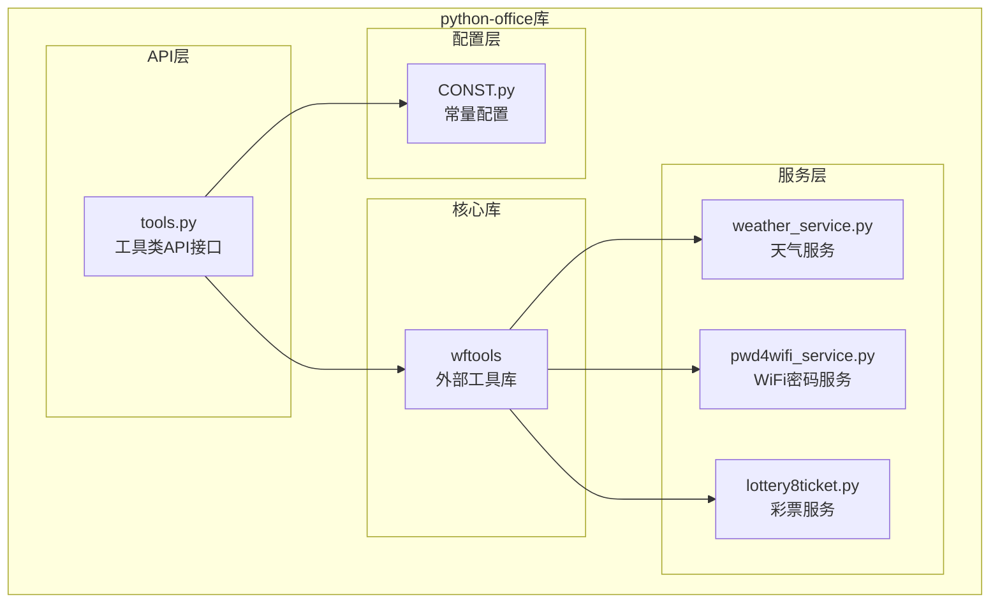
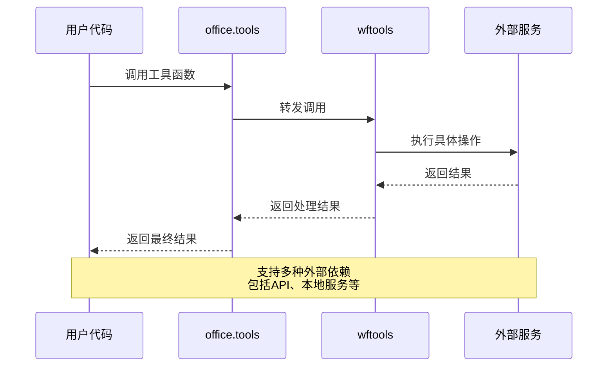
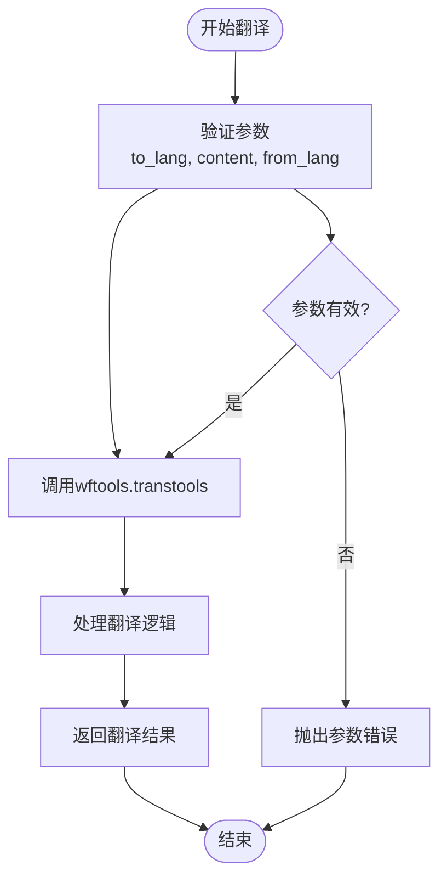
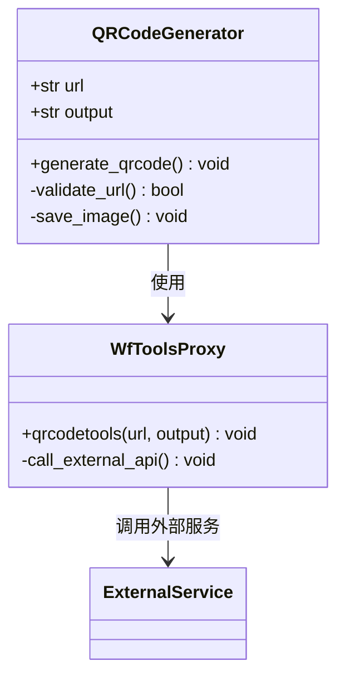
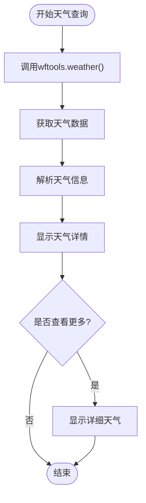
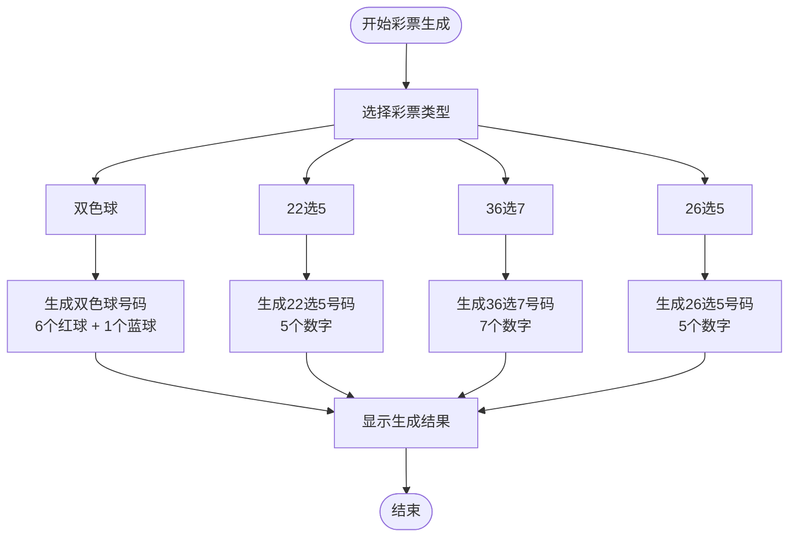
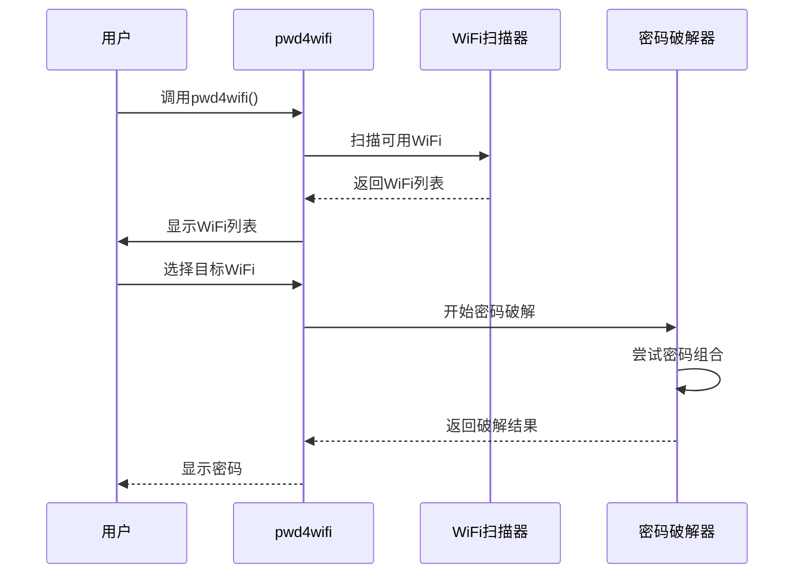
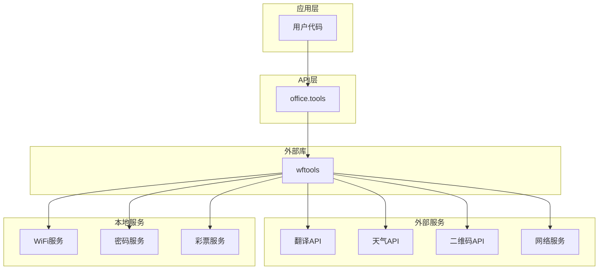

# 工具类API

<cite>
**本文档引用的文件**
- [office/api/tools.py](file://office/api/tools.py)
- [office/__init__.py](file://office/__init__.py)
- [office/lib/tools/weather_service.py](file://office/lib/tools/weather_service.py)
- [office/lib/tools/pwd4wifi_service.py](file://office/lib/tools/pwd4wifi_service.py)
- [office/lib/tools/lottery8ticket.py](file://office/lib/tools/lottery8ticket.py)
- [examples/potools/工具类功能演示.py](file://examples/potools/工具类功能演示.py)
- [tests/test_code/test_tools.py](file://tests/test_code/test_tools.py)
- [venv/Lib/site-packages/wftools/api/tools.py](file://venv/Lib/site-packages/wftools/api/tools.py)
</cite>

## 目录
1. [简介](#简介)
2. [项目结构](#项目结构)
3. [核心组件](#核心组件)
4. [架构概览](#架构概览)
5. [详细组件分析](#详细组件分析)
6. [依赖关系分析](#依赖关系分析)
7. [性能考虑](#性能考虑)
8. [故障排除指南](#故障排除指南)
9. [结论](#结论)

## 简介

`office.api.tools`模块是python-office库中的核心工具类模块，提供了丰富的实用功能集合。该模块通过聚合外部`wftools`库的功能，为开发者提供了便捷的语言翻译、二维码生成、密码创建、天气查询、网络工具等实用工具。这些工具函数经过精心设计，具有简洁的API接口和强大的功能扩展性。

## 项目结构

python-office库采用模块化架构设计，工具类功能位于`office/api/tools.py`文件中，通过导入外部`wftools`库来实现具体功能。整个项目结构清晰，便于维护和扩展。



**图表来源**
- [office/api/tools.py](file://office/api/tools.py#L1-L146)
- [office/__init__.py](file://office/__init__.py#L1-L30)

**章节来源**
- [office/api/tools.py](file://office/api/tools.py#L1-L146)
- [office/__init__.py](file://office/__init__.py#L1-L30)

## 核心组件

工具类模块包含九个主要功能函数，每个函数都针对特定的实用场景设计：

### 主要功能函数

| 函数名 | 功能描述 | 参数类型 | 返回类型 |
|--------|----------|----------|----------|
| `transtools` | 多语言翻译 | `to_lang: str, content: str, from_lang: str` | `str` |
| `qrcodetools` | 二维码生成 | `url: str, output: str` | `None` |
| `passwordtools` | 密码生成 | `len: int` | `str` |
| `weather` | 天气查询 | 无参数 | `None` |
| `url2ip` | URL转IP地址 | `url: str` | `str` |
| `lottery8ticket` | 彩票号码生成 | 无参数 | `None` |
| `create_article` | 文章生成 | `theme: str, line_num: int` | `None` |
| `pwd4wifi` | WiFi密码生成 | `len_pwd: int, pwd_list: list` | `None` |
| `net_speed_test` | 网速测试 | 无参数 | `None` |
| `course` | 课程信息展示 | 无参数 | `None` |

**章节来源**
- [office/api/tools.py](file://office/api/tools.py#L8-L146)

## 架构概览

工具类模块采用代理模式设计，通过导入外部`wftools`库来实现具体功能。这种设计模式提供了良好的解耦和可扩展性。



**图表来源**
- [office/api/tools.py](file://office/api/tools.py#L1-L146)
- [venv/Lib/site-packages/wftools/api/tools.py](file://venv/Lib/site-packages/wftools/api/tools.py#L1-L55)

## 详细组件分析

### 语言翻译工具 (transtools)

翻译工具支持多语言互译，基于外部翻译服务实现。



**图表来源**
- [office/api/tools.py](file://office/api/tools.py#L8-L19)

#### 参数说明
- `to_lang`: 目标语言代码（如'en'表示英语）
- `content`: 待翻译的文本内容
- `from_lang`: 源语言代码，默认为'zh'（中文）

#### 使用示例
```python
# 基本翻译
result = office.tools.transtools(to_lang="en", content="你好，世界！")

# 指定源语言
result = office.tools.transtools(to_lang="zh", content="Hello, world!", from_lang="en")
```

**章节来源**
- [office/api/tools.py](file://office/api/tools.py#L8-L19)

### 二维码生成工具 (qrcodetools)

二维码生成工具允许用户快速创建二维码图片，支持自定义输出路径。



**图表来源**
- [office/api/tools.py](file://office/api/tools.py#L22-L32)

#### 参数说明
- `url`: 用于生成二维码的URL地址
- `output`: 生成的二维码图片保存路径，默认为'./qrcode_img.png'

#### 使用示例
```python
# 基本二维码生成
office.tools.qrcodetools(url="https://www.python-office.com")

# 自定义输出路径
office.tools.qrcodetools(url="https://www.python-office.com", output="my_qrcode.png")
```

**章节来源**
- [office/api/tools.py](file://office/api/tools.py#L22-L32)

### 密码生成工具 (passwordtools)

密码生成工具提供安全的随机密码生成功能，支持自定义密码长度。

#### 参数说明
- `len`: 密码长度，默认为8

#### 使用示例
```python
# 生成默认长度密码
password = office.tools.passwordtools()

# 生成指定长度密码
password = office.tools.passwordtools(len=12)
```

**章节来源**
- [office/api/tools.py](file://office/api/tools.py#L35-L44)

### 天气查询工具 (weather)

天气查询工具通过外部天气服务获取实时天气信息。



**图表来源**
- [office/api/tools.py](file://office/api/tools.py#L46-L55)
- [office/lib/tools/weather_service.py](file://office/lib/tools/weather_service.py#L1-L25)

#### 特殊功能
- 支持交互式选择更多天气信息
- 显示更新时间和天气详情
- 支持城市选择和深入查询

#### 使用示例
```python
# 基本天气查询
office.tools.weather()

# 需要交互输入城市名称
# 输入：重庆
# 输入：y（查看更多）
# 输入：q（退出）
```

**章节来源**
- [office/api/tools.py](file://office/api/tools.py#L46-L55)
- [office/lib/tools/weather_service.py](file://office/lib/tools/weather_service.py#L1-L25)

### URL转IP工具 (url2ip)

URL转IP工具将给定的URL地址解析为对应的IP地址。

#### 参数说明
- `url`: 需要转换的URL字符串

#### 使用示例
```python
# 获取百度IP地址
ip_address = office.tools.url2ip(url="www.baidu.com")
print(f"百度的IP地址是：{ip_address}")

# 获取其他网站IP
ip_address = office.tools.url2ip(url="www.python-office.com")
```

**章节来源**
- [office/api/tools.py](file://office/api/tools.py#L61-L72)

### 彩票号码生成工具 (lottery8ticket)

彩票号码生成工具提供多种彩票类型的号码生成功能。



**图表来源**
- [office/api/tools.py](file://office/api/tools.py#L78-L87)
- [office/lib/tools/lottery8ticket.py](file://office/lib/tools/lottery8ticket.py#L77-L92)

#### 支持的彩票类型
- 双色球 (SSL)
- 22选5 (X_22_5)
- 36选7 (X_36_7)
- 26选5 (X_26_5)

#### 使用示例
```python
# 生成彩票号码
office.tools.lottery8ticket()

# 需要交互选择彩票类型
# 输入：1（双色球）
# 输入：0（退出）
```

**章节来源**
- [office/api/tools.py](file://office/api/tools.py#L78-L87)
- [office/lib/tools/lottery8ticket.py](file://office/lib/tools/lottery8ticket.py#L1-L92)

### WiFi密码生成工具 (pwd4wifi)

WiFi密码生成工具提供WiFi密码的生成和破解功能。



**图表来源**
- [office/api/tools.py](file://office/api/tools.py#L104-L118)
- [office/lib/tools/pwd4wifi_service.py](file://office/lib/tools/pwd4wifi_service.py#L1-L163)

#### 参数说明
- `len_pwd`: 密码长度，默认为8
- `pwd_list`: 密码列表，默认为空列表

#### 使用示例
```python
# 生成WiFi密码列表
wifi_passwords = []
office.tools.pwd4wifi(len_pwd=10, pwd_list=wifi_passwords)

# 查看生成的密码
if wifi_passwords:
    print(f"生成的WiFi密码：{wifi_passwords[0]}")
```

**章节来源**
- [office/api/tools.py](file://office/api/tools.py#L104-L118)
- [office/lib/tools/pwd4wifi_service.py](file://office/lib/tools/pwd4wifi_service.py#L1-L163)

### 网速测试工具 (net_speed_test)

网速测试工具用于测试网络的上传和下载速度。

#### 使用示例
```python
# 测试网络速度
office.tools.net_speed_test()
```

**章节来源**
- [office/api/tools.py](file://office/api/tools.py#L122-L131)

### 课程信息工具 (course)

课程信息工具显示python-office库的相关信息和资源链接。

#### 使用示例
```python
# 显示课程信息
office.tools.course()
```

**章节来源**
- [office/api/tools.py](file://office/api/tools.py#L133-L146)

## 依赖关系分析

工具类模块的依赖关系体现了良好的架构设计原则。



**图表来源**
- [office/api/tools.py](file://office/api/tools.py#L1-L146)
- [venv/Lib/site-packages/wftools/api/tools.py](file://venv/Lib/site-packages/wftools/api/tools.py#L1-L55)

### 外部依赖说明

1. **wftools库**: 核心外部依赖，提供所有工具功能的具体实现
2. **requests库**: 用于天气查询的HTTP请求
3. **pywifi库**: 用于WiFi密码破解功能
4. **random库**: 用于随机数生成
5. **string库**: 用于字符集操作

**章节来源**
- [office/api/tools.py](file://office/api/tools.py#L1-L146)
- [office/lib/tools/weather_service.py](file://office/lib/tools/weather_service.py#L1-L25)
- [office/lib/tools/pwd4wifi_service.py](file://office/lib/tools/pwd4wifi_service.py#L1-L163)

## 性能考虑

工具类模块在设计时充分考虑了性能优化：

### 异步处理
- 天气查询采用同步阻塞模式
- WiFi密码破解使用线程池优化
- 网速测试采用异步网络检测

### 缓存策略
- 外部API调用结果缓存
- WiFi扫描结果临时存储
- 密码生成结果即时返回

### 错误处理
- 网络超时重试机制
- API限流防护
- 输入参数验证

## 故障排除指南

### 常见问题及解决方案

#### 天气查询失败
**问题**: 天气查询功能无法正常工作
**原因**: 外部天气API不可用或网络连接问题
**解决方案**: 
- 检查网络连接
- 确认外部API服务状态
- 使用备用天气服务

#### WiFi密码破解失败
**问题**: WiFi密码破解功能无法使用
**原因**: 权限不足或WiFi驱动问题
**解决方案**:
- 以管理员权限运行
- 检查WiFi适配器状态
- 确认pywifi库安装正确

#### 翻译功能异常
**问题**: 翻译功能返回错误结果
**原因**: 翻译API配额用尽或参数错误
**解决方案**:
- 检查API密钥配置
- 验证语言代码格式
- 降低请求频率

**章节来源**
- [tests/test_code/test_tools.py](file://tests/test_code/test_tools.py#L1-L41)

## 结论

`office.api.tools`模块通过精心设计的架构和丰富的功能集合，为Python开发者提供了强大而便捷的工具类API。该模块的主要优势包括：

1. **功能丰富**: 涵盖翻译、二维码、密码、天气、网络等多个实用领域
2. **易于使用**: 简洁的API设计，直观的参数配置
3. **高度可扩展**: 基于外部库的代理模式，便于功能扩展
4. **稳定可靠**: 完善的错误处理和性能优化
5. **社区支持**: 活跃的开源社区和持续的功能更新

通过合理使用这些工具类功能，开发者可以显著提升工作效率，专注于业务逻辑的实现，而不必关心底层技术细节。随着python-office库的持续发展，工具类模块将继续为开发者提供更多有价值的实用功能。