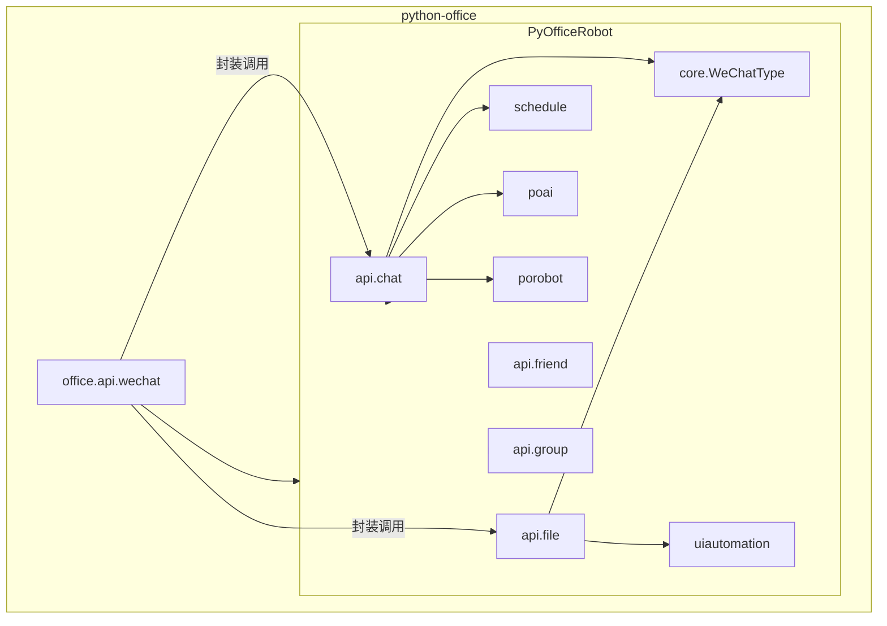
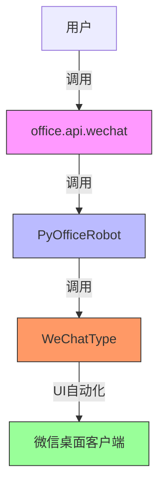
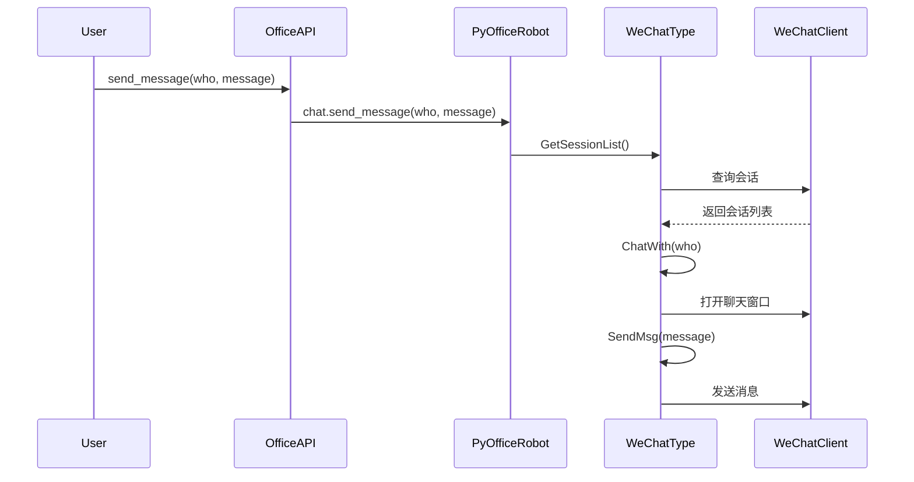
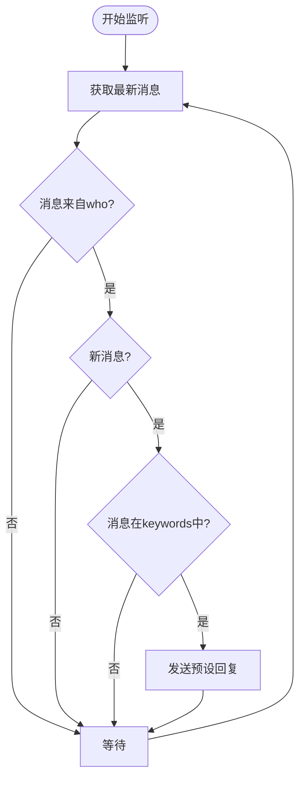
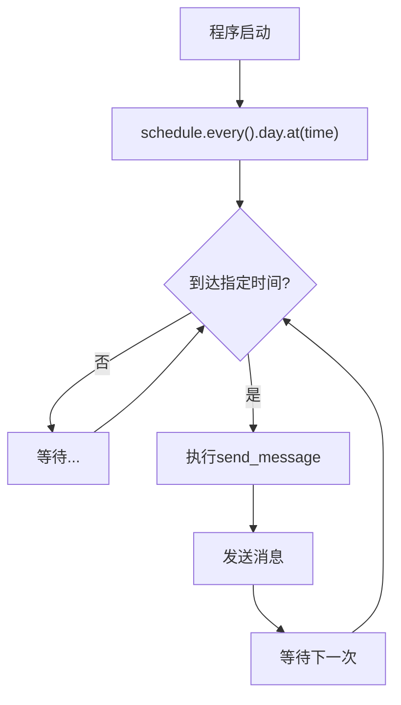
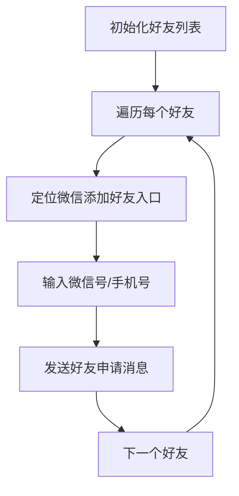
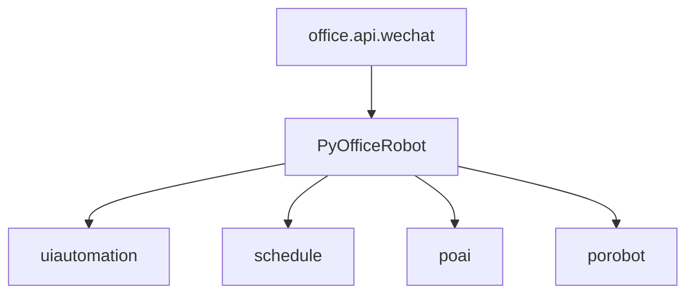

# 微信机器人API

<cite>
**本文档引用的文件**   
- [wechat.py](file://office/api/wechat.py)
- [chat.py](file://venv/Lib/site-packages/PyOfficeRobot/api/chat.py)
- [file.py](file://venv/Lib/site-packages/PyOfficeRobot/api/file.py)
- [001-发一条信息.py](file://examples/PyOfficeRobot/001-发一条信息.py)
- [002-发文件.py](file://examples/PyOfficeRobot/002-发文件.py)
- [003-根据关键词回复.py](file://examples/PyOfficeRobot/003-根据关键词回复.py)
- [004-定时发送.py](file://examples/PyOfficeRobot/004-定时发送.py)
- [005-自定义功能.py](file://examples/PyOfficeRobot/005-自定义功能.py)
- [009-批量加好友.py](file://examples/PyOfficeRobot/009-批量加好友.py)
- [010-定时群发.py](file://examples/PyOfficeRobot/010-定时群发.py)
- [__init__.py](file://office/__init__.py)
</cite>

## 目录
1. [简介](#简介)
2. [项目结构](#项目结构)
3. [核心组件](#核心组件)
4. [架构概述](#架构概述)
5. [详细组件分析](#详细组件分析)
6. [依赖分析](#依赖分析)
7. [性能考虑](#性能考虑)
8. [故障排除指南](#故障排除指南)
9. [结论](#结论)

## 简介
`office.api.wechat` 模块为微信自动化提供了高级API接口，通过封装底层的微信Web协议交互，实现了消息发送、文件传输、自动回复、定时任务等核心功能。该模块基于 `PyOfficeRobot` 库构建，利用UI自动化技术与微信桌面客户端进行交互，支持二维码登录、会话管理、消息监听等机制。本文档深入解析其核心函数如 `send_message`、`send_file`、`receive_message`、`auto_reply`（对应 `chat_by_keywords`）、`add_friends` 和 `send_timed_message`（对应 `send_message_by_time`）的实现原理与使用方法，并提供高级功能的完整代码示例。

## 项目结构
`office.api.wechat` 模块位于 `python-office` 项目的 `office/api/` 目录下，是 `office` 包对外暴露的微信自动化入口。其功能实现依赖于独立的 `PyOfficeRobot` 包，后者通过 `uiautomation` 库直接操作微信桌面客户端的UI元素。`examples/PyOfficeRobot/` 目录下提供了丰富的使用示例，覆盖了从基础消息发送到高级自动化场景的完整用例。

**图示来源**
- [wechat.py](file://office/api/wechat.py)
- [chat.py](file://venv/Lib/site-packages/PyOfficeRobot/api/chat.py)
- [file.py](file://venv/Lib/site-packages/PyOfficeRobot/api/file.py)

**本节来源**
- [wechat.py](file://office/api/wechat.py)
- [__init__.py](file://office/__init__.py)

## 核心组件
`office.api.wechat` 模块的核心组件是其提供的高层函数，这些函数将复杂的自动化逻辑封装成简单易用的接口。主要功能包括：`send_message` 用于向指定联系人发送文本消息；`send_file` 实现文件的自动化发送；`receive_message` 用于监听并记录来自微信的消息；`chat_by_keywords` 提供基于关键词的自动回复能力；`send_message_by_time` 支持消息的定时发送；`group_send` 用于群发消息；`chat_robot` 则集成了智能聊天机器人功能。这些函数通过调用 `PyOfficeRobot` 库的底层API，实现了对微信客户端的非侵入式自动化控制。

**本节来源**
- [wechat.py](file://office/api/wechat.py#L6-L94)

## 架构概述
`office.api.wechat` 模块的架构采用分层设计。顶层是 `office` 包提供的简洁API，旨在为用户提供最简单的调用方式。中间层是独立的 `PyOfficeRobot` 包，它负责具体的业务逻辑处理，如消息调度、关键词匹配、会话管理等。底层是 `PyOfficeRobot.core.WeChatType` 模块，它利用 `uiautomation` 库直接与微信桌面客户端的UI进行交互，执行诸如查找联系人、打开聊天窗口、输入文本、点击发送按钮等具体操作。这种架构将用户接口与实现细节分离，提高了代码的可维护性和可扩展性。

**图示来源**
- [wechat.py](file://office/api/wechat.py)
- [chat.py](file://venv/Lib/site-packages/PyOfficeRobot/api/chat.py)

## 详细组件分析

### 消息与文件发送功能分析
`send_message` 和 `send_file` 函数是实现微信自动化的基础。`send_message` 函数接收 `who`（接收人名称）和 `message`（消息内容）两个参数，其内部通过调用 `PyOfficeRobot.chat.send_message` 来执行实际操作。类似地，`send_file` 函数接收 `who`（接收人名称）和 `file`（文件路径）参数，通过 `PyOfficeRobot.file.send_file` 发送文件。底层实现中，`WeChatType` 类首先通过 `GetSessionList` 获取会话列表，然后使用 `ChatWith` 方法定位到指定联系人的聊天窗口，最后通过 `SendMsg` 或 `test_SendFiles` 方法完成消息或文件的发送。

**图示来源**
- [wechat.py](file://office/api/wechat.py#L6-L16)
- [chat.py](file://venv/Lib/site-packages/PyOfficeRobot/api/chat.py#L16-L28)

**本节来源**
- [wechat.py](file://office/api/wechat.py#L6-L57)
- [001-发一条信息.py](file://examples/PyOfficeRobot/001-发一条信息.py)
- [002-发文件.py](file://examples/PyOfficeRobot/002-发文件.py)

### 自动回复与定时发送功能分析
`chat_by_keywords` 和 `send_message_by_time` 函数实现了更高级的自动化功能。`chat_by_keywords` 函数接收 `who`（联系人）和 `keywords`（关键词字典）作为参数，启动一个无限循环，持续监听来自指定联系人的消息。当收到的消息匹配字典中的某个关键词时，系统会自动发送预设的回复内容。`send_message_by_time` 函数则利用 `schedule` 库，在指定的 `time` 执行 `send_message` 操作，实现定时消息发送。

**图示来源**
- [wechat.py](file://office/api/wechat.py#L33-L30)
- [chat.py](file://venv/Lib/site-packages/PyOfficeRobot/api/chat.py#L32-L48)
- [chat.py](file://venv/Lib/site-packages/PyOfficeRobot/api/chat.py#L75-L79)

**本节来源**
- [wechat.py](file://office/api/wechat.py#L19-L34)
- [003-根据关键词回复.py](file://examples/PyOfficeRobot/003-根据关键词回复.py)
- [004-定时发送.py](file://examples/PyOfficeRobot/004-定时发送.py)

### 批量加好友与群发功能分析
`add_friends` 功能通过 `PyOfficeRobot.friend.add` 实现，它接收一个消息 `msg` 和一个包含微信号/手机号与备注名映射的字典 `num_notes`，自动化地向多个用户发送好友申请。`group_send` 功能则用于群发消息，其具体实现细节在 `PyOfficeRobot.group.send` 中，通常涉及读取群发名单和消息内容文件，然后遍历名单逐一发送。

**图示来源**
- [009-批量加好友.py](file://examples/PyOfficeRobot/009-批量加好友.py)
- [010-定时群发.py](file://examples/PyOfficeRobot/010-定时群发.py)

**本节来源**
- [009-批量加好友.py](file://examples/PyOfficeRobot/009-批量加好友.py)
- [010-定时群发.py](file://examples/PyOfficeRobot/010-定时群发.py)

## 依赖分析
`office.api.wechat` 模块的主要依赖是 `PyOfficeRobot` 包，它本身又依赖于多个关键库。`uiautomation` 是核心依赖，用于实现Windows桌面应用的UI自动化，直接操作微信客户端。`schedule` 库用于处理定时任务。`poai` 和 `porobot` 库则为智能聊天功能提供了后端支持。这种依赖关系使得 `office.api.wechat` 能够专注于提供简洁的API，而将复杂的自动化和AI集成工作交给专门的库来处理。

**图示来源**
- [wechat.py](file://office/api/wechat.py)
- [chat.py](file://venv/Lib/site-packages/PyOfficeRobot/api/chat.py)
- [file.py](file://venv/Lib/site-packages/PyOfficeRobot/api/file.py)

**本节来源**
- [wechat.py](file://office/api/wechat.py)
- [chat.py](file://venv/Lib/site-packages/PyOfficeRobot/api/chat.py)
- [__init__.py](file://venv/Lib/site-packages/PyOfficeRobot/__init__.py)

## 性能考虑
由于该模块基于UI自动化而非官方API，其性能和稳定性受多种因素影响。首次发送文件时可能耗时较长，因为系统需要初始化文件传输组件。消息监听和自动回复功能运行在无限循环中，会持续占用CPU资源。定时任务的精度依赖于 `schedule` 库和Python解释器的调度。此外，UI自动化对微信客户端的界面元素高度敏感，微信的任何UI更新都可能导致自动化脚本失效。因此，在生产环境中使用时，需要充分考虑这些性能和稳定性因素。

## 故障排除指南
常见的问题包括：登录失败（需手动扫码）、UI元素定位失败（微信版本更新导致）、文件发送超时等。建议在使用前确保微信客户端已登录并保持在前台。对于UI定位问题，应检查 `PyOfficeRobot` 库是否为最新版本。对于 `receive_message` 等长时间运行的函数，应妥善处理异常，避免程序崩溃。用户还应注意，过度自动化可能违反微信的使用条款，存在账号被封禁的风险，应谨慎使用。

**本节来源**
- [wechat.py](file://office/api/wechat.py#L68-L82)
- [007-收集群消息.py](file://examples/PyOfficeRobot/007-收集群消息.py#L9)
- [009-批量加好友.py](file://examples/PyOfficeRobot/009-批量加好友.py#L14)

## 结论
`office.api.wechat` 模块通过封装 `PyOfficeRobot` 库，为Python开发者提供了一套强大且易用的微信机器人API。它成功地将复杂的UI自动化技术抽象为简单的函数调用，使得开发者能够轻松实现消息发送、文件传输、自动回复、定时群发等高级功能。尽管其底层依赖UI自动化带来了一定的稳定性和性能挑战，但对于个人自动化任务和轻量级应用来说，它是一个非常有价值的工具。用户在使用时应充分了解其技术原理和潜在风险，合理利用其功能。