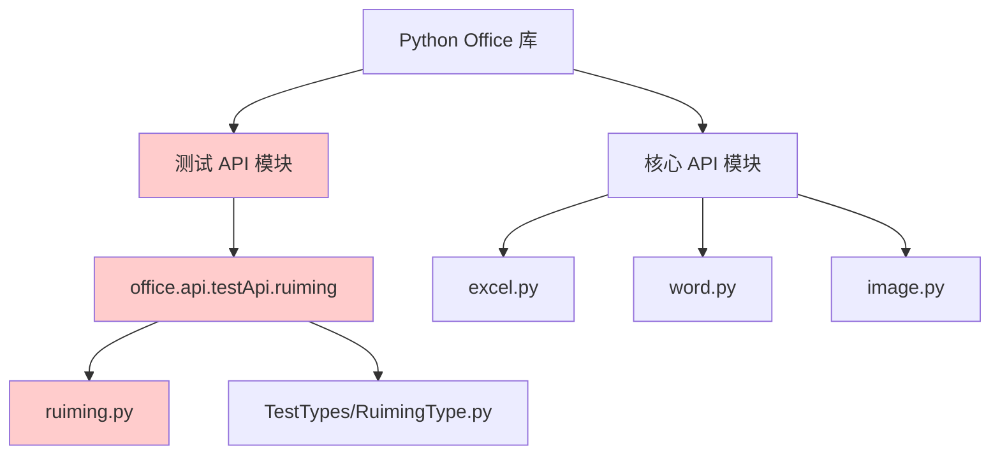
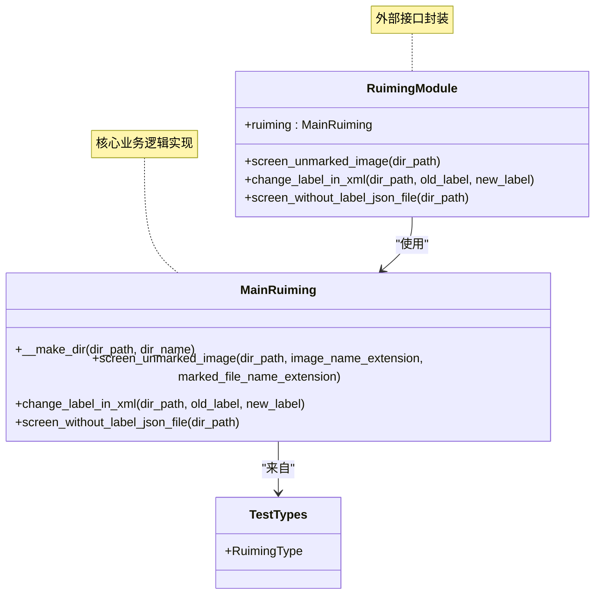
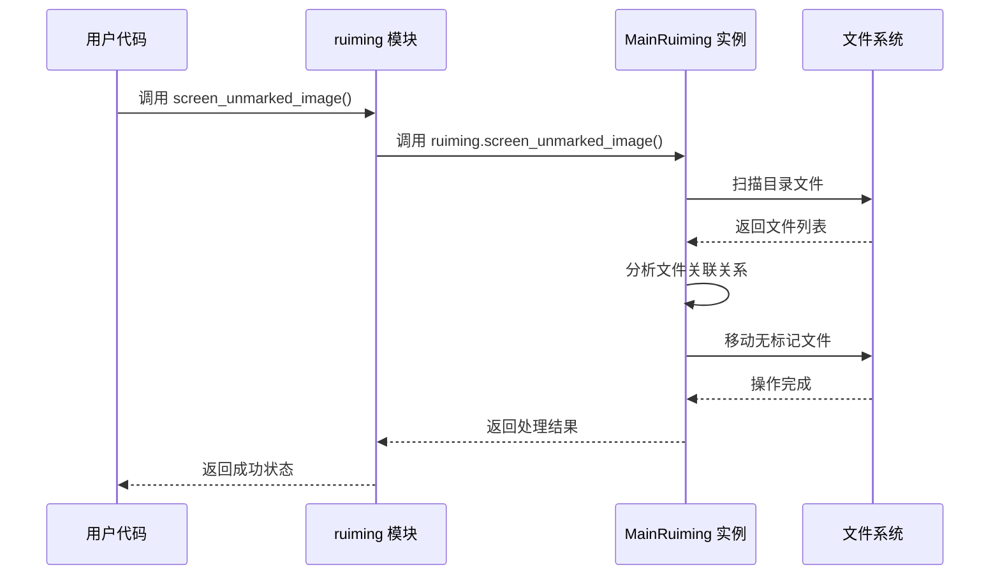
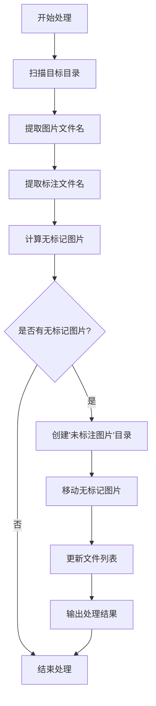
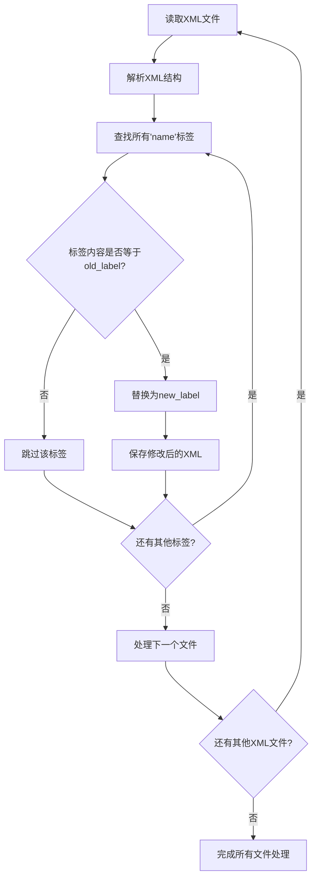
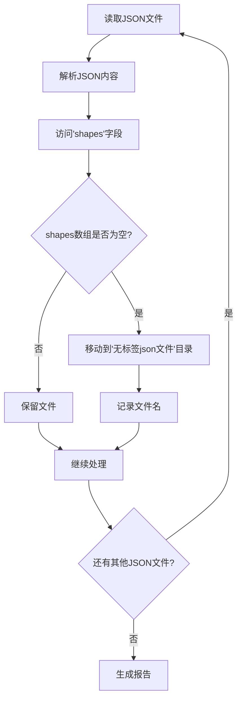
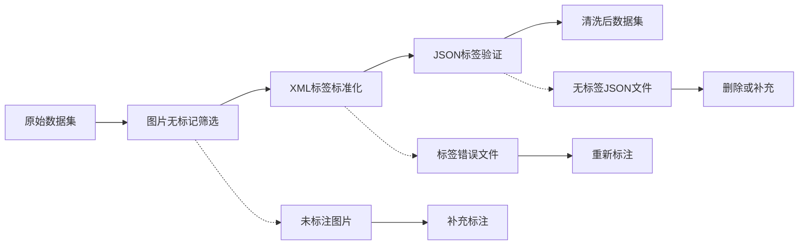
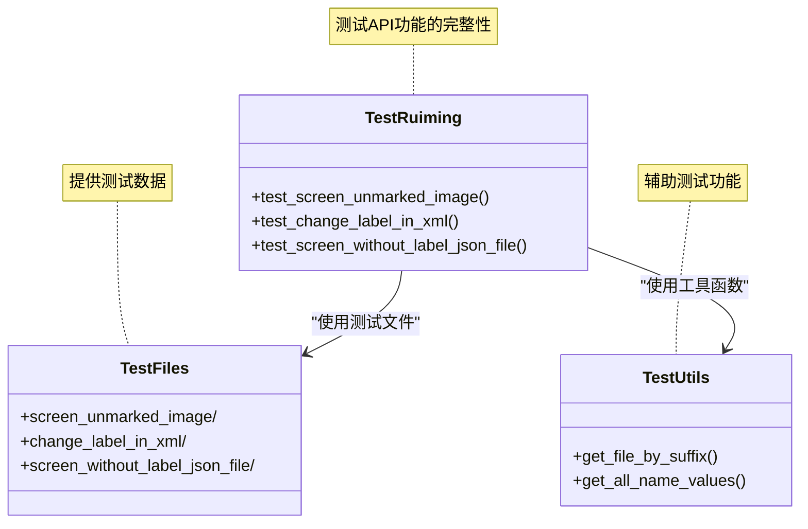
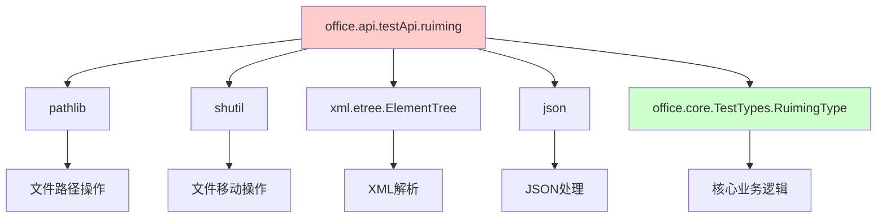
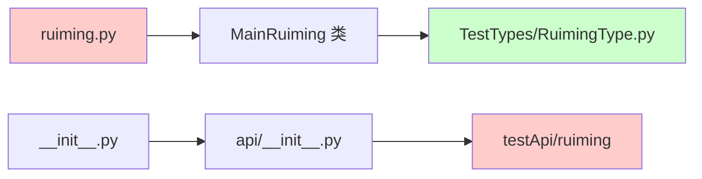

# 测试API (试验性)

<cite>
**本文档引用的文件**
- [office/api/testApi/ruiming.py](file://office/api/testApi/ruiming.py)
- [office/api/__init__.py](file://office/api/__init__.py)
- [office/__init__.py](file://office/__init__.py)
- [office/core/TestTypes/RuimingType.py](file://office/core/TestTypes/RuimingType.py)
- [examples/poruiming/测试API功能演示.py](file://examples/poruiming/测试API功能演示.py)
- [tests/test_code/test_ruiming.py](file://tests/test_code/test_ruiming.py)
- [tests/test_files/ruiming/change_label_in_xml/testfile.xml](file://tests/test_files/ruiming/change_label_in_xml/testfile.xml)
</cite>

## 目录
1. [简介](#简介)
2. [模块概述](#模块概述)
3. [架构分析](#架构分析)
4. [核心功能详解](#核心功能详解)
5. [使用指南](#使用指南)
6. [测试用例分析](#测试用例分析)
7. [依赖关系](#依赖关系)
8. [注意事项](#注意事项)
9. [故障排除](#故障排除)
10. [总结](#总结)

## 简介

`office.api.testApi.ruiming` 是 Python Office 库中的一个试验性测试 API 模块，专为机器学习数据预处理任务而设计。该模块提供了图像处理、XML 标签修改和 JSON 文件筛选等核心功能，目前处于 Beta 测试阶段，可能存在不稳定性和未来版本变更的风险。

### 关键特性
- **图像无标记检测**：自动识别未标注的图片文件
- **XML 标签批量修改**：支持批量修改 XML 文件中的标签内容
- **JSON 文件筛选**：智能筛选无标签的 JSON 文件
- **批量处理能力**：支持目录级批量文件处理
- **机器学习友好**：专为机器学习数据预处理优化

## 模块概述

### 模块位置与导入方式

该模块位于 `office.api.testApi.ruiming` 路径下，与核心 API 形成清晰的分离：



**图表来源**
- [office/api/__init__.py](file://office/api/__init__.py#L1-L2)
- [office/__init__.py](file://office/__init__.py#L17-L21)

### 导入限制

该模块不会被常规的 `office/__init__.py` 导出，用户需要通过特殊方式导入：

```python
# 正确的导入方式
from office.api.testApi.ruiming import (
    screen_unmarked_image,
    change_label_in_xml,
    screen_without_label_json_file
)

# 错误的导入方式（无法直接从 office 导入）
# import office
# office.screen_unmarked_image(...)  # 将失败
```

**节来源**
- [office/api/__init__.py](file://office/api/__init__.py#L1-L2)
- [office/__init__.py](file://office/__init__.py#L17-L21)

## 架构分析

### 整体架构



**图表来源**
- [office/api/testApi/ruiming.py](file://office/api/testApi/ruiming.py#L1-L19)
- [office/core/TestTypes/RuimingType.py](file://office/core/TestTypes/RuimingType.py#L7-L92)

### 核心组件关系



**图表来源**
- [office/api/testApi/ruiming.py](file://office/api/testApi/ruiming.py#L8-L19)
- [office/core/TestTypes/RuimingType.py](file://office/core/TestTypes/RuimingType.py#L20-L47)

**节来源**
- [office/api/testApi/ruiming.py](file://office/api/testApi/ruiming.py#L1-L19)
- [office/core/TestTypes/RuimingType.py](file://office/core/TestTypes/RuimingType.py#L1-L92)

## 核心功能详解

### 1. 筛选无标记图片

#### 功能描述
自动识别并筛选没有标记的图片文件，常用于机器学习数据预处理流程。

#### 接口定义
```python
def screen_unmarked_image(dir_path):
    """
    筛选无标记图片
    
    参数:
        dir_path (str): 包含图片和标注文件的目录路径
        
    功能:
        - 扫描目录中的图片和XML标注文件
        - 识别没有对应标注文件的图片
        - 将无标记图片移动到"未标注图片"子目录
    """
```

#### 处理流程


**图表来源**
- [office/core/TestTypes/RuimingType.py](file://office/core/TestTypes/RuimingType.py#L20-L47)

### 2. 修改XML标签

#### 功能描述
批量修改XML文件中的标签内容，支持标签名称的统一替换。

#### 接口定义
```python
def change_label_in_xml(dir_path, old_label, new_label):
    """
    修改XML文件中的标签内容
    
    参数:
        dir_path (str): 包含XML文件的目录路径
        old_label (str): 需要修改的旧标签名称
        new_label (str): 修改后的新标签名称
        
    功能:
        - 扫描目录中的所有XML文件
        - 查找并替换所有匹配的标签内容
        - 保存修改后的XML文件
    """
```

#### 处理机制


**图表来源**
- [office/core/TestTypes/RuimingType.py](file://office/core/TestTypes/RuimingType.py#L51-L70)

### 3. 筛选无标签JSON文件

#### 功能描述
识别并筛选没有标签内容的JSON文件，特别适用于机器学习标注数据的预处理。

#### 接口定义
```python
def screen_without_label_json_file(dir_path):
    """
    筛选无标签的JSON文件
    
    参数:
        dir_path (str): 包含JSON文件的目录路径
        
    功能:
        - 扫描目录中的所有JSON文件
        - 检查每个文件的"shapes"字段是否为空
        - 将空标签文件移动到"无标签json文件"子目录
    """
```

#### 数据结构处理


**图表来源**
- [office/core/TestTypes/RuimingType.py](file://office/core/TestTypes/RuimingType.py#L74-L89)

**节来源**
- [office/api/testApi/ruiming.py](file://office/api/testApi/ruiming.py#L8-L19)
- [office/core/TestTypes/RuimingType.py](file://office/core/TestTypes/RuimingType.py#L20-L89)

## 使用指南

### 基本使用示例

#### 1. 安装和导入
```python
# 安装 Python Office 库
pip install python-office

# 导入测试API模块
from office.api.testApi.ruiming import (
    screen_unmarked_image,
    change_label_in_xml,
    screen_without_label_json_file
)
```

#### 2. 图片无标记筛选
```python
import os

# 创建测试目录
test_dir = "test_images"
if not os.path.exists(test_dir):
    os.makedirs(test_dir)

# 筛选无标记图片
try:
    screen_unmarked_image(dir_path=test_dir)
    print("无标记图片筛选完成")
except Exception as e:
    print(f"功能执行失败：{e}")
```

#### 3. XML标签修改
```python
# 修改XML文件中的标签
try:
    change_label_in_xml(
        dir_path="标注数据",
        old_label="person",
        new_label="human"
    )
    print("XML标签修改完成")
except Exception as e:
    print(f"标签修改失败：{e}")
```

#### 4. JSON文件筛选
```python
# 筛选无标签JSON文件
try:
    screen_without_label_json_file(dir_path="标注数据")
    print("无标签JSON文件筛选完成")
except Exception as e:
    print(f"JSON筛选失败：{e}")
```

### 实际应用场景

#### 机器学习数据预处理工作流


**节来源**
- [examples/poruiming/测试API功能演示.py](file://examples/poruiming/测试API功能演示.py#L53-L135)

## 测试用例分析

### 单元测试结构



**图表来源**
- [tests/test_code/test_ruiming.py](file://tests/test_code/test_ruiming.py#L12-L35)

### 测试用例详情

#### 1. 无标记图片筛选测试
```python
def test_screen_unmarked_image(self):
    screen_unmarked_image(dir_path='../test_files/ruiming/screen_unmarked_image')
    # 预期结果：2.jpg被移动到"未标注图片"目录下
```

#### 2. XML标签修改测试
```python
def test_change_label_in_xml(self):
    change_label_in_xml(
        dir_path="../test_files/ruiming/change_label_in_xml", 
        old_label="测试", 
        new_label="测试1"
    )
    # 预期结果：name标签内容从"测试"改为"测试1"
    file_names = get_file_by_suffix('../test_files/ruiming/change_label_in_xml', 'xml')
    for file_name in file_names:
        names = get_all_name_values('../test_files/ruiming/change_label_in_xml/' + file_name)
        self.assertNotIn('测试', names)
    # 还原
    change_label_in_xml(
        dir_path="../test_files/ruiming/change_label_in_xml", 
        old_label="测试1", 
        new_label="测试"
    )
```

#### 3. 无标签JSON文件筛选测试
```python
def test_screen_without_label_json_file(self):
    screen_without_label_json_file(dir_path="../test_files/ruiming/screen_without_label_json_file")
    # 预期结果：除1.json外均被移动到"无标签json文件"文件夹中
```

**节来源**
- [tests/test_code/test_ruiming.py](file://tests/test_code/test_ruiming.py#L12-L35)

## 依赖关系

### 外部依赖



**图表来源**
- [office/api/testApi/ruiming.py](file://office/api/testApi/ruiming.py#L1-L3)
- [office/core/TestTypes/RuimingType.py](file://office/core/TestTypes/RuimingType.py#L1-L6)

### 内部依赖



**图表来源**
- [office/api/testApi/ruiming.py](file://office/api/testApi/ruiming.py#L1-L4)
- [office/api/__init__.py](file://office/api/__init__.py#L1-L2)

**节来源**
- [office/api/testApi/ruiming.py](file://office/api/testApi/ruiming.py#L1-L3)
- [office/core/TestTypes/RuimingType.py](file://office/core/TestTypes/RuimingType.py#L1-L6)

## 注意事项

### 1. Beta 版本特性
- **不稳定风险**：作为试验性功能，可能存在未预见的问题
- **API变更**：未来版本可能会对现有接口进行调整
- **功能扩展**：新功能可能随时添加或移除

### 2. 使用限制
- **导入方式**：必须通过 `office.api.testApi.ruiming` 导入
- **文件格式**：要求严格的文件命名规范（image.jpg 对应 image.xml）
- **权限要求**：需要对目标目录具有读写权限

### 3. 性能考虑
- **大文件处理**：对于大型数据集，处理时间可能较长
- **内存占用**：大量文件处理时可能消耗较多内存
- **并发安全**：不支持多线程同时操作同一目录

### 4. 数据安全
- **备份重要**：建议在执行前备份原始数据
- **不可逆操作**：文件移动操作不可撤销
- **错误处理**：完善的异常处理机制

## 故障排除

### 常见问题及解决方案

#### 1. 导入错误
```python
# 错误：AttributeError: module 'office' has no attribute 'screen_unmarked_image'
# 解决方案：
from office.api.testApi.ruiming import screen_unmarked_image
```

#### 2. 权限不足
```python
# 错误：PermissionError: [Errno 13] Permission denied
# 解决方案：
# 1. 检查目录权限
# 2. 以管理员身份运行
# 3. 更改目标目录位置
```

#### 3. 文件格式错误
```python
# 错误：FileNotFoundError 或解析错误
# 解决方案：
# 1. 确保文件命名正确（image.jpg 对应 image.xml）
# 2. 检查文件格式是否符合预期
# 3. 验证文件编码（UTF-8）
```

#### 4. 性能问题
```python
# 优化建议：
# 1. 分批处理大量文件
# 2. 使用更高效的存储设备
# 3. 在低峰时段执行处理
```

### 调试技巧

#### 1. 启用详细日志
```python
import logging
logging.basicConfig(level=logging.DEBUG)

# 添加调试输出
print(f"处理目录：{dir_path}")
print(f"找到文件数量：{len(file_list)}")
```

#### 2. 验证中间结果
```python
# 在关键步骤添加检查点
def debug_check():
    print("当前目录结构：")
    for item in os.listdir(dir_path):
        print(f"  - {item}")
```

## 总结

`office.api.testApi.ruiming` 是一个功能强大的试验性测试 API 模块，专为机器学习数据预处理而设计。虽然目前处于 Beta 阶段，但已经具备以下优势：

### 主要优势
1. **专业性强**：针对机器学习数据预处理场景优化
2. **功能完整**：涵盖图片、XML、JSON三种常见数据格式
3. **易于使用**：简洁的API设计，快速上手
4. **批量处理**：支持目录级批量操作，提高效率

### 发展方向
1. **稳定性提升**：修复已知问题，增强健壮性
2. **功能扩展**：增加更多数据格式支持
3. **性能优化**：提升大文件处理能力
4. **API标准化**：完善接口设计，确保向后兼容

### 最佳实践建议
1. **谨慎使用**：在生产环境中谨慎使用试验性功能
2. **充分测试**：在正式使用前进行充分测试
3. **定期备份**：重要数据处理前做好备份
4. **关注更新**：及时跟进功能更新和改进

该模块为 Python Office 库的功能扩展提供了良好的试验平台，随着测试的深入和完善，有望成为机器学习数据处理的重要工具。