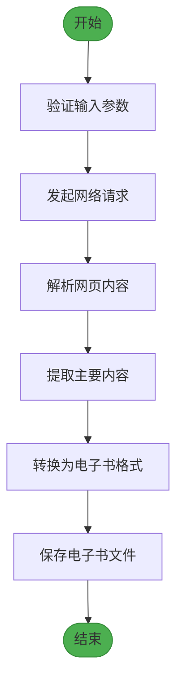
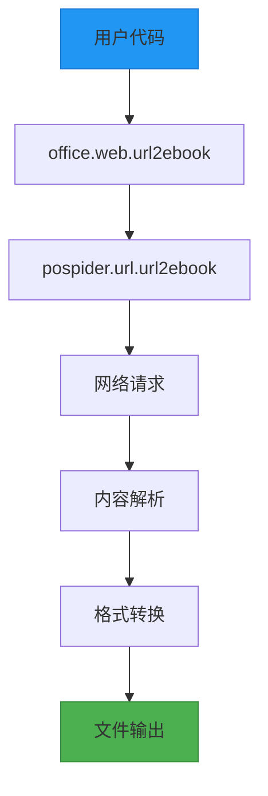

# 网页交互API

<cite>
**本文档中引用的文件**  
- [web.py](file://office/api/web.py)
- [网页转电子书.py](file://examples/pospider/网页转电子书.py)
- [test_web.py](file://tests/test_code/test_web.py)
</cite>

## 目录
1. [简介](#简介)
2. [核心功能](#核心功能)
3. [函数详解](#函数详解)
4. [调用示例](#调用示例)
5. [处理流程](#处理流程)
6. [反爬虫策略应对](#反爬虫策略应对)
7. [合法合规使用](#合法合规使用)
8. [模块暴露与自动化](#模块暴露与自动化)

## 简介
`office.api.web` 模块提供了网页交互功能，专注于将网页内容转换为电子书格式。该功能通过封装 `pospider` 模块的能力，实现了从指定URL抓取内容并生成标准电子书文件（如EPUB、PDF）的自动化流程。此功能适用于技术文档归档、学习资料整理和离线阅读等场景。

## 核心功能
`office.api.web` 模块的核心功能是将网页内容转换为电子书。该功能通过调用底层 `pospider` 模块实现，能够自动提取网页主要内容，并将其转换为结构化的电子书格式。主要特点包括：
- 支持多种网页格式转换
- 自动提取网页主要内容
- 生成标准电子书格式
- 简单易用的API接口

**Section sources**
- [web.py](file://office/api/web.py#L1-L18)

## 函数详解
### url2ebook 函数
`url2ebook` 是 `office.api.web` 模块提供的主要函数，用于将指定的URL转换为电子书格式。

**参数说明：**
- **url** (str): 需要转换为电子书的网页URL
- **tile** (str): 电子书的标题（注：参数名应为title，此处为拼写错误）

**返回值：**
- None，但会生成电子书文件

该函数通过调用 `pospider.url.url2ebook` 方法实现网页到电子书的转换。它封装了网络请求、内容解析和格式转换的复杂性，为用户提供了一个简单的一行代码解决方案。

**Section sources**
- [web.py](file://office/api/web.py#L5-L17)

## 调用示例
以下是一个完整的调用示例，演示如何使用 `office.web.url2ebook` 函数将网页转换为电子书：

```python
import office

# 定义要转换的网页URL和电子书标题
sample_url = "https://www.python-office.com"
ebook_title = "Python-Office自动化办公指南"

# 调用url2ebook函数进行转换
office.web.url2ebook(
    url=sample_url,
    tile=ebook_title
)
```

在实际使用中，建议添加异常处理以提高代码的健壮性：

```python
try:
    office.web.url2ebook(
        url=sample_url,
        tile=ebook_title
    )
    print("✅ 网页转电子书转换成功！")
except Exception as e:
    print(f"❌ 转换失败：{e}")
    print("💡 提示：请检查网络连接和URL有效性")
```

**Section sources**
- [网页转电子书.py](file://examples/pospider/网页转电子书.py#L8-L38)

## 处理流程
网页转电子书的处理流程包括以下几个关键步骤：



**Diagram sources**
- [web.py](file://office/api/web.py#L5-L17)
- [网页转电子书.py](file://examples/pospider/网页转电子书.py#L29-L32)

该流程首先验证输入的URL和标题参数，然后通过网络请求获取网页内容。接着，系统会解析HTML文档并提取主要内容，去除广告、导航栏等无关元素。最后，将提取的内容转换为标准的电子书格式并保存到本地文件系统。

## 反爬虫策略应对
在实际的网页抓取过程中，可能会遇到各种反爬虫机制。虽然 `office.api.web` 模块本身没有直接暴露请求头设置等参数，但其依赖的 `pospider` 模块应该已经内置了相应的应对策略：

1. **用户代理设置**：使用合理的User-Agent模拟浏览器访问
2. **请求频率控制**：避免过于频繁的请求导致IP被封禁
3. **Cookie处理**：维护会话状态以通过简单的身份验证
4. **JavaScript渲染**：处理需要JavaScript执行才能显示的内容

为了合法合规地使用此功能，建议：
- 遵守目标网站的robots.txt规则
- 控制请求频率，避免对服务器造成过大压力
- 尊重网站的版权和使用条款

**Section sources**
- [web.py](file://office/api/web.py#L3)
- [网页转电子书.py](file://examples/pospider/网页转电子书.py#L18)

## 合法合规使用
使用网页爬虫功能时，必须严格遵守相关法律法规和道德准则：

1. **尊重版权**：仅对允许抓取的内容进行操作，避免侵犯他人知识产权
2. **遵守服务条款**：仔细阅读并遵守目标网站的服务条款和使用协议
3. **保护隐私**：不抓取包含个人隐私信息的内容
4. **合理使用**：控制请求频率，避免对目标服务器造成不必要的负担
5. **明确用途**：仅将抓取的内容用于个人学习、研究或合法的商业用途

建议在使用此功能前，先检查目标网站的robots.txt文件，了解其对爬虫的允许范围。

**Section sources**
- [网页转电子书.py](file://examples/pospider/网页转电子书.py#L45-L47)

## 模块暴露与自动化
`office.api.web` 模块通过 `office` 包的统一接口暴露给用户，使得该功能可以轻松集成到自动化信息收集场景中。



**Diagram sources**
- [web.py](file://office/api/web.py#L5-L17)
- [__init__.py](file://office/__init__.py#L7)

通过 `import office` 即可使用 `office.web.url2ebook` 方法，这种设计使得该功能可以方便地集成到各种自动化工作流中，如定期抓取技术文档、批量转换学习资料等场景。这种封装方式既保持了接口的简洁性，又提供了强大的功能支持。

**Section sources**
- [web.py](file://office/api/web.py#L5-L17)
- [__init__.py](file://office/__init__.py#L7)