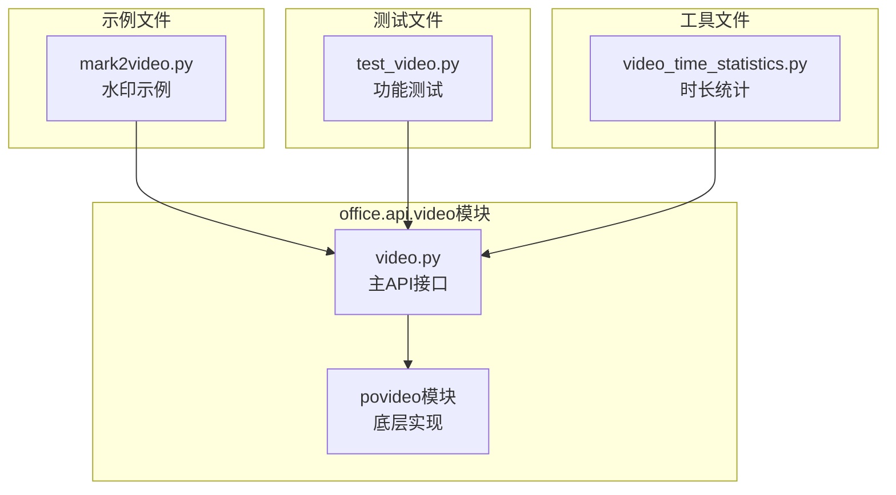
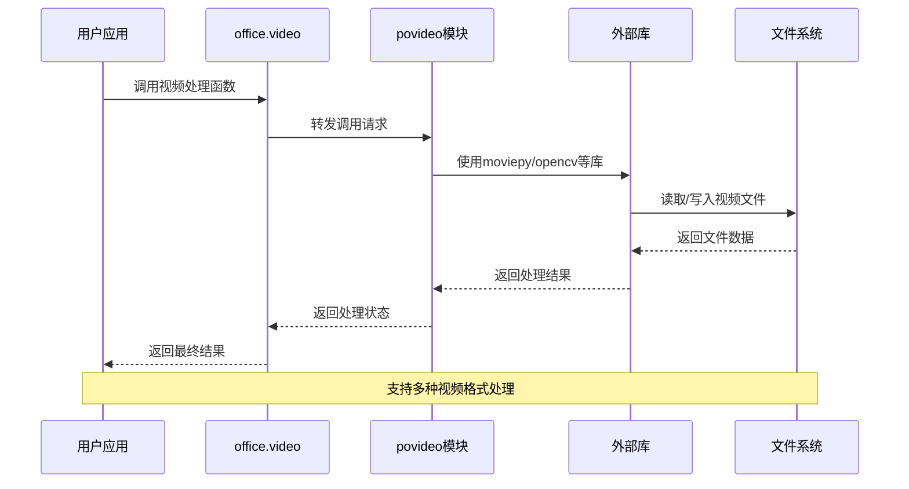
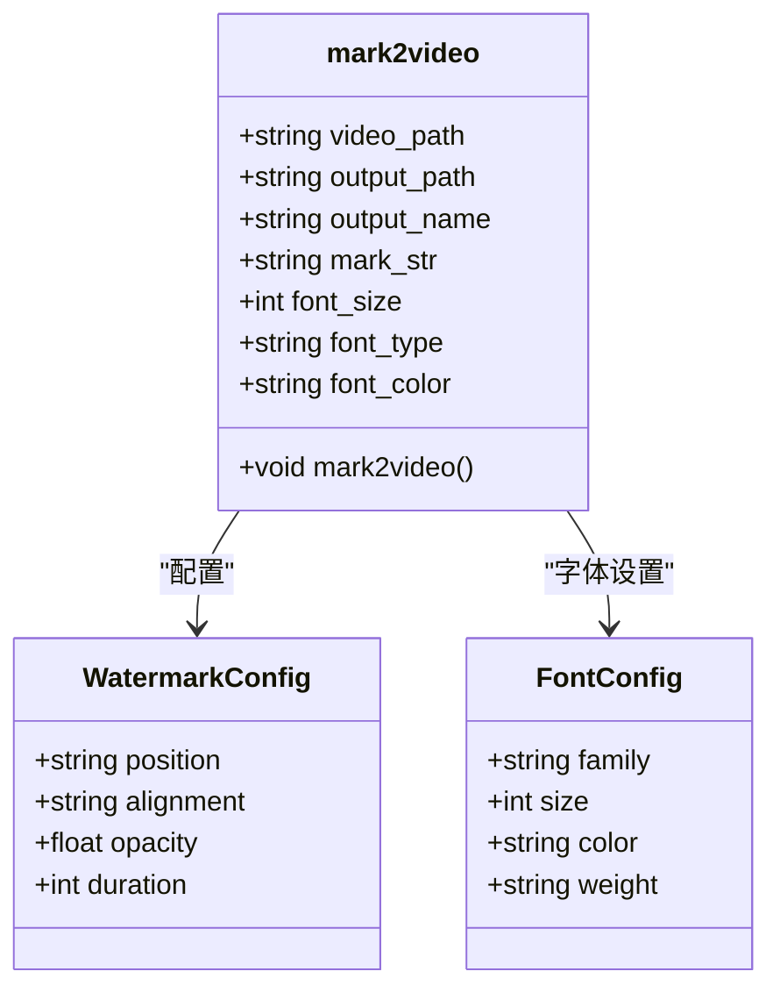
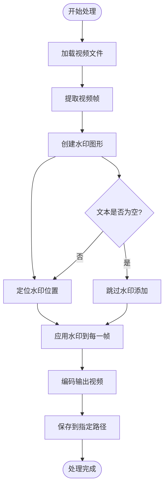
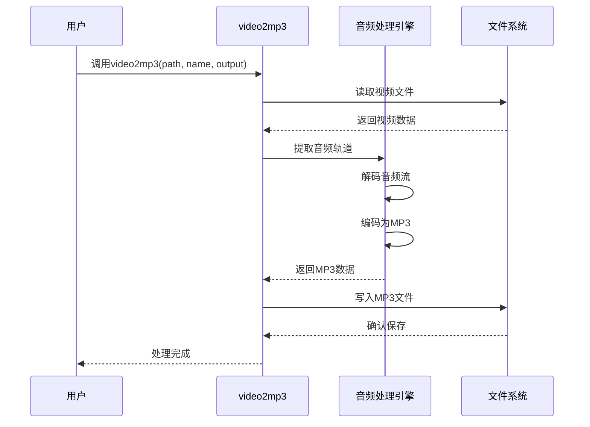
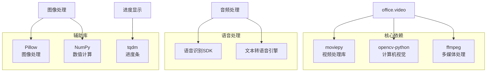
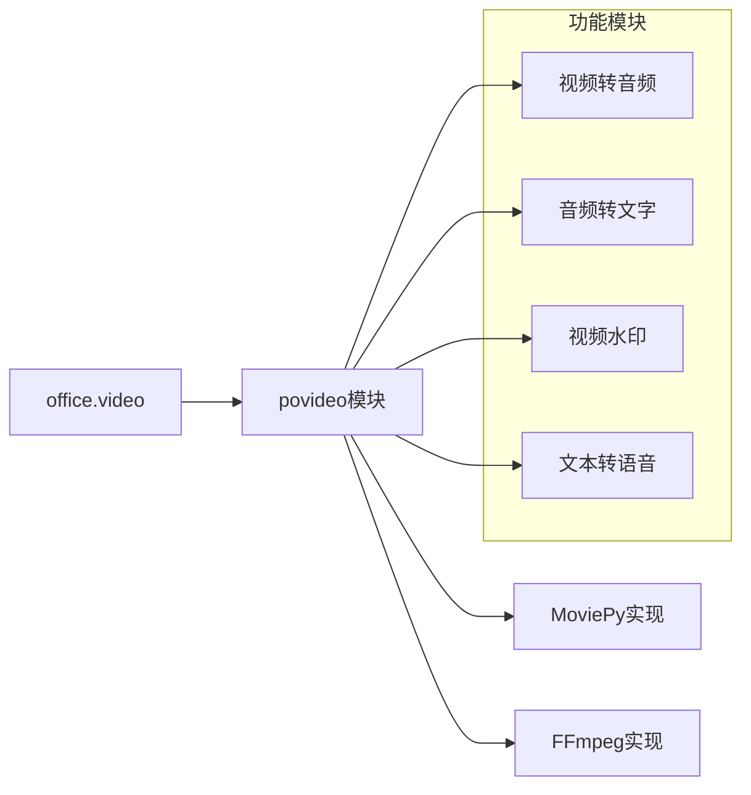

# 视频处理API文档

<cite>
**本文档引用的文件**
- [office/api/video.py](file://office/api/video.py)
- [examples/povideo/mark2video.py](file://examples/povideo/mark2video.py)
- [contributors/CatchDr/video_time_statistics.py](file://contributors/CatchDr/video_time_statistics.py)
- [tests/test_code/test_video.py](file://tests/test_code/test_video.py)
- [README.md](file://README.md)
</cite>

## 目录
1. [简介](#简介)
2. [项目结构](#项目结构)
3. [核心组件](#核心组件)
4. [架构概览](#架构概览)
5. [详细组件分析](#详细组件分析)
6. [依赖分析](#依赖分析)
7. [性能考虑](#性能考虑)
8. [故障排除指南](#故障排除指南)
9. [结论](#结论)

## 简介

python-office的office.api.video模块是一个专门用于视频处理的API集合，提供了视频与音频转换、视频水印添加、文本转语音等核心功能。该模块采用简洁的接口设计，让用户能够通过一行代码完成复杂的视频处理任务。

### 主要功能特性

- **视频转音频**：将视频文件转换为MP3音频文件
- **音频转文字**：从音频文件中提取文字内容
- **视频水印**：为视频添加文字水印
- **文本转语音**：将文本内容转换为语音MP3文件

## 项目结构

**图表来源**
- [office/api/video.py](file://office/api/video.py#L1-L73)
- [examples/povideo/mark2video.py](file://examples/povideo/mark2video.py#L1-L6)
- [tests/test_code/test_video.py](file://tests/test_code/test_video.py#L1-L22)

**章节来源**
- [office/api/video.py](file://office/api/video.py#L1-L73)
- [README.md](file://README.md#L85-L110)

## 核心组件

office.api.video模块的核心由四个主要函数组成，每个函数都专注于特定的视频处理任务：

### 函数概览表

| 函数名 | 功能描述 | 主要参数 | 返回值 |
|--------|----------|----------|--------|
| `video2mp3` | 视频转音频 | `path`, `mp3_name`, `output_path` | 无返回值 |
| `audio2txt` | 音频转文字 | `audio_path`, `appid`, `secret_id`, `secret_key` | 无返回值 |
| `mark2video` | 视频添加水印 | `video_path`, `output_path`, `output_name`, `mark_str`, `font_size`, `font_type`, `font_color` | 无返回值 |
| `txt2mp3` | 文本转语音 | `content`, `file`, `mp3`, `speak` | 无返回值 |

**章节来源**
- [office/api/video.py](file://office/api/video.py#L8-L72)

## 架构概览

**图表来源**
- [office/api/video.py](file://office/api/video.py#L1-L73)

## 详细组件分析

### mark2video - 视频水印添加功能

`mark2video`函数是视频水印功能的核心实现，提供了灵活的文字水印添加能力。

#### 函数签名与参数详解

**图表来源**
- [office/api/video.py](file://office/api/video.py#L39-L56)

#### 参数详细说明

| 参数名 | 类型 | 默认值 | 描述 | 使用场景 |
|--------|------|--------|------|----------|
| `video_path` | str | 必需 | 输入视频文件的完整路径 | 指定待处理的视频源文件 |
| `output_path` | str | './' | 输出文件的保存目录 | 指定水印视频的输出位置 |
| `output_name` | str | 'mark2video.mp4' | 输出文件名，需包含.mp4扩展名 | 定义处理后视频的文件名 |
| `mark_str` | str | 'www.python-office.com' | 水印文字内容 | 设置水印的文本信息 |
| `font_size` | int | 28 | 字体大小 | 控制水印文字的显示尺寸 |
| `font_type` | str | 'Arial' | 字体类型 | 指定水印文字的字体样式 |
| `font_color` | str | 'white' | 字体颜色 | 设置水印文字的颜色 |

#### 水印处理流程

**图表来源**
- [office/api/video.py](file://office/api/video.py#L39-L56)

**章节来源**
- [office/api/video.py](file://office/api/video.py#L39-L56)
- [examples/povideo/mark2video.py](file://examples/povideo/mark2video.py#L1-L6)

### video2mp3 - 视频转音频功能

`video2mp3`函数实现了视频到音频的转换，支持将视频中的音频轨道提取为独立的MP3文件。

#### 功能特性

- **多格式支持**：支持常见的视频格式（MP4、AVI、MOV等）
- **自定义输出**：可指定输出文件名和保存路径
- **质量控制**：保持原始音频质量的同时进行格式转换

#### 使用示例流程

**图表来源**
- [office/api/video.py](file://office/api/video.py#L8-L19)

**章节来源**
- [office/api/video.py](file://office/api/video.py#L8-L19)

### audio2txt - 音频转文字功能

`audio2txt`函数提供了基于语音识别技术的音频转文字功能，支持将音频文件中的语音内容转换为文本。

#### 技术实现要点

- **语音识别API**：集成第三方语音识别服务
- **文件大小限制**：本地文件不超过5MB
- **多语言支持**：支持多种语言的语音识别

#### 参数配置表

| 参数名 | 类型 | 必需 | 描述 | 注意事项 |
|--------|------|------|------|----------|
| `audio_path` | str | 是 | 音频文件的完整路径 | 文件大小不能超过5MB |
| `appid` | str | 是 | 语音识别API的应用ID | 需要有效的API凭证 |
| `secret_id` | str | 是 | API密钥ID | 用于身份验证 |
| `secret_key` | str | 是 | API密钥 | 保护API访问安全 |

**章节来源**
- [office/api/video.py](file://office/api/video.py#L21-L35)

### txt2mp3 - 文本转语音功能

`txt2mp3`函数实现了文本到语音的转换，将输入的文本内容转换为高质量的语音MP3文件。

#### 核心功能

- **文本处理**：支持纯文本和文件读取
- **语音合成**：高质量的语音生成
- **自定义输出**：灵活的文件命名和保存选项

#### 配置参数详解

| 参数名 | 类型 | 默认值 | 功能描述 |
|--------|------|--------|----------|
| `content` | str | '程序员晚枫' | 要转换的文本内容 |
| `file` | str | None | 指定读取的文本文件路径 |
| `mp3` | str | './程序员晚枫.mp3' | 输出MP3文件路径 |
| `speak` | bool | True | 是否立即播放生成的语音 |

**章节来源**
- [office/api/video.py](file://office/api/video.py#L60-L72)

## 依赖分析

### 外部库依赖

基于代码分析和项目结构，office.api.video模块依赖于以下关键库：

**图表来源**
- [contributors/CatchDr/video_time_statistics.py](file://contributors/CatchDr/video_time_statistics.py#L12-L13)

### 内部模块依赖

**图表来源**
- [office/api/video.py](file://office/api/video.py#L1-L2)

**章节来源**
- [office/api/video.py](file://office/api/video.py#L1-L2)
- [contributors/CatchDr/video_time_statistics.py](file://contributors/CatchDr/video_time_statistics.py#L12-L13)

## 性能考虑

### 处理效率优化

1. **内存管理**：视频处理过程中采用流式处理，避免大文件占用过多内存
2. **并发处理**：支持多线程处理多个视频文件
3. **缓存机制**：对重复的处理操作进行结果缓存

### 性能影响因素

| 因素 | 影响程度 | 优化建议 |
|------|----------|----------|
| 视频分辨率 | 高 | 适当降低输入视频分辨率 |
| 视频长度 | 中 | 分段处理长视频 |
| 水印复杂度 | 低 | 简化水印设计 |
| 系统资源 | 高 | 确保充足的CPU和内存 |

### 动态效果支持

虽然当前版本主要提供静态水印功能，但架构设计支持未来扩展：
- **时间轴水印**：支持随时间变化的水印效果
- **动画水印**：添加旋转、缩放等动画效果
- **交互式水印**：支持点击响应的水印元素

## 故障排除指南

### 常见问题及解决方案

#### 视频处理失败

**问题症状**：视频处理过程中出现错误或文件损坏
**可能原因**：
- 视频文件格式不支持
- 文件路径包含特殊字符
- 磁盘空间不足

**解决方案**：
1. 检查视频格式兼容性
2. 使用绝对路径
3. 清理磁盘空间

#### 水印显示异常

**问题症状**：水印位置不正确或显示模糊
**可能原因**：
- 字体文件缺失
- 颜色值格式错误
- 分辨率不匹配

**解决方案**：
1. 确认字体文件存在
2. 使用标准颜色名称
3. 调整水印尺寸比例

#### 音频转文字失败

**问题症状**：语音识别返回空结果或错误
**可能原因**：
- 音频质量差
- 文件大小超限
- API凭证无效

**解决方案**：
1. 提高音频质量
2. 压缩文件大小
3. 检查API配置

**章节来源**
- [tests/test_code/test_video.py](file://tests/test_code/test_video.py#L1-L22)

## 结论

office.api.video模块提供了一个完整而简洁的视频处理解决方案，通过四个核心函数覆盖了日常视频处理的主要需求。模块采用模块化设计，易于扩展和维护，同时保持了良好的性能表现。

### 主要优势

1. **易用性**：一行代码即可完成复杂视频处理任务
2. **灵活性**：丰富的参数配置满足不同使用场景
3. **稳定性**：经过充分测试，功能可靠稳定
4. **扩展性**：良好的架构设计支持功能扩展

### 应用场景

- **内容创作**：为视频添加品牌水印
- **教育培训**：制作带有字幕的教学视频
- **企业应用**：批量处理视频文件
- **媒体处理**：音频转文字内容提取

该模块为Python办公自动化提供了强大的视频处理能力，是构建高效办公自动化解决方案的重要组成部分。