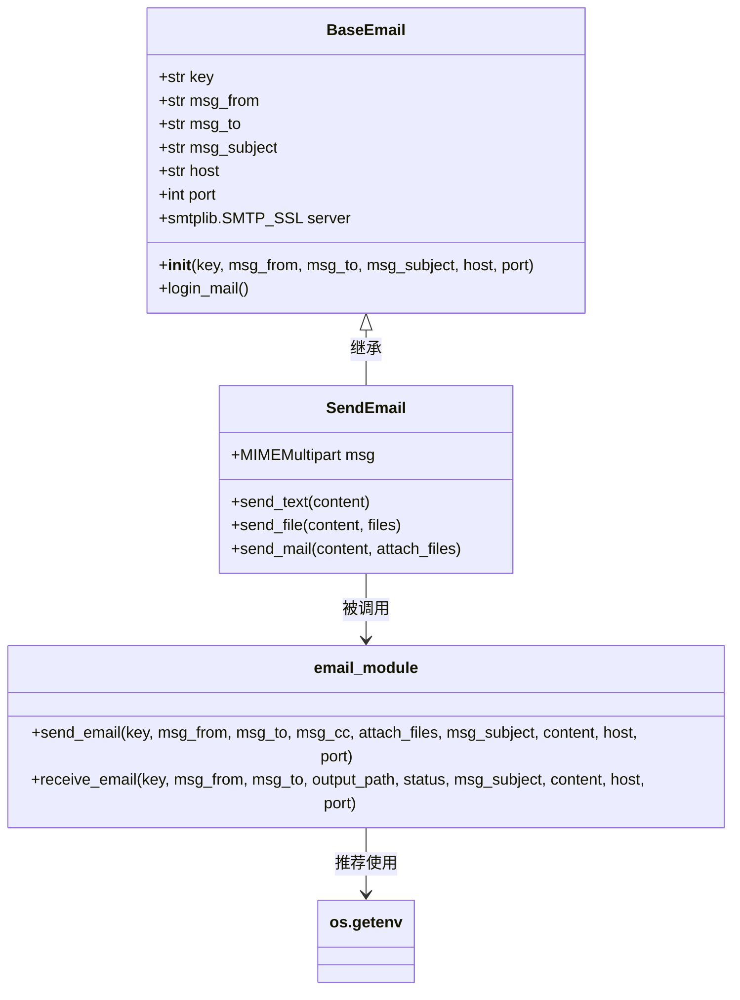

# 邮件API

<cite>
**本文档中引用的文件**
- [email.py](file://office/api/email.py)
- [__init__.py](file://office/__init__.py)
- [发送邮件.py](file://examples/poemail/发送邮件.py)
- [Const.py](file://venv/Lib/site-packages/poemail/lib/Const.py)
- [send.py](file://venv/Lib/site-packages/poemail/api/send.py)
- [SendEmail.py](file://venv/Lib/site-packages/poemail/core/SendEmail.py)
- [BaseEmail.py](file://venv/Lib/site-packages/poemail/core/BaseEmail.py)
</cite>

## 目录
1. [简介](#简介)
2. [核心功能与参数说明](#核心功能与参数说明)
3. [调用示例](#调用示例)
4. [SMTP服务器配置逻辑](#smtp服务器配置逻辑)
5. [异常处理机制](#异常处理机制)
6. [密码安全管理建议](#密码安全管理建议)
7. [模块集成方式](#模块集成方式)
8. [架构图解](#架构图解)

## 简介
`python-office` 是一个专注于Python自动化办公的开源库，其 `office.api.email` 模块提供了简洁易用的邮件发送与接收功能。本模块封装了底层复杂的SMTP/IMAP协议交互，使用户能够通过简单的函数调用实现邮件自动化操作。该模块支持主流邮箱服务（如QQ、163、Gmail），并具备发送纯文本、HTML内容及带附件邮件的能力。

**Section sources**
- [email.py](file://office/api/email.py#L1-L44)
- [发送邮件.py](file://examples/poemail/发送邮件.py#L1-L68)

## 核心功能与参数说明
`office.api.email` 模块的核心函数为 `send_email`，用于发送电子邮件。以下是该函数各参数的详细说明：

| 参数名 | 类型 | 默认值 | 作用 |
|-------|------|--------|------|
| key | str | 无 | 邮箱账户的授权码（非登录密码），用于身份验证 |
| msg_from | str | 无 | 发件人邮箱地址 |
| msg_to | str | 无 | 收件人邮箱地址，支持多个收件人（以分号分隔） |
| msg_cc | str | None | 抄送人邮箱地址，可选参数 |
| attach_files | list | [] | 附件文件路径列表，支持多个附件 |
| msg_subject | str | '' | 邮件主题 |
| content | str | '' | 邮件正文内容 |
| host | str | Mail_Type['qq'] | SMTP服务器地址，可通过常量选择 |
| port | int | 465 | SMTP服务器端口号，通常为465（SSL）或587（TLS） |

**Section sources**
- [email.py](file://office/api/email.py#L9-L34)
- [send.py](file://venv/Lib/site-packages/poemail/api/send.py#L34-L60)
- [Const.py](file://venv/Lib/site-packages/poemail/lib/Const.py#L19-L22)

## 调用示例
以下提供三种常见场景的完整调用示例。

### 纯文本邮件
```python
import office

office.email.send_email(
    key="your_authorization_code",
    msg_from="sender@qq.com",
    msg_to="recipient@example.com",
    msg_subject="测试邮件",
    content="这是一封来自python-office的纯文本测试邮件。"
)
```

### HTML邮件
虽然接口未直接区分HTML类型，但可通过设置内容为HTML字符串实现：
```python
html_content = """
<html>
  <body>
    <h1>欢迎使用python-office</h1>
    <p>这是一个<strong>HTML格式</strong>的邮件示例。</p>
  </body>
</html>
"""

office.email.send_email(
    key="your_authorization_code",
    msg_from="sender@qq.com",
    msg_to="recipient@example.com",
    msg_subject="HTML测试邮件",
    content=html_content
)
```

### 带附件邮件
```python
office.email.send_email(
    key="your_authorization_code",
    msg_from="sender@qq.com",
    msg_to="recipient@example.com",
    msg_subject="带附件的邮件",
    content="请查收附件中的文件。",
    attach_files=["./document.pdf", "./image.png"]
)
```

**Section sources**
- [发送邮件.py](file://examples/poemail/发送邮件.py#L23-L58)
- [SendEmail.py](file://venv/Lib/site-packages/poemail/core/SendEmail.py#L68-L76)

## SMTP服务器配置逻辑
模块通过 `poemail.lib.Const.Mail_Type` 字典预定义了主流邮箱的SMTP服务器地址。用户可通过字符串标识符自动映射到对应的服务器地址：

```python
Mail_Type = {
    'qq': 'smtp.qq.com',
    '163': 'smtp.163.com',
}
```

当用户调用 `send_email` 函数时，若传入 `host='qq'`，系统会自动解析为 `smtp.qq.com`。此设计简化了用户配置，避免记忆复杂的服务器地址。端口默认为465（SSL加密），符合大多数邮箱的安全要求。

**Section sources**
- [Const.py](file://venv/Lib/site-packages/poemail/lib/Const.py#L19-L22)
- [BaseEmail.py](file://venv/Lib/site-packages/poemail/core/BaseEmail.py#L11-L27)

## 异常处理机制
模块在底层实现了完善的异常处理机制，确保在发生错误时能提供清晰的反馈。

### 登录失败
在 `BaseEmail.login_mail()` 方法中，使用 `smtplib.SMTP_SSL` 连接服务器并尝试登录。若授权码或邮箱信息错误，将抛出异常，并通过 `print(error)` 输出具体错误信息。

### 网络错误
所有网络通信均被 `try...except` 块包裹。例如，在 `SendEmail.send_mail()` 方法中，发送过程中的任何异常（如网络中断、服务器拒绝等）都会被捕获，并返回 `None` 表示失败。

### 错误码返回
模块定义了 `Result_Type` 字典用于标准化结果反馈：
```python
Result_Type = {
    '200': 'success',
    '404': 'error',
    '500': 'warning'
}
```
成功发送时返回 `'200'`，失败则返回 `None`。

**Section sources**
- [BaseEmail.py](file://venv/Lib/site-packages/poemail/core/BaseEmail.py#L21-L27)
- [SendEmail.py](file://venv/Lib/site-packages/poemail/core/SendEmail.py#L70-L80)
- [Const.py](file://venv/Lib/site-packages/poemail/lib/Const.py#L24-L28)

## 密码安全管理建议
为保障账户安全，强烈建议用户遵循以下最佳实践：

1. **使用环境变量**：将邮箱授权码存储在环境变量中，而非硬编码在代码里。
   ```python
   import os
   key = os.getenv('EMAIL_AUTH_KEY')
   ```

2. **使用配置文件**：将敏感信息存放在 `.env` 或 `config.toml` 文件中，并将其加入 `.gitignore`，防止意外提交至版本控制系统。

3. **定期更换授权码**：避免长期使用同一授权码，降低泄露风险。

4. **最小权限原则**：为自动化任务创建专用邮箱账号，限制其权限范围。

**Section sources**
- [发送邮件.py](file://examples/poemail/发送邮件.py#L23)
- [BaseEmail.py](file://venv/Lib/site-packages/poemail/core/BaseEmail.py#L13)

## 模块集成方式
`office.api.email` 模块通过 `office/__init__.py` 文件实现了便捷的导入路径。在 `__init__.py` 中，使用以下语句将 `email` 子模块暴露给顶层命名空间：

```python
from office.api import email
```

这使得用户可以直接通过 `office.email.send_email()` 调用函数，而无需关心底层复杂的模块路径。这种设计提升了API的易用性和一致性，是典型的Python包结构封装实践。

**Section sources**
- [__init__.py](file://office/__init__.py#L7)
- [email.py](file://office/api/email.py#L9-L34)

## 架构图解
以下是 `office.api.email` 模块的类与函数调用关系图：



**Diagram sources**
- [BaseEmail.py](file://venv/Lib/site-packages/poemail/core/BaseEmail.py#L11-L27)
- [SendEmail.py](file://venv/Lib/site-packages/poemail/core/SendEmail.py#L18-L81)
- [email.py](file://office/api/email.py#L9-L34)