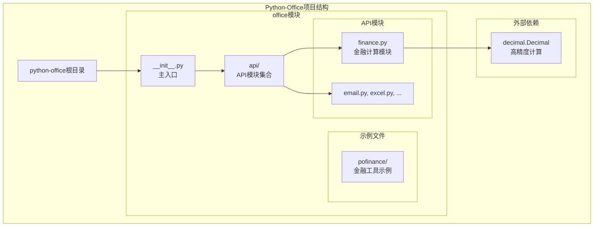
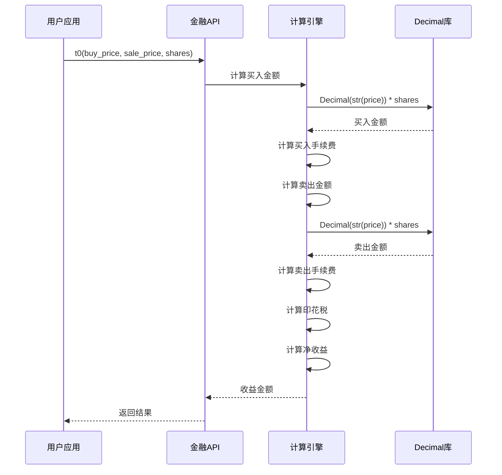
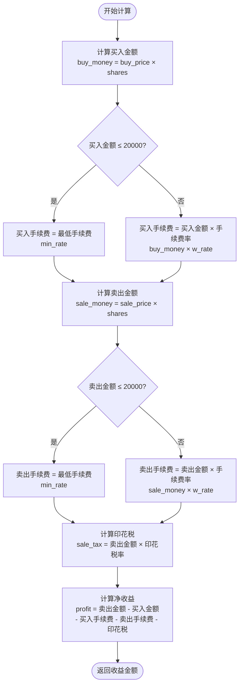
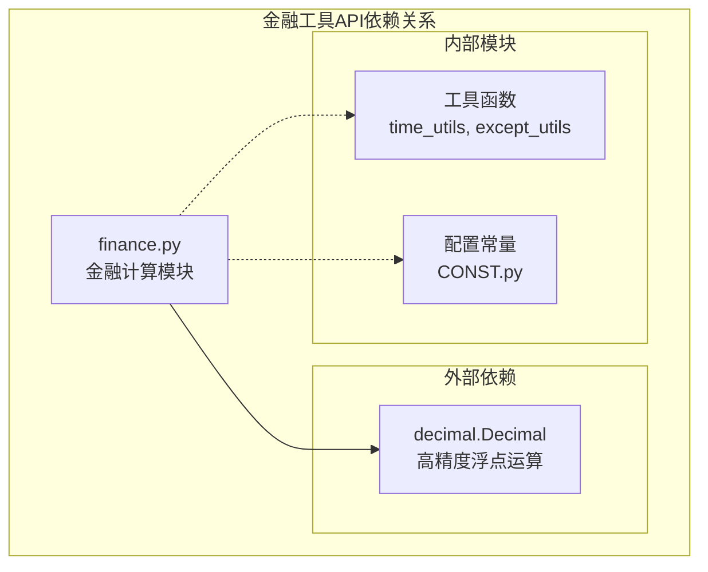

# 金融工具API文档

<cite>
**本文档引用的文件**
- [office/api/finance.py](file://office/api/finance.py)
- [office/__init__.py](file://office/__init__.py)
- [office/api/__init__.py](file://office/api/__init__.py)
- [examples/pofinance/1、单次做T.py](file://examples/pofinance/1、单次做T.py)
- [README.md](file://README.md)
</cite>

## 目录
1. [简介](#简介)
2. [项目结构](#项目结构)
3. [核心组件](#核心组件)
4. [架构概览](#架构概览)
5. [详细组件分析](#详细组件分析)
6. [依赖关系分析](#依赖关系分析)
7. [性能考虑](#性能考虑)
8. [故障排除指南](#故障排除指南)
9. [结论](#结论)

## 简介

Python-Office金融工具API是一个专门设计用于股票交易计算的专业模块，主要提供做T（日内交易）收益计算功能。该模块通过`office.api.finance`提供核心金融计算能力，并通过`office/__init__.py`被引入，形成`office.finance`的访问路径。

金融工具API的核心价值在于为量化交易者和投资者提供精确的交易成本计算和收益分析功能，支持复杂的股票交易策略评估。

## 项目结构

Python-Office项目采用模块化架构设计，金融工具作为其中一个独立模块存在：



**图表来源**
- [office/__init__.py](file://office/__init__.py#L1-L30)
- [office/api/__init__.py](file://office/api/__init__.py#L1-L2)
- [office/api/finance.py](file://office/api/finance.py#L1-L35)

**章节来源**
- [office/__init__.py](file://office/__init__.py#L1-L30)
- [office/api/__init__.py](file://office/api/__init__.py#L1-L2)

## 核心组件

金融工具API的核心是`t0`函数，这是一个专门设计的做T交易收益计算器。该函数提供了完整的交易成本计算功能，包括手续费、印花税等金融费用的精确计算。

### 主要特性

1. **高精度计算**：使用Decimal类型确保金融计算的准确性
2. **灵活的费率设置**：支持自定义手续费率和印花税率
3. **阶梯收费机制**：根据交易金额自动调整手续费
4. **完整成本覆盖**：包含买入成本、卖出收入、手续费、印花税等所有交易要素

**章节来源**
- [office/api/finance.py](file://office/api/finance.py#L1-L35)

## 架构概览

金融工具API采用简洁而高效的架构设计，专注于单一职责的计算功能：



**图表来源**
- [office/api/finance.py](file://office/api/finance.py#L7-L30)

## 详细组件分析

### t0函数详解

`t0`函数是金融工具API的核心函数，专门用于计算做T交易的收益。该函数的设计体现了金融计算的精确性和实用性。

#### 函数签名和参数

```python
def t0(buy_price: float, sale_price: float, shares: int, 
       w_rate: float = 2.5 / 10000, min_rate: int = 5,
       stamp_tax=1 / 1000) -> float:
```

#### 参数详细说明

| 参数名称 | 类型 | 默认值 | 金融含义 | 使用场景 |
|---------|------|--------|----------|----------|
| `buy_price` | float | 必需 | 买入成本 | 表示投资者买入股票时的每股价格 |
| `sale_price` | float | 必需 | 卖出价格 | 表示投资者卖出股票时的每股价格 |
| `shares` | int | 必需 | 单笔数量 | 表示交易的股票数量（通常为100的倍数） |
| `w_rate` | float | 0.00025 | 手续费率 | 万分之2.5的标准费率，可自定义 |
| `min_rate` | int | 5 | 最低手续费 | 单笔交易的最低手续费限制 |
| `stamp_tax` | float | 0.001 | 印花税率 | 千分之一的印花税标准 |

#### 业务逻辑流程



**图表来源**
- [office/api/finance.py](file://office/api/finance.py#L22-L29)

#### 计算公式详解

该函数实现了标准的做T交易收益计算公式：

**净收益 = 卖出总收入 - 买入总成本 - 买入手续费 - 卖出手续费 - 印花税**

其中：
- **买入总成本** = 买入价格 × 股票数量
- **卖出总收入** = 卖出价格 × 股票数量
- **手续费计算** = max(最低手续费, 交易金额 × 手续费率)
- **印花税** = 卖出金额 × 印花税率

**章节来源**
- [office/api/finance.py](file://office/api/finance.py#L7-L30)

### 示例调用分析

金融模块提供了完整的使用示例，展示了不同场景下的交易计算：

#### 基础使用示例

```python
# 基本做T交易计算
result = t0(11.06, 11.23, 500)
# 计算结果：买入11.06元，卖出11.23元，500股的收益
```

#### 大额交易示例

```python
# 大额交易计算
result = t0(11.06, 35.57, 2000)
# 高价股的大额交易，手续费按比例计算
```

#### 小额交易示例

```python
# 小额交易计算
result = t0(14, 14.5, 300)
# 低价股的小额交易，手续费按最低标准计算
```

**章节来源**
- [examples/pofinance/1、单次做T.py](file://examples/pofinance/1、单次做T.py#L1-L33)

### 引入和访问路径

金融工具API通过多层次的模块结构提供访问：

#### 1. 直接导入方式

```python
from office.api.finance import t0
# 或
import office.api.finance as finance
result = finance.t0(11.06, 11.23, 500)
```

#### 2. 通过office主包导入

```python
import office
result = office.finance.t0(11.06, 11.23, 500)
```

#### 3. 独立模块导入（pofinance）

```python
import pofinance
result = pofinance.t0(11.06, 11.23, 500)
```

**章节来源**
- [office/__init__.py](file://office/__init__.py#L7-L10)
- [office/api/__init__.py](file://office/api/__init__.py#L1-L2)

## 依赖关系分析

金融工具API的依赖关系相对简单，主要依赖于Python标准库：



**图表来源**
- [office/api/finance.py](file://office/api/finance.py#L3-L4)

### 关键依赖说明

1. **Decimal模块**：用于金融计算中的高精度数值处理，避免浮点数误差
2. **常量定义**：`RATE_LINE = 10000 * 2` 定义了手续费计算的分界线
3. **类型注解**：使用Python类型提示提高代码可读性和IDE支持

**章节来源**
- [office/api/finance.py](file://office/api/finance.py#L3-L4)

## 性能考虑

### 计算效率

金融工具API在设计时充分考虑了性能优化：

1. **单次计算复杂度**：O(1)，所有计算都是常数时间操作
2. **内存使用**：最小化内存占用，仅在必要时创建Decimal对象
3. **数值精度**：使用Decimal避免浮点数累积误差

### 适用场景

- **高频交易计算**：适合大量小规模交易的快速计算
- **投资组合分析**：可以用于多个交易的收益汇总
- **策略回测**：作为交易策略验证的基础计算模块

### 局限性

1. **单一功能**：目前仅支持做T交易收益计算
2. **静态费率**：不支持动态费率调整或复杂的费率结构
3. **无实时数据**：不提供市场数据获取功能

## 故障排除指南

### 常见问题及解决方案

#### 1. 数值精度问题

**问题描述**：浮点数计算导致的小数点误差

**解决方案**：函数内部已使用Decimal类型处理，用户无需担心

#### 2. 参数类型错误

**问题描述**：传入非float类型的buy_price或sale_price

**解决方案**：函数接受float类型参数，确保传入正确的数值类型

#### 3. 股票数量异常

**问题描述**：shares参数不是整数或为负数

**解决方案**：shares必须为正整数，建议在调用前进行参数验证

#### 4. 费率参数错误

**问题描述**：手续费率或印花税率超出合理范围

**解决方案**：默认费率符合市场标准，如有特殊需求可自定义参数

**章节来源**
- [office/api/finance.py](file://office/api/finance.py#L7-L30)

## 结论

Python-Office金融工具API是一个设计精良的专业金融计算模块，具有以下特点：

### 核心优势

1. **专业性强**：专注于做T交易收益计算，满足量化交易需求
2. **精度可靠**：使用Decimal类型确保金融计算的准确性
3. **易于使用**：简洁的API设计，参数直观易懂
4. **扩展性好**：模块化设计便于功能扩展

### 应用价值

- **投资决策支持**：为投资者提供精确的交易收益计算
- **策略验证**：作为交易策略回测的基础工具
- **教育用途**：帮助理解股票交易成本和收益计算原理

### 发展方向

虽然当前版本功能相对简单，但为未来的扩展奠定了良好的基础。可以考虑添加更多金融计算功能，如：
- 多种交易类型的收益计算
- 实时市场数据集成
- 更复杂的费率结构支持
- 组合投资收益分析

该金融工具API体现了Python-Office项目"简单实用"的设计理念，在保持功能完整性的同时，避免了过度复杂化，是Python金融计算领域的一个优秀实践案例。