# GUI版本概览

<cite>
**本文档引用文件**  
- [main.py](file://gui/qtpy/version1/main.py)
- [FinalWidget.py](file://gui/qtpy/version1/customizeWindowPyfile/FinalWidget.py)
- [ui_Widget.py](file://gui/qtpy/version1/customizeWindowPyfile/ui/ui_Widget.py)
- [requirements.txt](file://gui/qtpy/version1/requirements.txt)
- [demo.py](file://gui/qtpy/version2/gallery/demo.py)
- [main_window.py](file://gui/qtpy/version2/gallery/app/view/main_window.py)
- [home_interface.py](file://gui/qtpy/version2/gallery/app/view/home_interface.py)
- [setting_interface.py](file://gui/qtpy/version2/gallery/app/view/setting_interface.py)
- [config.py](file://gui/qtpy/version2/gallery/app/common/config.py)
- [style_sheet.py](file://gui/qtpy/version2/gallery/app/common/style_sheet.py)
- [main.py](file://gui/qtpy/version3/main.py)
- [requirements.txt](file://gui/qtpy/version2/requirements.txt)
</cite>

## 目录
1. [简介](#简介)
2. [项目结构](#项目结构)
3. [核心组件](#核心组件)
4. [架构概述](#架构概述)
5. [详细组件分析](#详细组件分析)
6. [版本演进分析](#版本演进分析)
7. [技术选型差异](#技术选型差异)
8. [用户体验改进](#用户体验改进)
9. [向后兼容性策略](#向后兼容性策略)
10. [运行指南](#运行指南)
11. [版本选择建议](#版本选择建议)

## 简介
本文档全面概述了python-office项目的GUI各版本设计演进，重点分析version1、version2和version3的技术架构、用户体验和设计哲学。通过代码结构分析，揭示了从基础QtPy实现到现代化Fluent Design风格的演进过程，并为用户提供了清晰的版本选择和运行指南。

## 项目结构
python-office的GUI模块采用版本化管理策略，通过独立的version1、version2和version3目录实现不同技术栈和设计风格的并行开发。这种结构支持渐进式重构，允许团队在不中断现有功能的情况下探索新的UI技术和用户体验模式。

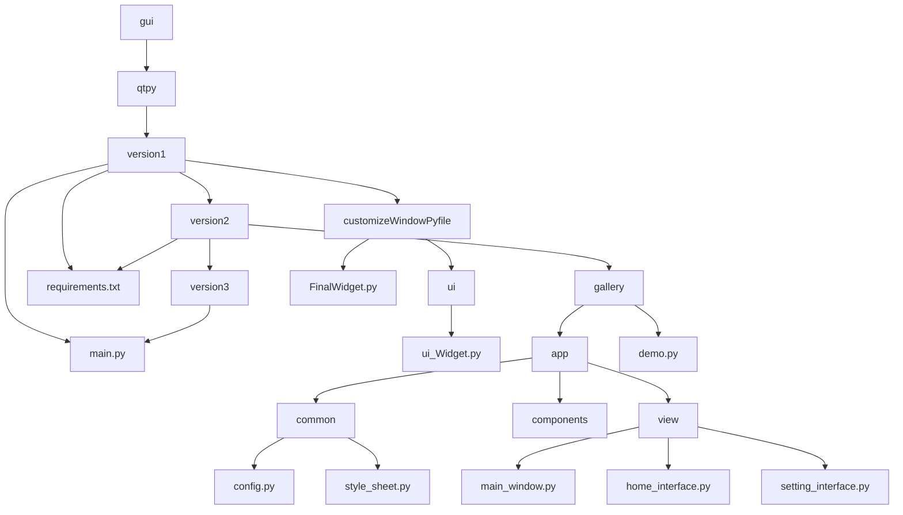

**图源**  
- [version1/main.py](file://gui/qtpy/version1/main.py)
- [version2/gallery/demo.py](file://gui/qtpy/version2/gallery/demo.py)
- [version3/main.py](file://gui/qtpy/version3/main.py)

## 核心组件
GUI模块的核心组件体现了从简单封装到模块化架构的演进。version1采用直接的UI绑定模式，而version2实现了清晰的MVC架构分离，version3则继承了version2的现代化架构模式。

**节源**  
- [version1/main.py](file://gui/qtpy/version1/main.py#L1-L21)
- [version2/gallery/demo.py](file://gui/qtpy/version2/gallery/demo.py#L1-L46)
- [version3/main.py](file://gui/qtpy/version3/main.py#L1-L56)

## 架构概述
python-office GUI的架构演进反映了现代桌面应用开发的趋势：从传统的桌面应用模式向现代化、响应式、国际化的设计范式转变。三个版本代表了不同的技术成熟度和设计理念。

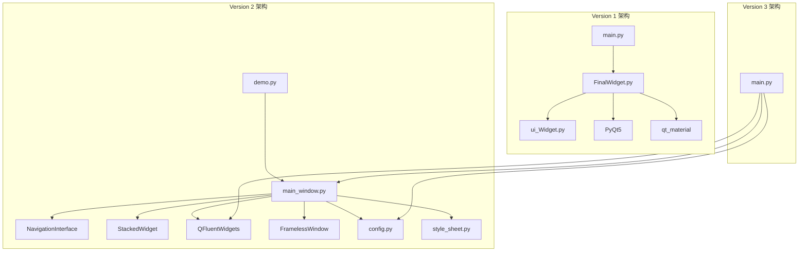

**图源**  
- [version1/main.py](file://gui/qtpy/version1/main.py#L1-L21)
- [version2/gallery/demo.py](file://gui/qtpy/version2/gallery/demo.py#L1-L46)
- [version2/gallery/app/view/main_window.py](file://gui/qtpy/version2/gallery/app/view/main_window.py#L1-L212)
- [version3/main.py](file://gui/qtpy/version3/main.py#L1-L56)

## 详细组件分析

### Version1 组件分析
version1是python-office GUI的基础实现，采用传统的QtPy开发模式，提供了基本的功能封装和用户界面。

#### 类图
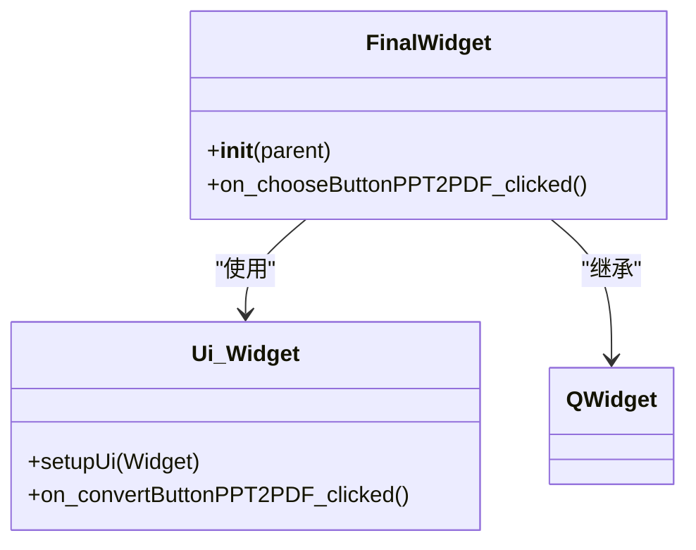

**图源**  
- [version1/customizeWindowPyfile/FinalWidget.py](file://gui/qtpy/version1/customizeWindowPyfile/FinalWidget.py#L1-L34)
- [version1/customizeWindowPyfile/ui/ui_Widget.py](file://gui/qtpy/version1/customizeWindowPyfile/ui/ui_Widget.py#L1-L200)

#### 序列图
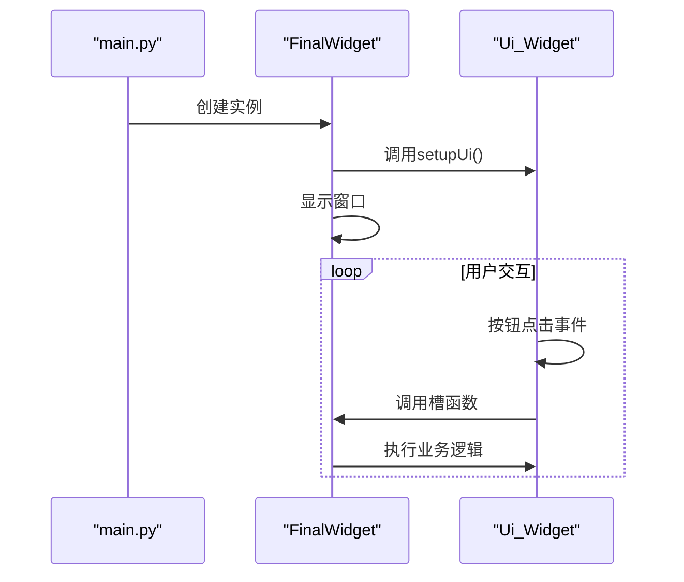

**图源**  
- [version1/main.py](file://gui/qtpy/version1/main.py#L8-L21)
- [version1/customizeWindowPyfile/FinalWidget.py](file://gui/qtpy/version1/customizeWindowPyfile/FinalWidget.py#L13-L34)

### Version2 组件分析
version2采用现代化的Fluent Design设计语言，基于QFluentWidgets组件库构建，实现了丰富的用户界面和良好的用户体验。

#### 类图
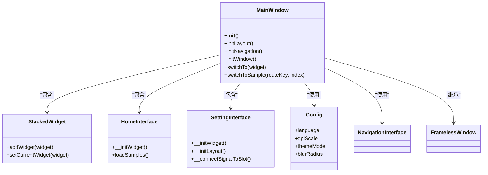

**图源**  
- [version2/gallery/app/view/main_window.py](file://gui/qtpy/version2/gallery/app/view/main_window.py#L66-L212)
- [version2/gallery/app/view/home_interface.py](file://gui/qtpy/version2/gallery/app/view/home_interface.py#L89-L200)
- [version2/gallery/app/view/setting_interface.py](file://gui/qtpy/version2/gallery/app/view/setting_interface.py#L18-L227)
- [version2/gallery/app/common/config.py](file://gui/qtpy/version2/gallery/app/common/config.py#L19-L52)

#### 序列图
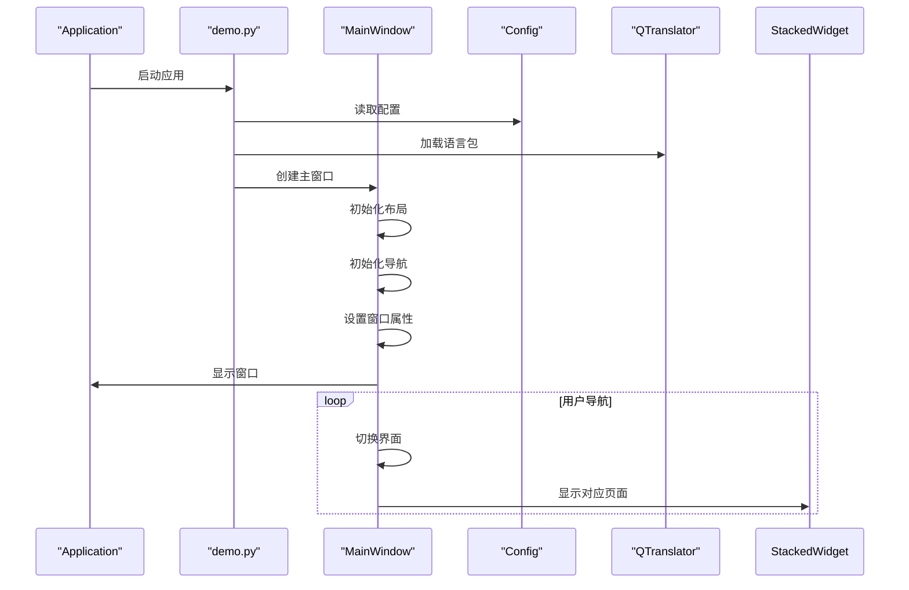

**图源**  
- [version2/gallery/demo.py](file://gui/qtpy/version2/gallery/demo.py#L23-L46)
- [version2/gallery/app/view/main_window.py](file://gui/qtpy/version2/gallery/app/view/main_window.py#L68-L212)

### Version3 组件分析
version3是python-office GUI的早期开发版本，目前仅包含主入口文件，其架构设计继承了version2的现代化模式。

#### 序列图
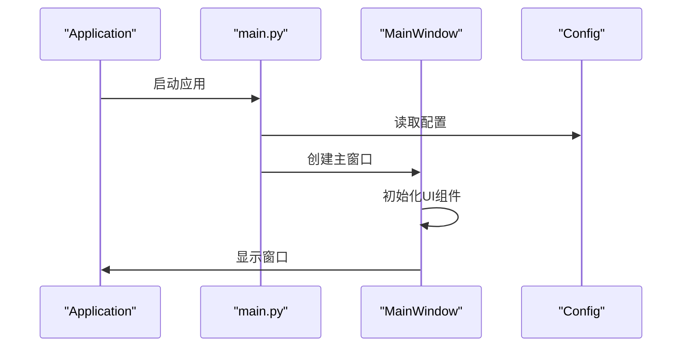

**图源**  
- [version3/main.py](file://gui/qtpy/version3/main.py#L32-L56)

## 版本演进分析
python-office GUI的版本演进体现了从功能导向到用户体验导向的设计哲学转变。每个版本都针对前一版本的局限性进行了改进和优化。

### 技术演进路线
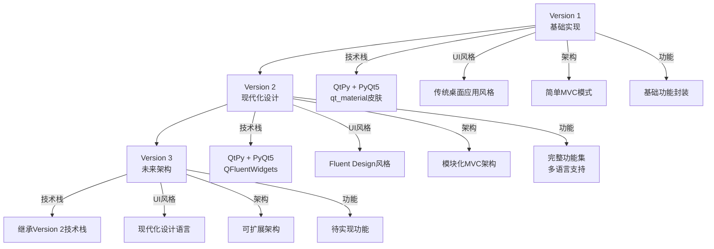

**图源**  
- [version1/main.py](file://gui/qtpy/version1/main.py)
- [version2/gallery/demo.py](file://gui/qtpy/version2/gallery/demo.py)
- [version3/main.py](file://gui/qtpy/version3/main.py)

## 技术选型差异
三个版本在技术选型上体现了明显的演进趋势，从基础实现到专业化UI框架的转变。

### 依赖对比
| 特性 | Version 1 | Version 2 | Version 3 |
|------|-----------|-----------|-----------|
| **核心框架** | PyQt5 | PyQt5 | PyQt5 |
| **UI库** | 原生Qt组件 | QFluentWidgets | QFluentWidgets |
| **样式方案** | qt_material皮肤 | 内置Fluent样式 | 内置Fluent样式 |
| **窗口框架** | 标准窗口 | 无边框窗口 | 无边框窗口 |
| **导航系统** | TabWidget | NavigationInterface | NavigationInterface |
| **配置管理** | 无 | Config类 + JSON | Config类 + JSON |
| **多语言** | 无 | QTranslator + TS文件 | QTranslator + TS文件 |
| **主题支持** | 预设皮肤 | 动态主题切换 | 动态主题切换 |

**节源**  
- [version1/requirements.txt](file://gui/qtpy/version1/requirements.txt#L1-L2)
- [version2/requirements.txt](file://gui/qtpy/version2/requirements.txt#L1-L2)
- [version2/gallery/app/common/config.py](file://gui/qtpy/version2/gallery/app/common/config.py#L1-L52)

### 架构模式对比
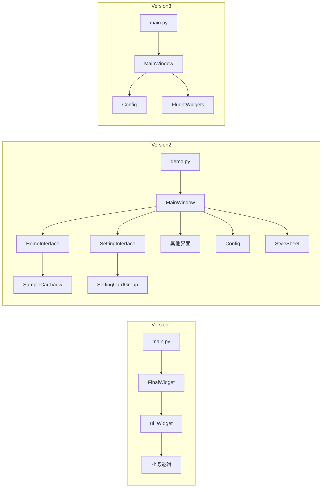

**图源**  
- [version1/main.py](file://gui/qtpy/version1/main.py)
- [version2/gallery/demo.py](file://gui/qtpy/version2/gallery/demo.py)
- [version3/main.py](file://gui/qtpy/version3/main.py)

## 用户体验改进
从version1到version2，用户体验得到了显著提升，主要体现在界面设计、交互模式和功能完整性方面。

### 用户体验维度对比
| 维度 | Version 1 | Version 2 | 改进程度 |
|------|-----------|-----------|----------|
| **视觉设计** | 传统桌面风格 | Fluent Design现代化风格 | 高 |
| **界面布局** | 简单Tab布局 | 侧边导航+内容区 | 高 |
| **响应式设计** | 基础响应 | 完整响应式布局 | 中 |
| **动画效果** | 无 | 页面切换动画 | 高 |
| **多语言支持** | 无 | 中文(简/繁)、英文 | 高 |
| **主题切换** | 预设皮肤 | 动态主题切换 | 高 |
| **DPI缩放** | 基础支持 | 智能DPI缩放 | 中 |
| **窗口样式** | 标准窗口 | 无边框现代化窗口 | 高 |
| **导航体验** | Tab切换 | 侧边栏导航 | 高 |
| **设置功能** | 无 | 完整设置界面 | 高 |

**节源**  
- [version1/customizeWindowPyfile/FinalWidget.py](file://gui/qtpy/version1/customizeWindowPyfile/FinalWidget.py)
- [version2/gallery/app/view/main_window.py](file://gui/qtpy/version2/gallery/app/view/main_window.py)
- [version2/gallery/app/view/setting_interface.py](file://gui/qtpy/version2/gallery/app/view/setting_interface.py)

### 用户界面演进
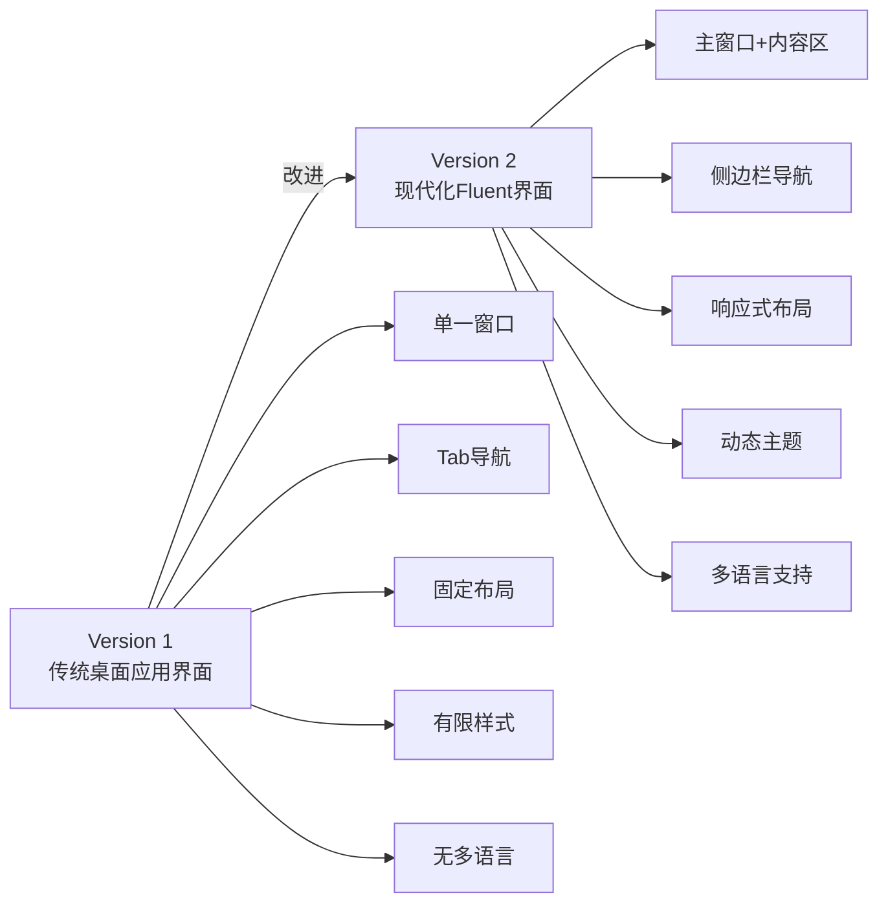

**图源**  
- [version1/customizeWindowPyfile/ui/ui_Widget.py](file://gui/qtpy/version1/customizeWindowPyfile/ui/ui_Widget.py#L26-L200)
- [version2/gallery/app/view/main_window.py](file://gui/qtpy/version2/gallery/app/view/main_window.py#L66-L212)

## 向后兼容性策略
python-office GUI的版本管理采用了渐进式演进策略，确保了功能的连续性和用户的平滑过渡。

### 兼容性设计
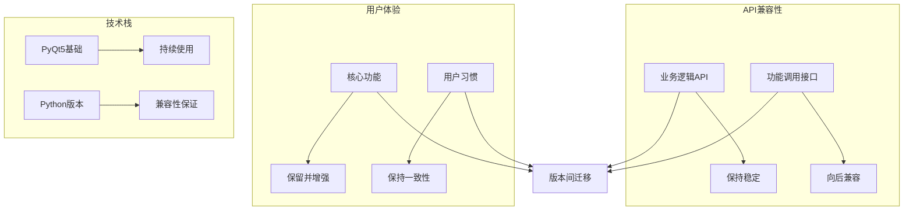

**图源**  
- [version1/main.py](file://gui/qtpy/version1/main.py)
- [version2/gallery/demo.py](file://gui/qtpy/version2/gallery/demo.py)
- [version3/main.py](file://gui/qtpy/version3/main.py)

### 版本共存策略
python-office通过独立的版本目录实现了多版本共存，这种设计具有以下优势：
- **隔离性**：各版本独立运行，互不影响
- **可选性**：用户可根据需求选择合适版本
- **演进性**：新版本开发不影响现有功能
- **回退性**：问题发生时可快速切换到稳定版本

## 运行指南
本节提供各版本GUI的运行方法和环境要求。

### 运行环境要求
| 版本 | Python版本 | 依赖包 | 运行命令 |
|------|------------|--------|----------|
| Version 1 | Python 3.7+ | python-office, PyQt5 | python gui/qtpy/version1/main.py |
| Version 2 | Python 3.7+ | PyQt5, PyQt-Fluent-Widgets[full] | python gui/qtpy/version2/gallery/demo.py |
| Version 3 | Python 3.7+ | PyQt5, PyQt-Fluent-Widgets[full] | python gui/qtpy/version3/main.py |

**节源**  
- [version1/requirements.txt](file://gui/qtpy/version1/requirements.txt)
- [version2/requirements.txt](file://gui/qtpy/version2/requirements.txt)
- [version1/main.py](file://gui/qtpy/version1/main.py)
- [version2/gallery/demo.py](file://gui/qtpy/version2/gallery/demo.py)
- [version3/main.py](file://gui/qtpy/version3/main.py)

### 运行流程
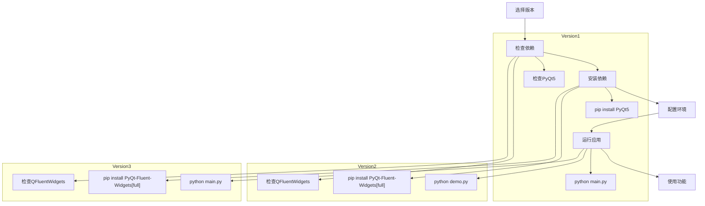

**图源**  
- [version1/requirements.txt](file://gui/qtpy/version1/requirements.txt)
- [version2/requirements.txt](file://gui/qtpy/version2/requirements.txt)

## 版本选择建议
根据用户需求和技术能力，选择合适的GUI版本至关重要。

### 选择决策树
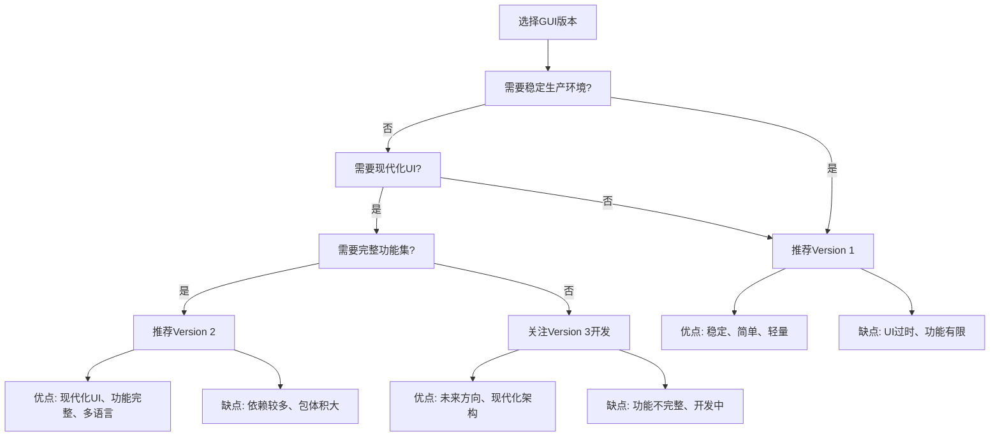

### 适用场景对比
| 用户类型 | 推荐版本 | 理由 |
|----------|----------|------|
| **生产环境用户** | Version 1 | 稳定可靠，依赖简单，适合长期运行 |
| **普通终端用户** | Version 2 | 界面现代化，功能完整，用户体验好 |
| **开发者/贡献者** | Version 2 和 Version 3 | 可以参与现有功能开发或新架构探索 |
| **技术评估者** | Version 2 | 代表当前技术水平和设计方向 |
| **早期采用者** | Version 3 | 可以体验未来发展方向 |

**节源**  
- [version1/main.py](file://gui/qtpy/version1/main.py)
- [version2/gallery/demo.py](file://gui/qtpy/version2/gallery/demo.py)
- [version3/main.py](file://gui/qtpy/version3/main.py)