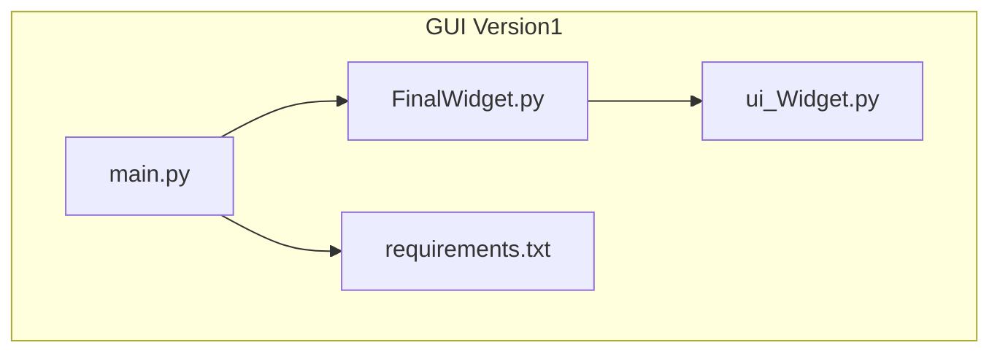
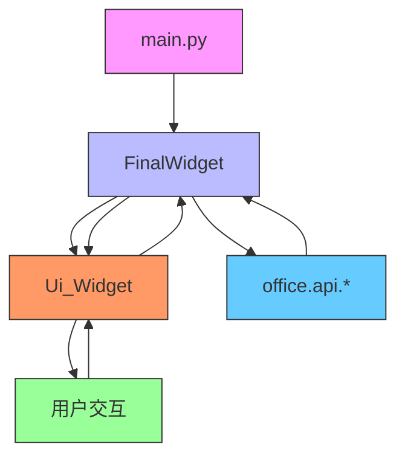
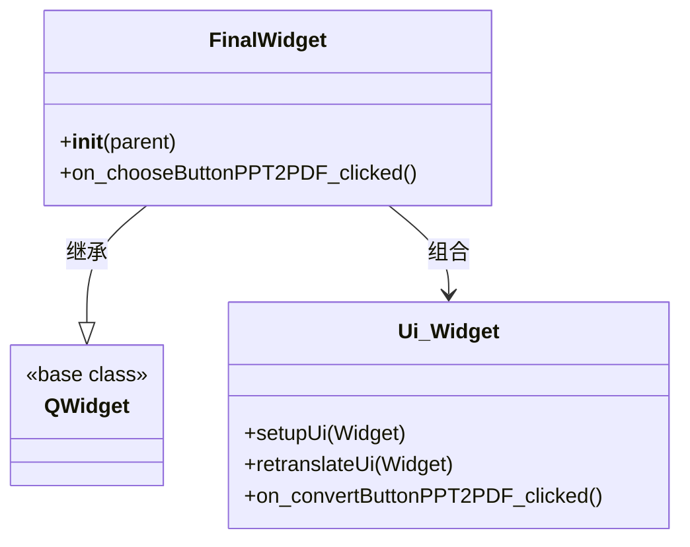
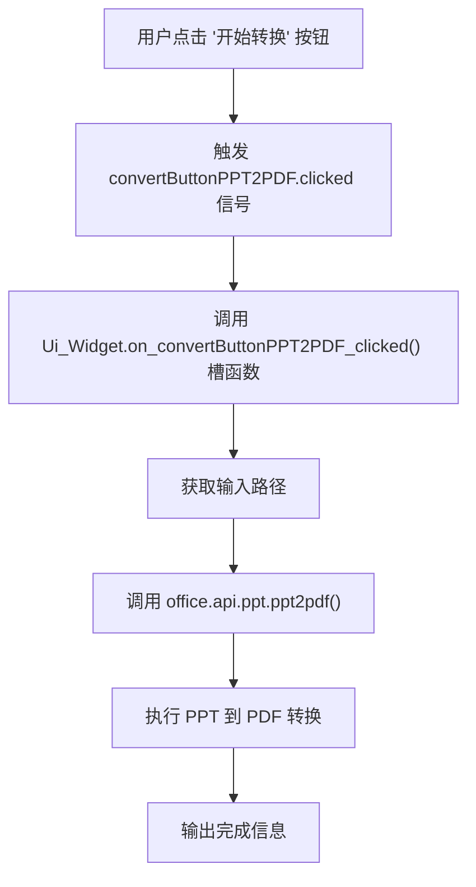
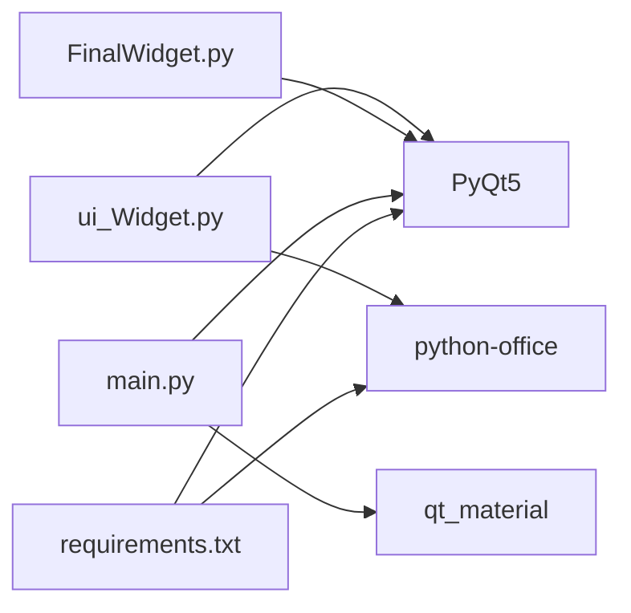

# Version1 概述

<cite>
**本文档引用的文件**
- [main.py](file://gui/qtpy/version1/main.py)
- [FinalWidget.py](file://gui/qtpy/version1/customizeWindowPyfile/FinalWidget.py)
- [ui_Widget.py](file://gui/qtpy/version1/customizeWindowPyfile/ui/ui_Widget.py)
- [requirements.txt](file://gui/qtpy/version1/requirements.txt)
</cite>

## 目录
1. [简介](#简介)
2. [项目结构](#项目结构)
3. [核心组件](#核心组件)
4. [架构概述](#架构概述)
5. [详细组件分析](#详细组件分析)
6. [依赖分析](#依赖分析)
7. [性能考虑](#性能考虑)
8. [故障排除指南](#故障排除指南)
9. [结论](#结论)

## 简介
python-office GUI Version1 是一个基于 QtPy 框架构建的桌面应用程序，旨在为用户提供简单直观的办公自动化功能操作界面。该版本通过封装基础的办公自动化功能，实现了对文档、演示文稿、电子表格等文件的批量处理能力。应用程序采用模块化设计，通过 main.py 作为启动入口，FinalWidget.py 实现核心业务逻辑，而 ui_Widget.py 则是由 Qt Designer 生成的 UI 布局文件。本技术文档将详细说明该版本的架构设计、运行环境配置、依赖安装步骤及启动方法，并分析其信号与槽机制的基本实现方式，同时指出其在用户体验和可扩展性方面的局限性，为后续版本的演进提供对比基础。

## 项目结构
python-office GUI Version1 的项目结构清晰地体现了其模块化设计理念。核心 GUI 应用位于 `gui/qtpy/version1/` 目录下，主要由三个部分组成：启动文件 `main.py`、核心逻辑实现 `FinalWidget.py` 和由 Qt Designer 生成的 UI 文件 `ui_Widget.py`。`FinalWidget.py` 位于 `customizeWindowPyfile/` 目录中，其内部的 `ui/` 子目录存放着 `ui_Widget.py`。此外，`requirements.txt` 文件定义了项目运行所必需的依赖项。这种结构将 UI 定义与业务逻辑分离，符合现代 GUI 应用的开发实践。

**图示来源**
- [main.py](file://gui/qtpy/version1/main.py#L1-L21)
- [FinalWidget.py](file://gui/qtpy/version1/customizeWindowPyfile/FinalWidget.py#L1-L34)
- [ui_Widget.py](file://gui/qtpy/version1/customizeWindowPyfile/ui/ui_Widget.py#L1-L418)

**本节来源**
- [main.py](file://gui/qtpy/version1/main.py#L1-L21)
- [FinalWidget.py](file://gui/qtpy/version1/customizeWindowPyfile/FinalWidget.py#L1-L34)
- [ui_Widget.py](file://gui/qtpy/version1/customizeWindowPyfile/ui/ui_Widget.py#L1-L418)

## 核心组件
python-office GUI Version1 的核心组件包括 `main.py`、`FinalWidget.py` 和 `ui_Widget.py`。`main.py` 作为应用程序的唯一入口点，负责初始化 Qt 应用程序、创建主窗口实例并启动事件循环。`FinalWidget.py` 是应用程序的核心逻辑所在，它继承自 `QWidget` 并通过组合 `Ui_Widget` 类来实现功能。`ui_Widget.py` 是由 Qt Designer 生成的纯 UI 定义文件，包含了所有界面元素（如按钮、文本框、标签）的布局和属性设置。这三个组件协同工作，共同构成了应用程序的完整功能。

**本节来源**
- [main.py](file://gui/qtpy/version1/main.py#L1-L21)
- [FinalWidget.py](file://gui/qtpy/version1/customizeWindowPyfile/FinalWidget.py#L1-L34)
- [ui_Widget.py](file://gui/qtpy/version1/customizeWindowPyfile/ui/ui_Widget.py#L1-L418)

## 架构概述
python-office GUI Version1 采用经典的 Model-View-Controller (MVC) 变体架构，更准确地说是 Model-View-Presenter (MVP) 模式。`ui_Widget.py` 代表了 View 层，它纯粹负责用户界面的展示和用户输入的捕获。`FinalWidget.py` 作为 Presenter (或 Controller) 层，持有对 View 的引用，并负责处理用户交互、调用业务逻辑（Model）以及更新 View。`main.py` 则扮演了应用程序启动器的角色，负责组装和启动整个架构。这种分层设计使得 UI 与业务逻辑解耦，提高了代码的可维护性。

**图示来源**
- [main.py](file://gui/qtpy/version1/main.py#L1-L21)
- [FinalWidget.py](file://gui/qtpy/version1/customizeWindowPyfile/FinalWidget.py#L1-L34)
- [ui_Widget.py](file://gui/qtpy/version1/customizeWindowPyfile/ui/ui_Widget.py#L1-L418)

## 详细组件分析

### main.py 分析
`main.py` 是整个应用程序的启动入口。它首先导入必要的模块，包括 `sys`、`PyQt5.QtCore`、`PyQt5.QtWidgets` 以及 `qt_material` 用于应用主题。在 `if __name__ == '__main__':` 块中，它执行了关键的初始化步骤：设置高 DPI 缩放策略以确保在高分辨率屏幕上的显示效果，创建 `QApplication` 实例，并实例化 `FinalWidget` 作为主窗口。最后，它应用了预设的深色主题并启动了 Qt 的事件循环。这个文件的职责非常单一且明确，即启动和配置应用程序。

**本节来源**
- [main.py](file://gui/qtpy/version1/main.py#L1-L21)

### FinalWidget.py 分析
`FinalWidget` 类是应用程序的核心业务逻辑容器。它继承自 `QWidget`，并在其构造函数中实例化了由 Qt Designer 生成的 `Ui_Widget` 对象，并调用其 `setupUi` 方法来构建实际的用户界面。`FinalWidget` 负责设置窗口标题和图标。该文件中定义了信号与槽的连接，例如 `on_chooseButtonPPT2PDF_clicked` 槽函数，它响应用户点击“选择路径”按钮的事件，通过 `QFileDialog` 获取用户选择的目录，并将其路径填充到对应的 `QLineEdit` 组件中。这体现了 Qt 框架中信号与槽机制的基本应用。

**图示来源**
- [FinalWidget.py](file://gui/qtpy/version1/customizeWindowPyfile/FinalWidget.py#L1-L34)
- [ui_Widget.py](file://gui/qtpy/version1/customizeWindowPyfile/ui/ui_Widget.py#L1-L418)

**本节来源**
- [FinalWidget.py](file://gui/qtpy/version1/customizeWindowPyfile/FinalWidget.py#L1-L34)

### ui_Widget.py 分析
`ui_Widget.py` 是一个由 Qt Designer 生成的代码文件，不应被手动修改。它定义了一个名为 `Ui_Widget` 的类，该类包含一个 `setupUi` 方法，该方法负责创建和配置所有 UI 组件，如 `QTabWidget`、`QPushButton`、`QLineEdit` 等，并将它们按照设计好的布局进行排列。文件中还定义了 `on_convertButtonPPT2PDF_clicked` 方法，该方法直接连接到“开始转换”按钮的 `clicked` 信号，当用户点击此按钮时，会调用 `office.api.ppt` 模块中的 `ppt2pdf` 函数来执行实际的转换任务。这表明 UI 层直接与业务逻辑层进行了耦合。

**图示来源**
- [ui_Widget.py](file://gui/qtpy/version1/customizeWindowPyfile/ui/ui_Widget.py#L1-L418)

**本节来源**
- [ui_Widget.py](file://gui/qtpy/version1/customizeWindowPyfile/ui/ui_Widget.py#L1-L418)

## 依赖分析
python-office GUI Version1 的依赖关系相对简单。`requirements.txt` 文件明确指定了两个核心依赖：`python-office` 和 `PyQt5`。`PyQt5` 是构建 GUI 应用的基础框架，提供了所有 Qt 的 Python 绑定。`python-office` 包则包含了所有办公自动化功能的实现，如 `ppt2pdf`、`word2pdf` 等，这些功能被 GUI 层直接调用。`qt_material` 库虽然在 `main.py` 中被使用，但并未在 `requirements.txt` 中声明，这可能是一个疏忽，需要在实际部署时手动安装。

**图示来源**
- [requirements.txt](file://gui/qtpy/version1/requirements.txt#L1-L2)
- [main.py](file://gui/qtpy/version1/main.py#L1-L21)
- [ui_Widget.py](file://gui/qtpy/version1/customizeWindowPyfile/ui/ui_Widget.py#L1-L418)

**本节来源**
- [requirements.txt](file://gui/qtpy/version1/requirements.txt#L1-L2)
- [main.py](file://gui/qtpy/version1/main.py#L1-L21)
- [ui_Widget.py](file://gui/qtpy/version1/customizeWindowPyfile/ui/ui_Widget.py#L1-L418)

## 性能考虑
Version1 的性能主要受限于其同步执行模式。当用户点击“开始转换”等按钮时，`ui_Widget.py` 中的槽函数会直接调用 `office.api.ppt.ppt2pdf()` 等阻塞式函数。这意味着在文件转换过程中，整个 GUI 界面会处于冻结状态，无法响应用户的任何操作，也无法更新进度条（如果有的话），用户体验较差。对于处理大型文件或批量任务，这种设计会导致应用程序无响应。此外，所有功能都耦合在 `ui_Widget.py` 文件中，缺乏异步处理和任务队列机制，限制了其处理并发任务的能力。

## 故障排除指南
在运行 python-office GUI Version1 时，可能会遇到以下常见问题：
1.  **模块导入错误**：如果出现 `ModuleNotFoundError`，请确保已正确安装 `PyQt5` 和 `python-office` 依赖。可以通过运行 `pip install -r requirements.txt` 来安装。
2.  **界面冻结**：在执行文件转换等长时间任务时，界面会无响应。这是由同步执行模式导致的正常现象，需等待任务完成。
3.  **路径问题**：确保在 `ui_Widget.py` 中硬编码的路径（如 `./resource/picture/`）在您的系统上存在，否则图标可能无法显示。
4.  **Qt Designer 文件缺失**：`ui_Widget.py` 是由 `widget.ui` 文件生成的。如果需要修改 UI，必须使用 Qt Designer 修改 `.ui` 文件，然后重新生成 `.py` 文件，切勿直接修改 `ui_Widget.py`。

**本节来源**
- [requirements.txt](file://gui/qtpy/version1/requirements.txt#L1-L2)
- [ui_Widget.py](file://gui/qtpy/version1/customizeWindowPyfile/ui/ui_Widget.py#L1-L418)

## 结论
python-office GUI Version1 成功地构建了一个基于 QtPy 框架的桌面应用原型，通过 `main.py`、`FinalWidget.py` 和 `ui_Widget.py` 的分工合作，实现了对多种办公文件的自动化处理功能。其架构清晰，利用了 Qt 的信号与槽机制来响应用户交互。然而，该版本也存在明显的局限性：UI 逻辑与业务逻辑在 `ui_Widget.py` 中耦合过紧，缺乏异步处理导致界面冻结，且 `requirements.txt` 文件不完整。这些局限性为 Version2 及后续版本的改进指明了方向，例如引入更严格的 MVC/MVP 分层、采用多线程或异步编程来提升响应性，以及完善依赖管理。