# Version2 架构设计

<cite>
**本文档引用的文件**
- [main_window.py](file://gui/qtpy/version2/gallery/app/view/main_window.py)
- [config.py](file://gui/qtpy/version2/gallery/app/common/config.py)
- [signal_bus.py](file://gui/qtpy/version2/gallery/app/common/signal_bus.py)
- [home_interface.py](file://gui/qtpy/version2/gallery/app/view/home_interface.py)
- [setting_interface.py](file://gui/qtpy/version2/gallery/app/view/setting_interface.py)
- [gallery_interface.py](file://gui/qtpy/version2/gallery/app/view/gallery_interface.py)
- [title_bar.py](file://gui/qtpy/version2/gallery/app/view/title_bar.py)
- [avatar_widget.py](file://gui/qtpy/version2/gallery/app/components/avatar_widget.py)
- [sample_card.py](file://gui/qtpy/version2/gallery/app/components/sample_card.py)
- [link_card.py](file://gui/qtpy/version2/gallery/app/components/link_card.py)
- [style_sheet.py](file://gui/qtpy/version2/gallery/app/common/style_sheet.py)
- [icon.py](file://gui/qtpy/version2/gallery/app/common/icon.py)
- [demo.py](file://gui/qtpy/version2/gallery/demo.py)
- [config.json](file://gui/qtpy/version2/gallery/app/config/config.json)
</cite>

## 目录
1. [引言](#引言)
2. [项目结构概览](#项目结构概览)
3. [核心架构组件](#核心架构组件)
4. [视图层架构](#视图层架构)
5. [组件层设计](#组件层设计)
6. [通用服务层](#通用服务层)
7. [事件总线通信模型](#事件总线通信模型)
8. [配置管理系统](#配置管理系统)
9. [样式表与主题系统](#样式表与主题系统)
10. [初始化流程与生命周期](#初始化流程与生命周期)
11. [模块化扩展能力](#模块化扩展能力)
12. [总结](#总结)

## 引言

python-office GUI Version2 是一个基于 QFluentWidgets 的现代化桌面应用程序，采用了 Fluent Design 设计理念和模块化的架构设计。该版本在保持原有功能完整性的同时，重构了代码结构，提升了系统的可维护性和扩展性。

本文档详细阐述了 Version2 版本的架构设计理念、核心组件设计、模块间通信机制以及系统生命周期管理等关键技术实现。

## 项目结构概览

Version2 采用分层架构设计，主要包含以下层次：

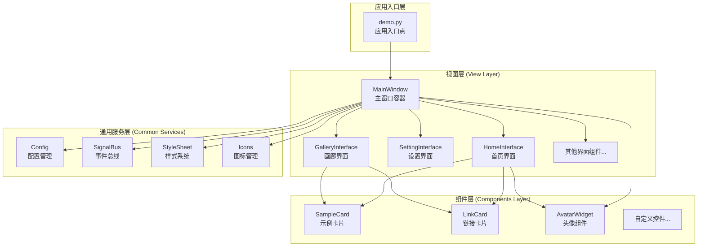
```mermaid
graph TB
subgraph "应用入口层"
Demo[demo.py<br/>应用入口点]
end
subgraph "视图层 (View Layer)"
MainWindow[MainWindow<br/>主窗口容器]
HomeInterface[HomeInterface<br/>首页界面]
SettingInterface[SettingInterface<br/>设置界面]
GalleryInterface[GalleryInterface<br/>画廊界面]
OtherInterfaces[其他界面组件...]
end
subgraph "组件层 (Components Layer)"
SampleCard[SampleCard<br/>示例卡片]
LinkCard[LinkCard<br/>链接卡片]
AvatarWidget[AvatarWidget<br/>头像组件]
CustomWidgets[自定义控件...]
end
subgraph "通用服务层 (Common Services)"
Config[Config<br/>配置管理]
SignalBus[SignalBus<br/>事件总线]
StyleSheet[StyleSheet<br/>样式系统]
Icons[Icons<br/>图标管理]
end
Demo --> MainWindow
MainWindow --> HomeInterface
MainWindow --> SettingInterface
MainWindow --> GalleryInterface
MainWindow --> OtherInterfaces
HomeInterface --> SampleCard
HomeInterface --> LinkCard
GalleryInterface --> SampleCard
GalleryInterface --> LinkCard
MainWindow --> AvatarWidget
HomeInterface --> AvatarWidget
MainWindow --> Config
MainWindow --> SignalBus
MainWindow --> StyleSheet
MainWindow --> Icons
```

**图表来源**
- [main_window.py](file://gui/qtpy/version2/gallery/app/view/main_window.py#L66-L91)
- [demo.py](file://gui/qtpy/version2/gallery/demo.py#L8-L9)

**章节来源**
- [main_window.py](file://gui/qtpy/version2/gallery/app/view/main_window.py#L1-L212)
- [demo.py](file://gui/qtpy/version2/gallery/demo.py#L1-L46)

## 核心架构组件

### 主窗口容器 (MainWindow)

主窗口是整个应用程序的核心容器，负责协调各个视图组件的显示和交互。其设计遵循 MVC 架构模式，实现了清晰的职责分离。

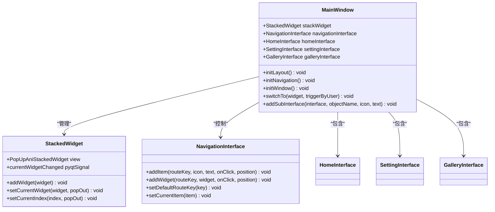
```mermaid
classDiagram
class MainWindow {
+StackedWidget stackWidget
+NavigationInterface navigationInterface
+HomeInterface homeInterface
+SettingInterface settingInterface
+GalleryInterface galleryInterface
+initLayout() void
+initNavigation() void
+initWindow() void
+switchTo(widget, triggerByUser) void
+addSubInterface(interface, objectName, icon, text) void
}
class StackedWidget {
+PopUpAniStackedWidget view
+currentWidgetChanged pyqtSignal
+addWidget(widget) void
+setCurrentWidget(widget, popOut) void
+setCurrentIndex(index, popOut) void
}
class NavigationInterface {
+addItem(routeKey, icon, text, onClick, position) void
+addWidget(routeKey, widget, onClick, position) void
+setDefaultRouteKey(key) void
+setCurrentItem(item) void
}
MainWindow --> StackedWidget : "管理"
MainWindow --> NavigationInterface : "控制"
MainWindow --> HomeInterface : "包含"
MainWindow --> SettingInterface : "包含"
MainWindow --> GalleryInterface : "包含"
```

**图表来源**
- [main_window.py](file://gui/qtpy/version2/gallery/app/view/main_window.py#L66-L91)
- [main_window.py](file://gui/qtpy/version2/gallery/app/view/main_window.py#L34-L64)

### 导航系统设计

导航系统采用 QFluentWidgets 的 NavigationInterface，支持顶部导航项和底部固定项的混合布局：

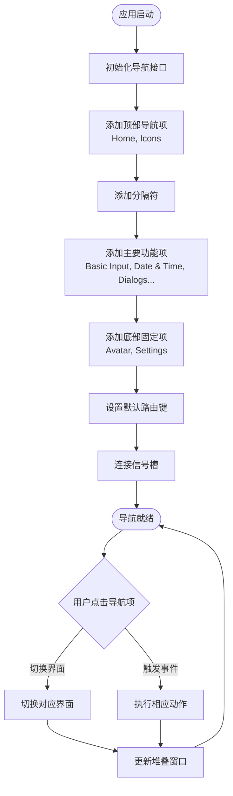
```mermaid
flowchart TD
Start([应用启动]) --> InitNav[初始化导航接口]
InitNav --> AddTopItems[添加顶部导航项<br/>Home, Icons]
AddTopItems --> AddSeparator[添加分隔符]
AddSeparator --> AddMainItems[添加主要功能项<br/>Basic Input, Date & Time, Dialogs...]
AddMainItems --> AddBottomItems[添加底部固定项<br/>Avatar, Settings]
AddBottomItems --> SetDefault[设置默认路由键]
SetDefault --> ConnectSignals[连接信号槽]
ConnectSignals --> Ready([导航就绪])
Ready --> UserClick{用户点击导航项}
UserClick --> |切换界面| SwitchInterface[切换对应界面]
UserClick --> |触发事件| TriggerAction[执行相应动作]
SwitchInterface --> UpdateStack[更新堆叠窗口]
TriggerAction --> UpdateStack
UpdateStack --> Ready
```

**图表来源**
- [main_window.py](file://gui/qtpy/version2/gallery/app/view/main_window.py#L116-L156)

**章节来源**
- [main_window.py](file://gui/qtpy/version2/gallery/app/view/main_window.py#L66-L212)

## 视图层架构

### 视图层职责划分

视图层采用界面导向的设计模式，每个界面负责特定的功能领域：

| 界面组件 | 职责描述 | 主要功能 |
|---------|---------|---------|
| HomeInterface | 应用首页展示 | 功能分类引导、快速访问入口 |
| SettingInterface | 应用设置管理 | 配置选项、主题设置、语言选择 |
| GalleryInterface | 功能演示界面 | 控件展示、示例代码、交互演示 |
| 其他界面 | 专业功能界面 | 输入控件、布局管理、状态信息等 |

### 界面继承体系

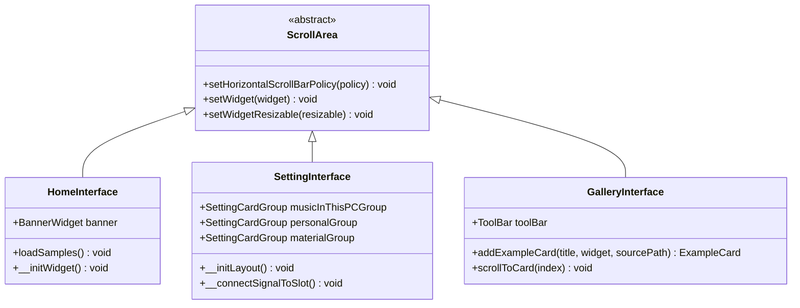
```mermaid
classDiagram
class ScrollArea {
<<abstract>>
+setHorizontalScrollBarPolicy(policy) void
+setWidget(widget) void
+setWidgetResizable(resizable) void
}
class HomeInterface {
+BannerWidget banner
+loadSamples() void
+__initWidget() void
}
class SettingInterface {
+SettingCardGroup musicInThisPCGroup
+SettingCardGroup personalGroup
+SettingCardGroup materialGroup
+__initLayout() void
+__connectSignalToSlot() void
}
class GalleryInterface {
+ToolBar toolBar
+addExampleCard(title, widget, sourcePath) ExampleCard
+scrollToCard(index) void
}
ScrollArea <|-- HomeInterface
ScrollArea <|-- SettingInterface
ScrollArea <|-- GalleryInterface
```

**图表来源**
- [home_interface.py](file://gui/qtpy/version2/gallery/app/view/home_interface.py#L89-L98)
- [setting_interface.py](file://gui/qtpy/version2/gallery/app/view/setting_interface.py#L18-L29)
- [gallery_interface.py](file://gui/qtpy/version2/gallery/app/view/gallery_interface.py#L150-L167)

### 内容组织模式

各界面采用统一的内容组织模式，确保用户体验的一致性：

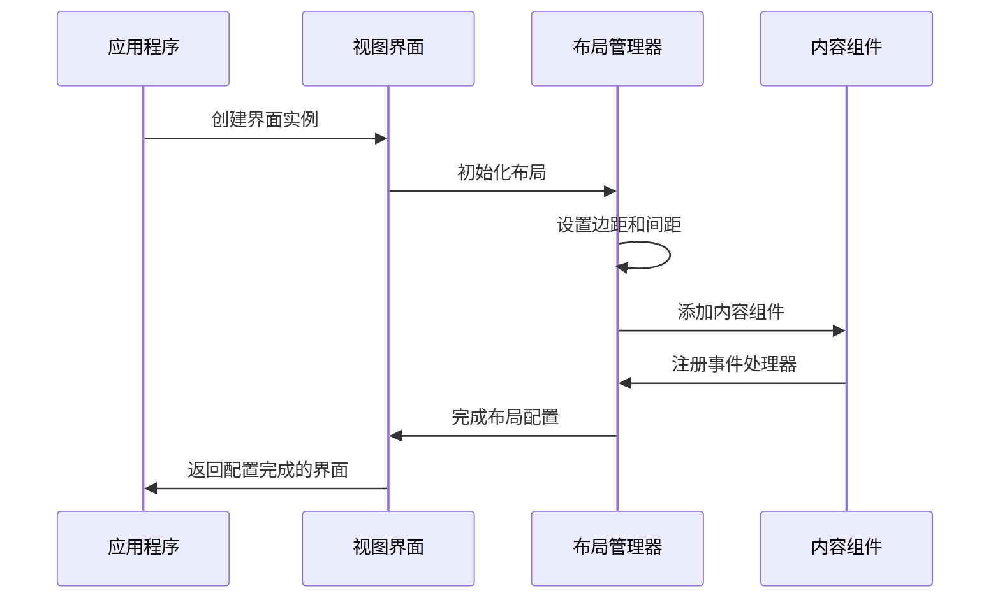
```mermaid
sequenceDiagram
participant App as 应用程序
participant Interface as 视图界面
participant Layout as 布局管理器
participant Content as 内容组件
App->>Interface : 创建界面实例
Interface->>Layout : 初始化布局
Layout->>Layout : 设置边距和间距
Layout->>Content : 添加内容组件
Content->>Layout : 注册事件处理器
Layout->>Interface : 完成布局配置
Interface->>App : 返回配置完成的界面
```

**图表来源**
- [home_interface.py](file://gui/qtpy/version2/gallery/app/view/home_interface.py#L98-L108)
- [setting_interface.py](file://gui/qtpy/version2/gallery/app/view/setting_interface.py#L145-L159)

**章节来源**
- [home_interface.py](file://gui/qtpy/version2/gallery/app/view/home_interface.py#L1-L326)
- [setting_interface.py](file://gui/qtpy/version2/gallery/app/view/setting_interface.py#L1-L227)
- [gallery_interface.py](file://gui/qtpy/version2/gallery/app/view/gallery_interface.py#L1-L196)

## 组件层设计

### 组件层架构原则

组件层采用可复用性优先的设计原则，提供了高度抽象的基础组件：

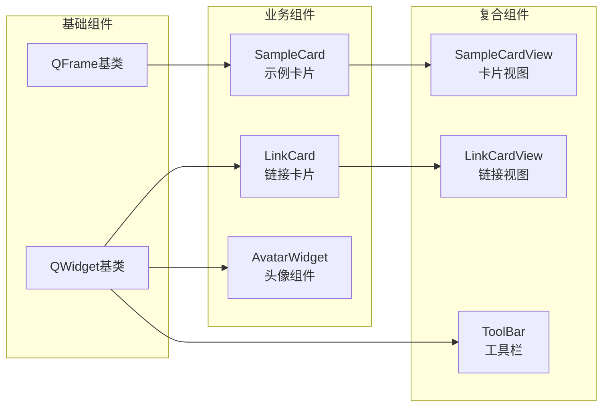
```mermaid
graph LR
subgraph "基础组件"
BaseFrame[QFrame基类]
BaseWidget[QWidget基类]
end
subgraph "业务组件"
SampleCard[SampleCard<br/>示例卡片]
LinkCard[LinkCard<br/>链接卡片]
AvatarWidget[AvatarWidget<br/>头像组件]
end
subgraph "复合组件"
SampleCardView[SampleCardView<br/>卡片视图]
LinkCardView[LinkCardView<br/>链接视图]
ToolBar[ToolBar<br/>工具栏]
end
BaseFrame --> SampleCard
BaseWidget --> LinkCard
BaseWidget --> AvatarWidget
SampleCard --> SampleCardView
LinkCard --> LinkCardView
BaseWidget --> ToolBar
```

**图表来源**
- [sample_card.py](file://gui/qtpy/version2/gallery/app/components/sample_card.py#L10-L49)
- [link_card.py](file://gui/qtpy/version2/gallery/app/components/link_card.py#L10-L46)
- [avatar_widget.py](file://gui/qtpy/version2/gallery/app/components/avatar_widget.py#L7-L12)

### 示例卡片组件

示例卡片是组件层的核心组件之一，用于展示功能示例：

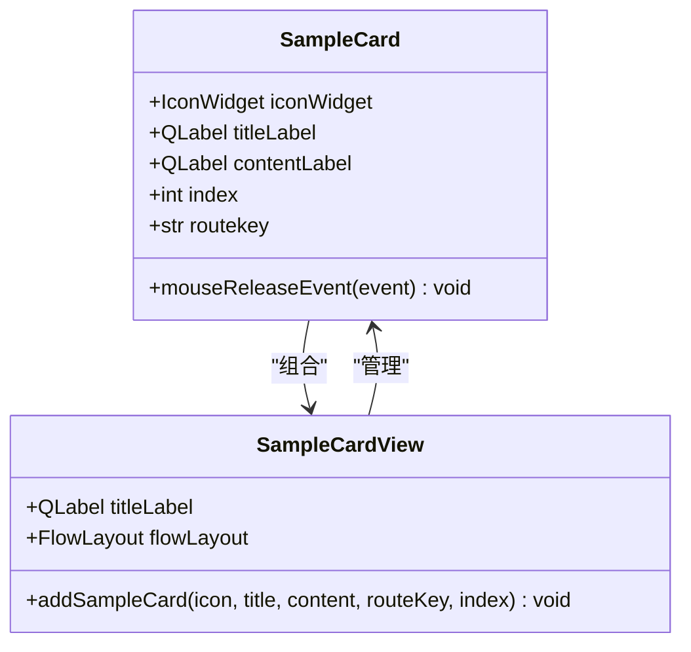
```mermaid
classDiagram
class SampleCard {
+IconWidget iconWidget
+QLabel titleLabel
+QLabel contentLabel
+int index
+str routekey
+mouseReleaseEvent(event) void
}
class SampleCardView {
+QLabel titleLabel
+FlowLayout flowLayout
+addSampleCard(icon, title, content, routeKey, index) void
}
SampleCard --> SampleCardView : "组合"
SampleCardView --> SampleCard : "管理"
```

**图表来源**
- [sample_card.py](file://gui/qtpy/version2/gallery/app/components/sample_card.py#L10-L49)

### 头像组件设计

头像组件展示了自定义绘制和交互响应的设计模式：

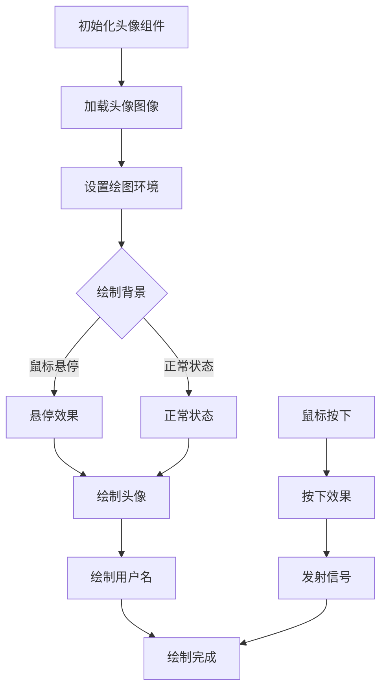
```mermaid
flowchart TD
Init[初始化头像组件] --> LoadImage[加载头像图像]
LoadImage --> SetupPainter[设置绘图环境]
SetupPainter --> DrawBackground{绘制背景}
DrawBackground --> |鼠标悬停| HoverEffect[悬停效果]
DrawBackground --> |正常状态| NormalState[正常状态]
HoverEffect --> DrawAvatar[绘制头像]
NormalState --> DrawAvatar
DrawAvatar --> DrawText[绘制用户名]
DrawText --> Complete[绘制完成]
MousePress[鼠标按下] --> PressEffect[按下效果]
PressEffect --> EmitSignal[发射信号]
EmitSignal --> Complete
```

**图表来源**
- [avatar_widget.py](file://gui/qtpy/version2/gallery/app/components/avatar_widget.py#L15-L42)

**章节来源**
- [sample_card.py](file://gui/qtpy/version2/gallery/app/components/sample_card.py#L1-L75)
- [link_card.py](file://gui/qtpy/version2/gallery/app/components/link_card.py#L1-L71)
- [avatar_widget.py](file://gui/qtpy/version2/gallery/app/components/avatar_widget.py#L1-L42)

## 通用服务层

### 配置管理系统

配置管理系统采用 QFluentWidgets 的配置框架，提供了类型安全的配置管理：

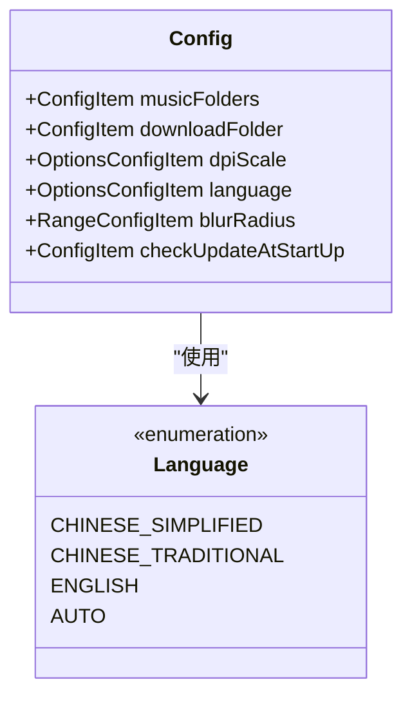
```mermaid
classDiagram
class Config {
+ConfigItem musicFolders
+ConfigItem downloadFolder
+OptionsConfigItem dpiScale
+OptionsConfigItem language
+RangeConfigItem blurRadius
+ConfigItem checkUpdateAtStartUp
}
class Language {
<<enumeration>>
CHINESE_SIMPLIFIED
CHINESE_TRADITIONAL
ENGLISH
AUTO
}
Config --> Language : "使用"
```

**图表来源**
- [config.py](file://gui/qtpy/version2/gallery/app/common/config.py#L19-L40)

### 配置加载机制

配置系统支持 JSON 文件加载和运行时配置修改：

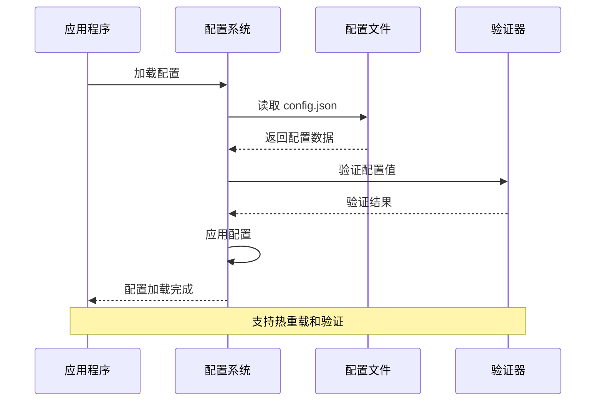
```mermaid
sequenceDiagram
participant App as 应用程序
participant Config as 配置系统
participant JSON as 配置文件
participant Validator as 验证器
App->>Config : 加载配置
Config->>JSON : 读取 config.json
JSON-->>Config : 返回配置数据
Config->>Validator : 验证配置值
Validator-->>Config : 验证结果
Config->>Config : 应用配置
Config-->>App : 配置加载完成
Note over App,Validator : 支持热重载和验证
```

**图表来源**
- [config.py](file://gui/qtpy/version2/gallery/app/common/config.py#L51-L52)
- [config.json](file://gui/qtpy/version2/gallery/app/config/config.json#L1-L20)

### 图标管理系统

图标系统采用枚举方式管理图标资源，支持主题适配：

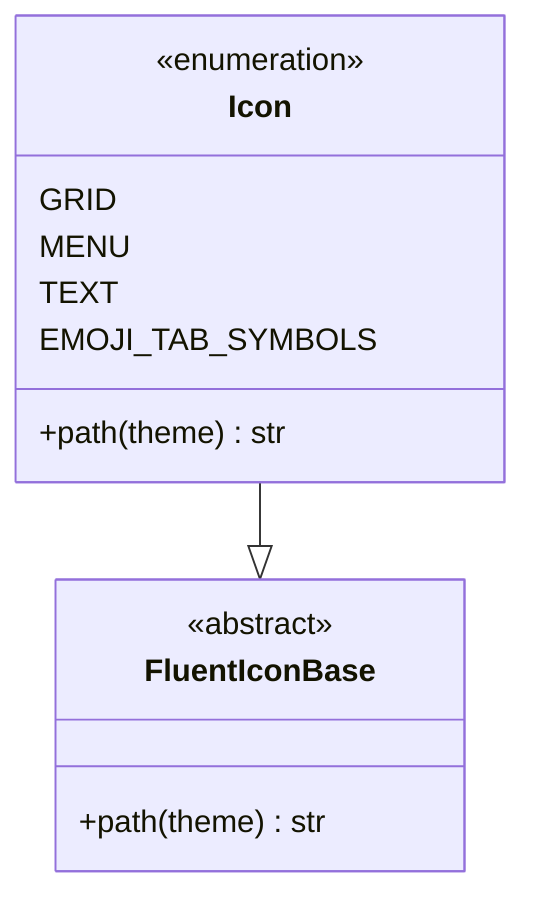
```mermaid
classDiagram
class Icon {
<<enumeration>>
GRID
MENU
TEXT
EMOJI_TAB_SYMBOLS
+path(theme) str
}
class FluentIconBase {
<<abstract>>
+path(theme) str
}
Icon --|> FluentIconBase
```

**图表来源**
- [icon.py](file://gui/qtpy/version2/gallery/app/common/icon.py#L7-L20)

**章节来源**
- [config.py](file://gui/qtpy/version2/gallery/app/common/config.py#L1-L52)
- [icon.py](file://gui/qtpy/version2/gallery/app/common/icon.py#L1-L21)
- [config.json](file://gui/qtpy/version2/gallery/app/config/config.json#L1-L20)

## 事件总线通信模型

### 信号总线架构

事件总线采用单例模式设计，提供全局事件通信机制：

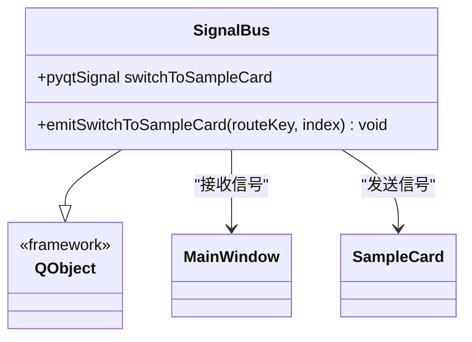
```mermaid
classDiagram
class SignalBus {
+pyqtSignal switchToSampleCard
+emitSwitchToSampleCard(routeKey, index) void
}
class QObject {
<<framework>>
}
SignalBus --|> QObject
SignalBus --> MainWindow : "接收信号"
SignalBus --> SampleCard : "发送信号"
```

**图表来源**
- [signal_bus.py](file://gui/qtpy/version2/gallery/app/common/signal_bus.py#L5-L11)

### 事件传播机制

事件总线支持跨组件的松耦合通信：

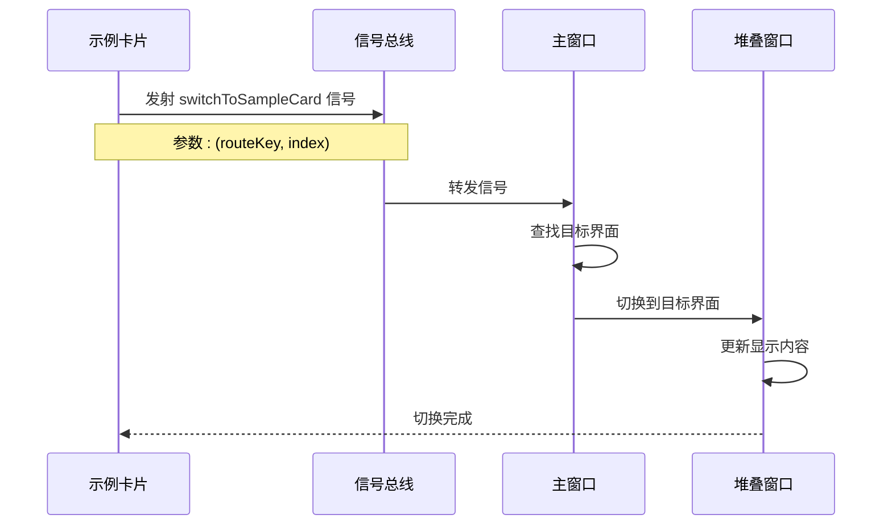
```mermaid
sequenceDiagram
participant SampleCard as 示例卡片
participant SignalBus as 信号总线
participant MainWindow as 主窗口
participant StackWidget as 堆叠窗口
SampleCard->>SignalBus : 发射 switchToSampleCard 信号
Note over SampleCard,SignalBus : 参数 : (routeKey, index)
SignalBus->>MainWindow : 转发信号
MainWindow->>MainWindow : 查找目标界面
MainWindow->>StackWidget : 切换到目标界面
StackWidget->>StackWidget : 更新显示内容
StackWidget-->>SampleCard : 切换完成
```

**图表来源**
- [main_window.py](file://gui/qtpy/version2/gallery/app/view/main_window.py#L110-L112)
- [signal_bus.py](file://gui/qtpy/version2/gallery/app/common/signal_bus.py#L8-L9)

**章节来源**
- [signal_bus.py](file://gui/qtpy/version2/gallery/app/common/signal_bus.py#L1-L11)

## 配置管理系统

### 配置层次结构

配置系统采用分层管理模式，支持不同类型配置项：

| 配置类型 | 示例 | 验证器 | 用途 |
|---------|------|--------|------|
| ConfigItem | downloadFolder | FolderValidator | 单值配置 |
| OptionsConfigItem | dpiScale | OptionsValidator | 选项配置 |
| RangeConfigItem | blurRadius | RangeValidator | 范围配置 |
| BoolValidator | checkUpdateAtStartUp | BoolValidator | 布尔配置 |

### 配置持久化

配置系统自动处理配置的持久化存储：

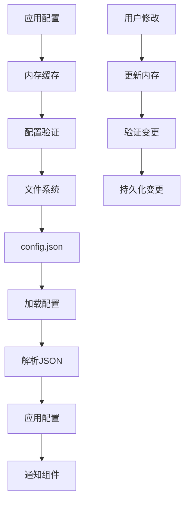
```mermaid
flowchart TD
AppConfig[应用配置] --> MemoryCache[内存缓存]
MemoryCache --> Validation[配置验证]
Validation --> FileSystem[文件系统]
FileSystem --> JSONFile[config.json]
JSONFile --> LoadConfig[加载配置]
LoadConfig --> ParseJSON[解析JSON]
ParseJSON --> ApplyConfig[应用配置]
ApplyConfig --> NotifyComponents[通知组件]
UserChange[用户修改] --> UpdateMemory[更新内存]
UpdateMemory --> ValidateChange[验证变更]
ValidateChange --> PersistChange[持久化变更]
```

**图表来源**
- [config.py](file://gui/qtpy/version2/gallery/app/common/config.py#L51-L52)

**章节来源**
- [config.py](file://gui/qtpy/version2/gallery/app/common/config.py#L1-L52)
- [config.json](file://gui/qtpy/version2/gallery/app/config/config.json#L1-L20)

## 样式表与主题系统

### 样式系统架构

样式系统采用枚举方式管理样式资源，支持主题切换：

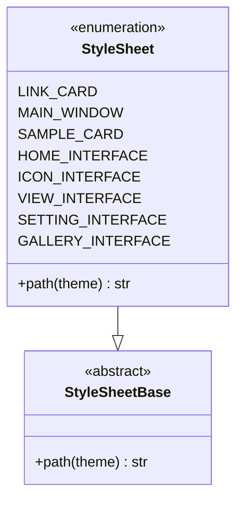
```mermaid
classDiagram
class StyleSheet {
<<enumeration>>
LINK_CARD
MAIN_WINDOW
SAMPLE_CARD
HOME_INTERFACE
ICON_INTERFACE
VIEW_INTERFACE
SETTING_INTERFACE
GALLERY_INTERFACE
+path(theme) str
}
class StyleSheetBase {
<<abstract>>
+path(theme) str
}
StyleSheet --|> StyleSheetBase
```

**图表来源**
- [style_sheet.py](file://gui/qtpy/version2/gallery/app/common/style_sheet.py#L7-L21)

### 主题适配机制

样式系统支持明暗主题自动切换：

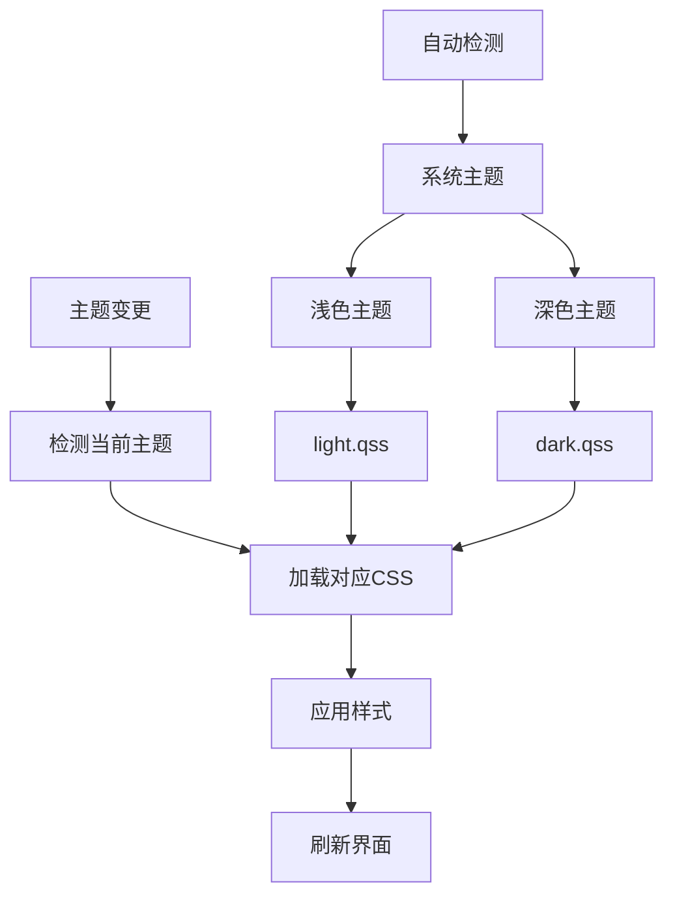
```mermaid
flowchart TD
ThemeChange[主题变更] --> DetectTheme[检测当前主题]
DetectTheme --> LoadCSS[加载对应CSS]
LoadCSS --> ApplyStyles[应用样式]
ApplyStyles --> RefreshUI[刷新界面]
AutoDetect[自动检测] --> SystemTheme[系统主题]
SystemTheme --> LightTheme[浅色主题]
SystemTheme --> DarkTheme[深色主题]
LightTheme --> LightCSS[light.qss]
DarkTheme --> DarkCSS[dark.qss]
LightCSS --> LoadCSS
DarkCSS --> LoadCSS
```

**图表来源**
- [style_sheet.py](file://gui/qtpy/version2/gallery/app/common/style_sheet.py#L19-L21)

**章节来源**
- [style_sheet.py](file://gui/qtpy/version2/gallery/app/common/style_sheet.py#L1-L22)

## 初始化流程与生命周期

### 应用启动流程

应用采用标准的 Qt 应用程序启动模式，包含完整的初始化序列：

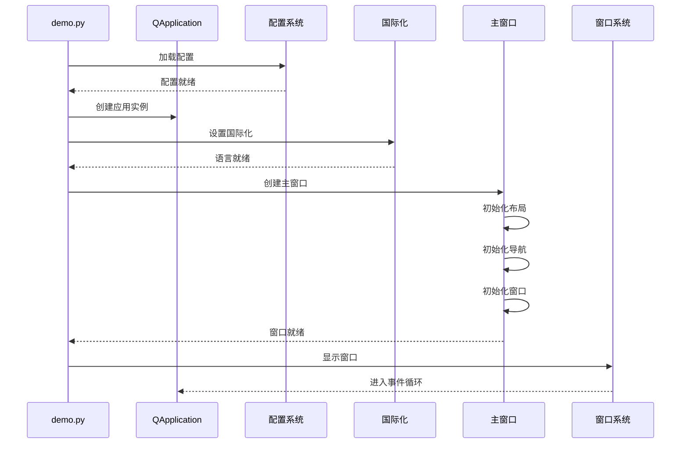
```mermaid
sequenceDiagram
participant Main as demo.py
participant App as QApplication
participant Config as 配置系统
participant Translator as 国际化
participant MainWindow as 主窗口
participant Window as 窗口系统
Main->>Config : 加载配置
Config-->>Main : 配置就绪
Main->>App : 创建应用实例
Main->>Translator : 设置国际化
Translator-->>Main : 语言就绪
Main->>MainWindow : 创建主窗口
MainWindow->>MainWindow : 初始化布局
MainWindow->>MainWindow : 初始化导航
MainWindow->>MainWindow : 初始化窗口
MainWindow-->>Main : 窗口就绪
Main->>Window : 显示窗口
Window-->>App : 进入事件循环
```

**图表来源**
- [demo.py](file://gui/qtpy/version2/gallery/demo.py#L23-L46)
- [main_window.py](file://gui/qtpy/version2/gallery/app/view/main_window.py#L68-L98)

### 生命周期管理

应用程序遵循 Qt 的生命周期管理模式：

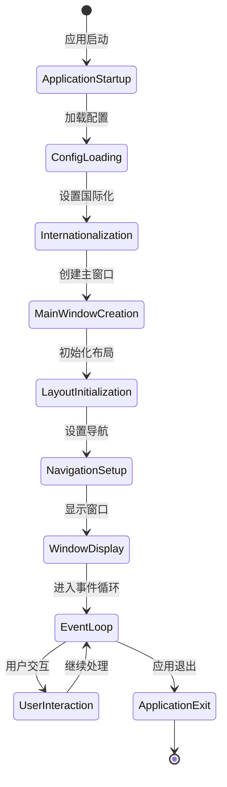
```mermaid
stateDiagram-v2
[*] --> ApplicationStartup : 应用启动
ApplicationStartup --> ConfigLoading : 加载配置
ConfigLoading --> Internationalization : 设置国际化
Internationalization --> MainWindowCreation : 创建主窗口
MainWindowCreation --> LayoutInitialization : 初始化布局
LayoutInitialization --> NavigationSetup : 设置导航
NavigationSetup --> WindowDisplay : 显示窗口
WindowDisplay --> EventLoop : 进入事件循环
EventLoop --> UserInteraction : 用户交互
UserInteraction --> EventLoop : 继续处理
EventLoop --> ApplicationExit : 应用退出
ApplicationExit --> [*]
```

### 窗口初始化序列

主窗口的初始化遵循严格的顺序，确保组件间的正确依赖关系：

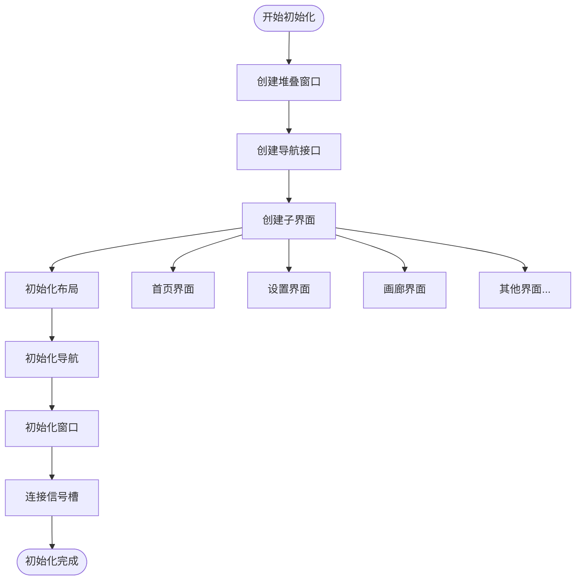
```mermaid
flowchart TD
Start([开始初始化]) --> CreateStack[创建堆叠窗口]
CreateStack --> CreateNav[创建导航接口]
CreateNav --> CreateInterfaces[创建子界面]
CreateInterfaces --> InitLayout[初始化布局]
InitLayout --> InitNav[初始化导航]
InitNav --> InitWindow[初始化窗口]
InitWindow --> ConnectSignals[连接信号槽]
ConnectSignals --> Ready([初始化完成])
CreateInterfaces --> HomeInterface[首页界面]
CreateInterfaces --> SettingInterface[设置界面]
CreateInterfaces --> GalleryInterface[画廊界面]
CreateInterfaces --> OtherInterfaces[其他界面...]
```

**图表来源**
- [main_window.py](file://gui/qtpy/version2/gallery/app/view/main_window.py#L68-L98)

**章节来源**
- [demo.py](file://gui/qtpy/version2/gallery/demo.py#L1-L46)
- [main_window.py](file://gui/qtpy/version2/gallery/app/view/main_window.py#L68-L212)

## 模块化扩展能力

### 插件化架构设计

系统采用插件化架构，支持功能模块的动态加载：

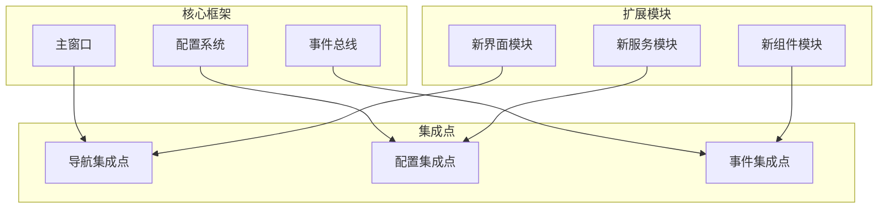
```mermaid
graph TB
subgraph "核心框架"
MainWindow[主窗口]
SignalBus[事件总线]
ConfigSystem[配置系统]
end
subgraph "扩展模块"
NewInterface[新界面模块]
NewComponent[新组件模块]
NewService[新服务模块]
end
subgraph "集成点"
NavigationPoint[导航集成点]
ConfigPoint[配置集成点]
EventPoint[事件集成点]
end
MainWindow --> NavigationPoint
SignalBus --> EventPoint
ConfigSystem --> ConfigPoint
NewInterface --> NavigationPoint
NewComponent --> EventPoint
NewService --> ConfigPoint
```

### 扩展点设计

系统提供了多个标准化的扩展点：

| 扩展点 | 接口 | 用途 | 实现示例 |
|-------|------|------|----------|
| 新界面 | 继承 ScrollArea | 添加新功能页面 | 自定义功能界面 |
| 新组件 | 继承 QWidget/QFrame | 添加自定义控件 | 专用输入控件 |
| 新配置 | 添加 ConfigItem | 扩展配置选项 | 新增功能配置 |
| 新图标 | 添加枚举值 | 扩展图标库 | 新功能图标 |

### 模块间解耦设计

通过接口抽象和依赖注入实现模块间解耦：

```mermaid
classDiagram
class IInterface {
<<interface>>
+initialize() void
+cleanup() void
+getDisplayName() str
}
class IComponent {
<<interface>>
+render() QWidget
+handleEvent(event) void
}
class IService {
<<interface>>
+configure(config) void
+execute(params) result
}
class ConcreteInterface {
+initialize() void
+cleanup() void
+getDisplayName() str
}
class ConcreteComponent {
+render() QWidget
+handleEvent(event) void
}
class ConcreteService {
+configure(config) void
+execute(params) result
}
IInterface <|.. ConcreteInterface
IComponent <|.. ConcreteComponent
IService <|.. ConcreteService
```

**章节来源**
- [main_window.py](file://gui/qtpy/version2/gallery/app/view/main_window.py#L157-L163)
- [home_interface.py](file://gui/qtpy/version2/gallery/app/view/home_interface.py#L114-L326)

## 总结

python-office GUI Version2 采用了现代化的软件架构设计，通过以下关键技术实现了高质量的桌面应用程序：

### 架构优势

1. **分层架构**：清晰的职责分离，便于维护和扩展
2. **模块化设计**：高内聚低耦合的组件设计
3. **事件驱动**：基于信号槽的松耦合通信机制
4. **配置管理**：类型安全的配置系统
5. **主题支持**：完整的明暗主题切换机制

### 技术特色

- **Fluent Design**：遵循微软 Fluent Design 设计规范
- **QFluentWidgets**：基于 PyQt 的现代化控件库
- **国际化支持**：完整的多语言支持机制
- **样式系统**：灵活的主题和样式管理
- **扩展性**：良好的插件化架构设计

### 最佳实践

该架构设计体现了现代软件开发的最佳实践：
- 遵循 SOLID 原则的面向对象设计
- 采用设计模式解决常见问题
- 实现了完整的生命周期管理
- 提供了完善的错误处理机制

Version2 版本为 python-office 提供了一个稳定、可扩展的 GUI 基础架构，为后续功能的开发奠定了坚实的基础。