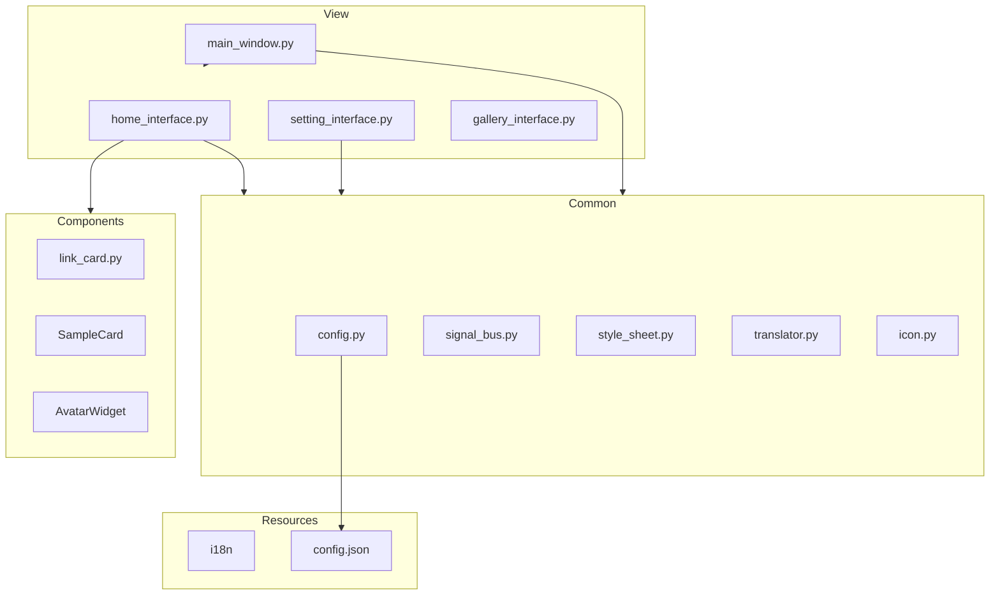
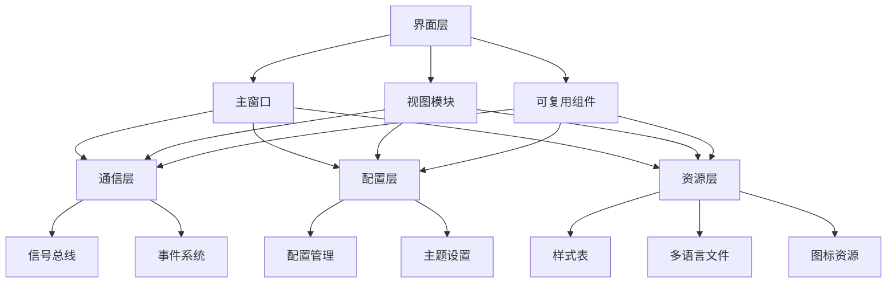
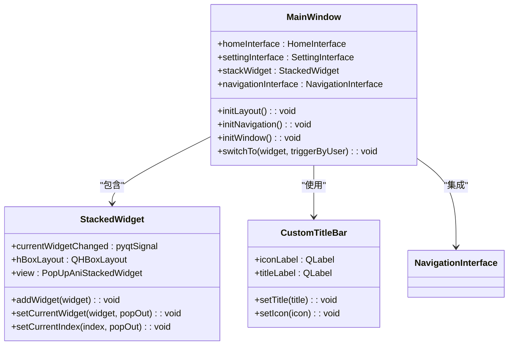
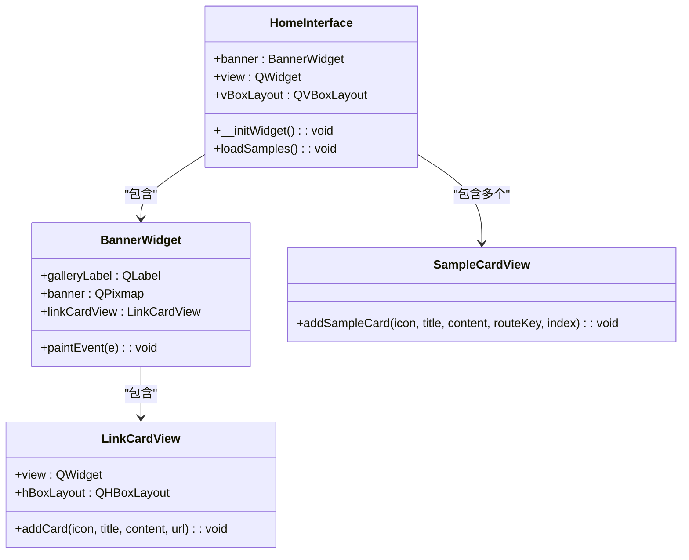
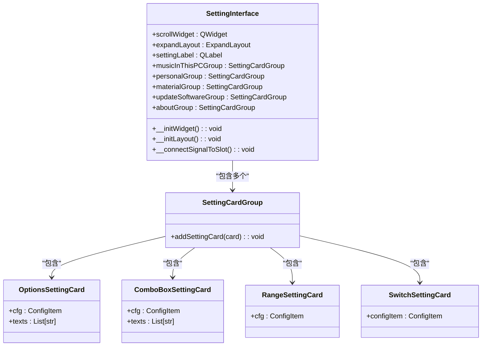
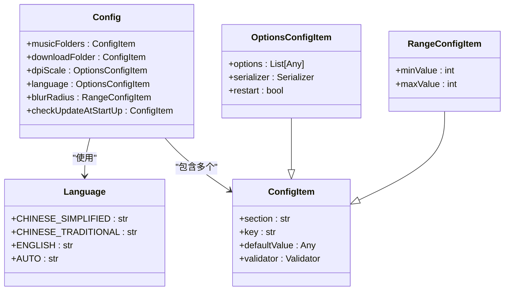
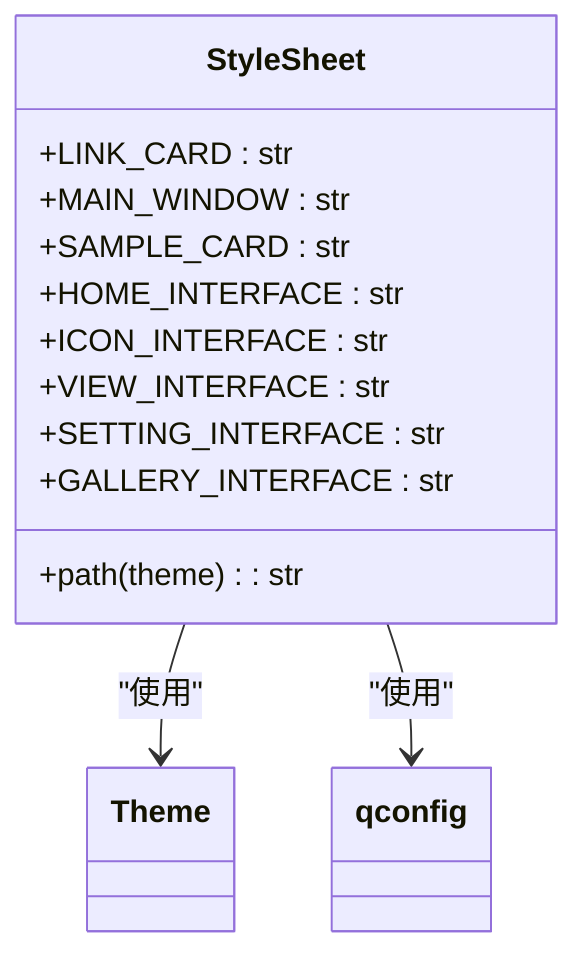
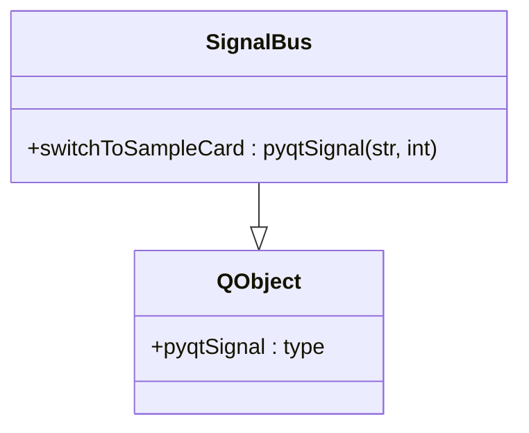
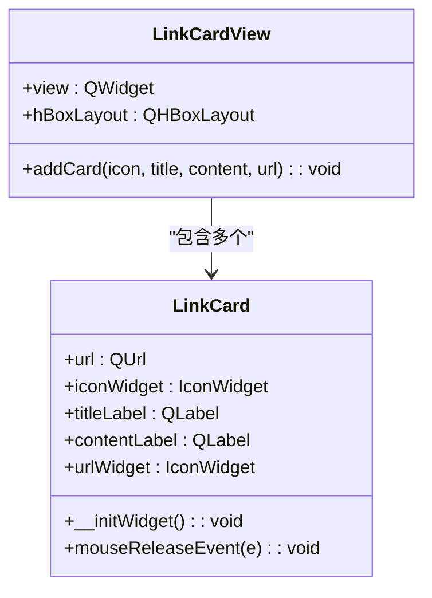

# Version2 概述

<cite>
**本文档引用的文件**   
- [main_window.py](file://gui/qtpy/version2/gallery/app/view/main_window.py)
- [home_interface.py](file://gui/qtpy/version2/gallery/app/view/home_interface.py)
- [setting_interface.py](file://gui/qtpy/version2/gallery/app/view/setting_interface.py)
- [config.py](file://gui/qtpy/version2/gallery/app/common/config.py)
- [style_sheet.py](file://gui/qtpy/version2/gallery/app/common/style_sheet.py)
- [signal_bus.py](file://gui/qtpy/version2/gallery/app/common/signal_bus.py)
- [link_card.py](file://gui/qtpy/version2/gallery/app/components/link_card.py)
- [gallery_zh.ts](file://gui/qtpy/version2/gallery/app/resource/i18n/gallery_zh.ts)
- [gallery_hk.ts](file://gui/qtpy/version2/gallery/app/resource/i18n/gallery_hk.ts)
- [translator.py](file://gui/qtpy/version2/gallery/app/common/translator.py)
- [title_bar.py](file://gui/qtpy/version2/gallery/app/view/title_bar.py)
- [gallery_interface.py](file://gui/qtpy/version2/gallery/app/view/gallery_interface.py)
- [basic_input_interface.py](file://gui/qtpy/version2/gallery/app/view/basic_input_interface.py)
- [icon.py](file://gui/qtpy/version2/gallery/app/common/icon.py)
</cite>

## 目录
1. [项目结构](#项目结构)
2. [核心组件](#核心组件)
3. [架构概述](#架构概述)
4. [详细组件分析](#详细组件分析)
5. [依赖分析](#依赖分析)
6. [性能考虑](#性能考虑)
7. [故障排除指南](#故障排除指南)
8. [结论](#结论)

## 项目结构

python-office GUI Version2 项目采用模块化设计，主要分为以下几个核心目录：

- **gui/qtpy/version2/gallery/app/view**: 包含所有界面视图模块，如主窗口、首页、设置界面等
- **gui/qtpy/version2/gallery/app/common**: 包含配置、信号总线、样式表等共享组件
- **gui/qtpy/version2/gallery/app/components**: 包含可复用的UI组件
- **gui/qtpy/version2/gallery/app/resource/i18n**: 包含多语言翻译文件



**图源**
- [main_window.py](file://gui/qtpy/version2/gallery/app/view/main_window.py)
- [home_interface.py](file://gui/qtpy/version2/gallery/app/view/home_interface.py)
- [setting_interface.py](file://gui/qtpy/version2/gallery/app/view/setting_interface.py)
- [config.py](file://gui/qtpy/version2/gallery/app/common/config.py)
- [link_card.py](file://gui/qtpy/version2/gallery/app/components/link_card.py)

## 核心组件

python-office GUI Version2 的核心组件包括主窗口容器、视图模块、配置管理、样式定义和多语言支持系统。这些组件共同构建了一个现代化的Fluent Design界面，提供了优秀的用户体验和可维护性。

**节源**
- [main_window.py](file://gui/qtpy/version2/gallery/app/view/main_window.py#L1-L212)
- [home_interface.py](file://gui/qtpy/version2/gallery/app/view/home_interface.py#L1-L326)
- [setting_interface.py](file://gui/qtpy/version2/gallery/app/view/setting_interface.py#L1-L227)
- [config.py](file://gui/qtpy/version2/gallery/app/common/config.py#L1-L52)

## 架构概述

python-office GUI Version2 采用基于QFluentWidgets的现代化架构设计，实现了Fluent Design设计语言。系统架构分为四个主要层次：界面层、通信层、配置层和资源层。



**图源**
- [main_window.py](file://gui/qtpy/version2/gallery/app/view/main_window.py#L66-L212)
- [signal_bus.py](file://gui/qtpy/version2/gallery/app/common/signal_bus.py#L1-L11)
- [config.py](file://gui/qtpy/version2/gallery/app/common/config.py#L1-L52)
- [style_sheet.py](file://gui/qtpy/version2/gallery/app/common/style_sheet.py#L1-L22)

## 详细组件分析

### 主窗口分析

MainWindow类作为应用程序的主窗口容器，继承自FramelessWindow，实现了无边框窗口设计。它通过NavigationInterface提供侧边导航栏，并使用StackedWidget管理多个视图界面的切换。



**图源**
- [main_window.py](file://gui/qtpy/version2/gallery/app/view/main_window.py#L66-L212)
- [title_bar.py](file://gui/qtpy/version2/gallery/app/view/title_bar.py#L1-L32)

**节源**
- [main_window.py](file://gui/qtpy/version2/gallery/app/view/main_window.py#L66-L212)
- [title_bar.py](file://gui/qtpy/version2/gallery/app/view/title_bar.py#L1-L32)

### 首页界面分析

HomeInterface类作为应用程序的首页，继承自ScrollArea，提供了丰富的功能展示和导航。它包含BannerWidget和多个SampleCardView，用于展示不同功能模块。



**图源**
- [home_interface.py](file://gui/qtpy/version2/gallery/app/view/home_interface.py#L89-L326)
- [link_card.py](file://gui/qtpy/version2/gallery/app/components/link_card.py#L48-L71)

**节源**
- [home_interface.py](file://gui/qtpy/version2/gallery/app/view/home_interface.py#L89-L326)
- [link_card.py](file://gui/qtpy/version2/gallery/app/components/link_card.py#L48-L71)

### 设置界面分析

SettingInterface类提供了应用程序的设置功能，通过分组的SettingCard实现各种配置选项。它支持主题、语言、缩放等个性化设置。



**图源**
- [setting_interface.py](file://gui/qtpy/version2/gallery/app/view/setting_interface.py#L18-L227)
- [config.py](file://gui/qtpy/version2/gallery/app/common/config.py#L1-L52)

**节源**
- [setting_interface.py](file://gui/qtpy/version2/gallery/app/view/setting_interface.py#L18-L227)
- [config.py](file://gui/qtpy/version2/gallery/app/common/config.py#L1-L52)

### 配置管理分析

Config类实现了应用程序的配置管理系统，使用QConfig框架持久化存储用户设置。它定义了多个配置项，包括语言、主题、DPI缩放等。



**图源**
- [config.py](file://gui/qtpy/version2/gallery/app/common/config.py#L1-L52)
- [setting_interface.py](file://gui/qtpy/version2/gallery/app/view/setting_interface.py#L2-L6)

**节源**
- [config.py](file://gui/qtpy/version2/gallery/app/common/config.py#L1-L52)

### 样式表分析

StyleSheet类实现了应用程序的主题样式管理，继承自StyleSheetBase和Enum。它为不同的界面组件定义了对应的样式表文件路径。



**图源**
- [style_sheet.py](file://gui/qtpy/version2/gallery/app/common/style_sheet.py#L1-L22)

**节源**
- [style_sheet.py](file://gui/qtpy/version2/gallery/app/common/style_sheet.py#L1-L22)

### 信号总线分析

SignalBus类实现了应用程序的全局信号总线，用于组件间的通信。它定义了switchToSampleCard信号，用于在不同界面间导航。



**图源**
- [signal_bus.py](file://gui/qtpy/version2/gallery/app/common/signal_bus.py#L1-L11)

**节源**
- [signal_bus.py](file://gui/qtpy/version2/gallery/app/common/signal_bus.py#L1-L11)

### 可复用组件分析

LinkCard和LinkCardView类实现了可复用的链接卡片组件，用于在界面上展示可点击的链接。



**图源**
- [link_card.py](file://gui/qtpy/version2/gallery/app/components/link_card.py#L1-L71)

**节源**
- [link_card.py](file://gui/qtpy/version2/gallery/app/components/link_card.py#L1-L71)

## 依赖分析

python-office GUI Version2 的依赖关系清晰，主要依赖于PyQt5和PyQt-Fluent-Widgets库。项目内部组件之间通过明确的接口进行通信，降低了耦合度。

```mermaid
graph TD
A[python-office GUI] --> B[PyQt5]
A --> C[PyQt-Fluent-Widgets[full]]
A --> D[qframelesswindow]
B --> E[Qt Core]
B --> F[Qt GUI]
B --> G[Qt Widgets]
C --> H[Fluent Design Components]
C --> I[Material Design Components]
C --> J[Common Controls]
A --> K[内部组件]
K --> L[View Modules]
K --> M[Common Utilities]
K --> N[Reusable Components]
K --> O[Resource Files]
```

**图源**
- [requirements.txt](file://gui/qtpy/version2/requirements.txt#L1-L2)
- [main_window.py](file://gui/qtpy/version2/gallery/app/view/main_window.py#L7-L10)

**节源**
- [requirements.txt](file://gui/qtpy/version2/requirements.txt#L1-L2)

## 性能考虑

python-office GUI Version2 在性能方面做了多项优化：

1. **懒加载**: 视图界面在需要时才创建，减少启动时的内存占用
2. **动画优化**: 使用PopUpAniStackedWidget提供流畅的页面切换动画
3. **资源管理**: 图标和样式表使用资源文件系统，减少磁盘I/O
4. **事件优化**: 使用信号槽机制进行组件通信，避免轮询

虽然没有具体的性能测试数据，但从代码结构可以看出，项目在设计时充分考虑了性能因素，采用了现代化的UI框架和优化技术。

## 故障排除指南

### 多语言支持问题

如果应用程序的多语言支持无法正常工作，请检查以下几点：

1. 确认翻译文件(.ts)已正确编译为.qm文件
2. 检查config.py中language配置项的值是否正确
3. 确认qconfig.load()已正确加载配置文件

### 主题切换问题

如果主题切换无法正常工作，请检查：

1. 确认style_sheet.py中定义的样式表文件路径是否正确
2. 检查setting_interface.py中主题相关设置卡的信号连接
3. 确认qfluentwidgets的Theme设置是否正确

### 界面导航问题

如果界面导航出现问题，请检查：

1. 确认signal_bus.py中的信号已正确连接
2. 检查main_window.py中navigationInterface的路由设置
3. 确认各视图模块的objectName是否唯一

**节源**
- [config.py](file://gui/qtpy/version2/gallery/app/common/config.py#L51-L52)
- [setting_interface.py](file://gui/qtpy/version2/gallery/app/view/setting_interface.py#L211-L213)
- [main_window.py](file://gui/qtpy/version2/gallery/app/view/main_window.py#L155-L157)

## 结论

python-office GUI Version2 成功实现了现代化的Fluent Design界面，通过QFluentWidgets组件库提供了优秀的用户体验。项目采用模块化设计，具有良好的可维护性和扩展性。

主要优势包括：

1. **现代化设计**: 采用Fluent Design设计语言，提供美观的用户界面
2. **多语言支持**: 通过.ts翻译文件实现国际化，支持简体中文、繁体中文和英文
3. **可维护性**: 清晰的组件分离和依赖管理，便于维护和扩展
4. **用户体验**: 无边框窗口、平滑动画和直观的导航设计

建议未来可以进一步优化性能监控，添加更多的自动化测试，并考虑支持更多语言和地区。